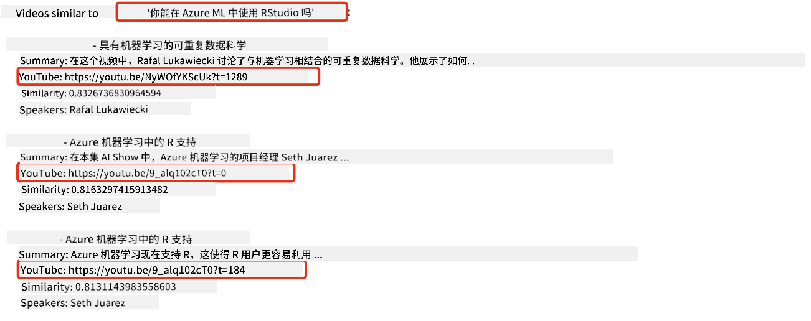
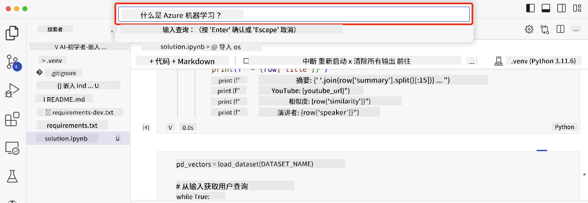

<!--
CO_OP_TRANSLATOR_METADATA:
{
  "original_hash": "d46aad0917a1a342d613e2c13d457da5",
  "translation_date": "2025-07-09T12:48:25+00:00",
  "source_file": "08-building-search-applications/README.md",
  "language_code": "zh"
}
-->
# 构建搜索应用程序

[](https://aka.ms/gen-ai-lesson8-gh?WT.mc_id=academic-105485-koreyst)

> > _点击上方图片观看本课视频_

大型语言模型不仅仅用于聊天机器人和文本生成，还可以利用 Embeddings 构建搜索应用。Embeddings 是数据的数值表示，也称为向量，可用于对数据进行语义搜索。

本课中，你将为我们的教育初创企业构建一个搜索应用。我们的初创企业是一个非营利组织，致力于为发展中国家的学生免费提供教育资源。我们拥有大量的 YouTube 视频，供学生学习 AI。我们希望构建一个搜索应用，允许学生通过输入问题来搜索 YouTube 视频。

例如，学生可能会输入“什么是 Jupyter 笔记本？”或“什么是 Azure ML”，搜索应用会返回与问题相关的 YouTube 视频列表，更棒的是，搜索应用还能返回视频中回答该问题的具体位置链接。

## 介绍

本课将涵盖：

- 语义搜索与关键词搜索的区别。
- 什么是文本 Embeddings。
- 创建文本 Embeddings 索引。
- 搜索文本 Embeddings 索引。

## 学习目标

完成本课后，你将能够：

- 区分语义搜索和关键词搜索。
- 解释文本 Embeddings 的概念。
- 使用 Embeddings 创建数据搜索应用。

## 为什么要构建搜索应用？

构建搜索应用能帮助你理解如何使用 Embeddings 进行数据搜索。你还将学会如何构建一个能帮助学生快速查找信息的搜索应用。

本课包含了微软 [AI Show](https://www.youtube.com/playlist?list=PLlrxD0HtieHi0mwteKBOfEeOYf0LJU4O1) YouTube 频道视频的转录文本 Embedding 索引。AI Show 是一个教授 AI 和机器学习的频道。Embedding 索引包含了截至 2023 年 10 月的所有视频转录文本的 Embeddings。你将使用该索引为我们的初创企业构建搜索应用。搜索应用会返回视频中回答问题的具体位置链接，帮助学生快速找到所需信息。

下面是一个针对问题“你可以用 RStudio 配合 Azure ML 吗？”的语义查询示例。查看 YouTube 链接，你会发现链接中包含时间戳，直接跳转到视频中回答该问题的位置。



## 什么是语义搜索？

你可能会好奇，什么是语义搜索？语义搜索是一种利用查询中词语的语义或含义来返回相关结果的搜索技术。

举个例子，假设你想买车，搜索“我的梦想车”，语义搜索会理解你不是在“梦见”一辆车，而是在寻找你理想中的车。语义搜索理解你的意图，返回相关结果。相比之下，关键词搜索会字面匹配“梦”和“车”，往往返回无关结果。

## 什么是文本 Embeddings？

[文本 Embeddings](https://en.wikipedia.org/wiki/Word_embedding?WT.mc_id=academic-105485-koreyst) 是一种用于[自然语言处理](https://en.wikipedia.org/wiki/Natural_language_processing?WT.mc_id=academic-105485-koreyst)的文本表示技术。文本 Embeddings 是文本的语义数值表示。Embeddings 用于以机器易于理解的方式表示数据。构建文本 Embeddings 有多种模型，本课重点介绍如何使用 OpenAI Embedding 模型生成 Embeddings。

举个例子，假设以下文本来自 AI Show YouTube 频道某期节目的转录：

```text
Today we are going to learn about Azure Machine Learning.
```

我们将文本传给 OpenAI Embedding API，它会返回一个由 1536 个数字组成的向量。向量中的每个数字代表文本的不同方面。为了简洁，这里只展示向量的前 10 个数字。

```python
[-0.006655829958617687, 0.0026128944009542465, 0.008792596869170666, -0.02446001023054123, -0.008540431968867779, 0.022071078419685364, -0.010703742504119873, 0.003311325330287218, -0.011632772162556648, -0.02187200076878071, ...]
```

## Embedding 索引是如何创建的？

本课的 Embedding 索引是通过一系列 Python 脚本创建的。你可以在本课的 `scripts` 文件夹中的 [README](./scripts/README.md?WT.mc_id=academic-105485-koreyst) 找到这些脚本和说明。完成本课不需要运行这些脚本，因为我们已经提供了 Embedding 索引。

脚本执行的操作包括：

1. 下载 [AI Show](https://www.youtube.com/playlist?list=PLlrxD0HtieHi0mwteKBOfEeOYf0LJU4O1) 播放列表中每个视频的转录文本。
2. 使用 [OpenAI Functions](https://learn.microsoft.com/azure/ai-services/openai/how-to/function-calling?WT.mc_id=academic-105485-koreyst) 尝试从视频转录的前三分钟提取说话人姓名。每个视频的说话人姓名存储在名为 `embedding_index_3m.json` 的 Embedding 索引中。
3. 将转录文本分割成**3分钟的文本片段**。每个片段与下一个片段有约 20 个词的重叠，以确保 Embedding 不被截断，并提供更好的搜索上下文。
4. 将每个文本片段传给 OpenAI Chat API，生成约 60 字的摘要。摘要也存储在 `embedding_index_3m.json` 中。
5. 最后，将文本片段传给 OpenAI Embedding API，返回一个包含 1536 个数字的向量，表示该片段的语义含义。文本片段和对应的 Embedding 向量存储在 `embedding_index_3m.json` 中。

### 向量数据库

为了简化教学，Embedding 索引存储在名为 `embedding_index_3m.json` 的 JSON 文件中，并加载到 Pandas DataFrame 中。但在生产环境中，Embedding 索引通常存储在向量数据库中，如 [Azure Cognitive Search](https://learn.microsoft.com/training/modules/improve-search-results-vector-search?WT.mc_id=academic-105485-koreyst)、[Redis](https://cookbook.openai.com/examples/vector_databases/redis/readme?WT.mc_id=academic-105485-koreyst)、[Pinecone](https://cookbook.openai.com/examples/vector_databases/pinecone/readme?WT.mc_id=academic-105485-koreyst)、[Weaviate](https://cookbook.openai.com/examples/vector_databases/weaviate/readme?WT.mc_id=academic-105485-koreyst) 等。

## 理解余弦相似度

我们已经了解了文本 Embeddings，接下来学习如何利用文本 Embeddings 搜索数据，特别是如何使用余弦相似度找到与查询最相似的 Embeddings。

### 什么是余弦相似度？

余弦相似度是衡量两个向量相似度的指标，也称为“最近邻搜索”。进行余弦相似度搜索时，首先需要使用 OpenAI Embedding API 将查询文本向量化。然后计算查询向量与 Embedding 索引中每个向量的余弦相似度。记住，Embedding 索引中每个向量对应一个 YouTube 转录文本片段。最后，根据余弦相似度排序，得分最高的文本片段与查询最相似。

从数学角度看，余弦相似度测量多维空间中两个向量夹角的余弦值。该指标有优势，因为即使两个文档在欧氏距离上相距较远（可能因大小不同），它们的夹角仍可能较小，从而余弦相似度较高。更多余弦相似度公式信息，请参见[余弦相似度](https://en.wikipedia.org/wiki/Cosine_similarity?WT.mc_id=academic-105485-koreyst)。

## 构建你的第一个搜索应用

接下来，我们将学习如何使用 Embeddings 构建搜索应用。该应用允许学生通过输入问题搜索视频，返回与问题相关的视频列表，并提供视频中回答问题的具体位置链接。

本解决方案已在 Windows 11、macOS 和 Ubuntu 22.04 上使用 Python 3.10 及以上版本构建和测试。你可以从 [python.org](https://www.python.org/downloads/?WT.mc_id=academic-105485-koreyst) 下载 Python。

## 任务 - 构建搜索应用，助力学生

我们在本课开头介绍了我们的初创企业。现在是时候让学生们为他们的评估任务构建搜索应用了。

在本任务中，你将创建用于构建搜索应用的 Azure OpenAI 服务。你需要创建以下 Azure OpenAI 服务。完成任务需要一个 Azure 订阅。

### 启动 Azure Cloud Shell

1. 登录 [Azure 门户](https://portal.azure.com/?WT.mc_id=academic-105485-koreyst)。
2. 点击 Azure 门户右上角的 Cloud Shell 图标。
3. 选择 **Bash** 作为环境类型。

#### 创建资源组

> 本说明中，我们使用名为“semantic-video-search”的资源组，位于 East US 区域。
> 你可以更改资源组名称，但更改资源位置时，
> 请查看[模型可用性表](https://aka.ms/oai/models?WT.mc_id=academic-105485-koreyst)。

```shell
az group create --name semantic-video-search --location eastus
```

#### 创建 Azure OpenAI 服务资源

在 Azure Cloud Shell 中运行以下命令，创建 Azure OpenAI 服务资源。

```shell
az cognitiveservices account create --name semantic-video-openai --resource-group semantic-video-search \
    --location eastus --kind OpenAI --sku s0
```

#### 获取端点和密钥以供应用使用

在 Azure Cloud Shell 中运行以下命令，获取 Azure OpenAI 服务资源的端点和密钥。

```shell
az cognitiveservices account show --name semantic-video-openai \
   --resource-group  semantic-video-search | jq -r .properties.endpoint
az cognitiveservices account keys list --name semantic-video-openai \
   --resource-group semantic-video-search | jq -r .key1
```

#### 部署 OpenAI Embedding 模型

在 Azure Cloud Shell 中运行以下命令，部署 OpenAI Embedding 模型。

```shell
az cognitiveservices account deployment create \
    --name semantic-video-openai \
    --resource-group  semantic-video-search \
    --deployment-name text-embedding-ada-002 \
    --model-name text-embedding-ada-002 \
    --model-version "2"  \
    --model-format OpenAI \
    --sku-capacity 100 --sku-name "Standard"
```

## 解决方案

打开 GitHub Codespaces 中的[解决方案笔记本](../../../08-building-search-applications/python/aoai-solution.ipynb)，并按照 Jupyter Notebook 中的说明操作。

运行笔记本时，会提示你输入查询。输入框如下所示：



## 干得好！继续学习

完成本课后，欢迎查看我们的[生成式 AI 学习合集](https://aka.ms/genai-collection?WT.mc_id=academic-105485-koreyst)，继续提升你的生成式 AI 知识！

接下来进入第 9 课，我们将学习如何[构建图像生成应用](../09-building-image-applications/README.md?WT.mc_id=academic-105485-koreyst)！

**免责声明**：  
本文件使用 AI 翻译服务 [Co-op Translator](https://github.com/Azure/co-op-translator) 进行翻译。虽然我们力求准确，但请注意自动翻译可能包含错误或不准确之处。原始文件的母语版本应被视为权威来源。对于重要信息，建议使用专业人工翻译。对于因使用本翻译而产生的任何误解或误释，我们不承担任何责任。