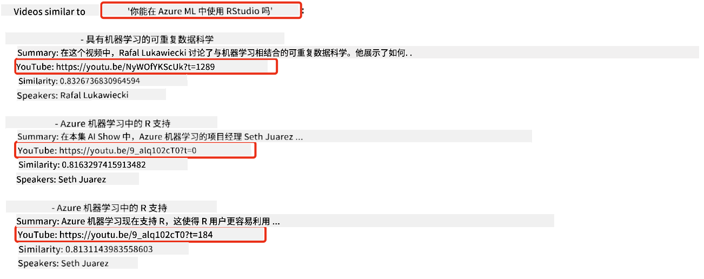
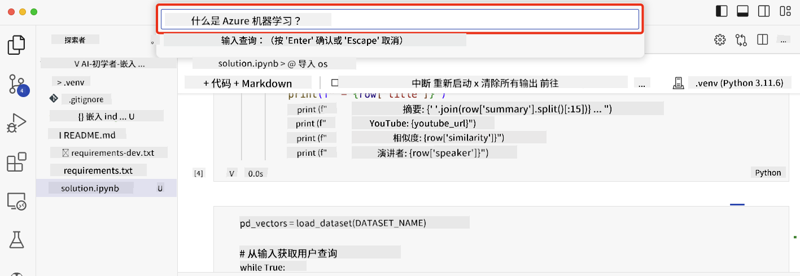

<!--
CO_OP_TRANSLATOR_METADATA:
{
  "original_hash": "d46aad0917a1a342d613e2c13d457da5",
  "translation_date": "2025-06-25T16:15:30+00:00",
  "source_file": "08-building-search-applications/README.md",
  "language_code": "zh"
}
-->
# 构建搜索应用

[](https://aka.ms/gen-ai-lesson8-gh?WT.mc_id=academic-105485-koreyst)

> > _点击上面的图片观看本课视频_

大型语言模型（LLM）不仅仅用于聊天机器人和文本生成。使用嵌入（Embeddings）也可以构建搜索应用。嵌入是数据的数值表示，也称为向量，可以用于数据的语义搜索。

在本课中，你将为我们的教育初创公司构建一个搜索应用。我们的初创公司是一家非营利组织，向发展中国家的学生提供免费教育。我们的初创公司有大量的YouTube视频，学生可以用来学习AI。我们的初创公司希望构建一个搜索应用，允许学生通过输入问题来搜索YouTube视频。

例如，学生可能会输入“什么是Jupyter Notebooks？”或者“什么是Azure ML”，搜索应用将返回与问题相关的YouTube视频列表，更好的是，搜索应用将返回视频中回答问题的具体位置的链接。

## 介绍

在本课中，我们将涵盖：

- 语义搜索与关键词搜索。
- 什么是文本嵌入。
- 创建文本嵌入索引。
- 搜索文本嵌入索引。

## 学习目标

完成本课后，你将能够：

- 区分语义搜索和关键词搜索。
- 解释什么是文本嵌入。
- 使用嵌入创建一个数据搜索应用。

## 为什么构建搜索应用？

创建搜索应用将帮助你理解如何使用嵌入来搜索数据。你还将学习如何构建一个搜索应用，使学生能够快速找到信息。

本课包括一个Microsoft [AI Show](https://www.youtube.com/playlist?list=PLlrxD0HtieHi0mwteKBOfEeOYf0LJU4O1) YouTube频道的转录嵌入索引。AI Show是一个教你关于AI和机器学习的YouTube频道。嵌入索引包含截至2023年10月的每个YouTube转录的嵌入。你将使用嵌入索引为我们的初创公司构建一个搜索应用。搜索应用将返回视频中回答问题的具体位置的链接。这是学生快速找到所需信息的好方法。

以下是“你能用rstudio和azure ml吗？”问题的语义查询示例。查看YouTube网址，你会看到网址包含一个时间戳，带你到视频中回答问题的具体位置。



## 什么是语义搜索？

现在你可能会想，什么是语义搜索？语义搜索是一种使用查询中单词的语义或意义来返回相关结果的搜索技术。

这是一个语义搜索的例子。假设你想买车，你可能会搜索“我的梦想车”，语义搜索理解你不是在`dreaming`关于车，而是想买你的`ideal`车。语义搜索理解你的意图并返回相关结果。另一种方法是`keyword search`，它会字面上搜索关于车的梦，通常返回不相关的结果。

## 什么是文本嵌入？

[文本嵌入](https://en.wikipedia.org/wiki/Word_embedding?WT.mc_id=academic-105485-koreyst)是一种在[自然语言处理](https://en.wikipedia.org/wiki/Natural_language_processing?WT.mc_id=academic-105485-koreyst)中使用的文本表示技术。文本嵌入是文本的语义数值表示。嵌入用于以机器易于理解的方式表示数据。构建文本嵌入有许多模型，在本课中，我们将专注于使用OpenAI嵌入模型生成嵌入。

这是一个例子，想象以下文本来自AI Show YouTube频道某集的转录：

```text
Today we are going to learn about Azure Machine Learning.
```

我们将文本传递给OpenAI嵌入API，它将返回由1536个数字组成的嵌入，即向量。向量中的每个数字代表文本的不同方面。为了简洁，这里是向量的前10个数字。

```python
[-0.006655829958617687, 0.0026128944009542465, 0.008792596869170666, -0.02446001023054123, -0.008540431968867779, 0.022071078419685364, -0.010703742504119873, 0.003311325330287218, -0.011632772162556648, -0.02187200076878071, ...]
```

## 嵌入索引是如何创建的？

本课的嵌入索引是通过一系列Python脚本创建的。你将在本课的“scripts”文件夹中的[README](./scripts/README.md?WT.mc_id=academic-105485-koreyst)中找到这些脚本及说明。你不需要运行这些脚本来完成本课，因为嵌入索引已为你提供。

这些脚本执行以下操作：

1. 下载[AI Show](https://www.youtube.com/playlist?list=PLlrxD0HtieHi0mwteKBOfEeOYf0LJU4O1)播放列表中每个YouTube视频的转录。
2. 使用[OpenAI Functions](https://learn.microsoft.com/azure/ai-services/openai/how-to/function-calling?WT.mc_id=academic-105485-koreyst)，尝试从YouTube转录的前三分钟中提取演讲者姓名。每个视频的演讲者姓名存储在名为`embedding_index_3m.json`的嵌入索引中。
3. 然后将转录文本分块为**3分钟的文本段**。每个段包含大约20个与下一个段重叠的单词，以确保段的嵌入不被截断，并提供更好的搜索上下文。
4. 然后将每个文本段传递给OpenAI Chat API，将文本总结为60个单词。摘要也存储在嵌入索引`embedding_index_3m.json`中。
5. 最后，将段文本传递给OpenAI嵌入API。嵌入API返回一个1536个数字的向量，代表段的语义意义。段和OpenAI嵌入向量一起存储在嵌入索引`embedding_index_3m.json`中。

### 向量数据库

为简化课程，嵌入索引存储在名为`embedding_index_3m.json`的JSON文件中，并加载到Pandas DataFrame中。然而，在生产环境中，嵌入索引将存储在如[Azure Cognitive Search](https://learn.microsoft.com/training/modules/improve-search-results-vector-search?WT.mc_id=academic-105485-koreyst)、[Redis](https://cookbook.openai.com/examples/vector_databases/redis/readme?WT.mc_id=academic-105485-koreyst)、[Pinecone](https://cookbook.openai.com/examples/vector_databases/pinecone/readme?WT.mc_id=academic-105485-koreyst)、[Weaviate](https://cookbook.openai.com/examples/vector_databases/weaviate/readme?WT.mc_id=academic-105485-koreyst)等向量数据库中。

## 理解余弦相似性

我们已经了解了文本嵌入，下一步是学习如何使用文本嵌入搜索数据，特别是使用余弦相似性找到与给定查询最相似的嵌入。

### 什么是余弦相似性？

余弦相似性是两个向量之间相似性的度量，你也会听到它被称为`nearest neighbor search`。要执行余弦相似性搜索，你需要使用OpenAI嵌入API对查询文本进行_向量化_。然后计算查询向量与嵌入索引中每个向量之间的_余弦相似性_。记住，嵌入索引中每个YouTube转录文本段都有一个向量。最后，按余弦相似性排序，余弦相似性最高的文本段与查询最相似。

从数学角度来看，余弦相似性测量在多维空间中两个向量之间的角度的余弦。这种测量很有用，因为如果两个文档由于大小而在欧几里得距离上相距很远，它们仍然可能在它们之间有较小的角度，因此具有较高的余弦相似性。有关余弦相似性方程的更多信息，请参见[余弦相似性](https://en.wikipedia.org/wiki/Cosine_similarity?WT.mc_id=academic-105485-koreyst)。

## 构建你的第一个搜索应用

接下来，我们将学习如何使用嵌入构建搜索应用。搜索应用将允许学生通过输入问题来搜索视频。搜索应用将返回与问题相关的视频列表。搜索应用还将返回视频中回答问题的具体位置的链接。

该解决方案已在Windows 11、macOS和Ubuntu 22.04上使用Python 3.10或更高版本进行构建和测试。你可以从[python.org](https://www.python.org/downloads/?WT.mc_id=academic-105485-koreyst)下载Python。

## 作业 - 构建一个搜索应用，帮助学生

我们在本课开始时介绍了我们的初创公司。现在是时候让学生构建一个用于他们评估的搜索应用。

在这个作业中，你将创建用于构建搜索应用的Azure OpenAI服务。你将创建以下Azure OpenAI服务。你需要一个Azure订阅才能完成此作业。

### 启动Azure Cloud Shell

1. 登录[Azure门户](https://portal.azure.com/?WT.mc_id=academic-105485-koreyst)。
2. 选择Azure门户右上角的Cloud Shell图标。
3. 选择**Bash**作为环境类型。

#### 创建资源组

> 在这些说明中，我们使用了位于美国东部的名为“semantic-video-search”的资源组。
> 你可以更改资源组的名称，但在更改资源位置时，请检查[模型可用性表](https://aka.ms/oai/models?WT.mc_id=academic-105485-koreyst)。

```shell
az group create --name semantic-video-search --location eastus
```

#### 创建Azure OpenAI服务资源

从Azure Cloud Shell运行以下命令以创建Azure OpenAI服务资源。

```shell
az cognitiveservices account create --name semantic-video-openai --resource-group semantic-video-search \
    --location eastus --kind OpenAI --sku s0
```

#### 获取用于此应用的端点和密钥

从Azure Cloud Shell运行以下命令以获取Azure OpenAI服务资源的端点和密钥。

```shell
az cognitiveservices account show --name semantic-video-openai \
   --resource-group  semantic-video-search | jq -r .properties.endpoint
az cognitiveservices account keys list --name semantic-video-openai \
   --resource-group semantic-video-search | jq -r .key1
```

#### 部署OpenAI嵌入模型

从Azure Cloud Shell运行以下命令以部署OpenAI嵌入模型。

```shell
az cognitiveservices account deployment create \
    --name semantic-video-openai \
    --resource-group  semantic-video-search \
    --deployment-name text-embedding-ada-002 \
    --model-name text-embedding-ada-002 \
    --model-version "2"  \
    --model-format OpenAI \
    --sku-capacity 100 --sku-name "Standard"
```

## 解决方案

在GitHub Codespaces中打开[解决方案笔记本](../../../08-building-search-applications/python/aoai-solution.ipynb)并按照Jupyter Notebook中的说明进行操作。

当你运行笔记本时，会提示你输入一个查询。输入框看起来像这样：



## 干得好！继续学习

完成本课后，查看我们的[生成式AI学习集合](https://aka.ms/genai-collection?WT.mc_id=academic-105485-koreyst)以继续提升你的生成式AI知识！

前往第9课，我们将看看如何[构建图像生成应用](../09-building-image-applications/README.md?WT.mc_id=academic-105485-koreyst)！

**免责声明**：
本文档是使用AI翻译服务[Co-op Translator](https://github.com/Azure/co-op-translator)翻译的。虽然我们力求准确，但请注意，自动翻译可能包含错误或不准确之处。应将原始语言的文档视为权威来源。对于重要信息，建议进行专业的人类翻译。对于因使用此翻译而产生的任何误解或误读，我们不承担责任。