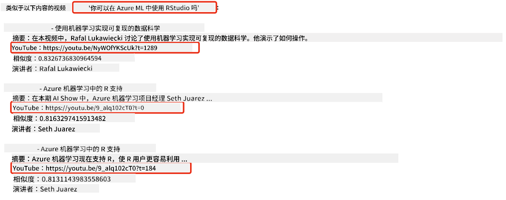

<!--
CO_OP_TRANSLATOR_METADATA:
{
  "original_hash": "58953c08b8ba7073b836d4270ea0fe86",
  "translation_date": "2025-10-17T23:20:37+00:00",
  "source_file": "08-building-search-applications/README.md",
  "language_code": "zh"
}
-->
# 构建搜索应用程序

[](https://youtu.be/W0-nzXjOjr0?si=GcsqiTTvd7RKbo7V)

> > _点击上方图片观看本课视频_

大型语言模型（LLMs）不仅仅用于聊天机器人和文本生成。通过使用嵌入（Embeddings），还可以构建搜索应用程序。嵌入是数据的数值表示，也称为向量，可用于数据的语义搜索。

在本课中，你将为我们的教育初创公司构建一个搜索应用程序。我们的初创公司是一家非营利组织，致力于为发展中国家的学生提供免费教育。公司拥有大量的 YouTube 视频，学生可以通过这些视频学习 AI 知识。公司希望构建一个搜索应用程序，允许学生通过输入问题来搜索相关的 YouTube 视频。

例如，学生可能会输入“什么是 Jupyter Notebooks？”或“什么是 Azure ML”，搜索应用程序将返回与问题相关的 YouTube 视频列表，更棒的是，搜索应用程序还会返回视频中回答问题的具体时间点链接。

## 介绍

在本课中，我们将学习以下内容：

- 语义搜索与关键词搜索的区别。
- 什么是文本嵌入。
- 创建文本嵌入索引。
- 搜索文本嵌入索引。

## 学习目标

完成本课后，你将能够：

- 区分语义搜索和关键词搜索。
- 解释什么是文本嵌入。
- 使用嵌入创建一个数据搜索应用程序。

## 为什么要构建搜索应用程序？

创建搜索应用程序将帮助你理解如何使用嵌入来搜索数据。你还将学习如何构建一个搜索应用程序，帮助学生快速找到所需信息。

本课包含一个 Microsoft [AI Show](https://www.youtube.com/playlist?list=PLlrxD0HtieHi0mwteKBOfEeOYf0LJU4O1) YouTube 频道的转录嵌入索引。AI Show 是一个教授 AI 和机器学习的 YouTube 频道。嵌入索引包含截至 2023 年 10 月的所有 YouTube 转录嵌入。你将使用嵌入索引为我们的初创公司构建一个搜索应用程序。搜索应用程序会返回视频中回答问题的具体时间点链接。这是一种帮助学生快速找到所需信息的绝佳方式。

以下是一个关于问题“可以在 Azure ML 中使用 RStudio 吗？”的语义查询示例。查看 YouTube URL，你会发现 URL 包含一个时间戳，直接跳转到视频中回答问题的具体时间点。



## 什么是语义搜索？

你可能会问，什么是语义搜索？语义搜索是一种搜索技术，它利用查询中单词的语义或含义来返回相关结果。

以下是一个语义搜索的示例。假设你想买一辆车，你可能会搜索“我的梦想之车”，语义搜索能够理解你并不是在“做梦”关于一辆车，而是想要购买你“理想的”车。语义搜索能够理解你的意图并返回相关结果。而关键词搜索则会字面搜索关于车的梦，通常会返回不相关的结果。

## 什么是文本嵌入？

[文本嵌入](https://en.wikipedia.org/wiki/Word_embedding?WT.mc_id=academic-105485-koreyst)是一种用于[自然语言处理](https://en.wikipedia.org/wiki/Natural_language_processing?WT.mc_id=academic-105485-koreyst)的文本表示技术。文本嵌入是文本的语义数值表示。嵌入用于以机器易于理解的方式表示数据。有许多构建文本嵌入的模型，在本课中，我们将重点使用 OpenAI 嵌入模型生成嵌入。

举个例子，假设以下文本来自 AI Show YouTube 频道某一集的转录：

```text
Today we are going to learn about Azure Machine Learning.
```

我们将文本传递给 OpenAI 嵌入 API，它会返回一个由 1536 个数字组成的嵌入，也就是一个向量。向量中的每个数字代表文本的不同方面。为了简洁，这里是向量中的前 10 个数字。

```python
[-0.006655829958617687, 0.0026128944009542465, 0.008792596869170666, -0.02446001023054123, -0.008540431968867779, 0.022071078419685364, -0.010703742504119873, 0.003311325330287218, -0.011632772162556648, -0.02187200076878071, ...]
```

## 嵌入索引是如何创建的？

本课的嵌入索引是通过一系列 Python 脚本创建的。你可以在本课的“scripts”文件夹中的 [README](./scripts/README.md?WT.mc_id=academic-105485-koreyst) 中找到这些脚本及其使用说明。完成本课不需要运行这些脚本，因为嵌入索引已经为你提供。

这些脚本执行以下操作：

1. 下载 [AI Show](https://www.youtube.com/playlist?list=PLlrxD0HtieHi0mwteKBOfEeOYf0LJU4O1) 播放列表中每个 YouTube 视频的转录。
2. 使用 [OpenAI Functions](https://learn.microsoft.com/azure/ai-services/openai/how-to/function-calling?WT.mc_id=academic-105485-koreyst)，尝试从 YouTube 转录的前 3 分钟中提取演讲者姓名。每个视频的演讲者姓名存储在嵌入索引 `embedding_index_3m.json` 中。
3. 然后将转录文本分块为**3 分钟的文本片段**。每个片段包括大约 20 个与下一个片段重叠的单词，以确保片段的嵌入不会被截断，并提供更好的搜索上下文。
4. 每个文本片段传递给 OpenAI Chat API，将文本总结为 60 个单词。总结也存储在嵌入索引 `embedding_index_3m.json` 中。
5. 最后，将片段文本传递给 OpenAI 嵌入 API。嵌入 API 返回一个由 1536 个数字组成的向量，表示片段的语义含义。片段及其 OpenAI 嵌入向量存储在嵌入索引 `embedding_index_3m.json` 中。

### 向量数据库

为了简化课程，嵌入索引存储在名为 `embedding_index_3m.json` 的 JSON 文件中，并加载到 Pandas DataFrame 中。然而，在生产环境中，嵌入索引通常存储在向量数据库中，例如 [Azure Cognitive Search](https://learn.microsoft.com/training/modules/improve-search-results-vector-search?WT.mc_id=academic-105485-koreyst)、[Redis](https://cookbook.openai.com/examples/vector_databases/redis/readme?WT.mc_id=academic-105485-koreyst)、[Pinecone](https://cookbook.openai.com/examples/vector_databases/pinecone/readme?WT.mc_id=academic-105485-koreyst)、[Weaviate](https://cookbook.openai.com/examples/vector_databases/weaviate/readme?WT.mc_id=academic-105485-koreyst)等。

## 理解余弦相似度

我们已经了解了文本嵌入，接下来需要学习如何使用文本嵌入来搜索数据，特别是通过余弦相似度找到与给定查询最相似的嵌入。

### 什么是余弦相似度？

余弦相似度是两个向量之间相似度的度量，你也会听到它被称为“最近邻搜索”。要执行余弦相似度搜索，你需要使用 OpenAI 嵌入 API 对查询文本进行_向量化_。然后计算查询向量与嵌入索引中每个向量的_余弦相似度_。记住，嵌入索引中每个 YouTube 转录文本片段都有一个向量。最后，根据余弦相似度对结果进行排序，余弦相似度最高的文本片段与查询最相似。

从数学角度来看，余弦相似度测量两个向量在多维空间中投影的角度的余弦值。这种测量很有用，因为即使两个文档由于大小不同而在欧几里得距离上相距较远，它们之间的角度可能较小，因此余弦相似度较高。有关余弦相似度公式的更多信息，请参阅 [余弦相似度](https://en.wikipedia.org/wiki/Cosine_similarity?WT.mc_id=academic-105485-koreyst)。

## 构建你的第一个搜索应用程序

接下来，我们将学习如何使用嵌入构建一个搜索应用程序。该搜索应用程序将允许学生通过输入问题来搜索视频。搜索应用程序将返回与问题相关的视频列表，同时还会返回视频中回答问题的具体时间点链接。

该解决方案已在 Windows 11、macOS 和 Ubuntu 22.04 上使用 Python 3.10 或更高版本进行构建和测试。你可以从 [python.org](https://www.python.org/downloads/?WT.mc_id=academic-105485-koreyst) 下载 Python。

## 作业 - 构建搜索应用程序，帮助学生

我们在本课开始时介绍了我们的初创公司。现在是时候帮助学生构建一个用于评估的搜索应用程序了。

在本次作业中，你将创建用于构建搜索应用程序的 Azure OpenAI 服务。你需要创建以下 Azure OpenAI 服务。完成此作业需要一个 Azure 订阅。

### 启动 Azure Cloud Shell

1. 登录 [Azure 门户](https://portal.azure.com/?WT.mc_id=academic-105485-koreyst)。
2. 选择 Azure 门户右上角的 Cloud Shell 图标。
3. 选择 **Bash** 作为环境类型。

#### 创建资源组

> 在这些说明中，我们使用名为“semantic-video-search”的资源组，位置为美国东部。
> 你可以更改资源组的名称，但在更改资源位置时，请检查[模型可用性表](https://aka.ms/oai/models?WT.mc_id=academic-105485-koreyst)。

```shell
az group create --name semantic-video-search --location eastus
```

#### 创建 Azure OpenAI 服务资源

在 Azure Cloud Shell 中运行以下命令以创建 Azure OpenAI 服务资源。

```shell
az cognitiveservices account create --name semantic-video-openai --resource-group semantic-video-search \
    --location eastus --kind OpenAI --sku s0
```

#### 获取此应用程序使用的端点和密钥

在 Azure Cloud Shell 中运行以下命令以获取 Azure OpenAI 服务资源的端点和密钥。

```shell
az cognitiveservices account show --name semantic-video-openai \
   --resource-group  semantic-video-search | jq -r .properties.endpoint
az cognitiveservices account keys list --name semantic-video-openai \
   --resource-group semantic-video-search | jq -r .key1
```

#### 部署 OpenAI 嵌入模型

在 Azure Cloud Shell 中运行以下命令以部署 OpenAI 嵌入模型。

```shell
az cognitiveservices account deployment create \
    --name semantic-video-openai \
    --resource-group  semantic-video-search \
    --deployment-name text-embedding-ada-002 \
    --model-name text-embedding-ada-002 \
    --model-version "2"  \
    --model-format OpenAI \
    --sku-capacity 100 --sku-name "Standard"
```

## 解决方案

在 GitHub Codespaces 中打开 [解决方案笔记本](./python/aoai-solution.ipynb?WT.mc_id=academic-105485-koreyst)，并按照 Jupyter Notebook 中的说明操作。

运行笔记本时，系统会提示你输入查询。输入框如下所示：


## 做得好！继续学习

完成本课后，请查看我们的 [生成式 AI 学习合集](https://aka.ms/genai-collection?WT.mc_id=academic-105485-koreyst)，继续提升你的生成式 AI 知识！

前往第 9 课，我们将学习如何[构建图像生成应用程序](../09-building-image-applications/README.md?WT.mc_id=academic-105485-koreyst)！

---

**免责声明**：  
本文档使用AI翻译服务[Co-op Translator](https://github.com/Azure/co-op-translator)进行翻译。尽管我们努力确保翻译的准确性，但请注意，自动翻译可能包含错误或不准确之处。原始语言的文档应被视为权威来源。对于关键信息，建议使用专业人工翻译。我们不对因使用此翻译而产生的任何误解或误读承担责任。