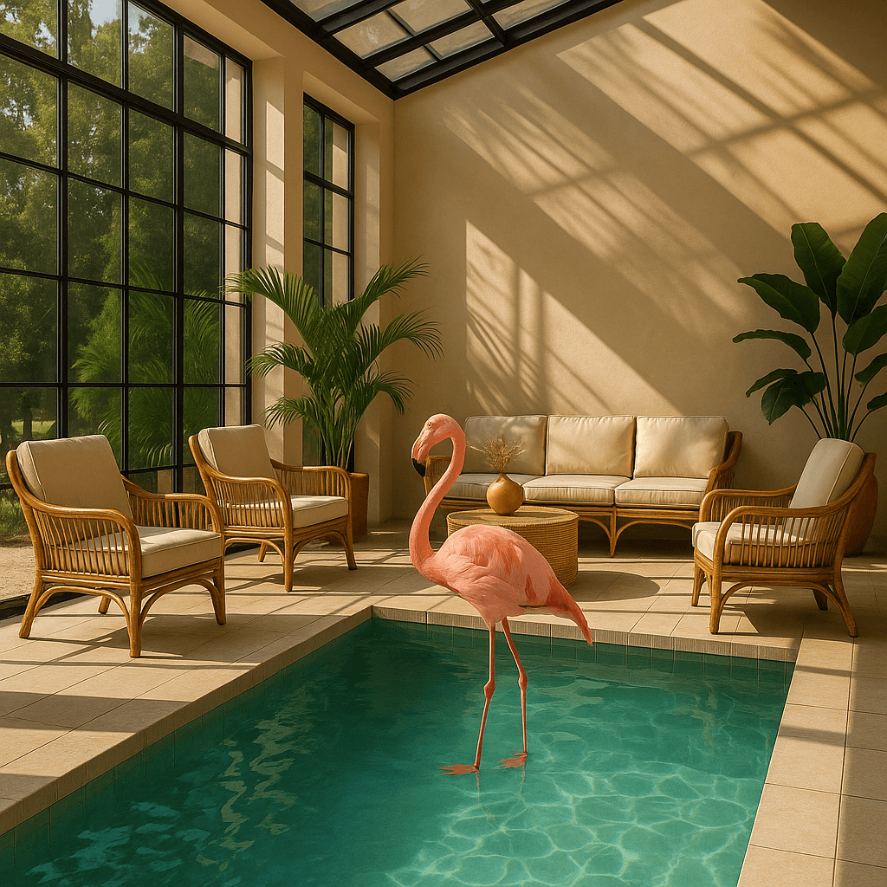

<!--
CO_OP_TRANSLATOR_METADATA:
{
  "original_hash": "063a2ac57d6b71bea0eaa880c68770d2",
  "translation_date": "2025-09-29T21:30:54+00:00",
  "source_file": "09-building-image-applications/README.md",
  "language_code": "zh"
}
-->
# 构建图像生成应用程序

[](https://aka.ms/gen-ai-lesson9-gh?WT.mc_id=academic-105485-koreyst)

大型语言模型（LLM）的功能不仅限于文本生成，还可以通过文本描述生成图像。图像作为一种模态在许多领域都非常有用，例如医疗技术、建筑、旅游、游戏开发等。在本章中，我们将探讨两个最流行的图像生成模型：DALL-E 和 Midjourney。

## 简介

在本课中，我们将学习：

- 图像生成及其用途。
- DALL-E 和 Midjourney，它们是什么以及如何工作。
- 如何构建一个图像生成应用程序。

## 学习目标

完成本课后，您将能够：

- 构建一个图像生成应用程序。
- 使用元提示为您的应用程序定义边界。
- 使用 DALL-E 和 Midjourney。

## 为什么要构建图像生成应用程序？

图像生成应用程序是探索生成式 AI 功能的绝佳方式。它们可以用于以下场景，例如：

- **图像编辑和合成**。您可以为各种用例生成图像，例如图像编辑和图像合成。

- **应用于多个行业**。它们还可以用于生成适用于多个行业的图像，例如医疗技术、旅游、游戏开发等。

## 场景：Edu4All

在本课中，我们将继续与我们的初创公司 Edu4All 合作。学生们将为他们的评估创建图像，具体创建什么图像由学生决定，例如可以是他们自己童话故事的插图，或者为他们的故事创建一个新角色，帮助他们可视化自己的想法和概念。

例如，如果 Edu4All 的学生在课堂上学习纪念碑，他们可以生成以下内容：


使用以下提示：

> “清晨阳光下，埃菲尔铁塔旁边的狗”

## 什么是 DALL-E 和 Midjourney？

[DALL-E](https://openai.com/dall-e-2?WT.mc_id=academic-105485-koreyst) 和 [Midjourney](https://www.midjourney.com/?WT.mc_id=academic-105485-koreyst) 是两个最流行的图像生成模型，它们允许您使用提示生成图像。

### DALL-E

我们先来看 DALL-E，它是一个生成式 AI 模型，可以根据文本描述生成图像。

> [DALL-E 是两个模型的结合：CLIP 和扩散注意力](https://towardsdatascience.com/openais-dall-e-and-clip-101-a-brief-introduction-3a4367280d4e?WT.mc_id=academic-105485-koreyst)。

- **CLIP** 是一个模型，可以从图像和文本中生成嵌入，即数据的数值表示。

- **扩散注意力** 是一个模型，可以从嵌入中生成图像。DALL-E 在图像和文本数据集上进行训练，可以根据文本描述生成图像。例如，DALL-E 可以生成戴帽子的猫或有莫霍克发型的狗的图像。

### Midjourney

Midjourney 的工作方式与 DALL-E 类似，它通过文本提示生成图像。Midjourney 也可以使用类似“戴帽子的猫”或“有莫霍克发型的狗”的提示生成图像。


_图片来源：维基百科，由 Midjourney 生成_

## DALL-E 和 Midjourney 的工作原理

首先，[DALL-E](https://arxiv.org/pdf/2102.12092.pdf?WT.mc_id=academic-105485-koreyst)。DALL-E 是一个基于 Transformer 架构的生成式 AI 模型，采用了 _自回归 Transformer_。

_自回归 Transformer_ 定义了模型如何根据文本描述生成图像，它一次生成一个像素，然后使用生成的像素生成下一个像素。通过神经网络的多个层，直到图像完成。

通过这个过程，DALL-E 可以控制生成图像中的属性、对象、特征等。然而，DALL-E 2 和 3 对生成的图像有更强的控制力。

## 构建您的第一个图像生成应用程序

那么构建一个图像生成应用程序需要什么呢？您需要以下库：

- **python-dotenv**，强烈建议使用此库将您的密钥保存在 _.env_ 文件中，远离代码。
- **openai**，此库用于与 OpenAI API 交互。
- **pillow**，用于在 Python 中处理图像。
- **requests**，帮助您发起 HTTP 请求。

## 创建并部署 Azure OpenAI 模型

如果尚未完成，请按照 [Microsoft Learn](https://learn.microsoft.com/azure/ai-foundry/openai/how-to/create-resource?pivots=web-portal) 页面上的说明创建 Azure OpenAI 资源和模型。选择 DALL-E 3 作为模型。

## 创建应用程序

1. 创建一个名为 _.env_ 的文件，内容如下：

   ```text
   AZURE_OPENAI_ENDPOINT=<your endpoint>
   AZURE_OPENAI_API_KEY=<your key>
   AZURE_OPENAI_DEPLOYMENT="dall-e-3"
   ```

   在 Azure OpenAI Foundry Portal 的“部署”部分找到此信息。

1. 将上述库收集到一个名为 _requirements.txt_ 的文件中，如下所示：

   ```text
   python-dotenv
   openai
   pillow
   requests
   ```

1. 接下来，创建虚拟环境并安装库：

   ```bash
   python3 -m venv venv
   source venv/bin/activate
   pip install -r requirements.txt
   ```

   对于 Windows，使用以下命令创建并激活虚拟环境：

   ```bash
   python3 -m venv venv
   venv\Scripts\activate.bat
   ```

1. 在名为 _app.py_ 的文件中添加以下代码：

    ```python
    import openai
    import os
    import requests
    from PIL import Image
    import dotenv
    from openai import OpenAI, AzureOpenAI
    
    # import dotenv
    dotenv.load_dotenv()
    
    # configure Azure OpenAI service client 
    client = AzureOpenAI(
      azure_endpoint = os.environ["AZURE_OPENAI_ENDPOINT"],
      api_key=os.environ['AZURE_OPENAI_API_KEY'],
      api_version = "2024-02-01"
      )
    try:
        # Create an image by using the image generation API
        generation_response = client.images.generate(
                                prompt='Bunny on horse, holding a lollipop, on a foggy meadow where it grows daffodils',
                                size='1024x1024', n=1,
                                model=os.environ['AZURE_OPENAI_DEPLOYMENT']
                              )

        # Set the directory for the stored image
        image_dir = os.path.join(os.curdir, 'images')

        # If the directory doesn't exist, create it
        if not os.path.isdir(image_dir):
            os.mkdir(image_dir)

        # Initialize the image path (note the filetype should be png)
        image_path = os.path.join(image_dir, 'generated-image.png')

        # Retrieve the generated image
        image_url = generation_response.data[0].url  # extract image URL from response
        generated_image = requests.get(image_url).content  # download the image
        with open(image_path, "wb") as image_file:
            image_file.write(generated_image)

        # Display the image in the default image viewer
        image = Image.open(image_path)
        image.show()

    # catch exceptions
    except openai.InvalidRequestError as err:
        print(err)
   ```

让我们解释一下这段代码：

- 首先，我们导入所需的库，包括 OpenAI 库、dotenv 库、requests 库和 Pillow 库。

  ```python
  import openai
  import os
  import requests
  from PIL import Image
  import dotenv
  ```

- 接着，我们从 _.env_ 文件加载环境变量。

  ```python
  # import dotenv
  dotenv.load_dotenv()
  ```

- 然后，我们配置 Azure OpenAI 服务客户端。

  ```python
  # Get endpoint and key from environment variables
  client = AzureOpenAI(
      azure_endpoint = os.environ["AZURE_OPENAI_ENDPOINT"],
      api_key=os.environ['AZURE_OPENAI_API_KEY'],
      api_version = "2024-02-01"
      )
  ```

- 接下来，我们生成图像：

  ```python
  # Create an image by using the image generation API
  generation_response = client.images.generate(
                        prompt='Bunny on horse, holding a lollipop, on a foggy meadow where it grows daffodils',
                        size='1024x1024', n=1,
                        model=os.environ['AZURE_OPENAI_DEPLOYMENT']
                      )
  ```

  上述代码返回一个包含生成图像 URL 的 JSON 对象。我们可以使用该 URL 下载图像并保存到文件中。

- 最后，我们打开图像并使用标准图像查看器显示它：

  ```python
  image = Image.open(image_path)
  image.show()
  ```

### 更详细的图像生成代码

让我们更详细地看看生成图像的代码：

   ```python
     generation_response = client.images.generate(
                               prompt='Bunny on horse, holding a lollipop, on a foggy meadow where it grows daffodils',
                               size='1024x1024', n=1,
                               model=os.environ['AZURE_OPENAI_DEPLOYMENT']
                           )
   ```

- **prompt** 是用于生成图像的文本提示。在此示例中，我们使用的提示是“骑在马上的兔子，拿着棒棒糖，站在长满水仙花的雾蒙蒙的草地上”。
- **size** 是生成图像的大小。在此示例中，我们生成的图像大小为 1024x1024 像素。
- **n** 是生成的图像数量。在此示例中，我们生成了两张图像。
- **temperature** 是一个参数，用于控制生成式 AI 模型输出的随机性。温度值范围为 0 到 1，其中 0 表示输出是确定性的，1 表示输出是随机的。默认值为 0.7。

还有更多关于图像的操作，我们将在下一节中介绍。

## 图像生成的其他功能

到目前为止，您已经看到我们如何使用几行 Python 代码生成图像。然而，您还可以对图像进行更多操作。

您还可以执行以下操作：

- **进行编辑**。通过提供现有图像、遮罩和提示，您可以修改图像。例如，您可以在图像的一部分添加内容。想象一下我们的兔子图像，您可以给兔子添加一顶帽子。实现方法是提供图像、遮罩（标识需要更改的区域）和文本提示说明需要进行的操作。
> 注意：DALL-E 3 不支持此功能。

以下是使用 GPT Image 的示例：

   ```python
   response = client.images.edit(
       model="gpt-image-1",
       image=open("sunlit_lounge.png", "rb"),
       mask=open("mask.png", "rb"),
       prompt="A sunlit indoor lounge area with a pool containing a flamingo"
   )
   image_url = response.data[0].url
   ```

  基础图像仅包含带泳池的休息室，但最终图像会有一只火烈鸟：

<div style="display: flex; justify-content: space-between; align-items: center; margin: 20px 0;">
  
  
  
</div>

- **创建变体**。这个功能的核心是您提供一个现有图像并要求生成变体。要创建变体，您需要提供图像和文本提示，并使用如下代码：

  ```python
  response = openai.Image.create_variation(
    image=open("bunny-lollipop.png", "rb"),
    n=1,
    size="1024x1024"
  )
  image_url = response['data'][0]['url']
  ```

  > 注意：此功能仅在 OpenAI 上支持。

## 温度

温度是一个参数，用于控制生成式 AI 模型输出的随机性。温度值范围为 0 到 1，其中 0 表示输出是确定性的，1 表示输出是随机的。默认值为 0.7。

让我们通过两次运行以下提示来看看温度的作用：

> 提示：“骑在马上的兔子，拿着棒棒糖，站在长满水仙花的雾蒙蒙的草地上”


现在让我们再次运行相同的提示，看看是否会生成不同的图像：


如您所见，图像相似但不完全相同。让我们尝试将温度值更改为 0.1，看看会发生什么：

```python
 generation_response = client.images.create(
        prompt='Bunny on horse, holding a lollipop, on a foggy meadow where it grows daffodils',    # Enter your prompt text here
        size='1024x1024',
        n=2
    )
```

### 更改温度

让我们尝试使响应更具确定性。从我们生成的两张图像中可以观察到，第一张图像中有一只兔子，而第二张图像中有一匹马，因此图像差异很大。

因此，让我们更改代码并将温度设置为 0，如下所示：

```python
generation_response = client.images.create(
        prompt='Bunny on horse, holding a lollipop, on a foggy meadow where it grows daffodils',    # Enter your prompt text here
        size='1024x1024',
        n=2,
        temperature=0
    )
```

现在运行此代码，您将得到以下两张图像：

- 
- 

在这里，您可以清楚地看到图像更加相似。

## 如何使用元提示为您的应用程序定义边界

通过我们的演示，我们已经可以为客户生成图像。然而，我们需要为应用程序创建一些边界。

例如，我们不希望生成不适合工作场所或不适合儿童的图像。

我们可以使用 _元提示_ 来实现这一点。元提示是用于控制生成式 AI 模型输出的文本提示。例如，我们可以使用元提示来控制输出，确保生成的图像适合工作场所或适合儿童。

### 它是如何工作的？

那么，元提示是如何工作的呢？

元提示是用于控制生成式 AI 模型输出的文本提示，它们位于文本提示之前，用于控制模型的输出，并嵌入到应用程序中以控制模型的输出。将提示输入和元提示输入封装在一个文本提示中。

元提示的一个示例如下：

```text
You are an assistant designer that creates images for children.

The image needs to be safe for work and appropriate for children.

The image needs to be in color.

The image needs to be in landscape orientation.

The image needs to be in a 16:9 aspect ratio.

Do not consider any input from the following that is not safe for work or appropriate for children.

(Input)

```

现在，让我们看看如何在演示中使用元提示。

```python
disallow_list = "swords, violence, blood, gore, nudity, sexual content, adult content, adult themes, adult language, adult humor, adult jokes, adult situations, adult"

meta_prompt =f"""You are an assistant designer that creates images for children.

The image needs to be safe for work and appropriate for children.

The image needs to be in color.

The image needs to be in landscape orientation.

The image needs to be in a 16:9 aspect ratio.

Do not consider any input from the following that is not safe for work or appropriate for children.
{disallow_list}
"""

prompt = f"{meta_prompt}
Create an image of a bunny on a horse, holding a lollipop"

# TODO add request to generate image
```

从上述提示中，您可以看到所有生成的图像都考虑了元提示。

## 作业 - 让学生参与

我们在本课开始时介绍了 Edu4All。现在是时候让学生为他们的评估生成图像了。

学生们将为他们的评估生成包含纪念碑的图像，具体选择哪些纪念碑由学生决定。学生们被要求在这项任务中发挥创造力，将这些纪念碑置于不同的背景中。

## 解决方案

以下是一个可能的解决方案：
```python
import openai
import os
import requests
from PIL import Image
import dotenv
from openai import AzureOpenAI
# import dotenv
dotenv.load_dotenv()

# Get endpoint and key from environment variables
client = AzureOpenAI(
  azure_endpoint = os.environ["AZURE_OPENAI_ENDPOINT"],
  api_key=os.environ['AZURE_OPENAI_API_KEY'],
  api_version = "2024-02-01"
  )


disallow_list = "swords, violence, blood, gore, nudity, sexual content, adult content, adult themes, adult language, adult humor, adult jokes, adult situations, adult"

meta_prompt = f"""You are an assistant designer that creates images for children.

The image needs to be safe for work and appropriate for children.

The image needs to be in color.

The image needs to be in landscape orientation.

The image needs to be in a 16:9 aspect ratio.

Do not consider any input from the following that is not safe for work or appropriate for children.
{disallow_list}
"""

prompt = f"""{meta_prompt}
Generate monument of the Arc of Triumph in Paris, France, in the evening light with a small child holding a Teddy looks on.
""""

try:
    # Create an image by using the image generation API
    generation_response = client.images.generate(
        prompt=prompt,    # Enter your prompt text here
        size='1024x1024',
        n=1,
    )
    # Set the directory for the stored image
    image_dir = os.path.join(os.curdir, 'images')

    # If the directory doesn't exist, create it
    if not os.path.isdir(image_dir):
        os.mkdir(image_dir)

    # Initialize the image path (note the filetype should be png)
    image_path = os.path.join(image_dir, 'generated-image.png')

    # Retrieve the generated image
    image_url = generation_response.data[0].url  # extract image URL from response
    generated_image = requests.get(image_url).content  # download the image
    with open(image_path, "wb") as image_file:
        image_file.write(generated_image)

    # Display the image in the default image viewer
    image = Image.open(image_path)
    image.show()

# catch exceptions
except openai.BadRequestError as err:
    print(err)
```

## 干得好！继续学习

完成本课后，查看我们的[生成式 AI 学习合集](https://aka.ms/genai-collection?WT.mc_id=academic-105485-koreyst)，继续提升您的生成式 AI 知识！

前往第10课，我们将探讨如何[使用低代码构建 AI 应用](../10-building-low-code-ai-applications/README.md?WT.mc_id=academic-105485-koreyst)。

---

**免责声明**：  
本文档使用AI翻译服务 [Co-op Translator](https://github.com/Azure/co-op-translator) 进行翻译。尽管我们努力确保翻译的准确性，但请注意，自动翻译可能包含错误或不准确之处。原始语言的文档应被视为权威来源。对于关键信息，建议使用专业人工翻译。我们对因使用此翻译而产生的任何误解或误读不承担责任。