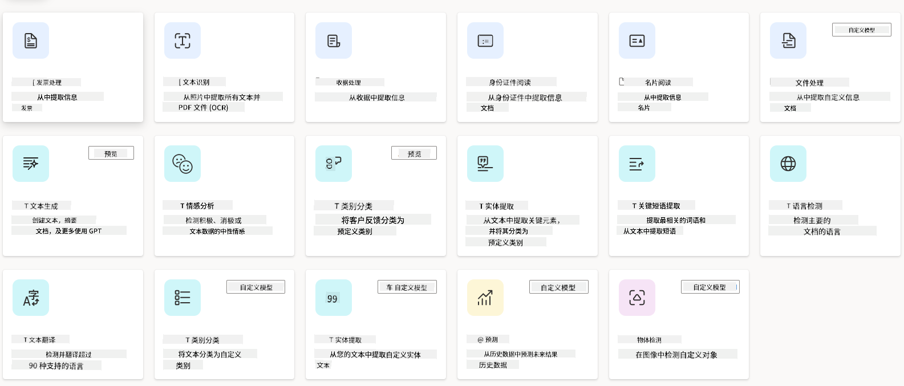
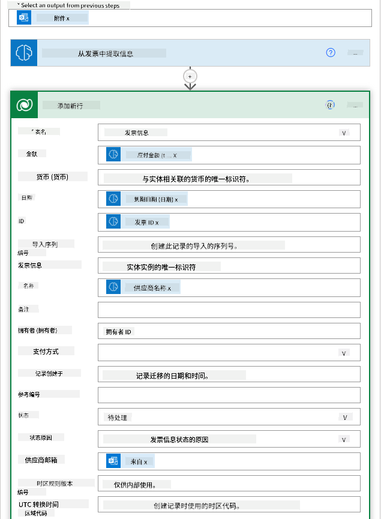
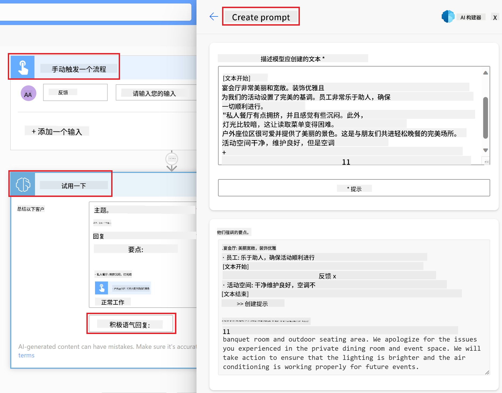

<!--
CO_OP_TRANSLATOR_METADATA:
{
  "original_hash": "f5ff3b6204a695a117d6f452403c95f7",
  "translation_date": "2025-05-19T19:43:28+00:00",
  "source_file": "10-building-low-code-ai-applications/README.md",
  "language_code": "zh"
}
-->
# 构建低代码AI应用程序

## 介绍

现在我们已经学会了如何构建图像生成应用程序，让我们来谈谈低代码。生成式AI可以用于多个不同领域，包括低代码，但什么是低代码，我们如何将AI添加到其中呢？

通过使用低代码开发平台，传统开发者和非开发者构建应用程序和解决方案变得更加容易。低代码开发平台使您可以使用很少或不需要代码来构建应用程序和解决方案。这是通过提供一个可视化的开发环境来实现的，您可以拖放组件来构建应用程序和解决方案。这使您能够更快地构建应用程序和解决方案，并减少资源的使用。在本课中，我们将深入探讨如何使用低代码以及如何通过Power Platform使用AI增强低代码开发。

Power Platform为组织提供了一个直观的低代码或无代码环境，帮助团队构建自己的解决方案。这个环境简化了构建解决方案的过程。使用Power Platform，解决方案可以在几天或几周内完成，而不是几个月或几年。Power Platform由五个关键产品组成：Power Apps、Power Automate、Power BI、Power Pages和Copilot Studio。

本课内容包括：

- Power Platform中的生成式AI介绍
- Copilot介绍及其使用方法
- 使用生成式AI在Power Platform中构建应用程序和流程
- 使用AI Builder理解Power Platform中的AI模型

## 学习目标

在本课结束时，您将能够：

- 理解Copilot在Power Platform中的工作原理。

- 为我们的教育初创公司构建一个学生作业跟踪应用程序。

- 构建一个使用AI从发票中提取信息的发票处理流程。

- 在使用GPT AI模型创建文本时应用最佳实践。

本课中您将使用的工具和技术包括：

- **Power Apps**，用于学生作业跟踪应用程序，它提供了一个低代码开发环境，用于构建应用程序以跟踪、管理和与数据交互。

- **Dataverse**，用于存储学生作业跟踪应用程序的数据，Dataverse将为应用程序的数据存储提供一个低代码数据平台。

- **Power Automate**，用于发票处理流程，您将在其中拥有一个低代码开发环境，用于构建工作流以自动化发票处理过程。

- **AI Builder**，用于发票处理AI模型，您将使用预构建的AI模型来处理我们初创公司的发票。

## Power Platform中的生成式AI

增强低代码开发和应用程序与生成式AI是Power Platform的一个关键关注领域。目标是让每个人都能够构建AI驱动的应用程序、网站、仪表板，并使用AI自动化流程，而不需要任何数据科学专业知识。这个目标是通过将生成式AI集成到Power Platform的低代码开发体验中实现的，形式为Copilot和AI Builder。

### 这是如何工作的？

Copilot是一个AI助手，允许您通过使用自然语言的对话步骤来描述您的需求，从而构建Power Platform解决方案。您可以指示AI助手说明您的应用程序将使用哪些字段，它将创建应用程序和基础数据模型，或者您可以指定如何在Power Automate中设置流程。

您可以在应用程序屏幕中使用Copilot驱动的功能，使用户能够通过对话交互发现见解。

AI Builder是Power Platform中可用的低代码AI功能，允许您使用AI模型来帮助自动化流程和预测结果。通过AI Builder，您可以将AI引入到连接到Dataverse或各种云数据源（如SharePoint、OneDrive或Azure）的应用程序和流程中。

Copilot在所有Power Platform产品中可用：Power Apps、Power Automate、Power BI、Power Pages和Power Virtual Agents。AI Builder在Power Apps和Power Automate中可用。在本课中，我们将重点介绍如何在Power Apps和Power Automate中使用Copilot和AI Builder为我们的教育初创公司构建解决方案。

### Power Apps中的Copilot

作为Power Platform的一部分，Power Apps提供了一个低代码开发环境，用于构建应用程序以跟踪、管理和与数据交互。它是一个应用程序开发服务套件，具有可扩展的数据平台，并能够连接到云服务和本地数据。Power Apps允许您构建在浏览器、平板电脑和手机上运行的应用程序，并可以与同事共享。Power Apps通过简单的界面使用户更容易进入应用程序开发，因此每个业务用户或专业开发者都可以构建自定义应用程序。应用程序开发体验还通过Copilot的生成式AI得到了增强。

Power Apps中的Copilot AI助手功能允许您描述您需要的应用程序类型以及您希望应用程序跟踪、收集或显示的信息。Copilot根据您的描述生成一个响应式Canvas应用程序。然后，您可以根据需要自定义应用程序。AI Copilot还生成并建议一个具有您需要存储数据字段的Dataverse表和一些示例数据。稍后我们将在本课中了解Dataverse是什么以及如何在Power Apps中使用它。然后，您可以使用AI Copilot助手功能通过对话步骤自定义表以满足您的需求。此功能可以从Power Apps主屏幕直接使用。

### Power Automate中的Copilot

作为Power Platform的一部分，Power Automate允许用户在应用程序和服务之间创建自动化工作流。它帮助自动化重复的业务流程，如通信、数据收集和决策审批。其简单的界面允许每个技术水平的用户（从初学者到经验丰富的开发者）自动化工作任务。工作流开发体验还通过Copilot的生成式AI得到了增强。

Power Automate中的Copilot AI助手功能允许您描述所需的流程类型以及希望流程执行的操作。Copilot根据您的描述生成一个流程。然后，您可以根据需要自定义流程。AI Copilot还生成并建议您需要执行的任务操作。稍后我们将在本课中了解流程是什么以及如何在Power Automate中使用它。然后，您可以使用AI Copilot助手功能通过对话步骤自定义操作以满足您的需求。此功能可以从Power Automate主屏幕直接使用。

## 任务：使用Copilot管理我们初创公司的学生作业和发票

我们的初创公司为学生提供在线课程。初创公司迅速成长，现在难以应对课程的需求。初创公司聘请您作为Power Platform开发人员，帮助他们构建一个低代码解决方案，以帮助他们管理学生作业和发票。他们的解决方案应该能够通过一个应用程序帮助他们跟踪和管理学生作业，并通过一个工作流自动化发票处理过程。您被要求使用生成式AI开发解决方案。

当您开始使用Copilot时，您可以使用[Power Platform Copilot Prompt Library](https://github.com/pnp/powerplatform-prompts?WT.mc_id=academic-109639-somelezediko)来开始使用提示。此库包含一系列提示，您可以使用这些提示通过Copilot构建应用程序和流程。您还可以使用库中的提示来了解如何向Copilot描述您的需求。

### 为我们的初创公司构建一个学生作业跟踪应用程序

我们初创公司的教育工作者一直在努力跟踪学生作业。他们一直在使用电子表格来跟踪作业，但随着学生数量的增加，这变得难以管理。他们要求您构建一个应用程序，以帮助他们跟踪和管理学生作业。应用程序应使他们能够添加新作业、查看作业、更新作业和删除作业。应用程序还应使教育工作者和学生能够查看已评分和未评分的作业。

您将按照以下步骤使用Power Apps中的Copilot构建应用程序：

1. 导航到[Power Apps](https://make.powerapps.com?WT.mc_id=academic-105485-koreyst)主屏幕。

1. 使用主屏幕上的文本区域描述您想要构建的应用程序。例如，**_我想构建一个应用程序来跟踪和管理学生作业_**。点击**发送**按钮将提示发送给AI Copilot。

1. AI Copilot将建议一个具有您需要存储数据字段的Dataverse表和一些示例数据。然后，您可以使用AI Copilot助手功能通过对话步骤自定义表以满足您的需求。

   > **重要**：Dataverse是Power Platform的基础数据平台。它是一个低代码数据平台，用于存储应用程序的数据。它是一个完全托管的服务，可以安全地将数据存储在Microsoft云中，并在您的Power Platform环境中进行配置。它具有内置的数据治理功能，如数据分类、数据沿袭、细粒度访问控制等。您可以在[这里](https://docs.microsoft.com/powerapps/maker/data-platform/data-platform-intro?WT.mc_id=academic-109639-somelezediko)了解更多关于Dataverse的信息。

1. 教育工作者希望向已提交作业的学生发送电子邮件，以便更新他们的作业进度。您可以使用Copilot向表中添加一个新字段来存储学生电子邮件。例如，您可以使用以下提示向表中添加一个新字段：**_我想添加一个列来存储学生电子邮件_**。点击**发送**按钮将提示发送给AI Copilot。

1. AI Copilot将生成一个新字段，然后您可以根据需要自定义字段。

1. 完成表后，点击**创建应用程序**按钮以创建应用程序。

1. AI Copilot将根据您的描述生成一个响应式Canvas应用程序。然后，您可以根据需要自定义应用程序。

1. 为了使教育工作者能够向学生发送电子邮件，您可以使用Copilot向应用程序添加一个新屏幕。例如，您可以使用以下提示向应用程序添加一个新屏幕：**_我想添加一个屏幕以向学生发送电子邮件_**。点击**发送**按钮将提示发送给AI Copilot。

1. AI Copilot将生成一个新屏幕，然后您可以根据需要自定义屏幕。

1. 完成应用程序后，点击**保存**按钮以保存应用程序。

1. 要与教育工作者共享应用程序，点击**共享**按钮，然后再次点击**共享**按钮。然后，您可以通过输入他们的电子邮件地址与教育工作者共享应用程序。

> **您的作业**：您刚刚构建的应用程序是一个良好的开端，但可以改进。通过电子邮件功能，教育工作者只能通过手动输入电子邮件向学生发送邮件。您能否使用Copilot构建一个自动化流程，使教育工作者在学生提交作业时自动向学生发送电子邮件？您的提示是，通过正确的提示，您可以在Power Automate中使用Copilot来实现这一点。

### 为我们的初创公司构建发票信息表

我们初创公司的财务团队一直在努力跟踪发票。他们一直在使用电子表格来跟踪发票，但随着发票数量的增加，这变得难以管理。他们要求您构建一个表，以帮助他们存储、跟踪和管理收到的发票信息。该表应用于构建一个自动化流程，提取所有发票信息并将其存储在表中。该表还应使财务团队能够查看已支付和未支付的发票。

Power Platform有一个名为Dataverse的基础数据平台，允许您存储应用程序和解决方案的数据。Dataverse提供了一个低代码数据平台，用于存储应用程序的数据。它是一个完全托管的服务，可以安全地将数据存储在Microsoft云中，并在您的Power Platform环境中进行配置。它具有内置的数据治理功能，如数据分类、数据沿袭、细粒度访问控制等。您可以在[这里](https://docs.microsoft.com/powerapps/maker/data-platform/data-platform-intro?WT.mc_id=academic-109639-somelezediko)了解更多关于Dataverse的信息。

为什么我们应该为我们的初创公司使用Dataverse？Dataverse中的标准和自定义表为您的数据提供了一个安全的云存储选项。表允许您存储不同类型的数据，类似于在单个Excel工作簿中使用多个工作表。您可以使用表来存储特定于您的组织或业务需求的数据。我们的初创公司使用Dataverse的好处包括但不限于：

- **易于管理**：元数据和数据都存储在云中，因此您无需担心它们的存储或管理细节。您可以专注于构建应用程序和解决方案。

- **安全**：Dataverse为您的数据提供了一个安全的云存储选项。您可以使用基于角色的安全性控制谁可以访问表中的数据以及他们如何访问。

- **丰富的元数据**：数据类型和关系直接在Power Apps中使用。

- **逻辑和验证**：您可以使用业务规则、计算字段和验证规则来实施业务逻辑并保持数据准确性。

现在您了解了Dataverse是什么以及为什么应该使用它，让我们看看如何使用Copilot在Dataverse中创建一个表以满足我们财务团队的要求。

> **注意**：您将在下一节中使用此表构建一个自动化流程，以提取所有发票信息并将其存储在表中。

要使用Copilot在Dataverse中创建一个表，请按照以下步骤操作：

1. 导航到[Power Apps](https://make.powerapps.com?WT.mc_id=academic-105485-koreyst)主屏幕。

2. 在左侧导航栏中，选择**表**，然后点击**描述新表**。

3. 在**描述新表**屏幕上，使用文本区域描述您想要创建的表。例如，**_我想创建一个表来存储发票信息_**。点击**发送**按钮将提示发送给AI Copilot。

4. AI Copilot将建议一个具有您需要存储数据字段的Dataverse表和一些示例数据。然后，您可以使用AI Copilot助手功能通过对话步骤自定义表以满足您的需求。

5. 财务团队希望向供应商发送电子邮件，以更新他们的发票当前状态。您可以使用Copilot向表中添加一个新字段来存储供应商电子邮件。例如，您可以使用以下提示向表中添加一个新字段：**_我想添加一个列来存储供应商电子邮件_**。点击**发送**按钮将提示发送给AI Copilot。

6. AI Copilot将生成一个新字段，然后您可以根据需要自定义字段。

7. 完成表后，点击**创建**按钮以创建表。

## Power Platform中的AI模型与AI Builder

AI Builder是Power Platform中可用的低代码AI功能，允许您使用AI模型来帮助自动化流程和预测结果。通过AI Builder，您可以将AI引入到连接到Dataverse或各种云数据源（如SharePoint、OneDrive或Azure）的应用程序和流程中。

## 预构建AI模型与自定义AI模型

AI Builder提供两种类型的AI模型：预构建AI模型和自定义AI模型。预构建AI模型是由Microsoft训练并在Power Platform中可用的即用型AI模型。这些模型帮助您为应用程序和流程添加智能，而无需收集数据然后构建、训练和发布您自己的模型。您可以使用这些模型来自动化流程和预测结果。Power Platform中可用的一些预构建AI模型包括：

- **关键短语提取**：此模型从文本中提取关键短语。

- **语言检测**：此模型检测文本的语言。
- **情感分析**：此模型检测文本中的积极、消极、中性或混合情感。  
- **名片读取器**：此模型从名片中提取信息。  
- **文本识别**：此模型从图像中提取文本。  
- **对象检测**：此模型检测并从图像中提取对象。  
- **文档处理**：此模型从表单中提取信息。  
- **发票处理**：此模型从发票中提取信息。  

通过自定义 AI 模型，您可以将自己的模型引入 AI Builder，使其能够像任何 AI Builder 自定义模型一样工作，允许您使用自己的数据来训练模型。您可以使用这些模型在 Power Apps 和 Power Automate 中自动化流程并预测结果。使用自定义模型时有一些限制，详细信息请阅读这些[限制](https://learn.microsoft.com/ai-builder/byo-model#limitations?WT.mc_id=academic-105485-koreyst)。

## 作业 #2 - 为我们的初创公司建立一个发票处理流程

财务团队在处理发票方面遇到了困难。他们一直在使用电子表格来跟踪发票，但随着发票数量的增加，这变得难以管理。他们要求您构建一个使用 AI 来帮助他们处理发票的工作流程。工作流程应使他们能够从发票中提取信息并将信息存储在 Dataverse 表中。工作流程还应使他们能够将提取的信息通过电子邮件发送给财务团队。

现在您知道 AI Builder 是什么以及为什么要使用它，让我们看看如何使用我们之前介绍的 AI Builder 中的发票处理 AI 模型，来构建一个帮助财务团队处理发票的工作流程。

要使用 AI Builder 中的发票处理 AI 模型来构建一个帮助财务团队处理发票的工作流程，请按照以下步骤操作：

1. 访问 [Power Automate](https://make.powerautomate.com?WT.mc_id=academic-105485-koreyst) 首页。  
2. 使用首页的文本区域描述您想要构建的工作流程。例如，**_当发票到达我的邮箱时处理发票_**。点击 **发送** 按钮将提示发送给 AI Copilot。  
     
3. AI Copilot 将建议您需要执行的任务操作。您可以点击 **下一步** 按钮继续进行。  
4. 在下一步中，Power Automate 会提示您设置流程所需的连接。完成后，点击 **创建流程** 按钮以创建流程。  
5. AI Copilot 将生成一个流程，然后您可以根据需要自定义该流程。  
6. 更新流程的触发器并将 **文件夹** 设置为存储发票的文件夹。例如，您可以将文件夹设置为 **收件箱**。点击 **显示高级选项** 并将 **仅包含附件** 设置为 **是**。这将确保流程仅在接收到带附件的邮件时运行。  
7. 从流程中删除以下操作：**HTML 转文本**、**撰写**、**撰写 2**、**撰写 3** 和 **撰写 4**，因为您将不使用它们。  
8. 从流程中删除 **条件** 操作，因为您将不使用它。它应看起来如下截图：  
     
9. 点击 **添加操作** 按钮并搜索 **Dataverse**。选择 **添加新行** 操作。  
10. 在 **从发票中提取信息** 操作中，更新 **发票文件** 以指向来自邮件的 **附件内容**。这将确保流程从发票附件中提取信息。  
11. 选择您之前创建的 **表**。例如，您可以选择 **发票信息** 表。从上一个操作中选择动态内容以填充以下字段：  
    - ID  
    - 金额  
    - 日期  
    - 名称  
    - 状态  
    - 将 **状态** 设置为 **待处理**。  
    - 供应商邮箱  
    - 使用 **当新邮件到达时** 触发器中的 **发件人** 动态内容。  
      
12. 完成流程后，点击 **保存** 按钮保存流程。您可以通过发送带有发票的邮件到触发器中指定的文件夹来测试该流程。  

> **你的作业**：您刚刚构建的流程是一个良好的开始，现在您需要考虑如何构建一个自动化，以便我们的财务团队能够向供应商发送电子邮件，更新其发票的当前状态。提示：流程必须在发票状态更改时运行。

## 在 Power Automate 中使用文本生成 AI 模型

AI Builder 中的使用 GPT AI 模型创建文本功能使您能够根据提示生成文本，并由 Microsoft Azure OpenAI 服务提供支持。通过这一功能，您可以将 GPT（生成性预训练变换器）技术集成到您的应用和流程中，以构建多种自动化流程和洞察应用。

GPT 模型经过大量数据的广泛训练，使其能够在提供提示时生成与人类语言非常相似的文本。当与工作流程自动化集成时，像 GPT 这样的 AI 模型可以被用来简化和自动化各种任务。

例如，您可以构建流程以自动生成多种使用场景的文本，如：电子邮件草稿、产品描述等。您还可以使用该模型为各种应用生成文本，如聊天机器人和客户服务应用，使客户服务代理能够有效且高效地响应客户询问。

要了解如何在 Power Automate 中使用此 AI 模型，请参阅 [使用 AI Builder 和 GPT 增强智能](https://learn.microsoft.com/training/modules/ai-builder-text-generation/?WT.mc_id=academic-109639-somelezediko) 模块。

## 干得好！继续学习

完成本课程后，请查看我们的 [生成式 AI 学习集合](https://aka.ms/genai-collection?WT.mc_id=academic-105485-koreyst) 以继续提升您的生成式 AI 知识！

前往第 11 课，我们将研究如何 [将生成式 AI 与函数调用集成](../11-integrating-with-function-calling/README.md?WT.mc_id=academic-105485-koreyst)！

**免责声明**：
本文档使用AI翻译服务[Co-op Translator](https://github.com/Azure/co-op-translator)进行翻译。虽然我们努力确保准确性，但请注意，自动翻译可能包含错误或不准确之处。应将其原始语言的文档视为权威来源。对于关键信息，建议进行专业人工翻译。我们不对因使用此翻译而产生的任何误解或误读负责。