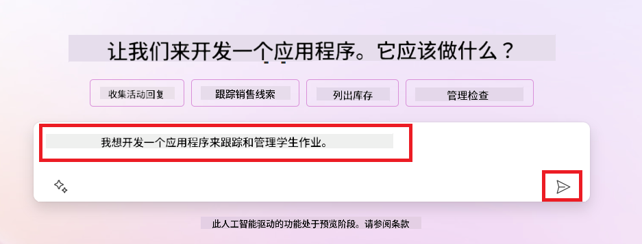
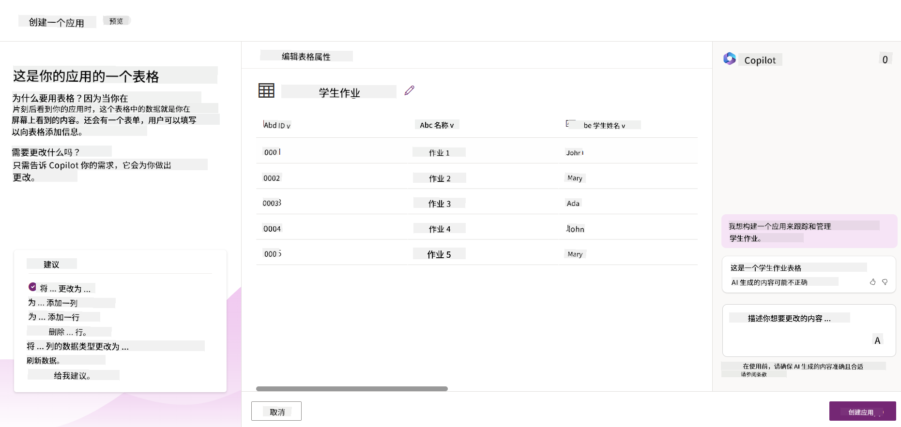
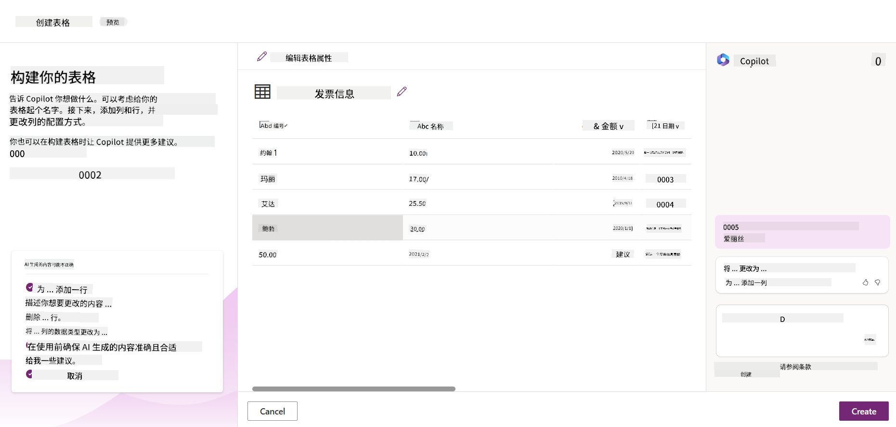

<!--
CO_OP_TRANSLATOR_METADATA:
{
  "original_hash": "f5ff3b6204a695a117d6f452403c95f7",
  "translation_date": "2025-07-09T13:44:16+00:00",
  "source_file": "10-building-low-code-ai-applications/README.md",
  "language_code": "zh"
}
-->
# 构建低代码 AI 应用

> _(点击上方图片观看本课视频)_

## 介绍

既然我们已经学会了如何构建图像生成应用，接下来让我们聊聊低代码。生成式 AI 可以应用于多个领域，包括低代码，但什么是低代码？我们又如何将 AI 融入其中？

通过低代码开发平台，传统开发者和非开发者都能更轻松地构建应用和解决方案。低代码开发平台允许你用极少甚至无需编写代码来构建应用和解决方案。这是通过提供一个可视化开发环境实现的，你可以拖拽组件来搭建应用和解决方案，从而更快、更高效地完成开发。本课将深入探讨如何使用低代码，以及如何利用 Power Platform 结合 AI 来增强低代码开发。

Power Platform 为组织提供了一个机会，让团队成员通过直观的低代码或无代码环境自行构建解决方案。这个环境简化了构建流程。借助 Power Platform，解决方案的开发周期可以从几个月甚至几年缩短到几天或几周。Power Platform 包含五个核心产品：Power Apps、Power Automate、Power BI、Power Pages 和 Copilot Studio。

本课内容包括：

- Power Platform 中生成式 AI 的介绍
- Copilot 的介绍及使用方法
- 利用生成式 AI 构建 Power Platform 中的应用和流程
- 通过 AI Builder 了解 Power Platform 中的 AI 模型

## 学习目标

完成本课后，你将能够：

- 理解 Copilot 在 Power Platform 中的工作原理。

- 为我们的教育初创公司构建一款学生作业跟踪应用。

- 构建一个使用 AI 提取发票信息的发票处理流程。

- 在使用 Create Text with GPT AI 模型时应用最佳实践。

本课将使用的工具和技术包括：

- **Power Apps**：用于构建学生作业跟踪应用，提供低代码开发环境，帮助构建用于跟踪、管理和交互数据的应用。

- **Dataverse**：用于存储学生作业跟踪应用的数据，提供低代码数据平台。

- **Power Automate**：用于发票处理流程，提供低代码开发环境，帮助构建自动化工作流。

- **AI Builder**：用于发票处理的 AI 模型，利用预构建的 AI 模型处理发票。

## Power Platform 中的生成式 AI

利用生成式 AI 来增强低代码开发和应用是 Power Platform 的重点方向。目标是让每个人都能构建 AI 驱动的应用、网站、仪表盘，并通过 AI 自动化流程，_无需任何数据科学专业知识_。这一目标通过将生成式 AI 集成到 Power Platform 的低代码开发体验中实现，具体表现为 Copilot 和 AI Builder。

### 这是如何实现的？

Copilot 是一个 AI 助手，允许你通过一系列自然语言的对话步骤描述需求，从而构建 Power Platform 解决方案。比如，你可以告诉 AI 助手你的应用需要哪些字段，它会帮你创建应用和底层数据模型；或者你可以说明如何设置 Power Automate 中的流程。

你还可以在应用界面中使用 Copilot 驱动的功能，让用户通过对话交互发现洞见。

AI Builder 是 Power Platform 中的低代码 AI 功能，允许你使用 AI 模型来自动化流程和预测结果。借助 AI Builder，你可以将 AI 融入连接 Dataverse 或其他云数据源（如 SharePoint、OneDrive、Azure）的应用和流程中。

Copilot 可用于所有 Power Platform 产品：Power Apps、Power Automate、Power BI、Power Pages 和 Power Virtual Agents。AI Builder 可用于 Power Apps 和 Power Automate。本课将重点介绍如何在 Power Apps 和 Power Automate 中使用 Copilot 和 AI Builder，为我们的教育初创公司构建解决方案。

### Power Apps 中的 Copilot

作为 Power Platform 的一部分，Power Apps 提供低代码开发环境，用于构建跟踪、管理和交互数据的应用。它是一套应用开发服务，拥有可扩展的数据平台，并能连接云服务和本地数据。Power Apps 支持在浏览器、平板和手机上运行应用，并可与同事共享。Power Apps 通过简洁的界面降低了应用开发门槛，使每个业务用户或专业开发者都能构建定制应用。生成式 AI 通过 Copilot 进一步提升了应用开发体验。

Power Apps 中的 Copilot AI 助手功能允许你描述所需应用的类型及其需要跟踪、收集或展示的信息。Copilot 会根据描述生成响应式 Canvas 应用。你可以根据需求自定义应用。AI Copilot 还会生成并建议一个 Dataverse 表，包含你需要存储的字段和一些示例数据。本课稍后会介绍 Dataverse 及其在 Power Apps 中的使用。你可以通过对话步骤使用 AI Copilot 助手功能自定义表格。该功能可直接从 Power Apps 主页访问。

### Power Automate 中的 Copilot

作为 Power Platform 的一部分，Power Automate 允许用户创建应用和服务之间的自动化工作流。它帮助自动化重复的业务流程，如沟通、数据收集和审批。其简洁界面适合各种技术水平的用户（从初学者到资深开发者）自动化工作任务。生成式 AI 通过 Copilot 也提升了工作流开发体验。

Power Automate 中的 Copilot AI 助手功能允许你描述所需的流程类型及其执行的操作。Copilot 会根据描述生成流程。你可以根据需求自定义流程。AI Copilot 还会生成并建议完成任务所需的操作。本课稍后会介绍流程及其在 Power Automate 中的使用。你可以通过对话步骤使用 AI Copilot 助手功能自定义操作。该功能可直接从 Power Automate 主页访问。

## 任务：使用 Copilot 管理我们初创公司的学生作业和发票

我们的初创公司为学生提供在线课程。随着业务快速增长，课程需求激增，公司难以应对。公司聘请你作为 Power Platform 开发者，帮助他们构建低代码解决方案，管理学生作业和发票。该方案应能通过应用跟踪和管理学生作业，并通过工作流自动化发票处理。你需要使用生成式 AI 开发该解决方案。

刚开始使用 Copilot 时，可以参考[Power Platform Copilot Prompt Library](https://github.com/pnp/powerplatform-prompts?WT.mc_id=academic-109639-somelezediko)获取提示语。这是一个包含多种提示语的库，帮助你用 Copilot 构建应用和流程，也能帮助你了解如何向 Copilot 描述需求。

### 为我们的初创公司构建学生作业跟踪应用

我们初创公司的教育者一直难以跟踪学生作业。他们之前用电子表格管理作业，但随着学生数量增加，管理变得困难。他们希望你构建一款应用，帮助跟踪和管理学生作业。该应用应支持添加新作业、查看作业、更新作业和删除作业。应用还应允许教育者和学生查看已评分和未评分的作业。

你将使用 Power Apps 中的 Copilot 按以下步骤构建应用：

1. 进入 [Power Apps](https://make.powerapps.com?WT.mc_id=academic-105485-koreyst) 主页。

2. 在主页的文本区域描述你想构建的应用。例如，**_我想构建一个用于跟踪和管理学生作业的应用_**。点击 **发送** 按钮，将提示发送给 AI Copilot。

3. AI Copilot 会建议一个 Dataverse 表，包含你需要存储的字段和一些示例数据。你可以通过对话步骤使用 AI Copilot 助手功能自定义表格以满足需求。

   > **重要提示**：Dataverse 是 Power Platform 的底层数据平台，是一个低代码数据平台，用于存储应用数据。它是一个完全托管的服务，安全地存储在微软云中，并在你的 Power Platform 环境中配置。它内置数据治理功能，如数据分类、数据血缘、细粒度访问控制等。你可以在[这里](https://docs.microsoft.com/powerapps/maker/data-platform/data-platform-intro?WT.mc_id=academic-109639-somelezediko)了解更多关于 Dataverse 的信息。

   

4. 教育者希望向提交作业的学生发送邮件，告知作业进度。你可以用 Copilot 向表中添加一个新字段，用于存储学生邮箱。例如，使用以下提示添加新字段：**_我想添加一列用于存储学生邮箱_**。点击 **发送** 按钮，将提示发送给 AI Copilot。

5. AI Copilot 会生成新字段，你可以根据需求自定义该字段。

6. 完成表格后，点击 **创建应用** 按钮创建应用。

7. AI Copilot 会根据你的描述生成响应式 Canvas 应用。你可以根据需求自定义应用。

8. 为了让教育者能给学生发送邮件，你可以用 Copilot 向应用添加新屏幕。例如，使用以下提示添加新屏幕：**_我想添加一个屏幕用于给学生发送邮件_**。点击 **发送** 按钮，将提示发送给 AI Copilot。

9. AI Copilot 会生成新屏幕，你可以根据需求自定义该屏幕。

10. 完成应用后，点击 **保存** 按钮保存应用。

11. 若要与教育者共享应用，点击 **共享** 按钮，再次点击 **共享**，输入教育者的邮箱地址即可共享应用。

> **你的作业**：你刚构建的应用是一个良好的开端，但仍有提升空间。当前邮件功能只能让教育者手动输入邮箱发送邮件。你能否利用 Copilot 构建一个自动化流程，使教育者在学生提交作业时自动发送邮件？提示：通过合适的提示语，你可以在 Power Automate 中使用 Copilot 来实现此功能。

### 为我们的初创公司构建发票信息表

我们初创公司的财务团队一直难以跟踪发票。他们之前用电子表格管理发票，但随着发票数量增加，管理变得困难。他们希望你构建一个表格，帮助存储、跟踪和管理收到的发票信息。该表将用于构建自动化流程，提取所有发票信息并存储到表中。表格还应支持财务团队查看已付款和未付款的发票。

Power Platform 有一个底层数据平台叫 Dataverse，支持你存储应用和解决方案的数据。Dataverse 提供低代码数据平台，用于存储应用数据。它是一个完全托管的服务，安全地存储在微软云中，并在你的 Power Platform 环境中配置。它内置数据治理功能，如数据分类、数据血缘、细粒度访问控制等。你可以在[这里](https://docs.microsoft.com/powerapps/maker/data-platform/data-platform-intro?WT.mc_id=academic-109639-somelezediko)了解更多关于 Dataverse 的信息。

为什么我们要为初创公司使用 Dataverse？Dataverse 中的标准和自定义表为你的数据提供了安全的云端存储选项。表格让你可以存储不同类型的数据，类似于在一个 Excel 工作簿中使用多个工作表。你可以用表格存储特定于组织或业务需求的数据。使用 Dataverse，初创公司将获得的好处包括但不限于：
- **易于管理**：元数据和数据都存储在云端，因此您无需担心它们的存储或管理细节。您可以专注于构建应用和解决方案。

- **安全**：Dataverse 提供安全的云端存储选项。您可以通过基于角色的安全性控制谁可以访问表中的数据以及如何访问。

- **丰富的元数据**：数据类型和关系可以直接在 Power Apps 中使用。

- **逻辑和验证**：您可以使用业务规则、计算字段和验证规则来执行业务逻辑并保持数据准确性。

既然您已经了解了 Dataverse 是什么以及为什么要使用它，接下来让我们看看如何使用 Copilot 在 Dataverse 中创建一个表，以满足财务团队的需求。

> **Note** ：您将在下一部分使用此表来构建一个自动化流程，提取所有发票信息并将其存储到表中。

使用 Copilot 在 Dataverse 中创建表，请按照以下步骤操作：

1. 进入 [Power Apps](https://make.powerapps.com?WT.mc_id=academic-105485-koreyst) 主页。

2. 在左侧导航栏选择 **Tables**，然后点击 **Describe the new Table**。

3. 在 **Describe the new Table** 页面，使用文本框描述您想创建的表。例如，**_我想创建一个用于存储发票信息的表_**。点击 **Send** 按钮将提示发送给 AI Copilot。

4. AI Copilot 会建议一个包含所需字段和一些示例数据的 Dataverse 表。您可以通过与 AI Copilot 的对话步骤，进一步自定义表以满足您的需求。

5. 财务团队希望向供应商发送电子邮件，更新他们发票的当前状态。您可以使用 Copilot 向表中添加一个新字段来存储供应商邮箱。例如，您可以使用以下提示添加新字段：**_我想添加一个用于存储供应商邮箱的列_**。点击 **Send** 按钮将提示发送给 AI Copilot。

6. AI Copilot 会生成一个新字段，您可以根据需要自定义该字段。

7. 完成表的设计后，点击 **Create** 按钮创建表。

## Power Platform 中的 AI 模型与 AI Builder

AI Builder 是 Power Platform 中的低代码 AI 功能，帮助您使用 AI 模型自动化流程和预测结果。通过 AI Builder，您可以将 AI 集成到连接 Dataverse 或各种云数据源（如 SharePoint、OneDrive 或 Azure）的应用和流程中。

## 预构建 AI 模型与自定义 AI 模型

AI Builder 提供两种 AI 模型：预构建 AI 模型和自定义 AI 模型。预构建 AI 模型由微软训练并在 Power Platform 中提供，帮助您无需收集数据、构建、训练和发布模型即可为应用和流程添加智能，实现自动化和预测。

Power Platform 中可用的一些预构建 AI 模型包括：

- **关键短语提取**：从文本中提取关键短语。
- **语言检测**：检测文本的语言。
- **情感分析**：识别文本的正面、负面、中性或混合情感。
- **名片识别**：从名片中提取信息。
- **文本识别**：从图像中提取文本。
- **对象检测**：检测并提取图像中的对象。
- **文档处理**：从表单中提取信息。
- **发票处理**：从发票中提取信息。

自定义 AI 模型允许您将自己的模型导入 AI Builder，使其像任何 AI Builder 自定义模型一样工作，您可以使用自己的数据训练模型。这些模型可用于 Power Apps 和 Power Automate 中的自动化和预测。使用自定义模型时存在一些限制，详情请参阅[限制说明](https://learn.microsoft.com/ai-builder/byo-model#limitations?WT.mc_id=academic-105485-koreyst)。

## 任务 #2 - 为我们的初创公司构建发票处理流程

财务团队一直在努力处理发票。他们使用电子表格跟踪发票，但随着发票数量增加，管理变得困难。他们希望您构建一个使用 AI 帮助处理发票的工作流。该工作流应能提取发票信息并存储到 Dataverse 表中，同时能够向财务团队发送包含提取信息的电子邮件。

既然您已经了解了 AI Builder 及其用途，接下来让我们看看如何使用之前介绍的发票处理 AI 模型，构建一个帮助财务团队处理发票的工作流。

使用 AI Builder 中的发票处理 AI 模型构建工作流，请按照以下步骤操作：

1. 进入 [Power Automate](https://make.powerautomate.com?WT.mc_id=academic-105485-koreyst) 主页。

2. 在主页的文本框中描述您想构建的工作流。例如，**_当发票到达我的邮箱时处理发票_**。点击 **Send** 按钮将提示发送给 AI Copilot。

   

3. AI Copilot 会建议完成任务所需的操作。您可以点击 **Next** 按钮继续下一步。

4. 下一步，Power Automate 会提示您设置流程所需的连接。完成后，点击 **Create flow** 按钮创建流程。

5. AI Copilot 会生成一个流程，您可以根据需要自定义。

6. 更新流程触发器，将 **Folder** 设置为存放发票的文件夹。例如，设置为 **Inbox**。点击 **Show advanced options**，将 **Only with Attachments** 设置为 **Yes**，确保流程仅在收到带附件的邮件时运行。

7. 从流程中删除以下操作：**HTML to text**、**Compose**、**Compose 2**、**Compose 3** 和 **Compose 4**，因为您不会使用它们。

8. 删除流程中的 **Condition** 操作，因为您不会使用它。流程应如下图所示：

   

9. 点击 **Add an action** 按钮，搜索 **Dataverse**，选择 **Add a new row** 操作。

10. 在 **Extract Information from invoices** 操作中，将 **Invoice File** 设置为邮件中的 **Attachment Content**，确保流程从发票附件中提取信息。

11. 选择之前创建的表，例如 **Invoice Information** 表。使用上一步操作的动态内容填充以下字段：

    - ID
    - Amount
    - Date
    - Name
    - Status - 将 **Status** 设置为 **Pending**。
    - Supplier Email - 使用 **When a new email arrives** 触发器中的 **From** 动态内容。

    

12. 完成流程后，点击 **Save** 按钮保存流程。您可以通过向触发器指定的文件夹发送带发票的邮件来测试流程。

> **您的作业**：您刚刚构建的流程是一个良好的开端，现在需要思考如何构建一个自动化流程，使财务团队能够向供应商发送电子邮件，更新发票的当前状态。提示：流程必须在发票状态发生变化时运行。

## 在 Power Automate 中使用文本生成 AI 模型

AI Builder 中的 Create Text with GPT AI 模型基于 Microsoft Azure OpenAI 服务，能够根据提示生成文本。借助此功能，您可以将 GPT（生成式预训练变换器）技术集成到应用和流程中，构建各种自动化流程和智能应用。

GPT 模型经过大量数据训练，能够根据提示生成接近人类语言的文本。结合工作流自动化，GPT 等 AI 模型可用于简化和自动化多种任务。

例如，您可以构建自动生成各种文本的流程，如电子邮件草稿、产品描述等。您还可以将该模型用于聊天机器人和客户服务应用，帮助客服人员高效、有效地回复客户咨询。

想了解如何在 Power Automate 中使用此 AI 模型，请学习[使用 AI Builder 和 GPT 添加智能](https://learn.microsoft.com/training/modules/ai-builder-text-generation/?WT.mc_id=academic-109639-somelezediko)模块。

## 干得好！继续学习

完成本课后，请查看我们的[生成式 AI 学习合集](https://aka.ms/genai-collection?WT.mc_id=academic-105485-koreyst)，继续提升您的生成式 AI 知识！

接下来进入第 11 课，我们将学习如何[集成生成式 AI 与函数调用](../11-integrating-with-function-calling/README.md?WT.mc_id=academic-105485-koreyst)！

**免责声明**：  
本文件使用 AI 翻译服务 [Co-op Translator](https://github.com/Azure/co-op-translator) 进行翻译。虽然我们力求准确，但请注意自动翻译可能包含错误或不准确之处。原始文件的母语版本应被视为权威来源。对于重要信息，建议采用专业人工翻译。对于因使用本翻译而产生的任何误解或误释，我们概不负责。