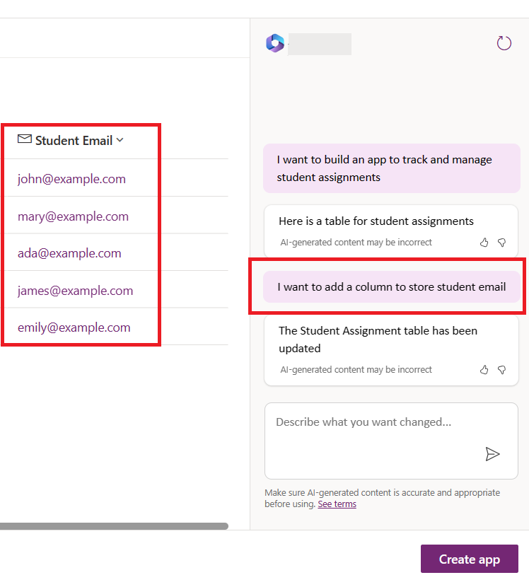
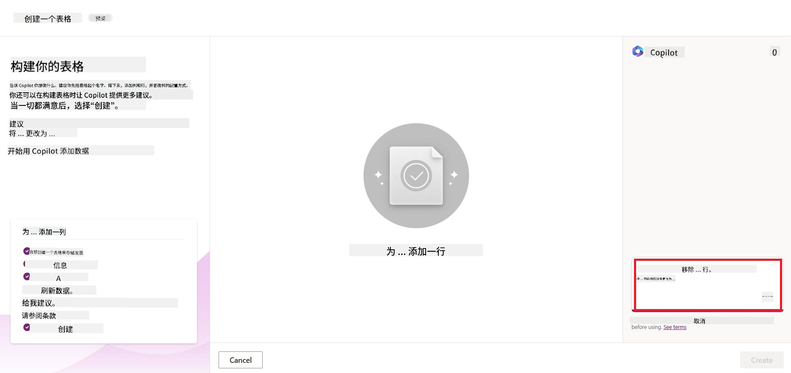
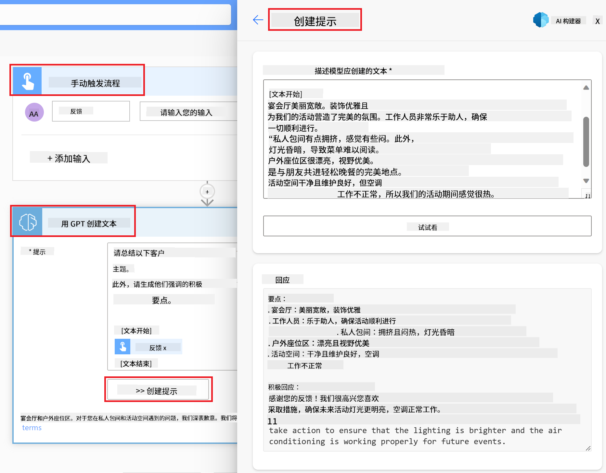

<!--
CO_OP_TRANSLATOR_METADATA:
{
  "original_hash": "846ac8e3b7dcfb697d3309fec05f0fea",
  "translation_date": "2025-10-17T23:23:37+00:00",
  "source_file": "10-building-low-code-ai-applications/README.md",
  "language_code": "zh"
}
-->
# 构建低代码 AI 应用程序

> _(点击上方图片观看本课视频)_

## 简介

现在我们已经学习了如何构建图像生成应用程序，接下来让我们谈谈低代码。生成式 AI 可以应用于许多不同领域，包括低代码开发，但什么是低代码？我们又如何将 AI 添加到其中呢？

通过使用低代码开发平台，传统开发者和非开发者构建应用程序和解决方案变得更加容易。低代码开发平台允许用户通过极少甚至无需编写代码来构建应用程序和解决方案。这是通过提供一个可视化开发环境实现的，用户可以通过拖放组件来构建应用程序和解决方案。这使得构建应用程序和解决方案的速度更快，资源需求更少。在本课中，我们将深入探讨如何使用低代码开发以及如何通过 Power Platform 使用 AI 来增强低代码开发。

Power Platform 为组织提供了一个直观的低代码或无代码环境，使团队能够自主构建解决方案。这个环境简化了构建解决方案的过程。使用 Power Platform，解决方案可以在几天或几周内完成，而不是几个月或几年。Power Platform 包括五个核心产品：Power Apps、Power Automate、Power BI、Power Pages 和 Copilot Studio。

本课内容包括：

- Power Platform 中生成式 AI 的介绍
- Copilot 的介绍及使用方法
- 使用生成式 AI 在 Power Platform 中构建应用程序和流程
- 了解 Power Platform 中的 AI Builder 模型

## 学习目标

完成本课后，您将能够：

- 了解 Copilot 在 Power Platform 中的工作原理。

- 为我们的教育初创公司构建一个学生作业跟踪应用程序。

- 构建一个使用 AI 从发票中提取信息的发票处理流程。

- 在使用 GPT AI 模型生成文本时应用最佳实践。

本课中您将使用的工具和技术包括：

- **Power Apps**：用于学生作业跟踪应用程序，提供一个低代码开发环境，用于构建应用程序以跟踪、管理和与数据交互。

- **Dataverse**：用于存储学生作业跟踪应用程序的数据，Dataverse 提供一个低代码数据平台，用于存储应用程序的数据。

- **Power Automate**：用于发票处理流程，提供一个低代码开发环境，用于构建工作流以自动化发票处理过程。

- **AI Builder**：用于发票处理 AI 模型，您将使用预构建的 AI 模型来处理初创公司的发票。

## Power Platform 中的生成式 AI

通过生成式 AI 增强低代码开发和应用程序是 Power Platform 的一个关键关注领域。目标是让每个人都能构建 AI 驱动的应用程序、网站、仪表板，并通过 AI 自动化流程，_无需任何数据科学专业知识_。这一目标通过将生成式 AI 集成到 Power Platform 的低代码开发体验中实现，形式包括 Copilot 和 AI Builder。

### 它是如何工作的？

Copilot 是一个 AI 助手，允许您通过自然语言描述需求，在一系列对话步骤中构建 Power Platform 解决方案。例如，您可以指示 AI 助手说明应用程序将使用哪些字段，它将根据您的描述创建应用程序和底层数据模型，或者您可以指定如何在 Power Automate 中设置流程。

您可以在应用程序屏幕中使用 Copilot 驱动的功能，通过对话交互帮助用户发现洞察。

AI Builder 是 Power Platform 中的一项低代码 AI 功能，允许您使用 AI 模型来帮助自动化流程和预测结果。通过 AI Builder，您可以将 AI 引入连接到 Dataverse 或各种云数据源（如 SharePoint、OneDrive 或 Azure）的应用程序和流程中。

Copilot 在 Power Platform 的所有产品中均可用：Power Apps、Power Automate、Power BI、Power Pages 和 Power Virtual Agents。而 AI Builder 在 Power Apps 和 Power Automate 中可用。在本课中，我们将重点介绍如何在 Power Apps 和 Power Automate 中使用 Copilot 和 AI Builder，为我们的教育初创公司构建解决方案。

### Power Apps 中的 Copilot

作为 Power Platform 的一部分，Power Apps 提供了一个低代码开发环境，用于构建应用程序以跟踪、管理和与数据交互。它是一套应用程序开发服务，具有可扩展的数据平台，并能够连接到云服务和本地数据。Power Apps 允许您构建可在浏览器、平板电脑和手机上运行的应用程序，并与同事共享。Power Apps 通过简单的界面使用户轻松进入应用程序开发领域，无论是普通业务用户还是专业开发者都可以构建自定义应用程序。通过 Copilot，生成式 AI 进一步增强了应用程序开发体验。

Power Apps 中的 Copilot AI 助手功能允许您描述所需的应用程序类型以及应用程序需要跟踪、收集或显示的信息。Copilot 会根据您的描述生成一个响应式 Canvas 应用程序。然后，您可以根据需要自定义应用程序。AI Copilot 还会生成并建议一个包含所需字段的 Dataverse 表，用于存储您想要跟踪的数据，并提供一些示例数据。稍后我们将在本课中详细介绍 Dataverse 及其在 Power Apps 中的使用。您可以通过对话步骤使用 AI Copilot 助手功能进一步自定义表格。此功能可以直接从 Power Apps 的主屏幕访问。

### Power Automate 中的 Copilot

作为 Power Platform 的一部分，Power Automate 允许用户在应用程序和服务之间创建自动化工作流。它帮助自动化重复的业务流程，例如通信、数据收集和决策审批。其简单的界面使得从初学者到经验丰富的开发者都可以轻松自动化工作任务。通过 Copilot，生成式 AI 进一步增强了工作流开发体验。

Power Automate 中的 Copilot AI 助手功能允许您描述所需的流程类型以及流程需要执行的操作。Copilot 会根据您的描述生成一个流程。然后，您可以根据需要自定义流程。AI Copilot 还会生成并建议执行任务所需的操作。稍后我们将在本课中详细介绍流程及其在 Power Automate 中的使用。您可以通过对话步骤使用 AI Copilot 助手功能进一步自定义操作。此功能可以直接从 Power Automate 的主屏幕访问。

## 作业：使用 Copilot 管理初创公司的学生作业和发票

我们的初创公司为学生提供在线课程。公司发展迅速，现在难以满足课程需求。公司聘请您作为 Power Platform 开发人员，帮助他们构建一个低代码解决方案，以管理学生作业和发票。解决方案应能够通过一个应用程序帮助他们跟踪和管理学生作业，并通过一个工作流自动化发票处理过程。您被要求使用生成式 AI 来开发解决方案。

在开始使用 Copilot 时，您可以使用 [Power Platform Copilot Prompt Library](https://github.com/pnp/powerplatform-prompts?WT.mc_id=academic-109639-somelezediko) 来获取提示。这些库包含了一系列提示，您可以用来通过 Copilot 构建应用程序和流程。您还可以使用库中的提示来了解如何向 Copilot 描述您的需求。

### 为初创公司构建学生作业跟踪应用程序

我们初创公司的教育工作者一直在努力跟踪学生作业。他们一直使用电子表格来跟踪作业，但随着学生数量的增加，这种方式变得难以管理。他们要求您构建一个应用程序，帮助他们跟踪和管理学生作业。应用程序应允许他们添加新作业、查看作业、更新作业和删除作业。应用程序还应允许教育工作者和学生查看已评分和未评分的作业。

您将按照以下步骤使用 Power Apps 中的 Copilot 构建应用程序：

1. 进入 [Power Apps](https://make.powerapps.com?WT.mc_id=academic-105485-koreyst) 主屏幕。

1. 使用主屏幕上的文本区域描述您想要构建的应用程序。例如，**_我想构建一个应用程序来跟踪和管理学生作业_**。点击 **发送** 按钮将提示发送给 AI Copilot。

1. AI Copilot 会建议一个包含所需字段的 Dataverse 表，用于存储您想要跟踪的数据，并提供一些示例数据。您可以通过对话步骤使用 AI Copilot 助手功能进一步自定义表格。

   > **重要提示**：Dataverse 是 Power Platform 的底层数据平台。它是一个低代码数据平台，用于存储应用程序的数据。它是一个完全托管的服务，安全地将数据存储在 Microsoft 云中，并在您的 Power Platform 环境中进行配置。它具有内置的数据治理功能，例如数据分类、数据沿袭、细粒度访问控制等。您可以在 [这里](https://docs.microsoft.com/powerapps/maker/data-platform/data-platform-intro?WT.mc_id=academic-109639-somelezediko) 了解更多关于 Dataverse 的信息。

   

1. 教育工作者希望向提交作业的学生发送电子邮件，以便让他们了解作业的进展情况。您可以使用 Copilot 向表中添加一个新字段来存储学生的电子邮件。例如，您可以使用以下提示向表中添加一个新字段：**_我想添加一个列来存储学生电子邮件_**。点击 **发送** 按钮将提示发送给 AI Copilot。

1. AI Copilot 会生成一个新字段，您可以根据需要自定义该字段。

1. 完成表格后，点击 **创建应用程序** 按钮以创建应用程序。

1. AI Copilot 会根据您的描述生成一个响应式 Canvas 应用程序。您可以根据需要自定义应用程序。

1. 为了让教育工作者向学生发送电子邮件，您可以使用 Copilot 向应用程序添加一个新屏幕。例如，您可以使用以下提示向应用程序添加一个新屏幕：**_我想添加一个屏幕来向学生发送电子邮件_**。点击 **发送** 按钮将提示发送给 AI Copilot。

1. AI Copilot 会生成一个新屏幕，您可以根据需要自定义该屏幕。

1. 完成应用程序后，点击 **保存** 按钮保存应用程序。

1. 要与教育工作者共享应用程序，点击 **共享** 按钮，然后再次点击 **共享** 按钮。您可以通过输入教育工作者的电子邮件地址与他们共享应用程序。

> **您的作业**：您刚刚构建的应用程序是一个良好的开端，但可以进一步改进。通过电子邮件功能，教育工作者只能手动输入学生的电子邮件来发送邮件。您能否使用 Copilot 构建一个自动化功能，使教育工作者在学生提交作业时自动向他们发送电子邮件？提示：通过正确的提示，您可以使用 Power Automate 中的 Copilot 来实现这一点。

### 为初创公司构建发票信息表

我们初创公司的财务团队一直在努力跟踪发票。他们一直使用电子表格来跟踪发票，但随着发票数量的增加，这种方式变得难以管理。他们要求您构建一个表格，帮助他们存储、跟踪和管理收到的发票信息。该表格应用于构建一个自动化流程，提取所有发票信息并将其存储在表格中。表格还应允许财务团队查看已支付和未支付的发票。

Power Platform 有一个底层数据平台叫 Dataverse，它允许您存储应用程序和解决方案的数据。Dataverse 提供一个低代码数据平台，用于存储应用程序的数据。它是一个完全托管的服务，安全地将数据存储在 Microsoft 云中，并在您的 Power Platform 环境中进行配置。它具有内置的数据治理功能，例如数据分类、数据沿袭、细粒度访问控制等。您可以在 [这里](https://docs.microsoft.com/powerapps/maker/data-platform/data-platform-intro?WT.mc_id=academic-109639-somelezediko) 了解更多关于 Dataverse 的信息。
为什么我们的初创公司应该使用 Dataverse？Dataverse 中的标准表和自定义表为您的数据提供了安全的云存储选项。表格可以让您存储不同类型的数据，就像在一个 Excel 工作簿中使用多个工作表一样。您可以使用表格存储特定于您的组织或业务需求的数据。使用 Dataverse，我们的初创公司可以获得以下好处（但不限于）：

- **易于管理**：元数据和数据都存储在云中，因此您无需担心它们的存储或管理细节。您可以专注于构建应用程序和解决方案。

- **安全性**：Dataverse 为您的数据提供了安全的云存储选项。您可以通过基于角色的安全性控制谁可以访问表中的数据以及如何访问。

- **丰富的元数据**：数据类型和关系可以直接在 Power Apps 中使用。

- **逻辑和验证**：您可以使用业务规则、计算字段和验证规则来强制执行业务逻辑并保持数据的准确性。

现在您已经了解了什么是 Dataverse 以及为什么应该使用它，接下来我们来看看如何使用 Copilot 在 Dataverse 中创建一个表，以满足我们财务团队的需求。

> **Note** : 您将在下一部分中使用此表构建一个自动化流程，用于提取所有发票信息并将其存储在表中。

使用 Copilot 在 Dataverse 中创建表，请按照以下步骤操作：

1. 进入 [Power Apps](https://make.powerapps.com?WT.mc_id=academic-105485-koreyst) 的主页。

2. 在左侧导航栏中，选择 **Tables**，然后点击 **Describe the new Table**。

3. 在 **Describe the new Table** 页面上，使用文本区域描述您想要创建的表。例如，**_我想创建一个表来存储发票信息_**。点击 **Send** 按钮将提示发送给 AI Copilot。

4. AI Copilot 将建议一个 Dataverse 表，其中包含您需要存储的数据字段以及一些示例数据。然后，您可以通过对话步骤使用 AI Copilot 助手功能来定制表格以满足您的需求。

5. 财务团队希望向供应商发送电子邮件，更新他们的发票当前状态。您可以使用 Copilot 向表中添加一个新字段来存储供应商的电子邮件。例如，您可以使用以下提示添加一个新字段：**_我想添加一个列来存储供应商电子邮件_**。点击 **Send** 按钮将提示发送给 AI Copilot。

6. AI Copilot 将生成一个新字段，您可以根据需要定制该字段。

7. 完成表格后，点击 **Create** 按钮创建表格。

## Power Platform 中的 AI 模型与 AI Builder

AI Builder 是 Power Platform 中的一种低代码 AI 功能，它使您能够使用 AI 模型来帮助自动化流程和预测结果。通过 AI Builder，您可以将 AI 引入连接到 Dataverse 或各种云数据源（如 SharePoint、OneDrive 或 Azure）的应用程序和流程中。

## 预构建 AI 模型与自定义 AI 模型

AI Builder 提供两种类型的 AI 模型：预构建 AI 模型和自定义 AI 模型。预构建 AI 模型是由 Microsoft 训练并在 Power Platform 中可用的现成 AI 模型。这些模型帮助您为应用程序和流程添加智能，而无需收集数据然后构建、训练和发布自己的模型。您可以使用这些模型来自动化流程和预测结果。

Power Platform 中的一些预构建 AI 模型包括：

- **关键短语提取**：此模型从文本中提取关键短语。
- **语言检测**：此模型检测文本的语言。
- **情感分析**：此模型检测文本中的积极、消极、中性或混合情感。
- **名片读取器**：此模型从名片中提取信息。
- **文本识别**：此模型从图像中提取文本。
- **对象检测**：此模型检测并从图像中提取对象。
- **文档处理**：此模型从表单中提取信息。
- **发票处理**：此模型从发票中提取信息。

通过自定义 AI 模型，您可以将自己的模型引入 AI Builder，使其像任何 AI Builder 自定义模型一样工作，允许您使用自己的数据训练模型。您可以在 Power Apps 和 Power Automate 中使用这些模型来自动化流程和预测结果。使用自定义模型时有一些限制。阅读更多关于这些[限制](https://learn.microsoft.com/ai-builder/byo-model#limitations?WT.mc_id=academic-105485-koreyst)。

## 作业 #2 - 为我们的初创公司构建一个发票处理流程

财务团队在处理发票方面遇到了困难。他们一直使用电子表格来跟踪发票，但随着发票数量的增加，这变得难以管理。他们要求您使用 AI 构建一个工作流程，帮助他们处理发票。该工作流程应能够从发票中提取信息并将信息存储在 Dataverse 表中。工作流程还应能够向财务团队发送包含提取信息的电子邮件。

现在您已经了解了什么是 AI Builder 以及为什么应该使用它，接下来我们来看看如何使用 AI Builder 中的发票处理 AI 模型（我们之前已经介绍过）来构建一个工作流程，帮助财务团队处理发票。

使用 AI Builder 中的发票处理 AI 模型构建一个工作流程，帮助财务团队处理发票，请按照以下步骤操作：

1. 进入 [Power Automate](https://make.powerautomate.com?WT.mc_id=academic-105485-koreyst) 的主页。

2. 在主页上的文本区域中描述您想要构建的工作流程。例如，**_当发票到达我的邮箱时处理发票_**。点击 **Send** 按钮将提示发送给 AI Copilot。

   

3. AI Copilot 将建议您需要执行的操作以完成您想要自动化的任务。您可以点击 **Next** 按钮查看下一步。

4. 在下一步中，Power Automate 将提示您设置流程所需的连接。完成后，点击 **Create flow** 按钮创建流程。

5. AI Copilot 将生成一个流程，您可以根据需要定制该流程。

6. 更新流程的触发器，并将 **Folder** 设置为存储发票的文件夹。例如，您可以将文件夹设置为 **Inbox**。点击 **Show advanced options** 并将 **Only with Attachments** 设置为 **Yes**。这将确保流程仅在文件夹中收到带附件的电子邮件时运行。

7. 从流程中删除以下操作：**HTML to text**、**Compose**、**Compose 2**、**Compose 3** 和 **Compose 4**，因为您不会使用它们。

8. 从流程中删除 **Condition** 操作，因为您不会使用它。它应该看起来像以下截图：

   

9. 点击 **Add an action** 按钮并搜索 **Dataverse**。选择 **Add a new row** 操作。

10. 在 **Extract Information from invoices** 操作中，将 **Invoice File** 更新为指向电子邮件中的 **Attachment Content**。这将确保流程从发票附件中提取信息。

11. 选择您之前创建的 **Table**。例如，您可以选择 **Invoice Information** 表。选择前一个操作中的动态内容来填充以下字段：

    - ID
    - Amount
    - Date
    - Name
    - Status - 将 **Status** 设置为 **Pending**。
    - Supplier Email - 使用 **When a new email arrives** 触发器中的 **From** 动态内容。

    

12. 完成流程后，点击 **Save** 按钮保存流程。您可以通过向触发器中指定的文件夹发送带发票的电子邮件来测试流程。

> **您的作业**：您刚刚构建的流程是一个良好的开端，现在您需要思考如何构建一个自动化流程，使我们的财务团队能够向供应商发送电子邮件，更新他们的发票当前状态。提示：流程必须在发票状态更改时运行。

## 在 Power Automate 中使用文本生成 AI 模型

AI Builder 中的 Create Text with GPT AI 模型使您能够基于提示生成文本，并由 Microsoft Azure OpenAI 服务提供支持。通过此功能，您可以将 GPT（生成式预训练变换器）技术集成到您的应用程序和流程中，以构建各种自动化流程和有洞察力的应用程序。

GPT 模型经过大量数据的广泛训练，使其能够在提供提示时生成与人类语言非常接近的文本。当与工作流程自动化集成时，像 GPT 这样的 AI 模型可以被用来简化和自动化各种任务。

例如，您可以构建流程来自动生成各种用途的文本，例如：电子邮件草稿、产品描述等。您还可以使用该模型为各种应用程序生成文本，例如聊天机器人和客户服务应用程序，使客户服务代理能够有效地回应客户询问。

要了解如何在 Power Automate 中使用此 AI 模型，请查看 [Add intelligence with AI Builder and GPT](https://learn.microsoft.com/training/modules/ai-builder-text-generation/?WT.mc_id=academic-109639-somelezediko) 模块。

## 出色的工作！继续学习

完成本课程后，请查看我们的 [生成式 AI 学习合集](https://aka.ms/genai-collection?WT.mc_id=academic-105485-koreyst)，继续提升您的生成式 AI 知识！

前往第 11 课，我们将学习如何 [将生成式 AI 与函数调用集成](../11-integrating-with-function-calling/README.md?WT.mc_id=academic-105485-koreyst)！

---

**免责声明**：  
本文档使用AI翻译服务[Co-op Translator](https://github.com/Azure/co-op-translator)进行翻译。尽管我们努力确保翻译的准确性，但请注意，自动翻译可能包含错误或不准确之处。原始语言的文档应被视为权威来源。对于关键信息，建议使用专业人工翻译。我们对因使用此翻译而产生的任何误解或误读不承担责任。