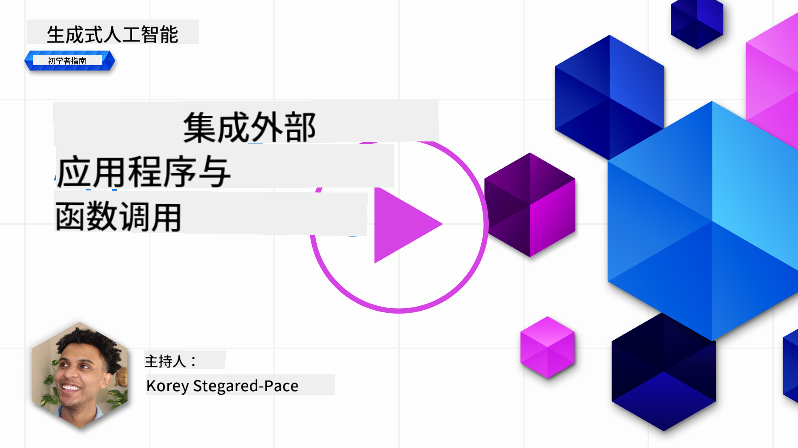
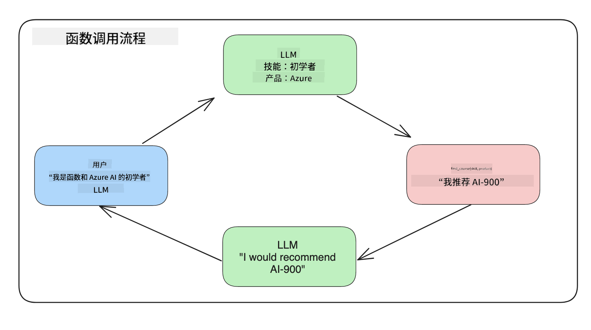
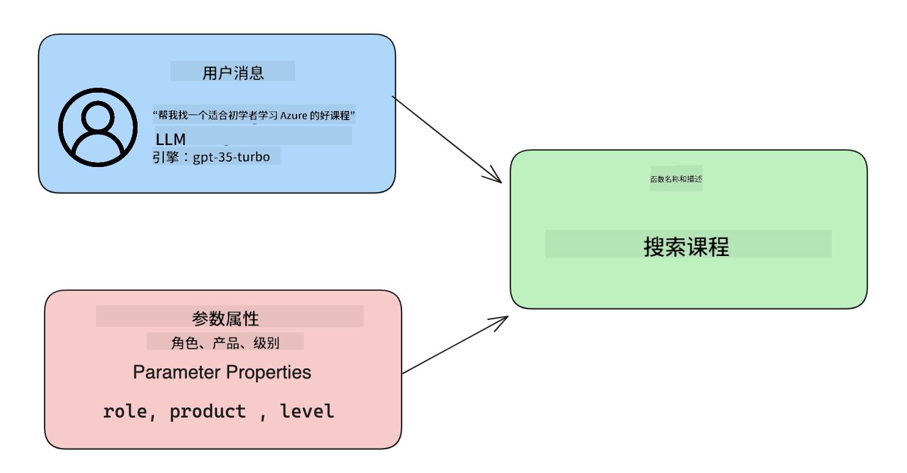

<!--
CO_OP_TRANSLATOR_METADATA:
{
  "original_hash": "77a48a201447be19aa7560706d6f93a0",
  "translation_date": "2025-07-09T14:25:00+00:00",
  "source_file": "11-integrating-with-function-calling/README.md",
  "language_code": "zh"
}
-->
# 与函数调用集成

[](https://aka.ms/gen-ai-lesson11-gh?WT.mc_id=academic-105485-koreyst)

到目前为止，你已经在之前的课程中学到了不少内容。不过，我们还可以进一步改进。一些我们可以解决的问题包括如何获得更一致的响应格式，以便后续处理响应时更方便。同时，我们可能还想从其他来源添加数据，以进一步丰富我们的应用。

上述问题正是本章要解决的内容。

## 介绍

本课将涵盖：

- 解释什么是函数调用及其使用场景。
- 使用 Azure OpenAI 创建函数调用。
- 如何将函数调用集成到应用程序中。

## 学习目标

完成本课后，你将能够：

- 解释使用函数调用的目的。
- 使用 Azure OpenAI 服务设置函数调用。
- 为你的应用场景设计有效的函数调用。

## 场景：通过函数改进我们的聊天机器人

本课中，我们希望为教育初创公司构建一个功能，允许用户通过聊天机器人查找技术课程。我们将推荐符合他们技能水平、当前职位和感兴趣技术的课程。

为完成此场景，我们将结合使用：

- `Azure OpenAI` 为用户创建聊天体验。
- `Microsoft Learn Catalog API` 根据用户请求帮助用户查找课程。
- `Function Calling` 将用户查询发送到函数以发起 API 请求。

首先，让我们看看为什么我们要使用函数调用：

## 为什么使用函数调用

在函数调用出现之前，LLM 的响应是非结构化且不一致的。开发者需要编写复杂的验证代码来处理各种响应变体。用户无法获得诸如“斯德哥尔摩当前天气如何？”这类问题的答案，因为模型只能基于训练时的数据时间点提供信息。

函数调用是 Azure OpenAI 服务的一项功能，用于克服以下限制：

- **响应格式一致**。如果我们能更好地控制响应格式，就能更轻松地将响应集成到下游系统。
- **外部数据**。能够在聊天上下文中使用应用程序的其他数据源。

## 通过场景说明问题

> 我们建议你使用[附带的笔记本](../../../11-integrating-with-function-calling/python/aoai-assignment.ipynb)来运行以下场景。你也可以直接阅读，我们试图说明函数如何帮助解决问题。

来看一个说明响应格式问题的例子：

假设我们想创建一个学生数据数据库，以便为他们推荐合适的课程。下面有两个学生描述，它们包含的数据非常相似。

1. 创建与 Azure OpenAI 资源的连接：

   ```python
   import os
   import json
   from openai import AzureOpenAI
   from dotenv import load_dotenv
   load_dotenv()

   client = AzureOpenAI(
   api_key=os.environ['AZURE_OPENAI_API_KEY'],  # this is also the default, it can be omitted
   api_version = "2023-07-01-preview"
   )

   deployment=os.environ['AZURE_OPENAI_DEPLOYMENT']
   ```

   下面是一些用于配置 Azure OpenAI 连接的 Python 代码，我们设置了 `api_type`、`api_base`、`api_version` 和 `api_key`。

1. 使用变量 `student_1_description` 和 `student_2_description` 创建两个学生描述。

   ```python
   student_1_description="Emily Johnson is a sophomore majoring in computer science at Duke University. She has a 3.7 GPA. Emily is an active member of the university's Chess Club and Debate Team. She hopes to pursue a career in software engineering after graduating."

   student_2_description = "Michael Lee is a sophomore majoring in computer science at Stanford University. He has a 3.8 GPA. Michael is known for his programming skills and is an active member of the university's Robotics Club. He hopes to pursue a career in artificial intelligence after finishing his studies."
   ```

   我们想将上述学生描述发送给 LLM 以解析数据。之后，这些数据可以在应用中使用，发送到 API 或存储到数据库。

1. 创建两个相同的提示，指示 LLM 我们感兴趣的信息：

   ```python
   prompt1 = f'''
   Please extract the following information from the given text and return it as a JSON object:

   name
   major
   school
   grades
   club

   This is the body of text to extract the information from:
   {student_1_description}
   '''

   prompt2 = f'''
   Please extract the following information from the given text and return it as a JSON object:

   name
   major
   school
   grades
   club

   This is the body of text to extract the information from:
   {student_2_description}
   '''
   ```

   上述提示指示 LLM 提取信息并以 JSON 格式返回响应。

1. 设置好提示和 Azure OpenAI 连接后，我们使用 `openai.ChatCompletion` 将提示发送给 LLM。我们将提示存储在 `messages` 变量中，并将角色设置为 `user`，模拟用户向聊天机器人发送消息。

   ```python
   # response from prompt one
   openai_response1 = client.chat.completions.create(
   model=deployment,
   messages = [{'role': 'user', 'content': prompt1}]
   )
   openai_response1.choices[0].message.content

   # response from prompt two
   openai_response2 = client.chat.completions.create(
   model=deployment,
   messages = [{'role': 'user', 'content': prompt2}]
   )
   openai_response2.choices[0].message.content
   ```

现在我们可以向 LLM 发送两个请求，并通过 `openai_response1['choices'][0]['message']['content']` 查看响应。

1. 最后，我们可以通过调用 `json.loads` 将响应转换为 JSON 格式：

   ```python
   # Loading the response as a JSON object
   json_response1 = json.loads(openai_response1.choices[0].message.content)
   json_response1
   ```

   响应 1：

   ```json
   {
     "name": "Emily Johnson",
     "major": "computer science",
     "school": "Duke University",
     "grades": "3.7",
     "club": "Chess Club"
   }
   ```

   响应 2：

   ```json
   {
     "name": "Michael Lee",
     "major": "computer science",
     "school": "Stanford University",
     "grades": "3.8 GPA",
     "club": "Robotics Club"
   }
   ```

   尽管提示相同且描述相似，但我们看到 `Grades` 属性的值格式不同，有时是 `3.7`，有时是 `3.7 GPA`。

   这是因为 LLM 接收的是非结构化的提示文本，返回的也是非结构化数据。我们需要结构化格式，以便在存储或使用数据时知道预期内容。

那么，我们如何解决格式问题呢？通过使用函数调用，我们可以确保收到结构化数据。使用函数调用时，LLM 并不会真正调用或执行任何函数，而是我们为 LLM 的响应创建一个结构。然后，我们根据这些结构化响应确定在应用中调用哪个函数。



接着，我们可以将函数返回的结果发送回 LLM，LLM 会用自然语言回答用户的查询。

## 函数调用的使用场景

函数调用可以提升应用的多种场景，例如：

- **调用外部工具**。聊天机器人擅长回答用户问题。通过函数调用，聊天机器人可以根据用户消息完成特定任务。例如，学生可以让聊天机器人“给我的导师发封邮件，说我需要更多这门课的帮助”，这时可以调用函数 `send_email(to: string, body: string)`。

- **创建 API 或数据库查询**。用户用自然语言查找信息，转换成格式化查询或 API 请求。例如，老师请求“哪些学生完成了上次作业”，可以调用函数 `get_completed(student_name: string, assignment: int, current_status: string)`。

- **创建结构化数据**。用户可以将一段文本或 CSV 交给 LLM 提取重要信息。例如，学生可以将关于和平协议的维基百科文章转换成 AI 闪卡，使用函数 `get_important_facts(agreement_name: string, date_signed: string, parties_involved: list)`。

## 创建你的第一个函数调用

创建函数调用的过程包括三个主要步骤：

1. 使用函数列表和用户消息调用 Chat Completions API。
2. 读取模型响应以执行操作，即执行函数或 API 调用。
3. 使用函数响应再次调用 Chat Completions API，利用该信息生成对用户的回复。



### 第一步 - 创建消息

第一步是创建用户消息。可以动态赋值，比如从文本输入获取，也可以直接赋值。如果你是第一次使用 Chat Completions API，需要定义消息的 `role` 和 `content`。

`role` 可以是 `system`（创建规则）、`assistant`（模型）或 `user`（最终用户）。函数调用中，我们将其设为 `user` 并给出示例问题。

```python
messages= [ {"role": "user", "content": "Find me a good course for a beginner student to learn Azure."} ]
```

通过分配不同角色，LLM 能区分是系统还是用户发言，有助于构建对话历史。

### 第二步 - 创建函数

接下来，我们定义一个函数及其参数。这里只用一个函数 `search_courses`，但你可以创建多个函数。

> **重要**：函数包含在发送给 LLM 的系统消息中，会占用可用的 token 数量。

下面我们将函数定义为一个数组，每个元素是一个函数，包含属性 `name`、`description` 和 `parameters`：

```python
functions = [
   {
      "name":"search_courses",
      "description":"Retrieves courses from the search index based on the parameters provided",
      "parameters":{
         "type":"object",
         "properties":{
            "role":{
               "type":"string",
               "description":"The role of the learner (i.e. developer, data scientist, student, etc.)"
            },
            "product":{
               "type":"string",
               "description":"The product that the lesson is covering (i.e. Azure, Power BI, etc.)"
            },
            "level":{
               "type":"string",
               "description":"The level of experience the learner has prior to taking the course (i.e. beginner, intermediate, advanced)"
            }
         },
         "required":[
            "role"
         ]
      }
   }
]
```

下面详细说明每个函数实例的属性：

- `name` - 要调用的函数名称。
- `description` - 函数的工作描述，需具体清晰。
- `parameters` - 模型在响应中应生成的值和格式列表。参数数组包含若干项，每项有以下属性：
  1. `type` - 属性的数据类型。
  2. `properties` - 模型用于响应的具体值列表
     1. `name` - 属性名称，模型在格式化响应中使用，如 `product`。
     2. `type` - 属性的数据类型，如 `string`。
     3. `description` - 该属性的描述。

还有一个可选属性 `required`，表示函数调用必须包含的属性。

### 第三步 - 发起函数调用

定义函数后，需要在调用 Chat Completion API 时包含它。通过添加 `functions` 参数实现，这里是 `functions=functions`。

还可以设置 `function_call` 为 `auto`，让 LLM 根据用户消息决定调用哪个函数，而不是我们手动指定。

下面代码展示了调用 `ChatCompletion.create`，注意设置了 `functions=functions` 和 `function_call="auto"`，让 LLM 自主选择调用时机：

```python
response = client.chat.completions.create(model=deployment,
                                        messages=messages,
                                        functions=functions,
                                        function_call="auto")

print(response.choices[0].message)
```

返回的响应如下：

```json
{
  "role": "assistant",
  "function_call": {
    "name": "search_courses",
    "arguments": "{\n  \"role\": \"student\",\n  \"product\": \"Azure\",\n  \"level\": \"beginner\"\n}"
  }
}
```

可以看到函数 `search_courses` 被调用，调用参数列在 JSON 响应的 `arguments` 属性中。

LLM 能找到匹配函数参数的数据，是因为它从传入 `messages` 参数的值中提取了信息。下面是 `messages` 的内容回顾：

```python
messages= [ {"role": "user", "content": "Find me a good course for a beginner student to learn Azure."} ]
```

如你所见，`student`、`Azure` 和 `beginner` 从 `messages` 中提取，并作为函数输入。这样使用函数既能从提示中提取信息，也能为 LLM 提供结构化和可复用的功能。

接下来，我们看看如何在应用中使用它。

## 将函数调用集成到应用程序

测试完 LLM 的格式化响应后，我们可以将其集成到应用中。

### 管理流程

集成到应用中，我们采取以下步骤：

1. 首先，调用 OpenAI 服务，将消息存储在变量 `response_message` 中。

   ```python
   response_message = response.choices[0].message
   ```

1. 定义调用 Microsoft Learn API 获取课程列表的函数：

   ```python
   import requests

   def search_courses(role, product, level):
     url = "https://learn.microsoft.com/api/catalog/"
     params = {
        "role": role,
        "product": product,
        "level": level
     }
     response = requests.get(url, params=params)
     modules = response.json()["modules"]
     results = []
     for module in modules[:5]:
        title = module["title"]
        url = module["url"]
        results.append({"title": title, "url": url})
     return str(results)
   ```

   注意这里创建了一个实际的 Python 函数，与 `functions` 变量中定义的函数名对应。我们还发起了真实的外部 API 调用，获取所需数据。这里调用了 Microsoft Learn API 来搜索培训模块。

好了，我们创建了 `functions` 变量和对应的 Python 函数，如何告诉 LLM 这两者对应，以便调用我们的 Python 函数呢？

1. 要判断是否需要调用 Python 函数，需要检查 LLM 的响应中是否包含 `function_call`，并调用指定函数。下面是检查方法：

   ```python
   # Check if the model wants to call a function
   if response_message.function_call.name:
    print("Recommended Function call:")
    print(response_message.function_call.name)
    print()

    # Call the function.
    function_name = response_message.function_call.name

    available_functions = {
            "search_courses": search_courses,
    }
    function_to_call = available_functions[function_name]

    function_args = json.loads(response_message.function_call.arguments)
    function_response = function_to_call(**function_args)

    print("Output of function call:")
    print(function_response)
    print(type(function_response))


    # Add the assistant response and function response to the messages
    messages.append( # adding assistant response to messages
        {
            "role": response_message.role,
            "function_call": {
                "name": function_name,
                "arguments": response_message.function_call.arguments,
            },
            "content": None
        }
    )
    messages.append( # adding function response to messages
        {
            "role": "function",
            "name": function_name,
            "content":function_response,
        }
    )
   ```

   这三行代码确保提取函数名、参数并执行调用：

   ```python
   function_to_call = available_functions[function_name]

   function_args = json.loads(response_message.function_call.arguments)
   function_response = function_to_call(**function_args)
   ```

   下面是运行代码的输出：

   **输出**

   ```Recommended Function call:
   {
     "name": "search_courses",
     "arguments": "{\n  \"role\": \"student\",\n  \"product\": \"Azure\",\n  \"level\": \"beginner\"\n}"
   }

   Output of function call:
   [{'title': 'Describe concepts of cryptography', 'url': 'https://learn.microsoft.com/training/modules/describe-concepts-of-cryptography/?
   WT.mc_id=api_CatalogApi'}, {'title': 'Introduction to audio classification with TensorFlow', 'url': 'https://learn.microsoft.com/en-
   us/training/modules/intro-audio-classification-tensorflow/?WT.mc_id=api_CatalogApi'}, {'title': 'Design a Performant Data Model in Azure SQL
   Database with Azure Data Studio', 'url': 'https://learn.microsoft.com/training/modules/design-a-data-model-with-ads/?
   WT.mc_id=api_CatalogApi'}, {'title': 'Getting started with the Microsoft Cloud Adoption Framework for Azure', 'url':
   'https://learn.microsoft.com/training/modules/cloud-adoption-framework-getting-started/?WT.mc_id=api_CatalogApi'}, {'title': 'Set up the
   Rust development environment', 'url': 'https://learn.microsoft.com/training/modules/rust-set-up-environment/?WT.mc_id=api_CatalogApi'}]
   <class 'str'>
   ```

1. 现在，我们将更新后的消息 `messages` 发送给 LLM，以便获得自然语言回复，而非 API JSON 格式响应。

   ```python
   print("Messages in next request:")
   print(messages)
   print()

   second_response = client.chat.completions.create(
      messages=messages,
      model=deployment,
      function_call="auto",
      functions=functions,
      temperature=0
         )  # get a new response from GPT where it can see the function response


   print(second_response.choices[0].message)
   ```

   **输出**

   ```python
   {
     "role": "assistant",
     "content": "I found some good courses for beginner students to learn Azure:\n\n1. [Describe concepts of cryptography] (https://learn.microsoft.com/training/modules/describe-concepts-of-cryptography/?WT.mc_id=api_CatalogApi)\n2. [Introduction to audio classification with TensorFlow](https://learn.microsoft.com/training/modules/intro-audio-classification-tensorflow/?WT.mc_id=api_CatalogApi)\n3. [Design a Performant Data Model in Azure SQL Database with Azure Data Studio](https://learn.microsoft.com/training/modules/design-a-data-model-with-ads/?WT.mc_id=api_CatalogApi)\n4. [Getting started with the Microsoft Cloud Adoption Framework for Azure](https://learn.microsoft.com/training/modules/cloud-adoption-framework-getting-started/?WT.mc_id=api_CatalogApi)\n5. [Set up the Rust development environment](https://learn.microsoft.com/training/modules/rust-set-up-environment/?WT.mc_id=api_CatalogApi)\n\nYou can click on the links to access the courses."
   }

   ```

## 练习

为了继续学习 Azure OpenAI 函数调用，你可以尝试：

- 增加函数的更多参数，帮助学习者找到更多课程。
- 创建另一个函数调用，获取学习者的母语等更多信息。
- 为函数调用和/或 API 调用未返回合适课程时添加错误处理。
提示：请参考[Learn API reference documentation](https://learn.microsoft.com/training/support/catalog-api-developer-reference?WT.mc_id=academic-105485-koreyst)页面，了解这些数据的获取方式和位置。

## 干得好！继续前进

完成本课后，欢迎查看我们的[生成式 AI 学习合集](https://aka.ms/genai-collection?WT.mc_id=academic-105485-koreyst)，继续提升你的生成式 AI 知识！

前往第12课，我们将探讨如何[为 AI 应用设计用户体验](../12-designing-ux-for-ai-applications/README.md?WT.mc_id=academic-105485-koreyst)！

**免责声明**：  
本文件使用 AI 翻译服务 [Co-op Translator](https://github.com/Azure/co-op-translator) 进行翻译。虽然我们力求准确，但请注意，自动翻译可能包含错误或不准确之处。原始文件的母语版本应被视为权威来源。对于重要信息，建议使用专业人工翻译。对于因使用本翻译而产生的任何误解或误释，我们概不负责。