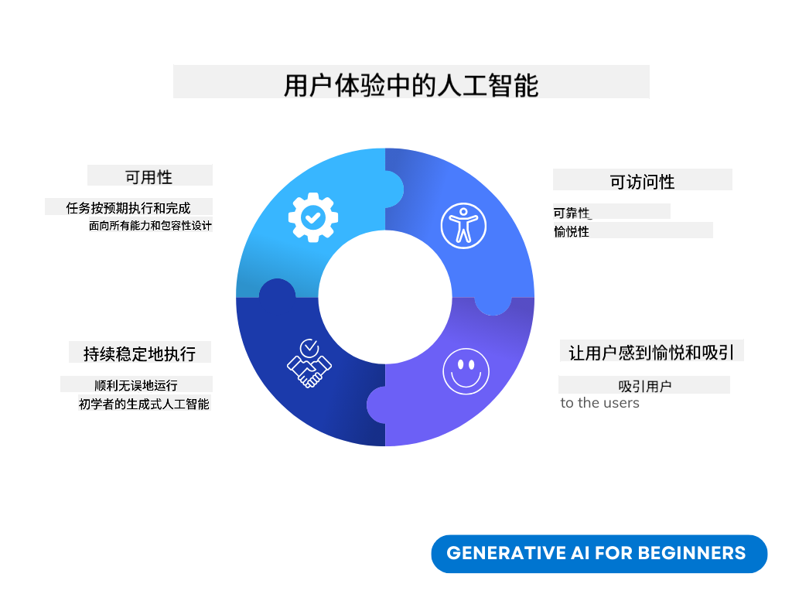
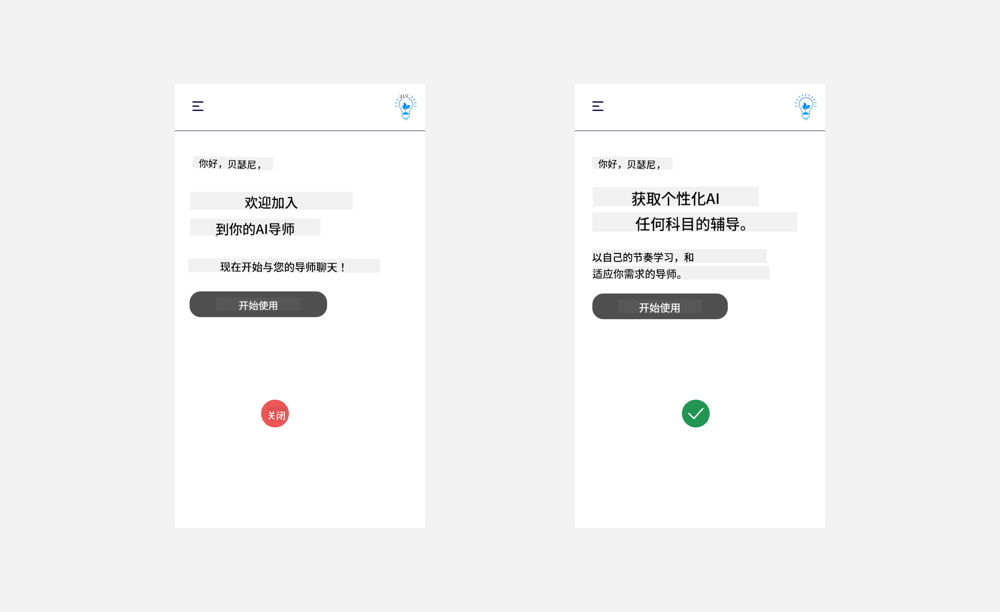
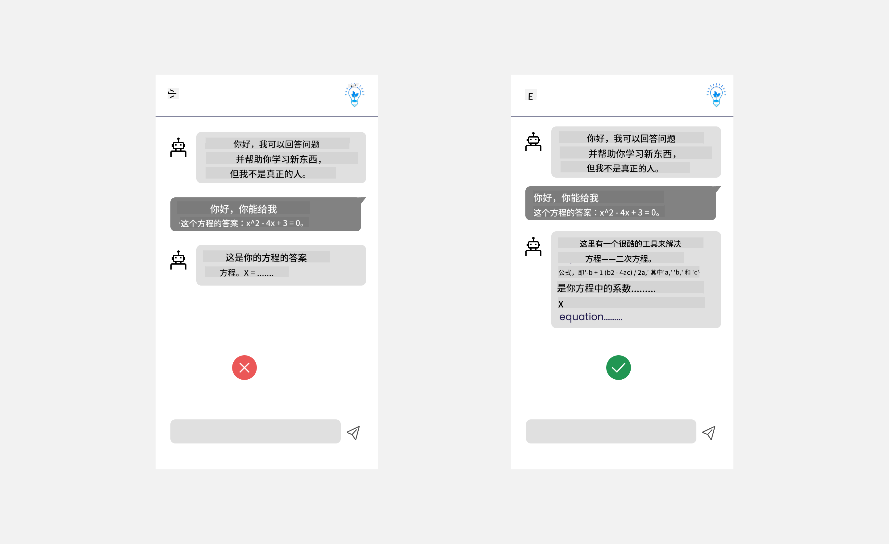
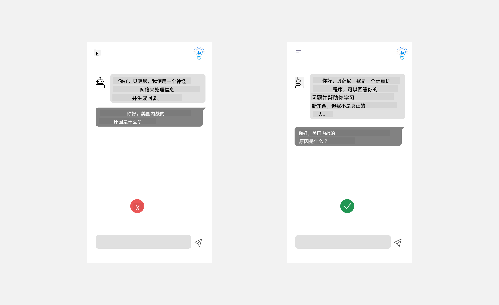
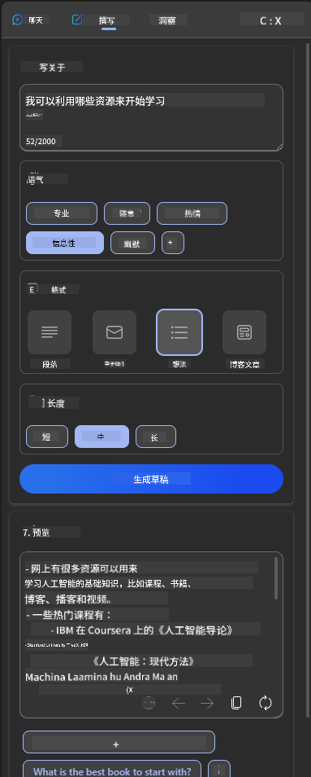
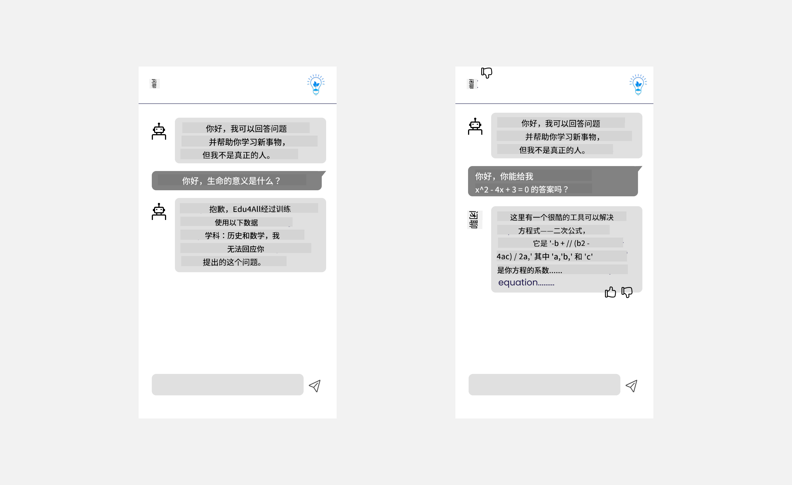

<!--
CO_OP_TRANSLATOR_METADATA:
{
  "original_hash": "747668e4c53d067369f06e9ec2e6313e",
  "translation_date": "2025-08-26T14:36:59+00:00",
  "source_file": "12-designing-ux-for-ai-applications/README.md",
  "language_code": "zh"
}
-->
# 为 AI 应用设计用户体验

> _(点击上方图片观看本课视频)_

用户体验是开发应用时非常重要的一环。用户需要能够高效地使用你的应用来完成任务。高效只是其中之一，你还需要让应用对所有人都友好，让它具有_可访问性_。本章将重点讲解这一领域，希望你最终能设计出大家都能用、也愿意用的应用。

## 介绍

用户体验指的是用户如何与某个产品或服务（无论是系统、工具还是设计）进行互动和使用。在开发 AI 应用时，开发者不仅要关注用户体验的有效性，还要关注其道德性。本课将介绍如何构建能够满足用户需求的人工智能（AI）应用。

本课将涵盖以下内容：

- 用户体验简介及理解用户需求
- 为信任与透明度设计 AI 应用
- 为协作与反馈设计 AI 应用

## 学习目标

学习本课后，你将能够：

- 理解如何构建满足用户需求的 AI 应用。
- 设计促进信任与协作的 AI 应用。

### 前置知识

花点时间阅读一下[用户体验与设计思维](https://learn.microsoft.com/training/modules/ux-design?WT.mc_id=academic-105485-koreyst)。

## 用户体验简介及理解用户需求

在我们虚构的教育创业公司中，有两类主要用户：老师和学生。每类用户都有独特的需求。以用户为中心的设计会优先考虑用户，确保产品对目标用户来说是有意义且有益的。

应用应该是**有用、可靠、可访问且令人愉快**的，才能带来良好的用户体验。

### 易用性

有用意味着应用的功能要与其预期用途相符，比如自动批改作业或生成复习用的抽认卡。自动批改作业的应用应能根据预设标准准确高效地为学生作业评分。同样，生成复习抽认卡的应用应能根据数据生成相关且多样化的问题。

### 可靠性

可靠意味着应用能持续稳定地完成任务且不出错。但 AI 和人类一样并不完美，可能会出错。应用可能会遇到错误或意外情况，需要人工干预或修正。如何处理这些错误？在本课最后一节，我们会讲解 AI 系统和应用如何为协作与反馈而设计。

### 可访问性

可访问性意味着让不同能力的用户都能获得良好体验，包括残障人士，确保没有人被排除在外。遵循可访问性准则和原则，能让 AI 解决方案更具包容性、可用性和对所有用户都有益。

### 令人愉快

令人愉快意味着应用用起来让人开心。吸引人的用户体验能带来积极影响，鼓励用户再次使用应用，也能提升业务收入。

并不是所有问题都能用 AI 解决。AI 的作用是增强你的用户体验，比如自动化手动任务或个性化用户体验。

## 为信任与透明度设计 AI 应用

在设计 AI 应用时，建立信任至关重要。信任让用户相信应用能完成任务、持续输出结果，并且结果是用户所需的。这里的风险在于不信任和过度信任。不信任是指用户对 AI 系统缺乏信心，导致用户拒绝使用你的应用。过度信任则是用户高估了 AI 系统的能力，过分依赖 AI。例如，自动批改系统如果被过度信任，老师可能不会再检查部分试卷，结果可能导致学生分数不公平或不准确，或者错过了反馈和改进的机会。

确保信任成为设计核心的两种方式是可解释性和控制权。

### 可解释性

当 AI 用于辅助决策，比如传授知识给下一代时，老师和家长必须了解 AI 的决策过程。这就是可解释性——理解 AI 应用如何做出决策。设计可解释性时要加入细节，突出 AI 如何得出结果。用户必须知道结果是 AI 生成的，而不是人类。例如，不要说“现在开始和你的导师聊天”，而是说“使用能根据你的需求调整、帮助你自主学习的 AI 导师”。

另一个例子是 AI 如何使用用户和个人数据。例如，学生这个角色可能有一些限制。AI 可能不会直接给出问题答案，但可以引导用户思考如何解决问题。

可解释性的最后一个关键点是让解释变得简单。学生和老师可能不是 AI 专家，因此应用能做什么、不能做什么的解释要简单易懂。

### 控制权

生成式 AI 让 AI 和用户之间形成协作，比如用户可以修改提示词以获得不同结果。此外，生成结果后，用户应该能修改结果，获得控制感。例如，在使用 Bing 时，你可以根据格式、语气和长度调整提示词，还可以对结果进行修改，如下图所示：

Bing 的另一个功能是让用户可以选择是否允许 AI 使用自己的数据。对于学校应用，学生可能希望用自己的笔记和老师的资料作为复习材料。

> 在设计 AI 应用时，必须有意识地避免用户过度信任，避免对 AI 能力产生不切实际的期待。一个方法是在提示词和结果之间设置一些“摩擦”，提醒用户这是 AI，不是人类。

## 为协作与反馈设计 AI 应用

如前所述，生成式 AI 让用户和 AI 之间形成协作。大多数互动都是用户输入提示词，AI 生成结果。如果结果不正确怎么办？应用如何处理错误？AI 是责怪用户，还是花时间解释错误？

AI 应用应该能够接收和提供反馈。这不仅有助于 AI 系统改进，也能增强用户信任。设计时应加入反馈机制，比如对结果进行点赞或点踩。

另一种处理方式是清楚地告知系统的能力和局限。当用户请求超出 AI 能力范围的内容时，也要有相应的处理方式，如下图所示。

系统错误在应用中很常见，比如用户需要获取 AI 范围之外的信息，或者应用对用户能生成的题目/学科数量有限制。例如，一个只训练了历史和数学数据的 AI 应用，可能无法回答地理相关问题。为此，AI 系统可以这样回应：“很抱歉，我们的产品只训练了以下学科的数据……，无法回答你提出的问题。”

AI 应用并不完美，难免会犯错。设计应用时，要确保为用户反馈和错误处理留出空间，并且处理方式要简单易懂。

## 作业

回顾你已经开发过的 AI 应用，考虑在你的应用中实现以下步骤：

- **令人愉快：** 思考如何让你的应用更有趣。你是否在各处都加了解释？你是否鼓励用户探索？你的错误提示是怎么表达的？

- **易用性：** 如果你在开发网页应用，确保你的应用既能用鼠标也能用键盘操作。

- **信任与透明度：** 不要完全相信 AI 及其结果，思考如何让人工参与验证结果。也要考虑并实现其他建立信任与透明度的方法。

- **控制权：** 让用户能控制他们提供给应用的数据。实现用户可以选择是否参与数据收集的功能。

## 继续学习！

完成本课后，欢迎查看我们的[生成式 AI 学习合集](https://aka.ms/genai-collection?WT.mc_id=academic-105485-koreyst)，继续提升你的生成式 AI 知识！

前往第 13 课，我们将学习如何[保护 AI 应用安全](../13-securing-ai-applications/README.md?WT.mc_id=academic-105485-koreyst)！

---

**免责声明**：  
本文件由 AI 翻译服务 [Co-op Translator](https://github.com/Azure/co-op-translator) 翻译。虽然我们力求准确，但请注意，自动翻译可能包含错误或不准确之处。原始语言的文件应被视为权威来源。对于关键信息，建议使用专业人工翻译。因使用本翻译而产生的任何误解或误读，我们概不负责。