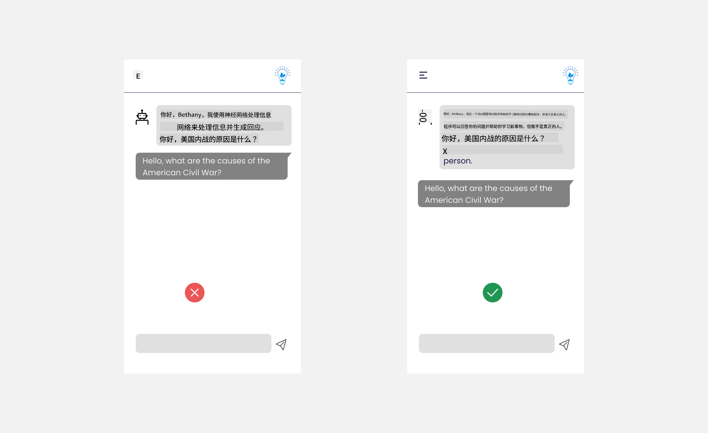
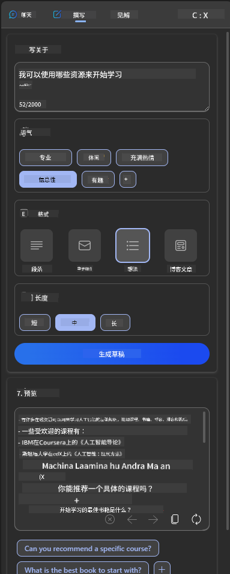
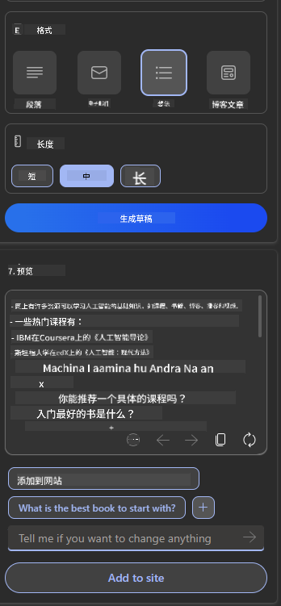
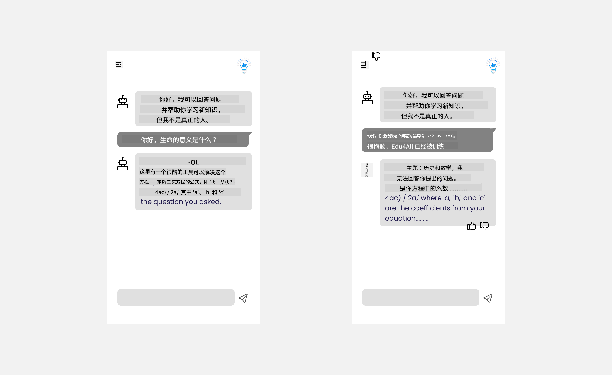

<!--
CO_OP_TRANSLATOR_METADATA:
{
  "original_hash": "ec385b41ee50579025d50cc03bfb3a25",
  "translation_date": "2025-07-09T14:50:45+00:00",
  "source_file": "12-designing-ux-for-ai-applications/README.md",
  "language_code": "zh"
}
-->
# 为 AI 应用设计用户体验

> _(点击上方图片观看本课视频)_

用户体验是构建应用程序时非常重要的一个方面。用户需要能够高效地使用你的应用来完成任务。高效固然重要，但你还需要设计出人人都能使用的应用，使其具备_无障碍性_。本章将重点关注这一领域，帮助你设计出用户愿意且能够使用的应用。

## 介绍

用户体验是指用户如何与特定产品或服务（无论是系统、工具还是设计）进行交互和使用。在开发 AI 应用时，开发者不仅关注用户体验的有效性，还关注其伦理性。本课将介绍如何构建满足用户需求的人工智能（AI）应用。

本课内容包括：

- 用户体验介绍及理解用户需求
- 为信任与透明度设计 AI 应用
- 为协作与反馈设计 AI 应用

## 学习目标

完成本课后，你将能够：

- 理解如何构建满足用户需求的 AI 应用。
- 设计促进信任与协作的 AI 应用。

### 先决条件

请花些时间阅读更多关于[用户体验和设计思维](https://learn.microsoft.com/training/modules/ux-design?WT.mc_id=academic-105485-koreyst)的内容。

## 用户体验介绍及理解用户需求

在我们虚构的教育创业公司中，有两类主要用户：教师和学生。每类用户都有其独特需求。以用户为中心的设计优先考虑用户，确保产品对目标用户具有相关性和实用性。

应用应当**有用、可靠、无障碍且令人愉悦**，以提供良好的用户体验。

### 可用性

有用意味着应用具备符合其预期目的的功能，比如自动评分或生成复习用的抽认卡。自动评分的应用应能根据预设标准准确高效地为学生作业打分。同样，生成复习抽认卡的应用应能基于数据创建相关且多样的问题。

### 可靠性

可靠意味着应用能持续稳定地完成任务且无错误。然而，AI 和人类一样并不完美，可能会出现错误。应用可能遇到错误或意外情况，需要人工干预或修正。你会如何处理错误？本课最后一节将介绍如何设计 AI 系统和应用以支持协作与反馈。

### 无障碍性

无障碍意味着将用户体验扩展到各种能力的用户，包括残障人士，确保没有人被排除在外。遵循无障碍指南和原则，AI 解决方案将更加包容、易用且对所有用户都有益。

### 愉悦感

愉悦意味着应用使用起来令人享受。吸引人的用户体验能积极影响用户，鼓励他们持续使用应用，从而提升业务收入。

并非所有挑战都能用 AI 解决。AI 是用来增强用户体验的，无论是自动化手动任务，还是个性化用户体验。

## 为信任与透明度设计 AI 应用

建立信任是设计 AI 应用的关键。信任让用户确信应用能完成工作，持续交付结果，且结果符合用户需求。信任风险包括不信任和过度信任。不信任是指用户对 AI 系统几乎没有信任，导致拒绝使用应用。过度信任是指用户高估 AI 系统能力，过分依赖它。例如，自动评分系统中过度信任可能导致教师不再仔细审核部分试卷，可能造成学生成绩不公或错失反馈和改进机会。

确保信任成为设计核心的两种方法是可解释性和控制权。

### 可解释性

当 AI 帮助做出决策，比如传授知识给下一代时，教师和家长理解 AI 如何做出决策至关重要。这就是可解释性——理解 AI 应用如何做决策。设计可解释性包括添加 AI 应用能做什么的示例细节。例如，系统可以用“使用 AI 总结笔记，便于复习”替代“开始使用 AI 教师”。

另一个例子是 AI 如何使用用户和个人数据。例如，学生身份的用户可能有基于身份的限制。AI 可能无法直接给出答案，但可以引导用户思考如何解决问题。

可解释性的另一个关键点是简化说明。学生和教师可能不是 AI 专家，因此应用功能的说明应简明易懂。

### 控制权

生成式 AI 促成了 AI 与用户的协作，例如用户可以修改提示以获得不同结果。此外，生成结果后，用户应能修改结果，从而获得控制感。例如，使用 Bing 时，你可以根据格式、语气和长度调整提示，还可以对输出进行修改，如下图所示：

Bing 的另一个控制功能是允许用户选择是否让 AI 使用其数据。对于学校应用，学生可能希望使用自己的笔记和教师资源作为复习材料。

> 设计 AI 应用时，意图性至关重要，确保用户不会对 AI 产生过度信任或对其能力抱有不切实际的期望。一种方法是在提示和结果之间制造一定摩擦，提醒用户这只是 AI，而非真人。

## 为协作与反馈设计 AI 应用

如前所述，生成式 AI 促成了用户与 AI 的协作。大多数交互是用户输入提示，AI 生成输出。如果输出错误，应用如何处理？AI 会责怪用户还是花时间解释错误？

AI 应用应设计为能接收和提供反馈。这不仅有助于 AI 系统改进，也能建立用户信任。设计中应包含反馈循环，例如对输出进行简单的点赞或点踩。

另一种处理方式是清晰传达系统的能力和限制。当用户请求超出 AI 能力范围时，应有相应处理方式，如下图所示。

系统错误在应用中很常见，比如用户可能需要 AI 范围外的信息，或应用对用户生成摘要的问题/科目数量有限制。例如，训练数据仅涵盖历史和数学的 AI 应用可能无法处理地理相关问题。为此，AI 系统可以回应：“抱歉，我们的产品仅基于以下科目数据训练……无法回答您提出的问题。”

AI 应用并不完美，难免出错。设计时应确保为用户反馈和错误处理留出空间，且方式简单易懂。

## 练习

选取你迄今为止构建的任意 AI 应用，考虑在应用中实现以下步骤：

- **愉悦感：** 思考如何让你的应用更令人愉悦。你是否在各处添加了解释？是否鼓励用户探索？你的错误信息措辞如何？

- **可用性：** 构建网页应用。确保应用既能用鼠标也能用键盘导航。

- **信任与透明度：** 不要完全信任 AI 及其输出，考虑如何引入人工审核输出。还要考虑并实现其他促进信任与透明度的方法。

- **控制权：** 让用户控制他们提供给应用的数据。实现用户可选择加入或退出数据收集的功能。

## 继续学习！

完成本课后，欢迎查看我们的[生成式 AI 学习合集](https://aka.ms/genai-collection?WT.mc_id=academic-105485-koreyst)，继续提升你的生成式 AI 知识！

接下来进入第 13 课，我们将探讨如何[保障 AI 应用安全](../13-securing-ai-applications/README.md?WT.mc_id=academic-105485-koreyst)！

**免责声明**：  
本文件使用 AI 翻译服务 [Co-op Translator](https://github.com/Azure/co-op-translator) 进行翻译。虽然我们力求准确，但请注意自动翻译可能包含错误或不准确之处。原始文件的母语版本应被视为权威来源。对于重要信息，建议使用专业人工翻译。对于因使用本翻译而产生的任何误解或误释，我们概不负责。