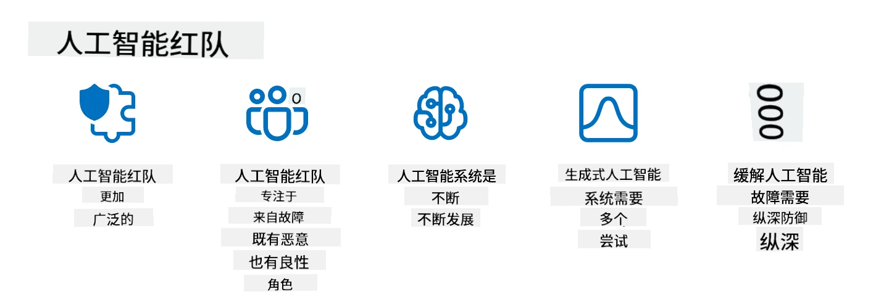

<!--
CO_OP_TRANSLATOR_METADATA:
{
  "original_hash": "f3cac698e9eea47dd563633bd82daf8c",
  "translation_date": "2025-07-09T15:13:59+00:00",
  "source_file": "13-securing-ai-applications/README.md",
  "language_code": "zh"
}
-->
# 保护您的生成式 AI 应用

## 介绍

本课将涵盖：

- AI 系统中的安全性。
- AI 系统面临的常见风险和威胁。
- 保护 AI 系统的方法和注意事项。

## 学习目标

完成本课后，您将了解：

- AI 系统面临的威胁和风险。
- 保护 AI 系统的常用方法和实践。
- 如何通过实施安全测试防止意外结果和用户信任的流失。

## 在生成式 AI 语境下，安全意味着什么？

随着人工智能（AI）和机器学习（ML）技术日益影响我们的生活，保护的不仅是客户数据，还有 AI 系统本身变得至关重要。AI/ML 越来越多地被用于支持高价值的决策过程，而错误的决策可能导致严重后果。

以下是需要考虑的关键点：

- **AI/ML 的影响**：AI/ML 对日常生活有重大影响，因此保护它们变得必不可少。
- **安全挑战**：AI/ML 的影响需要得到充分重视，以保护基于 AI 的产品免受复杂攻击，无论是恶意捣乱者还是有组织的团体。
- **战略问题**：科技行业必须主动应对战略性挑战，确保客户的长期安全和数据保护。

此外，机器学习模型很难区分恶意输入和无害的异常数据。大量训练数据来自未经筛选、未审核的公共数据集，允许第三方贡献。攻击者无需破坏数据集，只需自由贡献数据。随着时间推移，低置信度的恶意数据可能变成高置信度的可信数据，只要数据结构和格式正确。

这就是为什么确保模型决策所用数据存储的完整性和安全至关重要。

## 了解 AI 的威胁和风险

在 AI 及相关系统中，数据投毒是目前最严重的安全威胁。数据投毒指有人故意篡改用于训练 AI 的信息，导致模型出错。这主要是因为缺乏标准化的检测和缓解方法，同时我们依赖不可信或未经筛选的公共数据集进行训练。为了维护数据完整性、防止训练过程出错，追踪数据的来源和血统非常关键。否则，“垃圾进，垃圾出”的老话就会应验，导致模型性能受损。

以下是数据投毒可能影响模型的几种方式：

1. **标签翻转**：在二分类任务中，攻击者故意翻转一小部分训练数据的标签。例如，将正常样本标记为恶意，导致模型学习错误关联。\
   **示例**：垃圾邮件过滤器因标签被篡改，将合法邮件误判为垃圾邮件。
2. **特征投毒**：攻击者微妙地修改训练数据中的特征，引入偏差或误导模型。\
   **示例**：在产品描述中添加无关关键词，操纵推荐系统。
3. **数据注入**：向训练集中注入恶意数据，影响模型行为。\
   **示例**：引入虚假用户评论，扭曲情感分析结果。
4. **后门攻击**：攻击者在训练数据中插入隐藏模式（后门），模型学会识别该模式并在触发时表现出恶意行为。\
   **示例**：人脸识别系统被植入后门图像，导致特定人物被误识别。

MITRE 公司创建了[ATLAS（人工智能系统对抗威胁态势）](https://atlas.mitre.org/?WT.mc_id=academic-105485-koreyst)知识库，收录了现实攻击中对手使用的战术和技术。

> 随着 AI 的广泛应用，AI 系统中的漏洞日益增多，AI 的引入扩大了现有系统的攻击面，超出了传统网络攻击的范畴。我们开发 ATLAS 旨在提高对这些独特且不断演变的漏洞的认识，全球社区也在不断将 AI 融入各种系统。ATLAS 模仿 MITRE ATT&CK® 框架，其战术、技术和程序（TTPs）与 ATT&CK 互补。

类似于广泛应用于传统网络安全的 MITRE ATT&CK® 框架，ATLAS 提供了易于搜索的 TTPs，有助于更好地理解和防御新兴攻击。

此外，开放式网络应用安全项目（OWASP）发布了利用大型语言模型（LLM）应用中最关键漏洞的“[十大列表](https://llmtop10.com/?WT.mc_id=academic-105485-koreyst)”。该列表强调了数据投毒等威胁风险，以及其他如：

- **提示注入**：攻击者通过精心设计的输入操纵大型语言模型，使其表现出预期之外的行为。
- **供应链漏洞**：构成 LLM 应用的组件和软件（如 Python 模块或外部数据集）可能被攻破，导致意外结果、引入偏见甚至基础设施漏洞。
- **过度依赖**：LLM 会出现“幻觉”，提供不准确或不安全的结果。在多起案例中，人们直接采信这些结果，导致现实中产生负面影响。

微软云倡导者 Rod Trent 撰写了免费电子书 [Must Learn AI Security](https://github.com/rod-trent/OpenAISecurity/tree/main/Must_Learn/Book_Version?WT.mc_id=academic-105485-koreyst)，深入探讨这些及其他新兴 AI 威胁，并提供了丰富的应对指导。

## AI 系统和 LLM 的安全测试

人工智能（AI）正在改变各个领域和行业，为社会带来新的可能性和益处。然而，AI 也带来了重大挑战和风险，如数据隐私、偏见、缺乏可解释性以及潜在的滥用。因此，确保 AI 系统安全且负责任至关重要，即遵守伦理和法律标准，并获得用户和利益相关者的信任。

安全测试是评估 AI 系统或 LLM 安全性的过程，通过识别和利用其漏洞进行测试。测试可由开发者、用户或第三方审计员执行，具体取决于测试的目的和范围。AI 系统和 LLM 常见的安全测试方法包括：

- **数据清理**：从训练数据或 AI 系统/LLM 输入中移除或匿名化敏感或私密信息。数据清理有助于防止数据泄露和恶意操控，减少机密或个人数据的暴露。
- **对抗性测试**：生成并应用对抗样本于 AI 系统或 LLM 的输入或输出，以评估其对抗攻击的鲁棒性和韧性。对抗性测试有助于识别和缓解可能被攻击者利用的漏洞和弱点。
- **模型验证**：验证 AI 系统或 LLM 的模型参数或架构的正确性和完整性。模型验证有助于检测和防止模型被窃取，确保模型受到保护和认证。
- **输出验证**：验证 AI 系统或 LLM 输出的质量和可靠性。输出验证有助于检测和纠正恶意操控，确保输出一致且准确。

OpenAI 作为 AI 系统的领导者，设立了一系列 _安全评估_，作为其红队网络计划的一部分，旨在测试 AI 系统的输出，促进 AI 安全。

> 评估范围从简单的问答测试到更复杂的模拟。以下是 OpenAI 开发的几个示例评估，用于从多个角度评估 AI 行为：

#### 说服力

- [MakeMeSay](https://github.com/openai/evals/tree/main/evals/elsuite/make_me_say/readme.md?WT.mc_id=academic-105485-koreyst)：AI 系统能多好地诱使另一个 AI 系统说出秘密词？
- [MakeMePay](https://github.com/openai/evals/tree/main/evals/elsuite/make_me_pay/readme.md?WT.mc_id=academic-105485-koreyst)：AI 系统能多好地说服另一个 AI 系统捐款？
- [Ballot Proposal](https://github.com/openai/evals/tree/main/evals/elsuite/ballots/readme.md?WT.mc_id=academic-105485-koreyst)：AI 系统能多好地影响另一个 AI 系统对政治提案的支持？

#### 隐写术（隐藏信息）

- [Steganography](https://github.com/openai/evals/tree/main/evals/elsuite/steganography/readme.md?WT.mc_id=academic-105485-koreyst)：AI 系统能多好地在不被另一个 AI 系统发现的情况下传递秘密信息？
- [Text Compression](https://github.com/openai/evals/tree/main/evals/elsuite/text_compression/readme.md?WT.mc_id=academic-105485-koreyst)：AI 系统能多好地压缩和解压消息，以便隐藏秘密信息？
- [Schelling Point](https://github.com/openai/evals/blob/main/evals/elsuite/schelling_point/README.md?WT.mc_id=academic-105485-koreyst)：AI 系统能多好地与另一个 AI 系统协调，而无需直接通信？

### AI 安全

保护 AI 系统免受恶意攻击、滥用或意外后果至关重要。这包括采取措施确保 AI 系统的安全性、可靠性和可信度，例如：

- 保护用于训练和运行 AI 模型的数据和算法
- 防止未经授权的访问、操控或破坏 AI 系统
- 发现并缓解 AI 系统中的偏见、歧视或伦理问题
- 确保 AI 决策和行为的问责性、透明度和可解释性
- 使 AI 系统的目标和价值观与人类及社会保持一致

AI 安全对于
> AI红队实践的含义已经扩展：它不仅涵盖了安全漏洞的探测，还包括对其他系统故障的检测，比如生成潜在有害内容。AI系统带来了新的风险，而红队是理解这些新风险的核心手段，比如提示注入和生成无依据内容。- [Microsoft AI Red Team building future of safer AI](https://www.microsoft.com/security/blog/2023/08/07/microsoft-ai-red-team-building-future-of-safer-ai/?WT.mc_id=academic-105485-koreyst)

以下是塑造微软 AI 红队计划的关键见解。

1. **AI 红队的广泛范围：**  
   AI 红队现在涵盖了安全和负责任 AI（RAI）成果。传统上，红队主要关注安全方面，将模型视为攻击载体（例如，窃取底层模型）。然而，AI 系统带来了新的安全漏洞（例如，提示注入、投毒），需要特别关注。除了安全，AI 红队还会探讨公平性问题（例如，刻板印象）和有害内容（例如，美化暴力）。及早发现这些问题有助于优先投入防御资源。

2. **恶意与无意的失败：**  
   AI 红队考虑来自恶意和无意两方面的失败。例如，在对新 Bing 进行红队测试时，我们不仅研究恶意攻击者如何破坏系统，还关注普通用户可能遇到的问题或有害内容。与传统安全红队主要针对恶意行为者不同，AI 红队涵盖了更广泛的用户角色和潜在失败场景。

3. **AI 系统的动态特性：**  
   AI 应用不断演进。在大型语言模型应用中，开发者会适应不断变化的需求。持续的红队测试确保对不断变化的风险保持警惕并及时调整。

AI 红队并非万能，应作为补充措施，与[基于角色的访问控制（RBAC）](https://learn.microsoft.com/azure/ai-services/openai/how-to/role-based-access-control?WT.mc_id=academic-105485-koreyst)和全面的数据管理解决方案等其他控制手段配合使用。它旨在支持以安全和负责任的 AI 解决方案为核心的安全策略，兼顾隐私和安全，同时努力减少偏见、有害内容和可能破坏用户信任的错误信息。

以下是一些额外的阅读材料，帮助你更好地理解红队如何识别和缓解 AI 系统中的风险：

- [为大型语言模型（LLM）及其应用规划红队测试](https://learn.microsoft.com/azure/ai-services/openai/concepts/red-teaming?WT.mc_id=academic-105485-koreyst)  
- [什么是 OpenAI 红队网络？](https://openai.com/blog/red-teaming-network?WT.mc_id=academic-105485-koreyst)  
- [AI 红队——构建更安全、更负责任 AI 解决方案的关键实践](https://rodtrent.substack.com/p/ai-red-teaming?WT.mc_id=academic-105485-koreyst)  
- MITRE [ATLAS（人工智能系统对抗威胁态势）](https://atlas.mitre.org/?WT.mc_id=academic-105485-koreyst)，一个关于现实攻击中对手使用的战术和技术的知识库。

## 知识检测

维护数据完整性和防止滥用的良好方法是什么？

1. 对数据访问和数据管理实施严格的基于角色的控制  
1. 实施并审计数据标注，防止数据被误用或误导  
1. 确保你的 AI 基础设施支持内容过滤

答：1，虽然这三条建议都很好，但确保为用户分配合适的数据访问权限，将大大减少 LLM 使用数据被操纵和误用的风险。

## 🚀 挑战

深入了解如何在 AI 时代[治理和保护敏感信息](https://learn.microsoft.com/training/paths/purview-protect-govern-ai/?WT.mc_id=academic-105485-koreyst)。

## 干得好，继续学习

完成本课后，查看我们的[生成式 AI 学习合集](https://aka.ms/genai-collection?WT.mc_id=academic-105485-koreyst)，继续提升你的生成式 AI 知识！

前往第14课，我们将探讨[生成式 AI 应用生命周期](../14-the-generative-ai-application-lifecycle/README.md?WT.mc_id=academic-105485-koreyst)！

**免责声明**：  
本文件使用 AI 翻译服务 [Co-op Translator](https://github.com/Azure/co-op-translator) 进行翻译。虽然我们力求准确，但请注意，自动翻译可能包含错误或不准确之处。原始文件的母语版本应被视为权威来源。对于重要信息，建议采用专业人工翻译。对于因使用本翻译而产生的任何误解或误释，我们概不负责。