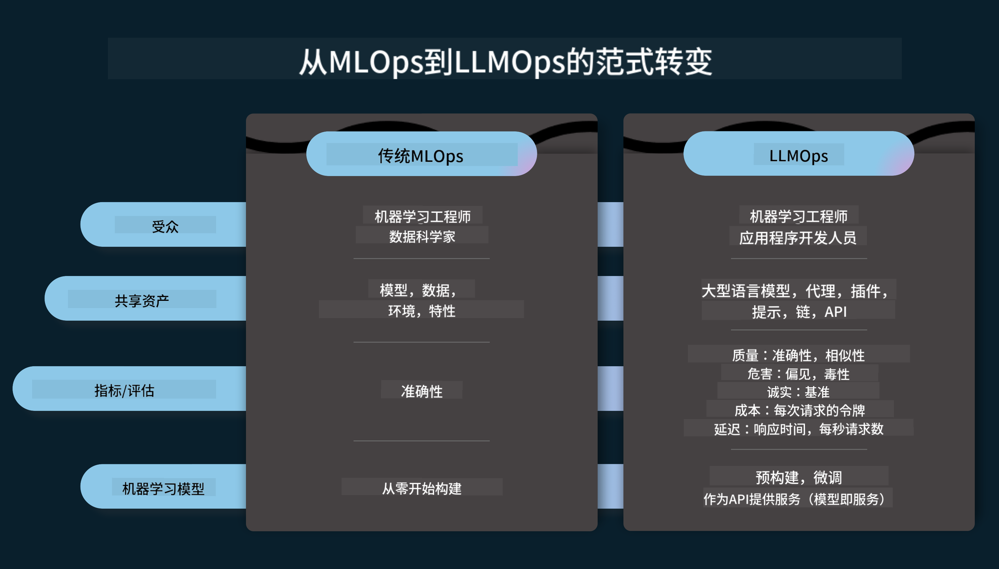
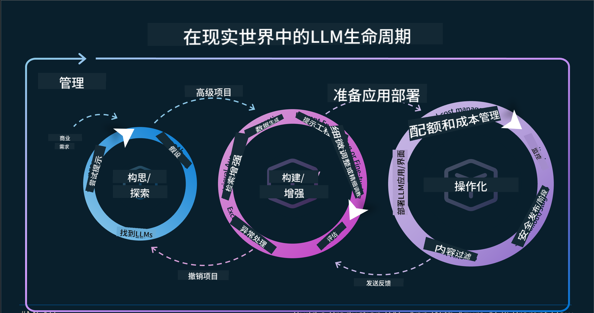
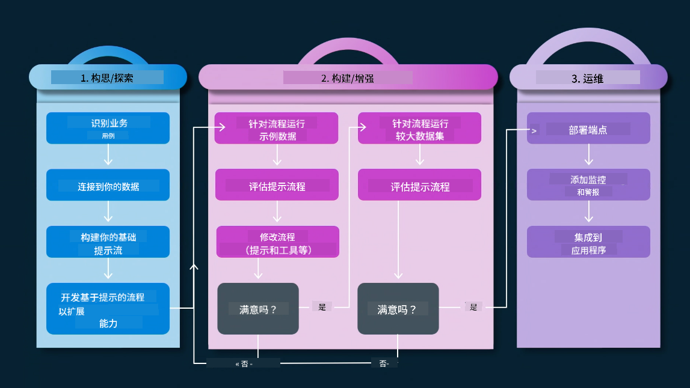
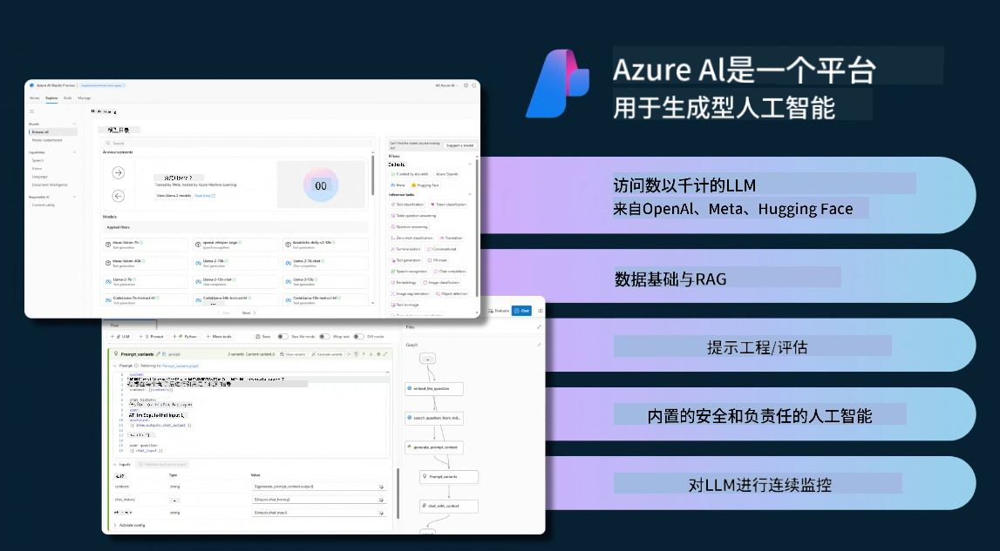
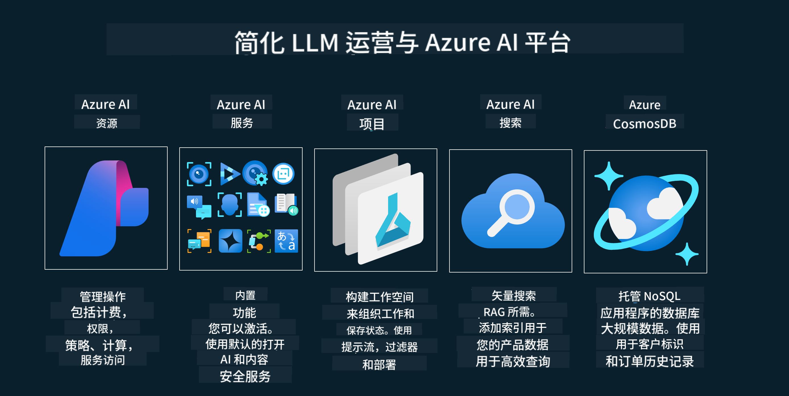
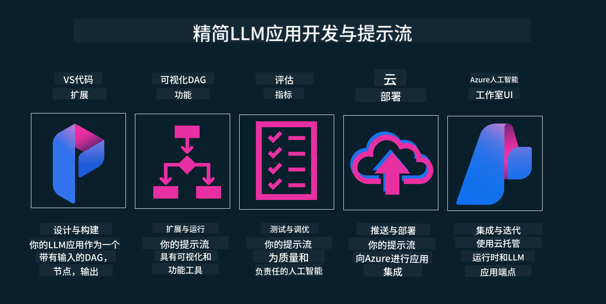

<!--
CO_OP_TRANSLATOR_METADATA:
{
  "original_hash": "27a5347a5022d5ef0a72ab029b03526a",
  "translation_date": "2025-05-19T23:20:50+00:00",
  "source_file": "14-the-generative-ai-application-lifecycle/README.md",
  "language_code": "zh"
}
-->

# 生成式 AI 应用生命周期

对于所有 AI 应用来说，一个重要的问题是 AI 特性的相关性。由于 AI 是一个快速发展的领域，为了确保你的应用保持相关性、可靠性和稳健性，你需要持续地监控、评估和改进它。这就是生成式 AI 生命周期的作用。

生成式 AI 生命周期是一个指导框架，帮助你开发、部署和维护生成式 AI 应用。它帮助你定义目标、衡量表现、识别挑战并实施解决方案。它还帮助你将应用与领域和利益相关者的道德和法律标准对齐。通过遵循生成式 AI 生命周期，你可以确保你的应用始终提供价值并满足用户需求。

## 介绍

在本章中，你将：

- 理解从 MLOps 到 LLMOps 的范式转变
- 理解 LLM 生命周期
- 生命周期工具
- 生命周期指标化和评估

## 理解从 MLOps 到 LLMOps 的范式转变

LLM 是人工智能武器库中的新工具，它们在应用的分析和生成任务中具有强大的能力，但这种能力对我们如何优化 AI 和经典机器学习任务有一些影响。

因此，我们需要一个新的范式，以正确的激励方式动态适应这一工具。我们可以将较早的 AI 应用分类为“ML 应用”，将较新的 AI 应用分类为“GenAI 应用”或“AI 应用”，以反映当时使用的主流技术和方法。这在多方面改变了我们的叙述，请看以下比较。

注意在 LLMOps 中，我们更加关注应用开发者，以集成为关键点，使用“模型即服务”，并考虑以下几点作为指标。

- 质量：响应质量
- 伤害：负责任的 AI
- 诚实：响应的合理性（是否合理？是否正确？）
- 成本：解决方案预算
- 延迟：令牌响应的平均时间

## LLM 生命周期

首先，为了理解生命周期和修改，让我们注意下一个信息图。

如你所见，这与 MLOps 的常规生命周期不同。LLM 具有许多新的要求，如提示、提高质量的不同技术（微调、RAG、元提示）、负责任 AI 的不同评估和责任，最后是新的评估指标（质量、伤害、诚实、成本和延迟）。

例如，看看我们如何构思。使用提示工程来尝试各种 LLM，以探索可能性，测试他们的假设是否正确。

注意这不是线性的，而是集成的循环，迭代的，并有一个整体的循环。

我们如何探索这些步骤？让我们详细了解如何构建一个生命周期。

这可能看起来有些复杂，首先让我们关注三个大步骤。

1. 构思/探索：探索，在这里我们可以根据业务需求进行探索。原型设计，创建一个 [PromptFlow](https://microsoft.github.io/promptflow/index.html?WT.mc_id=academic-105485-koreyst) 并测试其是否足够高效以验证我们的假设。
2. 构建/增强：实现，现在，我们开始评估更大数据集的实现技术，如微调和 RAG，以检查我们解决方案的稳健性。如果不行，重新实现，添加新步骤或重组数据可能会有所帮助。在测试我们的流程和规模后，如果有效并检查我们的指标，就可以进入下一步。
3. 运作：集成，现在向系统添加监控和警报系统，部署和应用集成到我们的应用中。

然后，我们有一个整体的管理循环，专注于安全、合规和治理。

恭喜，现在你的 AI 应用已经准备好并可以运行了。想要亲身体验，请查看 [Contoso Chat Demo.](https://nitya.github.io/contoso-chat/?WT.mc_id=academic-105485-koreys)

现在，我们可以使用哪些工具？

## 生命周期工具

对于工具，微软提供了 [Azure AI 平台](https://azure.microsoft.com/solutions/ai/?WT.mc_id=academic-105485-koreys) 和 [PromptFlow](https://microsoft.github.io/promptflow/index.html?WT.mc_id=academic-105485-koreyst)，方便你实现和快速进入周期。

[Azure AI 平台](https://azure.microsoft.com/solutions/ai/?WT.mc_id=academic-105485-koreys) 允许你使用 [AI Studio](https://ai.azure.com/?WT.mc_id=academic-105485-koreys)。AI Studio 是一个网络门户，允许你探索模型、示例和工具。管理你的资源、UI 开发流程和代码优先开发的 SDK/CLI 选项。

Azure AI 允许你使用多种资源来管理你的操作、服务、项目、向量搜索和数据库需求。

从概念验证（POC）到大规模应用程序的构建，使用 PromptFlow：

- 从 VS Code 设计和构建应用，具有视觉和功能工具
- 轻松测试和微调你的应用，以获得高质量的 AI
- 使用 Azure AI Studio 与云集成和迭代，快速集成并部署

## 太棒了！继续学习！

太棒了，现在了解更多关于我们如何构建应用以使用 [Contoso Chat App](https://nitya.github.io/contoso-chat/?WT.mc_id=academic-105485-koreyst) 中的概念，查看云倡导者如何在演示中添加这些概念。更多内容，请查看我们的 [Ignite 分会场会议！
](https://www.youtube.com/watch?v=DdOylyrTOWg)

现在，查看第 15 课，了解 [检索增强生成和向量数据库](../15-rag-and-vector-databases/README.md?WT.mc_id=academic-105485-koreyst) 如何影响生成式 AI 并创造更具吸引力的应用！

**免责声明**：
本文档是使用AI翻译服务[Co-op Translator](https://github.com/Azure/co-op-translator)翻译的。虽然我们努力确保准确性，但请注意，自动翻译可能包含错误或不准确之处。应将原始文档的母语版本视为权威来源。对于关键信息，建议使用专业人工翻译。我们不对因使用此翻译而产生的任何误解或误读负责。