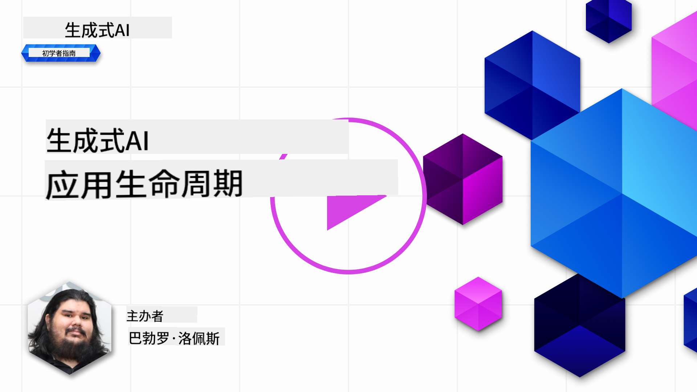
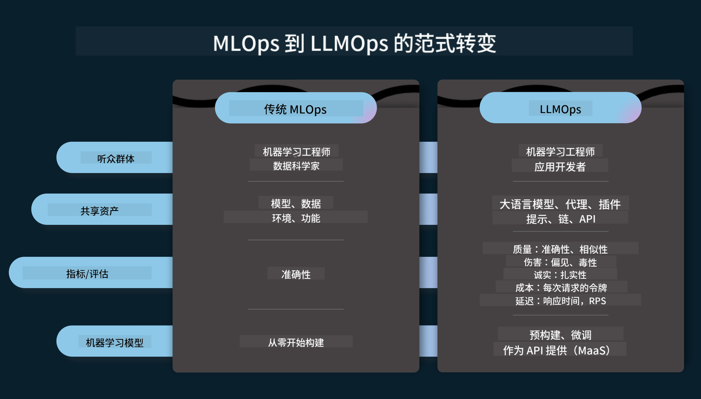
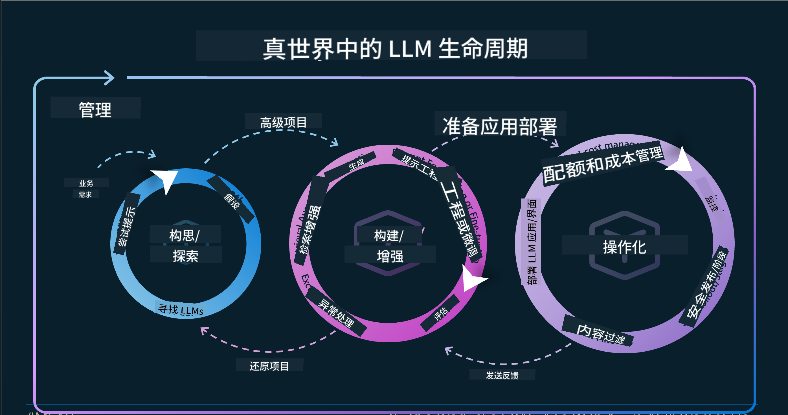
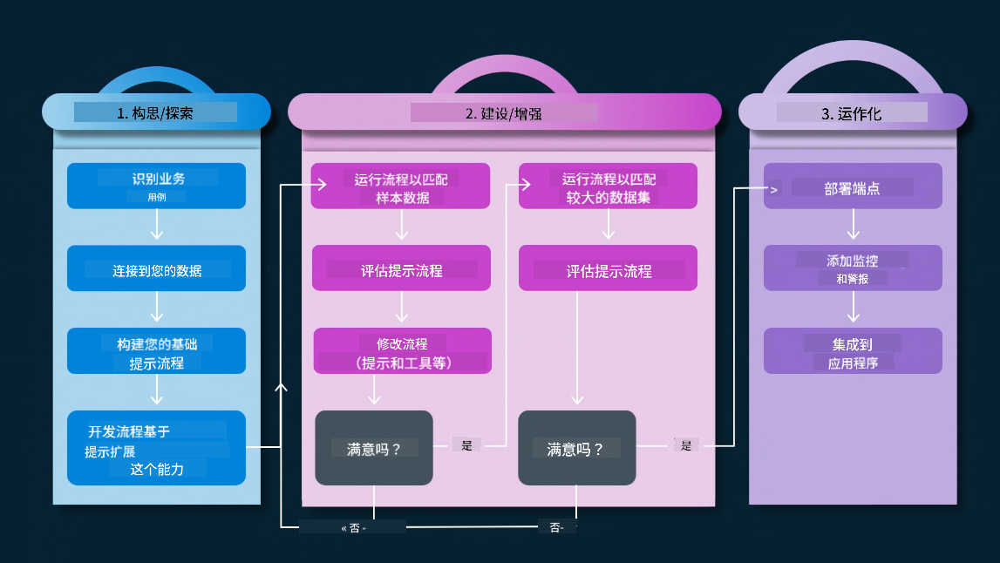
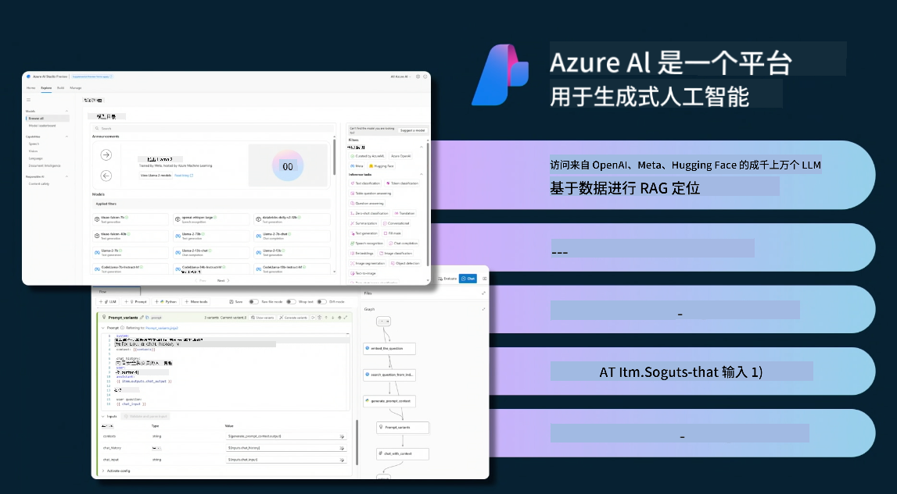
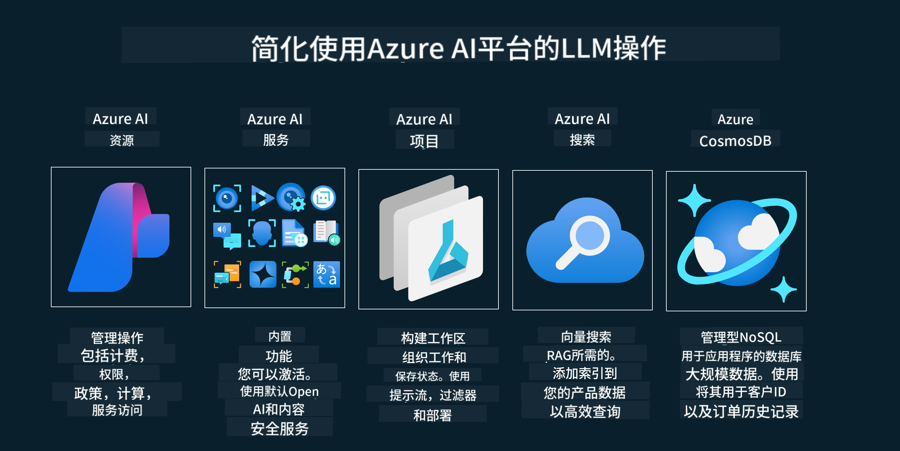
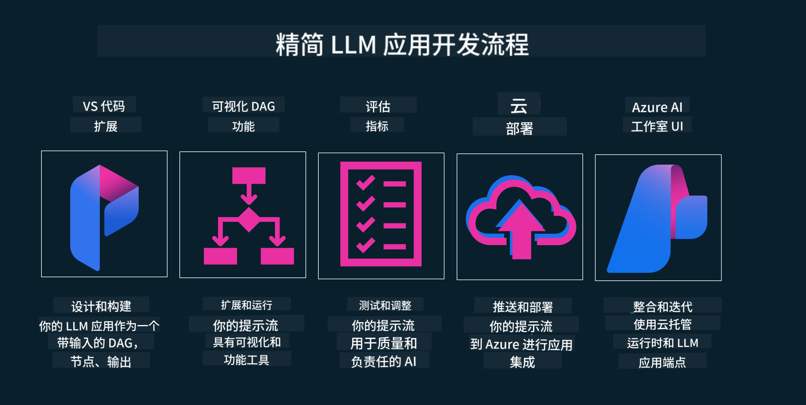

<!--
CO_OP_TRANSLATOR_METADATA:
{
  "original_hash": "27a5347a5022d5ef0a72ab029b03526a",
  "translation_date": "2025-06-25T21:56:24+00:00",
  "source_file": "14-the-generative-ai-application-lifecycle/README.md",
  "language_code": "zh"
}
-->

# 生成式AI应用生命周期

对于所有AI应用来说，AI功能的相关性是一个重要问题，因为AI是一个快速发展的领域。为了确保你的应用保持相关性、可靠性和稳健性，你需要持续监控、评估和改进。这就是生成式AI生命周期的作用。

生成式AI生命周期是一个指导框架，引导你完成开发、部署和维护生成式AI应用的各个阶段。它帮助你定义目标、衡量性能、识别挑战并实施解决方案。它还帮助你将应用与领域和利益相关者的伦理和法律标准对齐。通过遵循生成式AI生命周期，你可以确保你的应用始终提供价值并满足用户需求。

## 介绍

在本章中，你将：

- 理解从MLOps到LLMOps的范式转变
- LLM生命周期
- 生命周期工具
- 生命周期度量和评估

## 理解从MLOps到LLMOps的范式转变

LLM是人工智能工具库中的新工具，它们在应用的分析和生成任务中具有极强的能力。然而，这种能力在我们优化AI和经典机器学习任务时带来了一些后果。

因此，我们需要一个新的范式来在动态中适应这一工具，并提供正确的激励。我们可以将旧的AI应用归类为“ML应用”，而将新的AI应用归类为“生成AI应用”或“AI应用”，反映出当时主流的技术和方法。这在多方面改变了我们的叙述，请看以下比较。

注意，在LLMOps中，我们更加关注应用开发者，将集成作为关键点，使用“模型即服务”并考虑以下指标：

- 质量：响应质量
- 伤害：负责任的AI
- 诚实：响应是否有依据（有道理吗？正确吗？）
- 成本：解决方案预算
- 延迟：令牌响应的平均时间

## LLM生命周期

首先，为了理解生命周期和修改，让我们注意下一个信息图。

如你所见，这与通常的MLOps生命周期不同。LLM有许多新要求，如提示、提高质量的不同技术（微调、RAG、元提示）、负责任的AI的不同评估和责任，最后是新的评估指标（质量、伤害、诚实、成本和延迟）。

例如，看看我们如何构思。使用提示工程与各种LLM进行实验，探索可能性以测试他们的假设是否正确。

注意这不是线性的，而是集成的循环、迭代的，并且有一个全面的循环。

我们如何探索这些步骤？让我们详细了解如何构建一个生命周期。

这可能看起来有点复杂，让我们先关注三个大步骤。

1. 构思/探索：探索，在这里我们可以根据业务需求进行探索。原型设计，创建一个[PromptFlow](https://microsoft.github.io/promptflow/index.html?WT.mc_id=academic-105485-koreyst)并测试是否足够高效以验证我们的假设。
2. 构建/增强：实施，现在，我们开始评估更大的数据集，实施技术，如微调和RAG，以检查我们解决方案的稳健性。如果不行，重新实施它，添加新步骤到我们的流程或重组数据，可能会有所帮助。在测试我们的流程和规模后，如果它有效并检查我们的指标，它就准备好进入下一步。
3. 操作化：集成，现在为我们的系统添加监控和警报系统，部署和应用集成到我们的应用中。

然后，我们有一个专注于安全、合规和治理的全面管理循环。

恭喜，现在你的AI应用已经准备好并可以运行。想要动手体验，请查看[Contoso Chat Demo.](https://nitya.github.io/contoso-chat/?WT.mc_id=academic-105485-koreyst)

那么，我们可以使用哪些工具？

## 生命周期工具

对于工具，微软提供了[Azure AI平台](https://azure.microsoft.com/solutions/ai/?WT.mc_id=academic-105485-koreys)和[PromptFlow](https://microsoft.github.io/promptflow/index.html?WT.mc_id=academic-105485-koreyst)，以便于和简化你的周期实施和准备。

[Azure AI平台](https://azure.microsoft.com/solutions/ai/?WT.mc_id=academic-105485-koreys)，允许你使用[AI Studio](https://ai.azure.com/?WT.mc_id=academic-105485-koreys)。AI Studio是一个网页门户，允许你探索模型、样本和工具。管理你的资源、UI开发流程和代码优先开发的SDK/CLI选项。

Azure AI，允许你使用多种资源，管理你的操作、服务、项目、向量搜索和数据库需求。

从概念验证（POC）到大规模应用，使用PromptFlow构建：

- 从VS Code设计和构建应用，使用视觉和功能工具
- 轻松测试和微调你的应用以获得高质量AI
- 使用Azure AI Studio与云集成和迭代，快速集成和部署

## 太好了！继续学习！

太棒了，现在了解更多关于我们如何构建一个应用以使用[Contoso Chat App](https://nitya.github.io/contoso-chat/?WT.mc_id=academic-105485-koreyst)中的概念，查看云倡导者如何在演示中添加这些概念。更多内容，请查看我们的[Ignite分会场演讲！
](https://www.youtube.com/watch?v=DdOylyrTOWg)

现在，查看第15课，了解[检索增强生成和向量数据库](../15-rag-and-vector-databases/README.md?WT.mc_id=academic-105485-koreyst)如何影响生成式AI并制作更具吸引力的应用！

**免责声明**：  
本文档是使用AI翻译服务[Co-op Translator](https://github.com/Azure/co-op-translator)翻译的。尽管我们努力确保准确性，但请注意自动翻译可能包含错误或不准确之处。应将原始语言的文档视为权威来源。对于关键信息，建议使用专业人工翻译。对于因使用本翻译而产生的任何误解或误释，我们不承担责任。