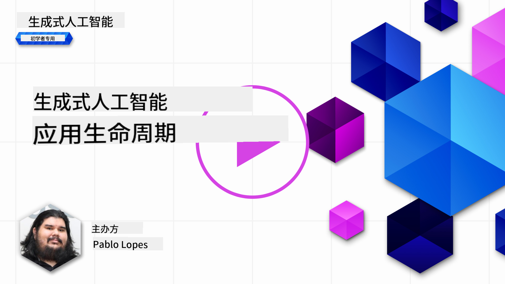
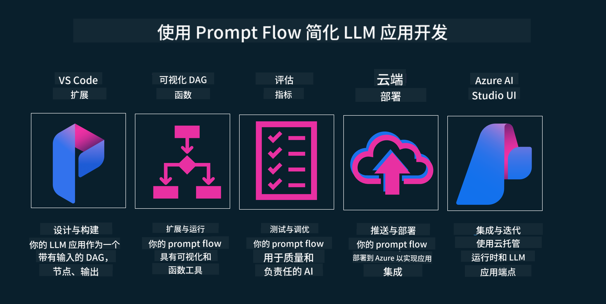

<!--
CO_OP_TRANSLATOR_METADATA:
{
  "original_hash": "27a5347a5022d5ef0a72ab029b03526a",
  "translation_date": "2025-07-09T15:48:27+00:00",
  "source_file": "14-the-generative-ai-application-lifecycle/README.md",
  "language_code": "zh"
}
-->

# 生成式 AI 应用生命周期

对于所有 AI 应用来说，一个重要的问题是 AI 功能的相关性。由于 AI 是一个快速发展的领域，为了确保您的应用保持相关性、可靠性和稳健性，您需要持续监控、评估和改进它。这就是生成式 AI 生命周期的作用所在。

生成式 AI 生命周期是一个指导您开发、部署和维护生成式 AI 应用的框架。它帮助您明确目标、衡量性能、识别挑战并实施解决方案。同时，它还帮助您使应用符合所在领域及利益相关者的伦理和法律标准。通过遵循生成式 AI 生命周期，您可以确保应用始终提供价值并满足用户需求。

## 介绍

在本章中，您将：

- 理解从 MLOps 到 LLMOps 的范式转变
- 了解 LLM 生命周期
- 生命周期工具
- 生命周期指标化与评估

## 理解从 MLOps 到 LLMOps 的范式转变

LLM 是人工智能工具库中的新利器，它们在分析和生成任务中极为强大，适用于各种应用。然而，这种强大能力也对我们如何简化 AI 和传统机器学习任务带来了一些影响。

因此，我们需要一个新的范式，以动态且正确的激励机制来适应这一工具。我们可以将较早的 AI 应用称为“ML 应用”，而较新的 AI 应用称为“GenAI 应用”或简称“AI 应用”，以反映当时主流的技术和方法。这在多个方面改变了我们的叙述，下面的对比图可以帮助理解。

请注意，在 LLMOps 中，我们更关注应用开发者，强调集成作为关键点，采用“模型即服务”的方式，并关注以下指标：

- 质量：响应质量
- 伤害：负责任的 AI
- 诚实：响应的依据性（合理吗？正确吗？）
- 成本：解决方案预算
- 延迟：平均响应时间（每个 token）

## LLM 生命周期

首先，为了理解生命周期及其变化，请看下面的信息图。

如您所见，这与传统的 MLOps 生命周期不同。LLM 有许多新的需求，如提示工程、提升质量的不同技术（微调、RAG、元提示）、负责任 AI 的不同评估和责任，以及新的评估指标（质量、伤害、诚实、成本和延迟）。

例如，看看我们的构思过程。通过提示工程，尝试不同的 LLM 来探索可能性，验证假设是否成立。

请注意，这不是线性的，而是集成的循环，迭代进行，并有一个整体的周期。

我们如何探索这些步骤？让我们详细了解如何构建生命周期。

这看起来可能有些复杂，先关注三个主要步骤。

1. 构思/探索：根据业务需求进行探索。原型设计，创建一个 [PromptFlow](https://microsoft.github.io/promptflow/index.html?WT.mc_id=academic-105485-koreyst)，测试其对假设的有效性。
2. 构建/增强：实施阶段，开始评估更大规模的数据集，应用微调和 RAG 等技术，检验解决方案的稳健性。如果不理想，可以重新实现，增加流程步骤或重组数据。测试流程和规模后，确认指标达标，即可进入下一步。
3. 运营化：集成阶段，添加监控和告警系统，部署并将应用集成到整体系统中。

此外，还有一个贯穿始终的管理周期，关注安全、合规和治理。

恭喜，您的 AI 应用现在已准备就绪并投入运营。想要动手体验，可以查看 [Contoso Chat Demo](https://nitya.github.io/contoso-chat/?WT.mc_id=academic-105485-koreys)。

那么，我们可以使用哪些工具呢？

## 生命周期工具

在工具方面，微软提供了 [Azure AI 平台](https://azure.microsoft.com/solutions/ai/?WT.mc_id=academic-105485-koreys) 和 [PromptFlow](https://microsoft.github.io/promptflow/index.html?WT.mc_id=academic-105485-koreyst)，帮助您轻松实现并管理整个生命周期。

[Azure AI 平台](https://azure.microsoft.com/solutions/ai/?WT.mc_id=academic-105485-koreys) 允许您使用 [AI Studio](https://ai.azure.com/?WT.mc_id=academic-105485-koreys)。AI Studio 是一个网页门户，您可以在这里探索模型、示例和工具，管理资源，进行 UI 开发流程，以及使用 SDK/CLI 进行代码优先开发。

Azure AI 支持多种资源，帮助您管理运营、服务、项目、向量搜索和数据库需求。

使用 PromptFlow，从概念验证（POC）到大规模应用构建：

- 在 VS Code 中设计和构建应用，支持可视化和功能性工具
- 轻松测试和微调应用，确保 AI 质量
- 利用 Azure AI Studio 进行云端集成和迭代，快速推送和部署

## 太棒了！继续学习吧！

非常好，现在了解更多关于如何构建应用以运用这些概念，查看 [Contoso Chat App](https://nitya.github.io/contoso-chat/?WT.mc_id=academic-105485-koreyst)，了解云倡导团队如何在演示中应用这些概念。更多内容请观看我们的 [Ignite 分会场！](https://www.youtube.com/watch?v=DdOylyrTOWg)

接下来，请查看第 15 课，了解 [检索增强生成和向量数据库](../15-rag-and-vector-databases/README.md?WT.mc_id=academic-105485-koreyst) 如何影响生成式 AI，并打造更具吸引力的应用！

**免责声明**：  
本文件使用 AI 翻译服务 [Co-op Translator](https://github.com/Azure/co-op-translator) 进行翻译。虽然我们力求准确，但请注意，自动翻译可能包含错误或不准确之处。原始文件的母语版本应被视为权威来源。对于重要信息，建议采用专业人工翻译。对于因使用本翻译而产生的任何误解或误释，我们概不负责。