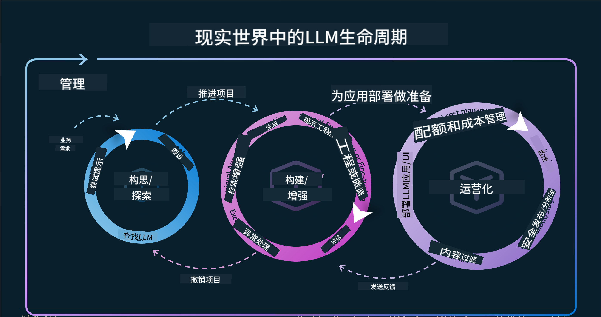
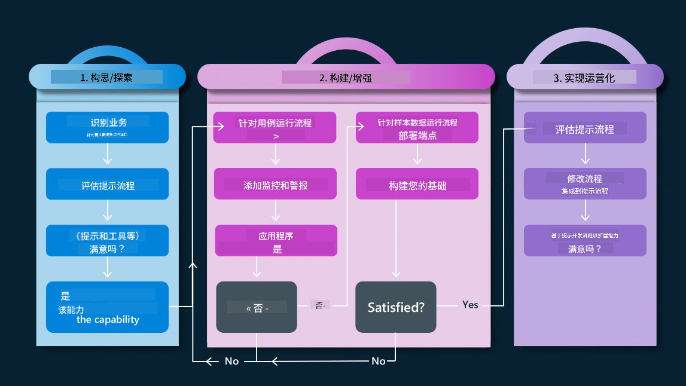
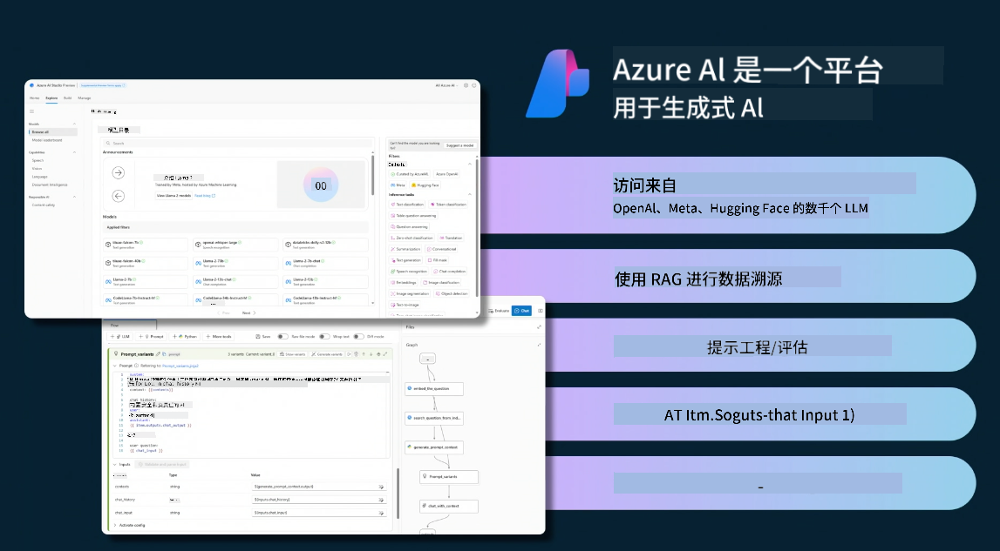
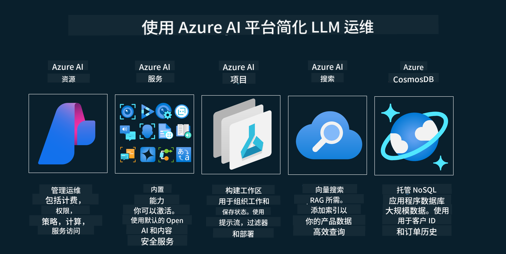

<!--
CO_OP_TRANSLATOR_METADATA:
{
  "original_hash": "b9d32511b27373a1b21b5789d4fda057",
  "translation_date": "2025-10-17T23:24:37+00:00",
  "source_file": "14-the-generative-ai-application-lifecycle/README.md",
  "language_code": "zh"
}
-->

# 生成式人工智能应用生命周期

对于所有人工智能应用来说，一个重要的问题是人工智能功能的相关性。由于人工智能是一个快速发展的领域，为了确保您的应用程序保持相关性、可靠性和稳健性，您需要持续监控、评估和改进。这就是生成式人工智能生命周期的作用所在。

生成式人工智能生命周期是一个框架，指导您完成开发、部署和维护生成式人工智能应用的各个阶段。它帮助您定义目标、衡量性能、识别挑战并实施解决方案。同时，它还帮助您将应用程序与领域内的伦理和法律标准以及利益相关者的需求保持一致。通过遵循生成式人工智能生命周期，您可以确保您的应用始终提供价值并满足用户需求。

## 介绍

在本章中，您将学习：

- 理解从MLOps到LLMOps的范式转变
- LLM生命周期
- 生命周期工具
- 生命周期的度量和评估

## 理解从MLOps到LLMOps的范式转变

LLM是人工智能工具库中的一种新工具，它在应用的分析和生成任务中表现出极大的威力。然而，这种强大的能力对我们优化人工智能和传统机器学习任务的方式产生了一些影响。

因此，我们需要一个新的范式来动态适应这一工具，并设置正确的激励机制。我们可以将较旧的人工智能应用归类为“ML应用”，而将较新的人工智能应用归类为“生成式AI应用”或简称“AI应用”，以反映当时主流的技术和方法。这种转变在多个方面改变了我们的叙述，请看以下比较。

注意，在LLMOps中，我们更加关注应用开发者，将集成作为关键点，使用“模型即服务”，并考虑以下指标：

- 质量：响应质量
- 伤害：负责任的人工智能
- 真实性：响应是否有依据（是否合理？是否正确？）
- 成本：解决方案预算
- 延迟：每个token响应的平均时间

## LLM生命周期

首先，为了理解生命周期及其变化，我们来看下面的信息图。

如您所见，这与传统的MLOps生命周期有所不同。LLM有许多新的需求，例如提示工程、提高质量的不同技术（微调、RAG、元提示）、负责任的人工智能评估以及新的评估指标（质量、伤害、真实性、成本和延迟）。

例如，看看我们如何进行构思。通过提示工程，实验各种LLM以探索可能性，测试它们的假设是否正确。

请注意，这不是线性的，而是集成的循环，迭代并具有一个总体周期。

我们如何探索这些步骤？让我们详细了解如何构建一个生命周期。

这看起来可能有点复杂，我们先关注三个主要步骤。

1. 构思/探索：探索阶段，在这里我们可以根据业务需求进行探索。原型设计，创建一个[PromptFlow](https://microsoft.github.io/promptflow/index.html?WT.mc_id=academic-105485-koreyst)，并测试其是否足够高效以验证我们的假设。
2. 构建/增强：实施阶段，现在我们开始评估更大的数据集，实施技术，如微调和RAG，以检查解决方案的稳健性。如果不够稳健，可以重新实施，添加新的流程步骤或重组数据可能会有所帮助。在测试我们的流程和规模后，如果有效并通过指标检查，就可以进入下一步。
3. 运维：集成阶段，现在为系统添加监控和警报系统，进行部署并将应用集成到我们的应用程序中。

然后，我们有一个围绕管理的总体周期，重点是安全性、合规性和治理。

恭喜您，现在您的AI应用已经准备好上线并运行了。想要亲身体验，请查看[Contoso Chat Demo](https://nitya.github.io/contoso-chat/?WT.mc_id=academic-105485-koreys)。

那么，我们可以使用哪些工具呢？

## 生命周期工具

在工具方面，微软提供了[Azure AI平台](https://azure.microsoft.com/solutions/ai/?WT.mc_id=academic-105485-koreys)和[PromptFlow](https://microsoft.github.io/promptflow/index.html?WT.mc_id=academic-105485-koreyst)，使您的生命周期易于实施并快速启动。

[Azure AI平台](https://azure.microsoft.com/solutions/ai/?WT.mc_id=academic-105485-koreys)允许您使用[AI Studio](https://ai.azure.com/?WT.mc_id=academic-105485-koreys)。AI Studio是一个网页门户，允许您探索模型、示例和工具，管理资源、开发UI流程以及提供SDK/CLI选项以支持代码优先开发。

Azure AI允许您使用多种资源来管理您的操作、服务、项目、向量搜索和数据库需求。

从概念验证（POC）到大规模应用，使用PromptFlow构建：

- 使用VS Code中的可视化和功能工具设计和构建应用
- 轻松测试和微调您的应用以实现高质量的人工智能
- 使用Azure AI Studio与云集成和迭代，快速推送和部署

## 太棒了！继续学习！

太棒了，现在学习更多关于如何构建一个应用以使用这些概念的内容，请查看[Contoso Chat App](https://nitya.github.io/contoso-chat/?WT.mc_id=academic-105485-koreyst)，了解云倡导如何在演示中应用这些概念。更多内容，请查看我们的[Ignite分会场演讲！](https://www.youtube.com/watch?v=DdOylyrTOWg)

接下来，请查看第15课，了解[检索增强生成和向量数据库](../15-rag-and-vector-databases/README.md?WT.mc_id=academic-105485-koreyst)如何影响生成式人工智能并创建更具吸引力的应用！

---

**免责声明**：  
本文档使用AI翻译服务[Co-op Translator](https://github.com/Azure/co-op-translator)进行翻译。尽管我们努力确保翻译的准确性，但请注意，自动翻译可能包含错误或不准确之处。原始语言的文档应被视为权威来源。对于关键信息，建议使用专业人工翻译。我们不对因使用此翻译而产生的任何误解或误读承担责任。