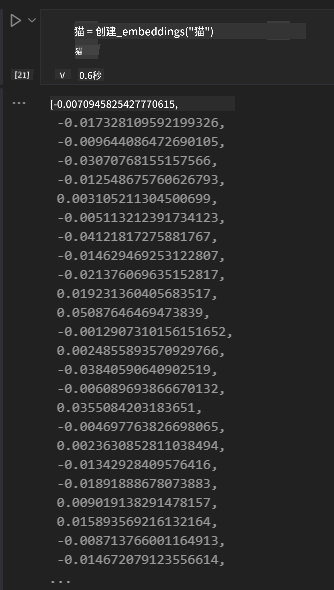

<!--
CO_OP_TRANSLATOR_METADATA:
{
  "original_hash": "e2861bbca91c0567ef32bc77fe054f9e",
  "translation_date": "2025-06-25T22:20:16+00:00",
  "source_file": "15-rag-and-vector-databases/README.md",
  "language_code": "zh"
}
-->
# 检索增强生成 (RAG) 和向量数据库

在搜索应用课程中，我们简要学习了如何将自己的数据集成到大型语言模型 (LLMs) 中。在本课程中，我们将深入探讨如何在 LLM 应用中将数据与模型结合的概念、过程机制以及存储数据的方法，包括嵌入和文本。

> **视频即将推出**

## 介绍

在本课程中，我们将涵盖以下内容：

- 介绍 RAG，它是什么以及为什么在人工智能中使用它。

- 理解什么是向量数据库，并为我们的应用创建一个。

- 如何将 RAG 集成到应用中的实际示例。

## 学习目标

完成本课程后，您将能够：

- 解释 RAG 在数据检索和处理中的重要性。

- 设置 RAG 应用并将您的数据与 LLM 结合。

- 在 LLM 应用中有效集成 RAG 和向量数据库。

## 我们的场景：用自己的数据增强我们的 LLMs

在本课程中，我们希望将自己的笔记添加到教育初创公司中，使聊天机器人能够获取更多关于不同主题的信息。使用我们的笔记，学习者将能够更好地学习和理解不同的主题，从而更容易复习他们的考试。为了创建我们的场景，我们将使用：

- `Azure OpenAI:` 我们用来创建聊天机器人的 LLM

- `AI for beginners' lesson on Neural Networks`：这是我们在 LLM 上结合的数据

- `Azure AI Search` 和 `Azure Cosmos DB:` 向量数据库，用于存储我们的数据并创建搜索索引

用户将能够根据他们的笔记创建练习测验、复习闪卡，并将其总结为简洁的概述。首先，让我们看看什么是 RAG 以及它如何工作：

## 检索增强生成 (RAG)

一个由 LLM 驱动的聊天机器人处理用户提示以生成响应。它旨在交互并与用户讨论广泛的话题。然而，它的响应仅限于提供的上下文和其基础训练数据。例如，GPT-4 的知识截止日期为 2021 年 9 月，这意味着它缺乏在此之后发生的事件的知识。此外，用于训练 LLMs 的数据排除了机密信息，如个人笔记或公司的产品手册。

### RAGs（检索增强生成）的工作原理

假设您想部署一个从您的笔记中创建测验的聊天机器人，您将需要连接到知识库。这就是 RAG 的用武之地。RAGs 的操作如下：

- **知识库：** 在检索之前，这些文档需要被摄取和预处理，通常将大型文档拆分成较小的块，转换为文本嵌入并存储在数据库中。

- **用户查询：** 用户提出问题

- **检索：** 当用户提出问题时，嵌入模型从我们的知识库中检索相关信息，以提供更多上下文并将其合并到提示中。

- **增强生成：** LLM 基于检索到的数据增强其响应。它使生成的响应不仅基于预训练数据，还包括来自添加上下文的相关信息。检索到的数据用于增强 LLM 的响应。然后，LLM 返回对用户问题的答案。

RAGs 的架构是通过包含两个部分的转换器实现的：编码器和解码器。例如，当用户提出问题时，输入文本被“编码”成向量，捕捉词语的含义，并将向量“解码”到我们的文档索引中，并根据用户查询生成新文本。LLM 使用编码器-解码器模型生成输出。

根据提出的论文：[知识密集 NLP（自然语言处理软件）任务的检索增强生成](https://arxiv.org/pdf/2005.11401.pdf?WT.mc_id=academic-105485-koreyst)，在实现 RAG 时有两种方法：

- **_RAG-Sequence_** 使用检索到的文档预测用户查询的最佳答案

- **RAG-Token** 使用文档生成下一个令牌，然后检索它们以回答用户查询

### 为什么要使用 RAGs？

- **信息丰富：** 确保文本响应是最新和当前的。因此，通过访问内部知识库来增强特定领域任务的性能。

- 通过利用知识库中的 **可验证数据** 来减少捏造，以提供用户查询的上下文。

- **成本效益：** 与微调 LLM 相比，它们更经济。

## 创建知识库

我们的应用基于我们的个人数据，即 AI 初学者课程中的神经网络课程。

### 向量数据库

向量数据库不同于传统数据库，是一种专门用于存储、管理和搜索嵌入向量的数据库。它存储文档的数字表示。将数据分解为数字嵌入使我们的 AI 系统更容易理解和处理数据。

我们将嵌入存储在向量数据库中，因为 LLMs 对它们接受的输入令牌数量有限制。由于无法将整个嵌入传递给 LLM，我们需要将它们拆分成块，当用户提出问题时，最像问题的嵌入将与提示一起返回。拆分也减少了通过 LLM 的令牌数量的成本。

一些流行的向量数据库包括 Azure Cosmos DB、Clarifyai、Pinecone、Chromadb、ScaNN、Qdrant 和 DeepLake。您可以使用以下命令通过 Azure CLI 创建 Azure Cosmos DB 模型：

```bash
az login
az group create -n <resource-group-name> -l <location>
az cosmosdb create -n <cosmos-db-name> -r <resource-group-name>
az cosmosdb list-keys -n <cosmos-db-name> -g <resource-group-name>
```

### 从文本到嵌入

在存储数据之前，我们需要将其转换为向量嵌入，然后再存储在数据库中。如果您处理的是大型文档或长文本，可以根据您期望的查询进行拆分。拆分可以在句子级别或段落级别进行。由于拆分从周围的词语中获取意义，您可以向块中添加一些其他上下文，例如，添加文档标题或在块前后包括一些文本。您可以按以下方式拆分数据：

```python
def split_text(text, max_length, min_length):
    words = text.split()
    chunks = []
    current_chunk = []

    for word in words:
        current_chunk.append(word)
        if len(' '.join(current_chunk)) < max_length and len(' '.join(current_chunk)) > min_length:
            chunks.append(' '.join(current_chunk))
            current_chunk = []

    # If the last chunk didn't reach the minimum length, add it anyway
    if current_chunk:
        chunks.append(' '.join(current_chunk))

    return chunks
```

一旦拆分，我们就可以使用不同的嵌入模型嵌入我们的文本。您可以使用的一些模型包括：word2vec、OpenAI 的 ada-002、Azure 计算机视觉等。选择使用的模型将取决于您使用的语言、编码的内容类型（文本/图像/音频）、它可以编码的输入大小以及嵌入输出的长度。

使用 OpenAI 的 `text-embedding-ada-002` 模型嵌入文本的示例是：


## 检索和向量搜索

当用户提出问题时，检索器使用查询编码器将其转换为向量，然后在我们的文档搜索索引中搜索与输入相关的文档中的相关向量。完成后，它将输入向量和文档向量转换为文本并传递给 LLM。

### 检索

检索发生在系统尝试快速从索引中找到满足搜索条件的文档时。检索器的目标是获取将用于提供上下文并将 LLM 与您的数据结合的文档。

在我们的数据库中有几种搜索方式，例如：

- **关键词搜索** - 用于文本搜索

- **语义搜索** - 使用词语的语义含义

- **向量搜索** - 使用嵌入模型将文档从文本转换为向量表示。检索将通过查询与用户问题最近的文档进行。

- **混合搜索** - 结合关键词和向量搜索。

检索面临的挑战是当数据库中没有与查询相似的响应时，系统将返回他们能找到的最佳信息。然而，您可以使用策略，例如设置最大相关距离或使用结合关键词和向量搜索的混合搜索。在本课程中，我们将使用混合搜索，结合向量和关键词搜索。我们将数据存储到一个数据框中，其中包含块和嵌入的列。

### 向量相似性

检索器将在知识数据库中搜索靠近的嵌入，最近的邻居，因为它们是相似的文本。在用户提出查询的情况下，首先嵌入然后与相似的嵌入匹配。用于查找不同向量相似程度的常用测量是余弦相似性，它基于两个向量之间的角度。

我们可以使用其他替代方法测量相似性，如欧几里得距离，它是向量端点之间的直线，以及点积，它测量两个向量对应元素的乘积之和。

### 搜索索引

进行检索时，我们需要在执行搜索之前为我们的知识库构建搜索索引。索引将存储我们的嵌入，并能够在大型数据库中快速检索最相似的块。我们可以使用以下方法在本地创建索引：

```python
from sklearn.neighbors import NearestNeighbors

embeddings = flattened_df['embeddings'].to_list()

# Create the search index
nbrs = NearestNeighbors(n_neighbors=5, algorithm='ball_tree').fit(embeddings)

# To query the index, you can use the kneighbors method
distances, indices = nbrs.kneighbors(embeddings)
```

### 重排序

一旦查询了数据库，您可能需要从最相关的结果中进行排序。重排序 LLM 利用机器学习通过从最相关的结果中排序来提高搜索结果的相关性。使用 Azure AI 搜索，重排序会自动为您完成，使用语义重排序器。使用最近邻居进行重排序的示例：

```python
# Find the most similar documents
distances, indices = nbrs.kneighbors([query_vector])

index = []
# Print the most similar documents
for i in range(3):
    index = indices[0][i]
    for index in indices[0]:
        print(flattened_df['chunks'].iloc[index])
        print(flattened_df['path'].iloc[index])
        print(flattened_df['distances'].iloc[index])
    else:
        print(f"Index {index} not found in DataFrame")
```

## 综合应用

最后一步是将我们的 LLM 添加到混合中，以便能够获得基于我们数据的响应。我们可以按以下方式实现：

```python
user_input = "what is a perceptron?"

def chatbot(user_input):
    # Convert the question to a query vector
    query_vector = create_embeddings(user_input)

    # Find the most similar documents
    distances, indices = nbrs.kneighbors([query_vector])

    # add documents to query  to provide context
    history = []
    for index in indices[0]:
        history.append(flattened_df['chunks'].iloc[index])

    # combine the history and the user input
    history.append(user_input)

    # create a message object
    messages=[
        {"role": "system", "content": "You are an AI assistant that helps with AI questions."},
        {"role": "user", "content": history[-1]}
    ]

    # use chat completion to generate a response
    response = openai.chat.completions.create(
        model="gpt-4",
        temperature=0.7,
        max_tokens=800,
        messages=messages
    )

    return response.choices[0].message

chatbot(user_input)
```

## 评估我们的应用

### 评估指标

- 确保响应质量自然、流畅并具有类人特征

- 数据的扎实性：评估响应是否来自提供的文档

- 相关性：评估响应是否与提出的问题匹配并相关

- 流利度 - 评估响应在语法上是否合理

## 使用 RAG（检索增强生成）和向量数据库的用例

有许多不同的用例，功能调用可以改善您的应用，例如：

- 问答：将公司数据与聊天结合，供员工提问。

- 推荐系统：可以创建一个匹配最相似值的系统，例如电影、餐馆等。

- 聊天机器人服务：可以存储聊天记录并根据用户数据个性化对话。

- 基于向量嵌入的图像搜索，在进行图像识别和异常检测时很有用。

## 总结

我们已经涵盖了 RAG 的基本领域，从将数据添加到应用、用户查询到输出。为了简化 RAG 的创建，您可以使用 Semanti Kernel、Langchain 或 Autogen 等框架。

## 作业

为了继续学习检索增强生成 (RAG)，您可以构建：

- 使用您选择的框架构建应用的前端

- 利用框架，无论是 LangChain 还是 Semantic Kernel，并重新创建您的应用。

恭喜您完成课程 👏。

## 学习不会止步于此，继续学习旅程

完成本课程后，请查看我们的 [生成式 AI 学习合集](https://aka.ms/genai-collection?WT.mc_id=academic-105485-koreyst)，继续提升您的生成式 AI 知识！

**免责声明**：
本文档使用 AI 翻译服务 [Co-op Translator](https://github.com/Azure/co-op-translator) 进行翻译。尽管我们力求准确，但请注意自动翻译可能包含错误或不准确之处。原始文档的母语版本应被视为权威来源。对于关键信息，建议进行专业人工翻译。对于因使用此翻译而产生的任何误解或误读，我们不承担责任。