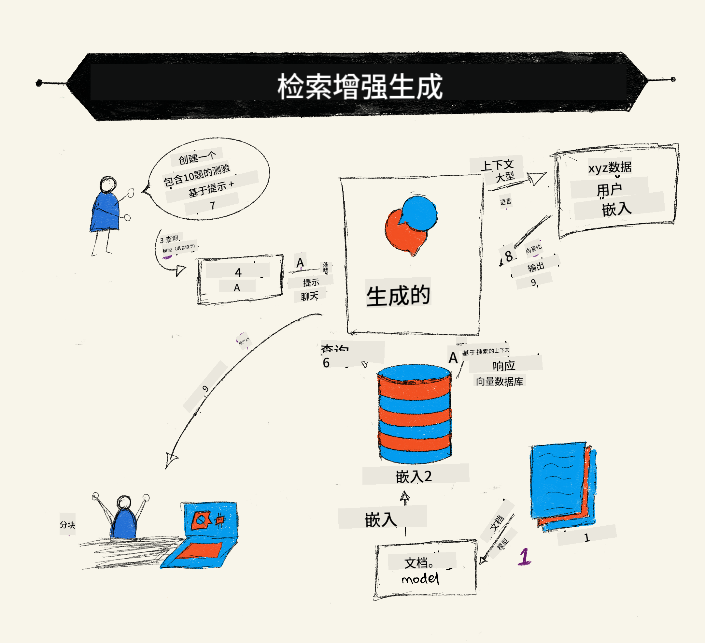
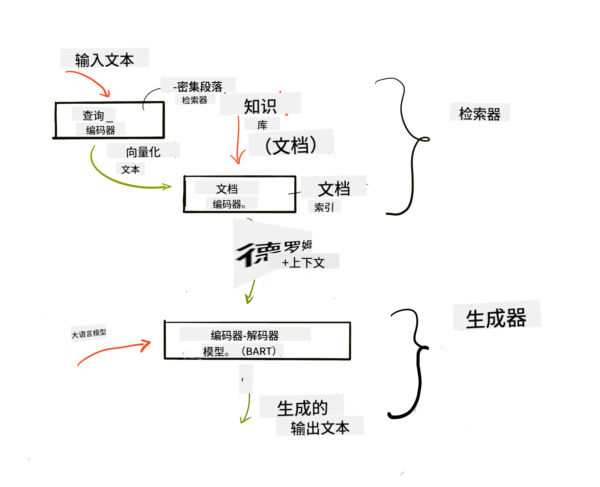

<!--
CO_OP_TRANSLATOR_METADATA:
{
  "original_hash": "e2861bbca91c0567ef32bc77fe054f9e",
  "translation_date": "2025-07-09T16:04:33+00:00",
  "source_file": "15-rag-and-vector-databases/README.md",
  "language_code": "zh"
}
-->
# 检索增强生成（RAG）与向量数据库

[](https://aka.ms/gen-ai-lesson15-gh?WT.mc_id=academic-105485-koreyst)

在搜索应用课程中，我们简要了解了如何将自己的数据集成到大型语言模型（LLM）中。本课将深入探讨如何在LLM应用中为数据提供支撑的概念、流程机制以及数据存储方法，包括嵌入向量和文本。

> **视频即将上线**

## 介绍

本课内容包括：

- 介绍RAG，什么是RAG以及它在人工智能（AI）中的应用原因。

- 了解向量数据库的概念，并为我们的应用创建一个向量数据库。

- 一个如何将RAG集成到应用中的实用示例。

## 学习目标

完成本课后，您将能够：

- 解释RAG在数据检索和处理中的重要性。

- 搭建RAG应用并将数据与LLM进行绑定。

- 有效地将RAG和向量数据库集成到LLM应用中。

## 场景设定：用自有数据增强我们的LLM

本课中，我们希望将自己的笔记添加到教育创业项目中，使聊天机器人能够获取更多关于不同学科的信息。利用这些笔记，学习者能够更好地学习和理解不同主题，从而更轻松地复习考试内容。为构建此场景，我们将使用：

- `Azure OpenAI`：用于创建聊天机器人的LLM

- `AI for beginners' lesson on Neural Networks`：作为我们为LLM提供支撑的数据

- `Azure AI Search` 和 `Azure Cosmos DB`：用于存储数据和创建搜索索引的向量数据库

用户将能够根据笔记创建练习测验、复习闪卡，并将内容总结为简明概览。首先，让我们了解什么是RAG以及它的工作原理：

## 检索增强生成（RAG）

基于LLM的聊天机器人处理用户提示以生成回复。它设计为交互式，能够与用户就各种话题进行交流。然而，其回答受限于提供的上下文和基础训练数据。例如，GPT-4的知识截止于2021年9月，这意味着它不了解此后发生的事件。此外，训练LLM所用的数据不包含机密信息，如个人笔记或公司的产品手册。

### RAG（检索增强生成）的工作原理



假设您想部署一个能根据笔记生成测验的聊天机器人，您需要连接到知识库。这时RAG派上用场。RAG的工作流程如下：

- **知识库**：在检索之前，需要先将文档导入并预处理，通常是将大文档拆分成较小的块，转换为文本嵌入向量并存储到数据库中。

- **用户查询**：用户提出问题。

- **检索**：当用户提问时，嵌入模型会从知识库中检索相关信息，为提示提供更多上下文。

- **增强生成**：LLM基于检索到的数据增强回答，使生成的回复不仅基于预训练数据，还结合了相关的上下文信息。LLM随后返回对用户问题的答案。



RAG架构基于transformer模型，由编码器和解码器两部分组成。例如，当用户提问时，输入文本被“编码”为捕捉词义的向量，这些向量被“解码”到文档索引中，并基于用户查询生成新文本。LLM使用编码器-解码器模型来生成输出。

根据论文[Retrieval-Augmented Generation for Knowledge intensive NLP Tasks](https://arxiv.org/pdf/2005.11401.pdf?WT.mc_id=academic-105485-koreyst)，实现RAG有两种方法：

- **_RAG-Sequence_**：使用检索到的文档预测用户查询的最佳答案。

- **RAG-Token**：使用文档生成下一个token，然后检索以回答用户查询。

### 为什么要使用RAG？

- **信息丰富**：确保文本回复是最新且准确的，从而通过访问内部知识库提升特定领域任务的表现。

- 利用知识库中的**可验证数据**为用户查询提供上下文，减少虚假信息。

- **成本效益高**，相比微调LLM更经济。

## 创建知识库

我们的应用基于个人数据，即“AI For Beginners”课程中的神经网络章节。

### 向量数据库

向量数据库不同于传统数据库，是专门设计用来存储、管理和搜索嵌入向量的数据库。它存储文档的数值表示。将数据转换为数值嵌入使AI系统更容易理解和处理数据。

我们将嵌入向量存储在向量数据库中，因为LLM对输入的token数量有限制。由于无法将整个嵌入向量直接传入LLM，我们需要将其拆分成块，当用户提问时，最相关的嵌入向量会与提示一起返回。拆分还能降低传入LLM的token数量，从而节省成本。

常见的向量数据库包括Azure Cosmos DB、Clarifyai、Pinecone、Chromadb、ScaNN、Qdrant和DeepLake。您可以使用Azure CLI通过以下命令创建Azure Cosmos DB模型：

```bash
az login
az group create -n <resource-group-name> -l <location>
az cosmosdb create -n <cosmos-db-name> -r <resource-group-name>
az cosmosdb list-keys -n <cosmos-db-name> -g <resource-group-name>
```

### 从文本到嵌入向量

在存储数据之前，需要先将其转换为向量嵌入。如果处理的是大型文档或长文本，可以根据预期查询进行拆分。拆分可以在句子级别或段落级别进行。由于拆分依赖于周围词语的含义，您可以为拆分块添加额外上下文，例如文档标题或拆分块前后的文本。拆分示例如下：

```python
def split_text(text, max_length, min_length):
    words = text.split()
    chunks = []
    current_chunk = []

    for word in words:
        current_chunk.append(word)
        if len(' '.join(current_chunk)) < max_length and len(' '.join(current_chunk)) > min_length:
            chunks.append(' '.join(current_chunk))
            current_chunk = []

    # If the last chunk didn't reach the minimum length, add it anyway
    if current_chunk:
        chunks.append(' '.join(current_chunk))

    return chunks
```

拆分后，我们可以使用不同的嵌入模型对文本进行嵌入。一些可用模型包括word2vec、OpenAI的ada-002、Azure计算机视觉等。选择模型时需考虑所用语言、编码内容类型（文本/图像/音频）、可编码的输入大小以及嵌入输出长度。

以下是使用OpenAI的`text-embedding-ada-002`模型嵌入“cat”一词的示例：


## 检索与向量搜索

当用户提问时，检索器使用查询编码器将问题转换为向量，然后在文档搜索索引中查找与输入相关的向量。一旦完成，它将输入向量和文档向量转换回文本，并传递给LLM。

### 检索

检索是系统快速找到满足搜索条件的文档的过程。检索器的目标是获取用于为LLM提供上下文并绑定数据的文档。

数据库中搜索的方法包括：

- **关键词搜索**：用于文本搜索。

- **语义搜索**：利用词语的语义含义。

- **向量搜索**：使用嵌入模型将文档从文本转换为向量表示，通过查询与用户问题向量最接近的文档进行检索。

- **混合搜索**：结合关键词搜索和向量搜索。

检索的挑战在于当数据库中没有与查询相似的回答时，系统会返回最接近的信息。您可以通过设置最大相关距离或使用结合关键词和向量搜索的混合搜索来优化结果。本课将使用混合搜索，将数据存储在包含拆分块和嵌入向量的dataframe中。

### 向量相似度

检索器会在知识库中寻找相近的嵌入向量，即最邻近的向量，因为它们代表相似的文本。当用户提问时，问题先被嵌入，然后与相似的嵌入向量匹配。常用的相似度度量是余弦相似度，基于两个向量之间的夹角。

我们还可以使用其他相似度度量方法，如欧氏距离（向量端点之间的直线距离）和点积（对应元素乘积的和）。

### 搜索索引

进行检索前，需要为知识库构建搜索索引。索引存储嵌入向量，即使在大型数据库中也能快速检索最相似的拆分块。我们可以本地创建索引，示例如下：

```python
from sklearn.neighbors import NearestNeighbors

embeddings = flattened_df['embeddings'].to_list()

# Create the search index
nbrs = NearestNeighbors(n_neighbors=5, algorithm='ball_tree').fit(embeddings)

# To query the index, you can use the kneighbors method
distances, indices = nbrs.kneighbors(embeddings)
```

### 重新排序

查询数据库后，可能需要对结果按相关性进行排序。重新排序的LLM利用机器学习提升搜索结果的相关性，将最相关的结果排在前面。使用Azure AI Search时，语义重新排序器会自动完成此操作。以下是基于最近邻的重新排序示例：

```python
# Find the most similar documents
distances, indices = nbrs.kneighbors([query_vector])

index = []
# Print the most similar documents
for i in range(3):
    index = indices[0][i]
    for index in indices[0]:
        print(flattened_df['chunks'].iloc[index])
        print(flattened_df['path'].iloc[index])
        print(flattened_df['distances'].iloc[index])
    else:
        print(f"Index {index} not found in DataFrame")
```

## 综合应用

最后一步是将LLM加入流程，以便基于我们的数据生成回答。实现示例如下：

```python
user_input = "what is a perceptron?"

def chatbot(user_input):
    # Convert the question to a query vector
    query_vector = create_embeddings(user_input)

    # Find the most similar documents
    distances, indices = nbrs.kneighbors([query_vector])

    # add documents to query  to provide context
    history = []
    for index in indices[0]:
        history.append(flattened_df['chunks'].iloc[index])

    # combine the history and the user input
    history.append(user_input)

    # create a message object
    messages=[
        {"role": "system", "content": "You are an AI assistant that helps with AI questions."},
        {"role": "user", "content": history[-1]}
    ]

    # use chat completion to generate a response
    response = openai.chat.completions.create(
        model="gpt-4",
        temperature=0.7,
        max_tokens=800,
        messages=messages
    )

    return response.choices[0].message

chatbot(user_input)
```

## 评估我们的应用

### 评估指标

- 回答质量：确保回答自然流畅，具有人类语言风格。

- 数据支撑度：评估回答是否基于提供的文档。

- 相关性：评估回答是否匹配并与提问相关。

- 流畅度：回答在语法上是否通顺合理。

## RAG（检索增强生成）与向量数据库的应用场景

函数调用可以提升应用的多种场景，例如：

- 问答系统：将公司数据绑定到聊天机器人，供员工提问使用。

- 推荐系统：创建匹配最相似项的系统，如电影、餐厅等。

- 聊天机器人服务：存储聊天记录，并基于用户数据个性化对话。

- 基于向量嵌入的图像搜索，适用于图像识别和异常检测。

## 总结

我们涵盖了RAG的基础知识，从添加数据到应用、用户查询及输出。为简化RAG的创建，您可以使用Semanti Kernel、Langchain或Autogen等框架。

## 练习

继续学习检索增强生成（RAG），您可以：

- 使用您选择的框架构建应用的前端。

- 利用LangChain或Semantic Kernel框架，重建您的应用。

恭喜您完成本课👏。

## 学习永无止境，继续前行

完成本课后，欢迎查看我们的[生成式AI学习合集](https://aka.ms/genai-collection?WT.mc_id=academic-105485-koreyst)，持续提升您的生成式AI知识！

**免责声明**：  
本文件由 AI 翻译服务 [Co-op Translator](https://github.com/Azure/co-op-translator) 翻译而成。虽然我们力求准确，但请注意，自动翻译可能包含错误或不准确之处。原始文件的母语版本应被视为权威来源。对于重要信息，建议使用专业人工翻译。因使用本翻译而产生的任何误解或误释，我们概不负责。