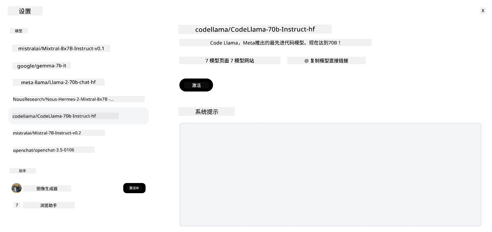

<!--
CO_OP_TRANSLATOR_METADATA:
{
  "original_hash": "85b754d4dc980f270f264d17116d9a5f",
  "translation_date": "2025-12-19T13:18:01+00:00",
  "source_file": "16-open-source-models/README.md",
  "language_code": "zh"
}
-->

## 介绍

开源大型语言模型（LLM）的世界令人兴奋且不断发展。本课旨在深入介绍开源模型。如果您想了解专有模型与开源模型的比较，请访问[“探索和比较不同的LLM”课程](../02-exploring-and-comparing-different-llms/README.md?WT.mc_id=academic-105485-koreyst)。本课还将涵盖微调主题，但更详细的解释可以在[“微调LLM”课程](../18-fine-tuning/README.md?WT.mc_id=academic-105485-koreyst)中找到。

## 学习目标

- 了解开源模型
- 理解使用开源模型的优势
- 探索Hugging Face和Azure AI Studio上可用的开源模型

## 什么是开源模型？

开源软件在各个领域的技术发展中发挥了关键作用。开源倡议组织（OSI）定义了[软件开源的10条标准](https://web.archive.org/web/20241126001143/https://opensource.org/osd?WT.mc_id=academic-105485-koreyst)，源代码必须在OSI批准的许可证下公开共享。

虽然LLM的开发与软件开发有相似之处，但过程并不完全相同。这在社区中引发了关于LLM开源定义的广泛讨论。要符合传统开源定义，模型应公开以下信息：

- 用于训练模型的数据集。
- 训练过程中完整的模型权重。
- 评估代码。
- 微调代码。
- 完整的模型权重和训练指标。

目前只有少数模型符合这些标准。[由艾伦人工智能研究所（AllenAI）创建的OLMo模型](https://huggingface.co/allenai/OLMo-7B?WT.mc_id=academic-105485-koreyst)就是其中之一。

在本课中，我们将称这些模型为“开源模型”，因为它们在撰写时可能尚未完全符合上述标准。

## 开源模型的优势

**高度可定制** - 由于开源模型附带详细的训练信息，研究人员和开发者可以修改模型内部结构，从而创建针对特定任务或研究领域微调的高度专业化模型。例如代码生成、数学运算和生物学领域。

**成本** - 使用和部署这些模型的每个token成本低于专有模型。在构建生成式AI应用时，应根据您的用例权衡性能与价格。

来源：Artificial Analysis

**灵活性** - 使用开源模型可以灵活选择不同模型或将它们组合使用。例如，[HuggingChat助理](https://huggingface.co/chat?WT.mc_id=academic-105485-koreyst)允许用户在界面中直接选择使用的模型：

## 探索不同的开源模型

### Llama 2

[Meta开发的Llama 2](https://huggingface.co/meta-llama?WT.mc_id=academic-105485-koreyst)是一款针对聊天应用优化的开源模型。这得益于其微调方法，包含大量对话和人类反馈，使模型生成的结果更符合人类预期，提升用户体验。

Llama的微调版本示例包括专注于日语的[Japanese Llama](https://huggingface.co/elyza/ELYZA-japanese-Llama-2-7b?WT.mc_id=academic-105485-koreyst)和增强版的[Llama Pro](https://huggingface.co/TencentARC/LLaMA-Pro-8B?WT.mc_id=academic-105485-koreyst)。

### Mistral

[Mistral](https://huggingface.co/mistralai?WT.mc_id=academic-105485-koreyst)是一款注重高性能和效率的开源模型。它采用专家混合（Mixture-of-Experts）方法，将一组专门的专家模型组合成一个系统，根据输入选择特定模型使用，从而提高计算效率。

Mistral的微调版本示例包括专注医疗领域的[BioMistral](https://huggingface.co/BioMistral/BioMistral-7B?text=Mon+nom+est+Thomas+et+mon+principal?WT.mc_id=academic-105485-koreyst)和执行数学计算的[OpenMath Mistral](https://huggingface.co/nvidia/OpenMath-Mistral-7B-v0.1-hf?WT.mc_id=academic-105485-koreyst)。

### Falcon

[Falcon](https://huggingface.co/tiiuae?WT.mc_id=academic-105485-koreyst)是由技术创新研究院（**TII**）创建的LLM。Falcon-40B拥有400亿参数，表现优于GPT-3且计算资源消耗更低。这得益于其使用的FlashAttention算法和多查询注意力机制，减少了推理时的内存需求。推理时间的缩短使Falcon-40B适合聊天应用。

Falcon的微调版本示例包括基于开源模型构建的[OpenAssistant](https://huggingface.co/OpenAssistant/falcon-40b-sft-top1-560?WT.mc_id=academic-105485-koreyst)和性能优于基础模型的[GPT4ALL](https://huggingface.co/nomic-ai/gpt4all-falcon?WT.mc_id=academic-105485-koreyst)。

## 如何选择

选择开源模型没有唯一答案。一个好的起点是使用Azure AI Studio的按任务筛选功能，帮助您了解模型训练的任务类型。Hugging Face还维护了LLM排行榜，展示基于特定指标的最佳模型。

在比较不同类型的LLM时，[Artificial Analysis](https://artificialanalysis.ai/?WT.mc_id=academic-105485-koreyst)是另一个很好的资源：

来源：Artificial Analysis

如果针对特定用例，搜索专注于相同领域的微调版本会很有效。尝试多个开源模型，观察它们是否符合您和用户的期望，也是一个好方法。

## 下一步

开源模型的最大优势是您可以很快开始使用。查看[Azure AI Foundry模型目录](https://ai.azure.com?WT.mc_id=academic-105485-koreyst)，其中包含我们这里讨论的Hugging Face模型合集。

## 学习永不止步，继续前行

完成本课后，请访问我们的[生成式AI学习合集](https://aka.ms/genai-collection?WT.mc_id=academic-105485-koreyst)，继续提升您的生成式AI知识！

---

<!-- CO-OP TRANSLATOR DISCLAIMER START -->
**免责声明**：  
本文件由人工智能翻译服务 [Co-op Translator](https://github.com/Azure/co-op-translator) 翻译。尽管我们力求准确，但请注意自动翻译可能存在错误或不准确之处。原始语言的文档应被视为权威来源。对于重要信息，建议使用专业人工翻译。我们不对因使用本翻译而产生的任何误解或误释承担责任。
<!-- CO-OP TRANSLATOR DISCLAIMER END -->