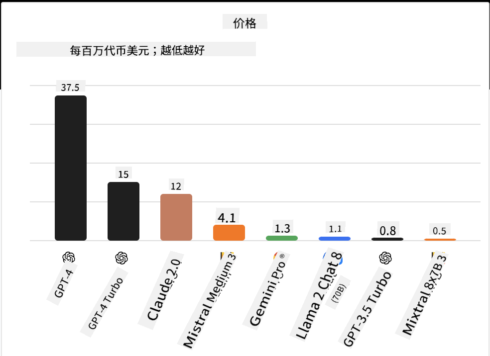
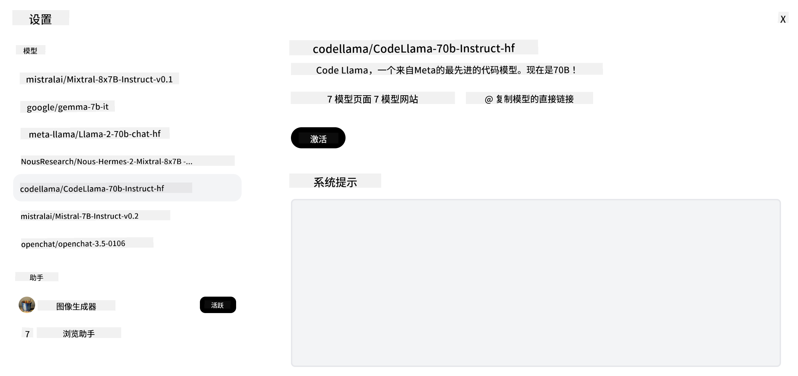
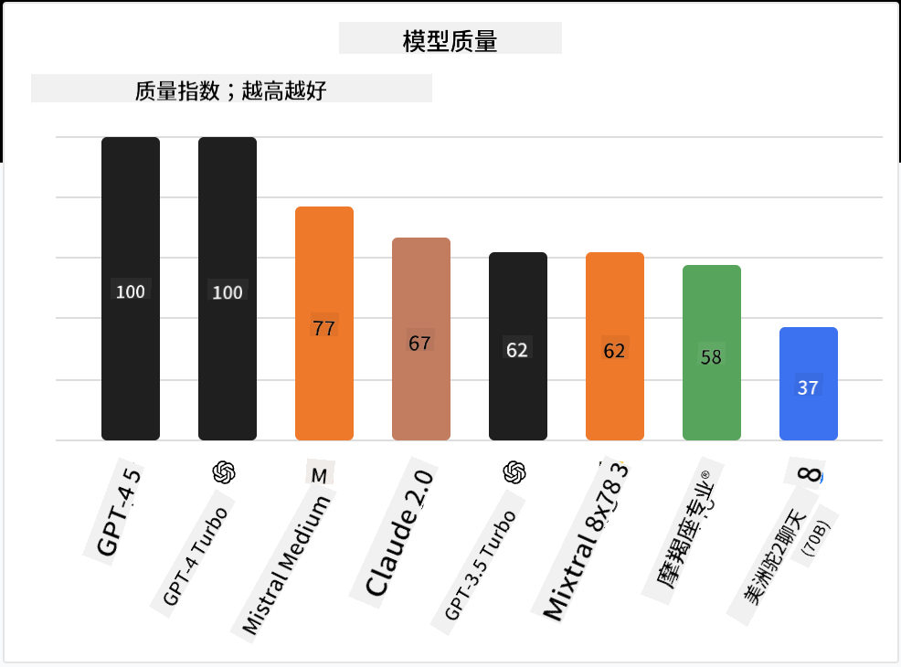

<!--
CO_OP_TRANSLATOR_METADATA:
{
  "original_hash": "0bba96e53ab841d99db731892a51fab8",
  "translation_date": "2025-06-25T23:50:02+00:00",
  "source_file": "16-open-source-models/README.md",
  "language_code": "zh"
}
-->

## 介绍

开源大型语言模型（LLM）的世界充满了激动人心的变化。本课旨在深入了解开源模型。如果您想了解专有模型与开源模型的比较，请参阅["探索和比较不同LLM"课程](../02-exploring-and-comparing-different-llms/README.md?WT.mc_id=academic-105485-koreyst)。本课还将涉及微调的主题，但更详细的解释可以在["微调LLM"课程](../18-fine-tuning/README.md?WT.mc_id=academic-105485-koreyst)中找到。

## 学习目标

- 理解开源模型
- 理解使用开源模型的好处
- 探索Hugging Face和Azure AI Studio上可用的开源模型

## 什么是开源模型？

开源软件在各个领域的技术发展中发挥了关键作用。开源倡议（OSI）定义了[软件的10个标准](https://web.archive.org/web/20241126001143/https://opensource.org/osd?WT.mc_id=academic-105485-koreyst)以被归类为开源。源代码必须在OSI批准的许可证下公开共享。

虽然LLM的开发与软件开发有相似之处，但过程并不完全相同。这在社区中引发了关于在LLM背景下开源定义的许多讨论。要使模型符合传统的开源定义，以下信息应公开可用：

- 用于训练模型的数据集。
- 作为训练一部分的完整模型权重。
- 评估代码。
- 微调代码。
- 完整的模型权重和训练指标。

目前只有少数模型符合这些标准。[由Allen人工智能研究所（AllenAI）创建的OLMo模型](https://huggingface.co/allenai/OLMo-7B?WT.mc_id=academic-105485-koreyst)是其中之一。

在本课中，我们将这些模型称为“开放模型”，因为在撰写本文时，它们可能不符合上述标准。

## 开放模型的好处

**高度可定制** - 由于开放模型是与详细的训练信息一起发布的，研究人员和开发人员可以修改模型的内部。这使得创建高度专业化的模型成为可能，这些模型可以针对特定任务或研究领域进行微调。例如代码生成、数学运算和生物学。

**成本** - 使用和部署这些模型的每个token的成本低于专有模型。在构建生成式AI应用程序时，应根据您的用例比较这些模型的性能与价格。

  
来源：人工分析

**灵活性** - 使用开放模型使您在使用不同模型或组合模型方面具有灵活性。例如在[HuggingChat Assistants](https://huggingface.co/chat?WT.mc_id=academic-105485-koreyst)中，用户可以直接在用户界面中选择正在使用的模型：

## 探索不同的开放模型

### Llama 2

[LLama2](https://huggingface.co/meta-llama?WT.mc_id=academic-105485-koreyst)由Meta开发，是一个针对聊天应用程序优化的开放模型。这是由于其微调方法，包括大量对话和人类反馈。通过这种方法，模型生成的结果更符合人类期望，从而提供更好的用户体验。

Llama的一些微调版本包括专注于日语的[Japanese Llama](https://huggingface.co/elyza/ELYZA-japanese-Llama-2-7b?WT.mc_id=academic-105485-koreyst)和增强版的[Llama Pro](https://huggingface.co/TencentARC/LLaMA-Pro-8B?WT.mc_id=academic-105485-koreyst)。

### Mistral

[Mistral](https://huggingface.co/mistralai?WT.mc_id=academic-105485-koreyst)是一个专注于高性能和效率的开放模型。它使用专家混合方法，将一组专业专家模型组合成一个系统，根据输入选择特定模型使用。这使得计算更有效，因为模型仅处理其专长的输入。

Mistral的一些微调版本包括专注于医疗领域的[BioMistral](https://huggingface.co/BioMistral/BioMistral-7B?text=Mon+nom+est+Thomas+et+mon+principal?WT.mc_id=academic-105485-koreyst)和执行数学计算的[OpenMath Mistral](https://huggingface.co/nvidia/OpenMath-Mistral-7B-v0.1-hf?WT.mc_id=academic-105485-koreyst)。

### Falcon

[Falcon](https://huggingface.co/tiiuae?WT.mc_id=academic-105485-koreyst)是由技术创新研究所（TII）创建的LLM。Falcon-40B在400亿参数上进行了训练，表现优于计算预算较少的GPT-3。这是因为其使用了FlashAttention算法和多查询注意力，使其在推理时减少了内存需求。由于推理时间减少，Falcon-40B适合用于聊天应用。

Falcon的一些微调版本包括基于开放模型构建的助手[OpenAssistant](https://huggingface.co/OpenAssistant/falcon-40b-sft-top1-560?WT.mc_id=academic-105485-koreyst)和性能高于基础模型的[GPT4ALL](https://huggingface.co/nomic-ai/gpt4all-falcon?WT.mc_id=academic-105485-koreyst)。

## 如何选择

选择开放模型没有一个标准答案。一个好的起点是使用Azure AI Studio的按任务筛选功能。这将帮助您了解模型已被训练用于哪些类型的任务。Hugging Face还维护了一个LLM排行榜，显示了基于特定指标的最佳表现模型。

在比较不同类型的LLM时，[Artificial Analysis](https://artificialanalysis.ai/?WT.mc_id=academic-105485-koreyst)是另一个很好的资源：

  
来源：人工分析

如果正在处理特定的用例，寻找专注于相同领域的微调版本可能会有效。尝试多个开放模型以查看它们根据您和您的用户期望的表现如何，也是一个好的做法。

## 下一步

开放模型的最佳之处在于您可以快速开始使用它们。查看[Azure AI Studio模型目录](https://ai.azure.com?WT.mc_id=academic-105485-koreyst)，其中有我们在此讨论的特定Hugging Face集合。

## 学习不会止步于此，继续旅程

完成本课后，查看我们的[生成式AI学习集合](https://aka.ms/genai-collection?WT.mc_id=academic-105485-koreyst)，继续提升您的生成式AI知识！

**免责声明**：
本文档已使用 AI 翻译服务 [Co-op Translator](https://github.com/Azure/co-op-translator) 进行翻译。虽然我们努力确保准确性，但请注意，自动翻译可能包含错误或不准确之处。应将原始文档的母语版本视为权威来源。对于重要信息，建议使用专业人工翻译。我们不对因使用此翻译而产生的任何误解或误读负责。