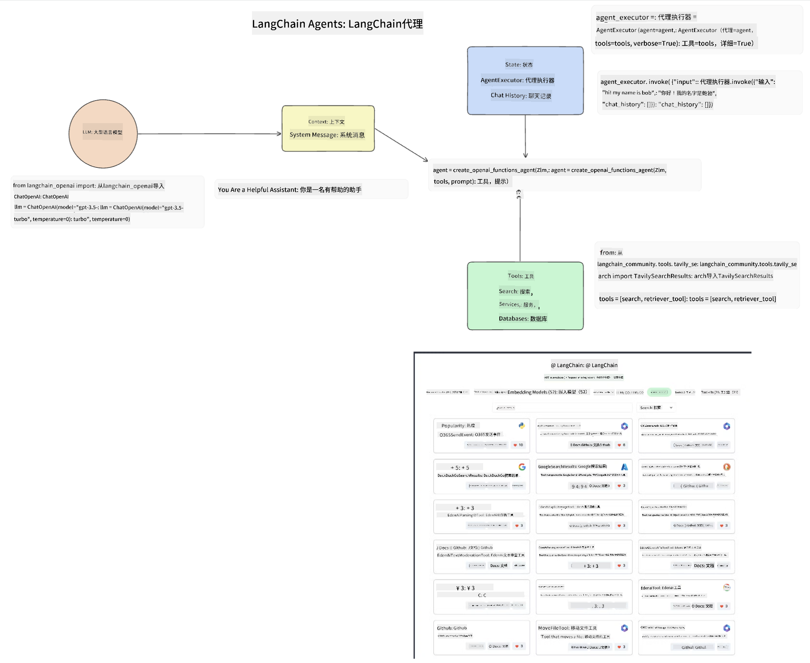
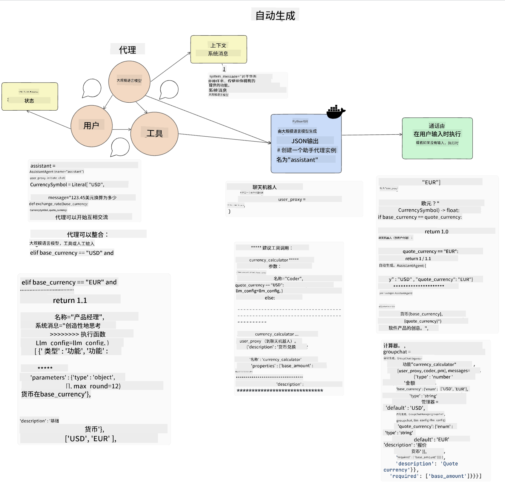
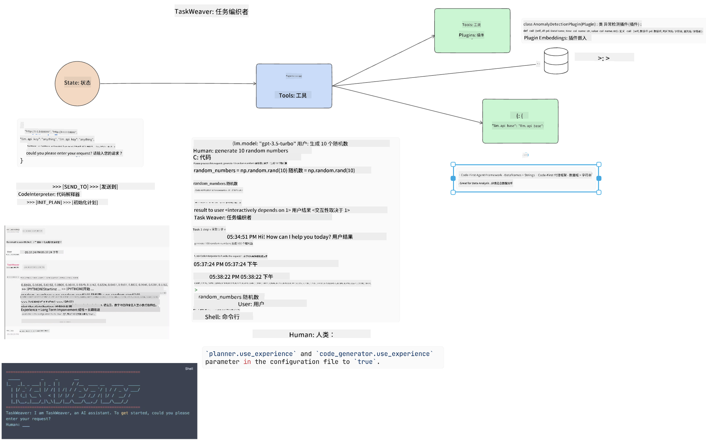
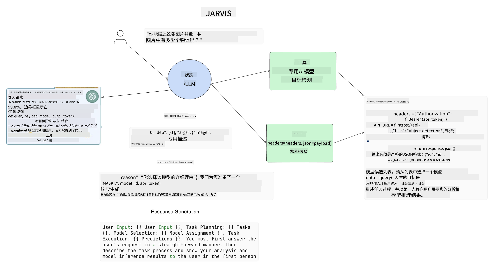

<!--
CO_OP_TRANSLATOR_METADATA:
{
  "original_hash": "11f03c81f190d9cbafd0f977dcbede6c",
  "translation_date": "2025-05-20T07:09:53+00:00",
  "source_file": "17-ai-agents/README.md",
  "language_code": "zh"
}
-->
[](https://aka.ms/gen-ai-lesson17-gh?WT.mc_id=academic-105485-koreyst)

## 介绍

AI代理是生成式AI中的一个令人兴奋的发展，使大型语言模型（LLM）从助手演变为能够采取行动的代理。AI代理框架使开发者能够创建应用程序，让LLM可以访问工具和状态管理。这些框架还增强了可见性，允许用户和开发者监控LLM计划的行动，从而改善体验管理。

本课将涵盖以下领域：

- 理解AI代理是什么 - AI代理究竟是什么？
- 探索四种不同的AI代理框架 - 它们有什么独特之处？
- 将这些AI代理应用于不同的用例 - 什么时候应该使用AI代理？

## 学习目标

完成本课后，你将能够：

- 解释AI代理是什么以及如何使用它们。
- 了解一些流行的AI代理框架之间的差异，以及它们如何不同。
- 理解AI代理的工作原理，以便用它们构建应用程序。

## 什么是AI代理？

AI代理在生成式AI领域是一个非常令人兴奋的领域。伴随着这种兴奋，有时也会对术语及其应用产生困惑。为了简单并涵盖大多数提到AI代理的工具，我们将使用以下定义：

AI代理通过为大型语言模型（LLM）提供访问**状态**和**工具**的能力来执行任务。


让我们定义这些术语：

**大型语言模型** - 这些是本课程中提到的模型，如GPT-3.5、GPT-4、Llama-2等。

**状态** - 这指的是LLM工作的上下文。LLM使用其过去行动和当前上下文的上下文，指导其后续行动的决策。AI代理框架使开发者更容易维护这种上下文。

**工具** - 为了完成用户请求的任务以及LLM计划的任务，LLM需要访问工具。一些工具的例子可以是数据库、API、外部应用程序，甚至是另一个LLM！

这些定义希望能为你在我们探讨其实现方式时打下良好的基础。让我们探索几个不同的AI代理框架：

## LangChain代理

[LangChain代理](https://python.langchain.com/docs/how_to/#agents?WT.mc_id=academic-105485-koreyst)是我们上面提供的定义的一个实现。

为了管理**状态**，它使用一个内置函数，称为`AgentExecutor`。它接受定义的`agent`和可用的`tools`。

`Agent Executor`还存储聊天记录，以提供聊天的上下文。



LangChain提供了一个[工具目录](https://integrations.langchain.com/tools?WT.mc_id=academic-105485-koreyst)，可以导入到你的应用程序中，让LLM可以访问。这些工具由社区和LangChain团队制作。

然后，你可以定义这些工具并将它们传递给`Agent Executor`。

可见性是讨论AI代理时的另一个重要方面。对于应用程序开发者来说，了解LLM正在使用哪个工具以及为什么使用它是很重要的。为此，LangChain团队开发了LangSmith。

## AutoGen

我们将讨论的下一个AI代理框架是[AutoGen](https://microsoft.github.io/autogen/?WT.mc_id=academic-105485-koreyst)。AutoGen的主要关注点是对话。代理既可以**对话**又可以**自定义**。

**对话 -** LLM可以启动并继续与另一个LLM的对话，以完成任务。这是通过创建`AssistantAgents`并为它们提供特定的系统消息来完成的。

```python

autogen.AssistantAgent( name="Coder", llm_config=llm_config, ) pm = autogen.AssistantAgent( name="Product_manager", system_message="Creative in software product ideas.", llm_config=llm_config, )

```

**自定义** - 代理不仅可以定义为LLM，还可以是用户或工具。作为开发者，你可以定义一个`UserProxyAgent`，负责与用户互动以获取反馈以完成任务。这个反馈可以继续任务的执行或停止它。

```python
user_proxy = UserProxyAgent(name="user_proxy")
```

### 状态和工具

为了改变和管理状态，助手代理生成Python代码来完成任务。

以下是该过程的一个例子：



#### 使用系统消息定义的LLM

```python
system_message="For weather related tasks, only use the functions you have been provided with. Reply TERMINATE when the task is done."
```

这个系统消息指导这个特定的LLM哪些功能与其任务相关。记住，使用AutoGen你可以定义多个具有不同系统消息的助手代理。

#### 用户启动聊天

```python
user_proxy.initiate_chat( chatbot, message="I am planning a trip to NYC next week, can you help me pick out what to wear? ", )

```

来自user_proxy（人类）的这个消息将启动代理探索其应该执行的可能功能的过程。

#### 执行功能

```bash
chatbot (to user_proxy):

***** Suggested tool Call: get_weather ***** Arguments: {"location":"New York City, NY","time_periond:"7","temperature_unit":"Celsius"} ******************************************************** --------------------------------------------------------------------------------

>>>>>>>> EXECUTING FUNCTION get_weather... user_proxy (to chatbot): ***** Response from calling function "get_weather" ***** 112.22727272727272 EUR ****************************************************************

```

一旦初始聊天被处理，代理将发送建议的工具调用。在这种情况下，它是一个名为`get_weather`. Depending on your configuration, this function can be automatically executed and read by the Agent or can be executed based on user input.

You can find a list of [AutoGen code samples](https://microsoft.github.io/autogen/docs/Examples/?WT.mc_id=academic-105485-koreyst) to further explore how to get started building.

## Taskweaver

The next agent framework we will explore is [Taskweaver](https://microsoft.github.io/TaskWeaver/?WT.mc_id=academic-105485-koreyst). It is known as a "code-first" agent because instead of working strictly with `strings` , it can work with DataFrames in Python. This becomes extremely useful for data analysis and generation tasks. This can be things like creating graphs and charts or generating random numbers.

### State and Tools

To manage the state of the conversation, TaskWeaver uses the concept of a `Planner`. The `Planner` is a LLM that takes the request from the users and maps out the tasks that need to be completed to fulfill this request.

To complete the tasks the `Planner` is exposed to the collection of tools called `Plugins`的功能。这可以是Python类或通用代码解释器。这个插件存储为嵌入，以便LLM可以更好地搜索正确的插件。



以下是处理异常检测的插件示例：

```python
class AnomalyDetectionPlugin(Plugin): def __call__(self, df: pd.DataFrame, time_col_name: str, value_col_name: str):
```

在执行之前会验证代码。Taskweaver中管理上下文的另一个特性是`experience`. Experience allows for the context of a conversation to be stored over to the long term in a YAML file. This can be configured so that the LLM improves over time on certain tasks given that it is exposed to prior conversations.

## JARVIS

The last agent framework we will explore is [JARVIS](https://github.com/microsoft/JARVIS?tab=readme-ov-file?WT.mc_id=academic-105485-koreyst). What makes JARVIS unique is that it uses an LLM to manage the `state`的对话和`tools`是其他AI模型。每个AI模型都是执行某些任务的专门模型，如对象检测、转录或图像字幕。



LLM作为一个通用模型，接收用户的请求并识别完成任务所需的特定任务和任何参数/数据。

```python
[{"task": "object-detection", "id": 0, "dep": [-1], "args": {"image": "e1.jpg" }}]
```

然后，LLM以专用AI模型可以解释的方式格式化请求，例如JSON。一旦AI模型根据任务返回其预测，LLM就会接收响应。

如果需要多个模型来完成任务，它还会在将它们组合在一起生成对用户的响应之前解释这些模型的响应。

下面的示例显示了当用户请求图片中对象的描述和数量时，这将如何工作：

## 作业

要继续学习AI代理，你可以使用AutoGen构建：

- 一个模拟教育初创公司不同部门的业务会议的应用程序。
- 创建系统消息，引导LLM理解不同的角色和优先级，并使用户能够推销一个新产品创意。
- 然后，LLM应该生成来自每个部门的后续问题，以完善和改进推销和产品创意。

## 学习不会止步于此，继续旅程

完成本课后，请查看我们的[生成式AI学习合集](https://aka.ms/genai-collection?WT.mc_id=academic-105485-koreyst)，继续提升你的生成式AI知识！

**免责声明**：  
本文档使用AI翻译服务[Co-op Translator](https://github.com/Azure/co-op-translator)进行翻译。虽然我们努力确保准确性，但请注意，自动翻译可能包含错误或不准确之处。应将原始文档的本地语言版本视为权威来源。对于关键信息，建议使用专业人工翻译。对于因使用此翻译而产生的任何误解或误读，我们不承担责任。