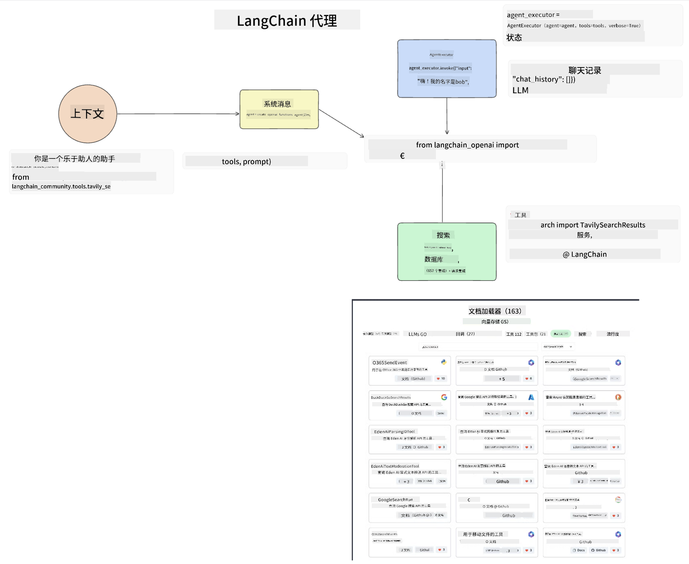
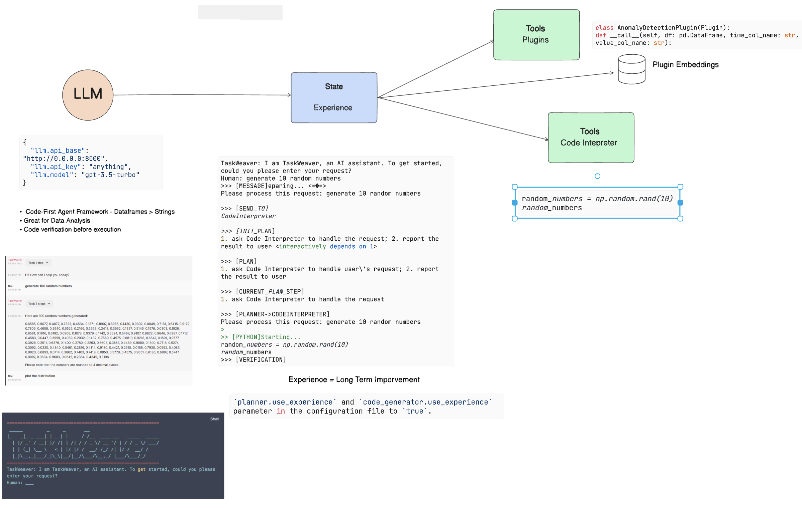

<!--
CO_OP_TRANSLATOR_METADATA:
{
  "original_hash": "11f03c81f190d9cbafd0f977dcbede6c",
  "translation_date": "2025-07-09T17:19:50+00:00",
  "source_file": "17-ai-agents/README.md",
  "language_code": "zh"
}
-->
[](https://aka.ms/gen-ai-lesson17-gh?WT.mc_id=academic-105485-koreyst)

## 介绍

AI Agents 是生成式 AI 中一个令人兴奋的发展，使大型语言模型（LLMs）从助手进化为能够执行动作的代理。AI Agent 框架使开发者能够创建让 LLM 访问工具和状态管理的应用程序。这些框架还增强了可视化，允许用户和开发者监控 LLM 计划的动作，从而提升体验管理。

本课将涵盖以下内容：

- 了解什么是 AI Agent —— AI Agent 究竟是什么？
- 探索四种不同的 AI Agent 框架 —— 它们各自有什么独特之处？
- 将这些 AI Agents 应用于不同的用例 —— 什么时候应该使用 AI Agents？

## 学习目标

完成本课后，你将能够：

- 解释什么是 AI Agents 以及它们的应用方式。
- 理解一些流行 AI Agent 框架之间的差异及其不同之处。
- 了解 AI Agents 的工作原理，以便构建相关应用。

## 什么是 AI Agents？

AI Agents 是生成式 AI 领域中非常令人兴奋的方向。随着兴奋而来的是术语和应用上的一些混淆。为了简化并涵盖大多数称为 AI Agents 的工具，我们采用以下定义：

AI Agents 允许大型语言模型（LLMs）通过访问**状态**和**工具**来执行任务。


让我们定义这些术语：

**大型语言模型** —— 指本课程中提到的模型，如 GPT-3.5、GPT-4、Llama-2 等。

**状态** —— 指 LLM 所处的上下文。LLM 利用其过去动作的上下文和当前上下文，指导后续动作的决策。AI Agent 框架使开发者更容易维护这种上下文。

**工具** —— 为完成用户请求且 LLM 规划的任务，LLM 需要访问工具。工具的例子包括数据库、API、外部应用程序，甚至是另一个 LLM！

这些定义将为后续的实现方式提供良好基础。接下来我们来看看几种不同的 AI Agent 框架：

## LangChain Agents

[LangChain Agents](https://python.langchain.com/docs/how_to/#agents?WT.mc_id=academic-105485-koreyst) 是上述定义的一个实现。

为了管理**状态**，它使用了一个内置函数 `AgentExecutor`。该函数接受定义好的 `agent` 和可用的 `tools`。

`AgentExecutor` 还会存储聊天历史，以提供聊天的上下文。



LangChain 提供了一个[工具目录](https://integrations.langchain.com/tools?WT.mc_id=academic-105485-koreyst)，可以导入到你的应用中供 LLM 访问。这些工具由社区和 LangChain 团队共同制作。

你可以定义这些工具并传递给 `AgentExecutor`。

在谈论 AI Agents 时，可视化是另一个重要方面。应用开发者需要了解 LLM 正在使用哪个工具以及原因。为此，LangChain 团队开发了 LangSmith。

## AutoGen

接下来介绍的 AI Agent 框架是 [AutoGen](https://microsoft.github.io/autogen/?WT.mc_id=academic-105485-koreyst)。AutoGen 的主要关注点是对话。Agents 既是**可对话的**，又是**可定制的**。

**可对话的** —— LLM 可以与另一个 LLM 开始并持续对话，以完成任务。这是通过创建 `AssistantAgents` 并赋予它们特定的系统消息实现的。

```python

autogen.AssistantAgent( name="Coder", llm_config=llm_config, ) pm = autogen.AssistantAgent( name="Product_manager", system_message="Creative in software product ideas.", llm_config=llm_config, )

```

**可定制的** —— Agents 不仅可以定义为 LLM，还可以是用户或工具。作为开发者，你可以定义一个 `UserProxyAgent`，负责与用户交互以获取完成任务的反馈。该反馈可以继续执行任务或终止任务。

```python
user_proxy = UserProxyAgent(name="user_proxy")
```

### 状态和工具

为了更改和管理状态，助手 Agent 会生成 Python 代码来完成任务。

以下是该过程的示例：


#### 使用系统消息定义 LLM

```python
system_message="For weather related tasks, only use the functions you have been provided with. Reply TERMINATE when the task is done."
```

该系统消息指示特定 LLM 哪些函数与其任务相关。记住，使用 AutoGen 你可以定义多个带有不同系统消息的 AssistantAgents。

#### 聊天由用户发起

```python
user_proxy.initiate_chat( chatbot, message="I am planning a trip to NYC next week, can you help me pick out what to wear? ", )

```

来自 user_proxy（人类）的消息将启动 Agent 探索应执行的可能函数的过程。

#### 执行函数

```bash
chatbot (to user_proxy):

***** Suggested tool Call: get_weather ***** Arguments: {"location":"New York City, NY","time_periond:"7","temperature_unit":"Celsius"} ******************************************************** --------------------------------------------------------------------------------

>>>>>>>> EXECUTING FUNCTION get_weather... user_proxy (to chatbot): ***** Response from calling function "get_weather" ***** 112.22727272727272 EUR ****************************************************************

```

初始聊天处理后，Agent 会发送建议调用的工具。在此例中，是名为 `get_weather` 的函数。根据配置，该函数可以自动执行并由 Agent 读取，或根据用户输入执行。

你可以查看[AutoGen 代码示例](https://microsoft.github.io/autogen/docs/Examples/?WT.mc_id=academic-105485-koreyst)，进一步了解如何开始构建。

## Taskweaver

接下来我们将探索的代理框架是 [Taskweaver](https://microsoft.github.io/TaskWeaver/?WT.mc_id=academic-105485-koreyst)。它被称为“代码优先”代理，因为它不仅处理 `strings`，还能处理 Python 中的 DataFrames。这在数据分析和生成任务中非常有用，比如创建图表或生成随机数。

### 状态和工具

为了管理对话状态，TaskWeaver 使用了 `Planner` 概念。`Planner` 是一个 LLM，接收用户请求并规划完成该请求所需的任务。

为了完成任务，`Planner` 可以访问称为 `Plugins` 的工具集合。这些可以是 Python 类或通用代码解释器。插件以嵌入向量形式存储，便于 LLM 更好地搜索正确的插件。



以下是一个处理异常检测的插件示例：

```python
class AnomalyDetectionPlugin(Plugin): def __call__(self, df: pd.DataFrame, time_col_name: str, value_col_name: str):
```

代码在执行前会被验证。Taskweaver 管理上下文的另一个功能是 `experience`。Experience 允许将对话上下文长期存储在 YAML 文件中。这样配置后，LLM 在接触到之前的对话时，能随着时间推移在某些任务上不断改进。

## JARVIS

我们将探索的最后一个代理框架是 [JARVIS](https://github.com/microsoft/JARVIS?tab=readme-ov-file?WT.mc_id=academic-105485-koreyst)。JARVIS 的独特之处在于它使用 LLM 来管理对话的 `state`，而 `tools` 则是其他 AI 模型。每个 AI 模型都是专门执行某些任务的模型，如目标检测、转录或图像描述。


作为通用模型的 LLM 接收用户请求，识别具体任务及完成任务所需的参数/数据。

```python
[{"task": "object-detection", "id": 0, "dep": [-1], "args": {"image": "e1.jpg" }}]
```

然后 LLM 将请求格式化为专门 AI 模型能理解的形式，如 JSON。AI 模型基于任务返回预测结果后，LLM 会接收该响应。

如果完成任务需要多个模型，LLM 还会解释这些模型的响应，然后整合生成对用户的回复。

下面的示例展示了当用户请求对图片中的物体进行描述和计数时的工作流程：

## 练习

为了继续学习 AI Agents，你可以使用 AutoGen 构建：

- 一个模拟教育创业公司不同部门商务会议的应用。
- 创建系统消息，引导 LLM 理解不同角色和优先级，并让用户推介新产品创意。
- LLM 应根据各部门提出的后续问题，完善和改进推介和产品创意。

## 学习永不止步，继续前行

完成本课后，欢迎查看我们的[生成式 AI 学习合集](https://aka.ms/genai-collection?WT.mc_id=academic-105485-koreyst)，持续提升你的生成式 AI 知识！

**免责声明**：  
本文件使用 AI 翻译服务 [Co-op Translator](https://github.com/Azure/co-op-translator) 进行翻译。虽然我们力求准确，但请注意自动翻译可能包含错误或不准确之处。原始文件的母语版本应被视为权威来源。对于重要信息，建议使用专业人工翻译。对于因使用本翻译而产生的任何误解或误释，我们不承担任何责任。