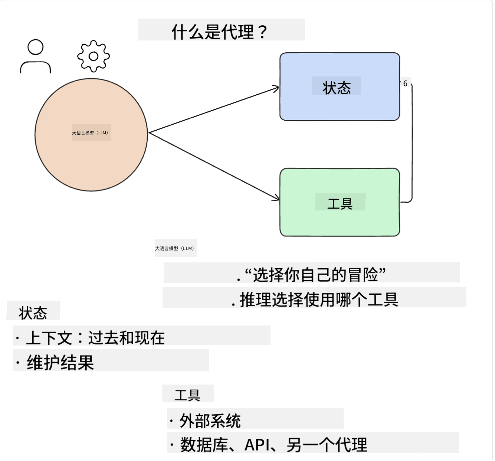
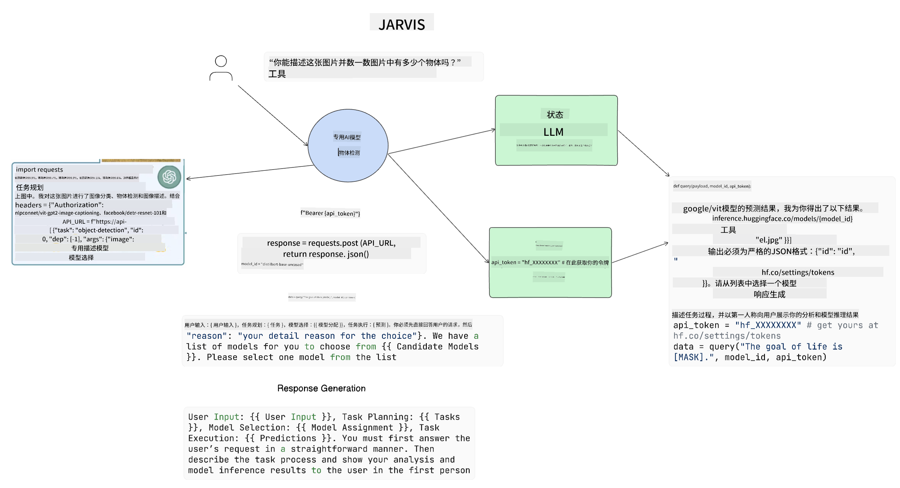

<!--
CO_OP_TRANSLATOR_METADATA:
{
  "original_hash": "8e8d1f6a63da606af7176a87ff8e92b6",
  "translation_date": "2025-10-17T23:26:59+00:00",
  "source_file": "17-ai-agents/README.md",
  "language_code": "zh"
}
-->
[](https://youtu.be/yAXVW-lUINc?si=bOtW9nL6jc3XJgOM)

## 简介

AI代理是生成式AI领域的一项令人兴奋的发展，它使大型语言模型（LLMs）从助手进化为能够采取行动的代理。AI代理框架使开发者能够创建应用程序，为LLMs提供工具和状态管理。这些框架还增强了可见性，使用户和开发者能够监控LLMs计划的行动，从而改善体验管理。

本课程将涵盖以下内容：

- 了解什么是AI代理——AI代理究竟是什么？
- 探索四种不同的AI代理框架——它们的独特之处是什么？
- 将这些AI代理应用于不同的使用场景——什么时候应该使用AI代理？

## 学习目标

完成本课程后，您将能够：

- 解释什么是AI代理以及如何使用它们。
- 了解一些流行的AI代理框架之间的差异及其不同之处。
- 理解AI代理的工作原理，以便使用它们构建应用程序。

## 什么是AI代理？

AI代理是生成式AI领域一个非常令人兴奋的领域。随着这种兴奋，有时也会出现术语和应用的混淆。为了简单起见，并涵盖大多数提到AI代理的工具，我们将使用以下定义：

AI代理通过为大型语言模型（LLMs）提供**状态**和**工具**，使其能够执行任务。



让我们定义这些术语：

**大型语言模型** - 这些是本课程中提到的模型，例如GPT-3.5、GPT-4、Llama-2等。

**状态** - 这是指LLM正在处理的上下文。LLM使用其过去行动的上下文和当前上下文，指导其后续行动的决策。AI代理框架使开发者更容易维护这种上下文。

**工具** - 为了完成用户请求的任务以及LLM计划的任务，LLM需要访问工具。一些工具的例子包括数据库、API、外部应用程序甚至另一个LLM！

这些定义希望能为您提供良好的基础，接下来我们将探讨它们的实现方式。让我们来看看几种不同的AI代理框架：

## LangChain代理

[LangChain代理](https://python.langchain.com/docs/how_to/#agents?WT.mc_id=academic-105485-koreyst)是我们上面提供的定义的一个实现。

为了管理**状态**，它使用了一个内置函数`AgentExecutor`。该函数接受定义的`agent`和可用的`tools`。

`AgentExecutor`还存储聊天记录，以提供聊天的上下文。


LangChain提供了一个[工具目录](https://integrations.langchain.com/tools?WT.mc_id=academic-105485-koreyst)，可以导入到您的应用程序中，使LLM能够访问。这些工具由社区和LangChain团队创建。

然后，您可以定义这些工具并将它们传递给`AgentExecutor`。

在讨论AI代理时，可见性是另一个重要方面。对于应用程序开发者来说，了解LLM正在使用哪个工具以及为什么使用它是很重要的。为此，LangChain团队开发了LangSmith。

## AutoGen

接下来我们将讨论的AI代理框架是[AutoGen](https://microsoft.github.io/autogen/?WT.mc_id=academic-105485-koreyst)。AutoGen的主要关注点是对话。代理既可以**进行对话**，也可以**定制化**。

**进行对话 -** LLM可以开始并继续与另一个LLM的对话，以完成任务。这是通过创建`AssistantAgents`并为其提供特定的系统消息来实现的。

```python

autogen.AssistantAgent( name="Coder", llm_config=llm_config, ) pm = autogen.AssistantAgent( name="Product_manager", system_message="Creative in software product ideas.", llm_config=llm_config, )

```

**定制化** - 代理不仅可以定义为LLM，还可以定义为用户或工具。作为开发者，您可以定义一个`UserProxyAgent`，负责与用户交互以获取完成任务的反馈。此反馈可以继续执行任务或停止任务。

```python
user_proxy = UserProxyAgent(name="user_proxy")
```

### 状态和工具

为了改变和管理状态，助手代理生成Python代码来完成任务。

以下是流程的一个示例：


#### 使用系统消息定义LLM

```python
system_message="For weather related tasks, only use the functions you have been provided with. Reply TERMINATE when the task is done."
```

此系统消息指示特定LLM哪些功能与其任务相关。请记住，使用AutoGen，您可以定义多个具有不同系统消息的AssistantAgents。

#### 用户启动聊天

```python
user_proxy.initiate_chat( chatbot, message="I am planning a trip to NYC next week, can you help me pick out what to wear? ", )

```

来自user_proxy（人类）的消息将启动代理探索其应执行的可能功能的过程。

#### 执行功能

```bash
chatbot (to user_proxy):

***** Suggested tool Call: get_weather ***** Arguments: {"location":"New York City, NY","time_periond:"7","temperature_unit":"Celsius"} ******************************************************** --------------------------------------------------------------------------------

>>>>>>>> EXECUTING FUNCTION get_weather... user_proxy (to chatbot): ***** Response from calling function "get_weather" ***** 112.22727272727272 EUR ****************************************************************

```

一旦初始聊天被处理，代理将建议调用的工具。在这种情况下，它是一个名为`get_weather`的功能。根据您的配置，此功能可以由代理自动执行和读取，也可以根据用户输入执行。

您可以在[AutoGen代码示例](https://microsoft.github.io/autogen/docs/Examples/?WT.mc_id=academic-105485-koreyst)中找到更多示例，进一步探索如何开始构建。

## Taskweaver

接下来我们将探讨的代理框架是[Taskweaver](https://microsoft.github.io/TaskWeaver/?WT.mc_id=academic-105485-koreyst)。它被称为“代码优先”代理，因为它不仅可以处理`字符串`，还可以处理Python中的DataFrame。这在数据分析和生成任务中非常有用，例如创建图表或生成随机数。

### 状态和工具

为了管理对话的状态，Taskweaver使用了`Planner`的概念。`Planner`是一个LLM，它接受用户的请求并规划完成该请求所需的任务。

为了完成任务，`Planner`可以访问称为`Plugins`的工具集合。这些工具可以是Python类或通用代码解释器。这些插件以嵌入的形式存储，以便LLM更好地搜索正确的插件。


以下是一个处理异常检测的插件示例：

```python
class AnomalyDetectionPlugin(Plugin): def __call__(self, df: pd.DataFrame, time_col_name: str, value_col_name: str):
```

代码在执行前会被验证。Taskweaver中管理上下文的另一个功能是`experience`。`experience`允许对话的上下文长期存储在一个YAML文件中。可以配置使LLM在某些任务上随着暴露于之前的对话而逐渐改进。

## JARVIS

最后一个我们将探讨的代理框架是[JARVIS](https://github.com/microsoft/JARVIS?tab=readme-ov-file?WT.mc_id=academic-105485-koreyst)。JARVIS的独特之处在于它使用LLM来管理对话的`状态`，而`工具`则是其他AI模型。每个AI模型都是专门的模型，用于执行某些任务，例如对象检测、转录或图像描述。



LLM作为通用模型，接收用户的请求并识别完成任务所需的具体任务及任何参数/数据。

```python
[{"task": "object-detection", "id": 0, "dep": [-1], "args": {"image": "e1.jpg" }}]
```

LLM随后以专门的AI模型可以解释的格式（如JSON）来格式化请求。一旦AI模型根据任务返回预测，LLM会接收响应。

如果完成任务需要多个模型，它还会解释这些模型的响应，然后将它们整合起来生成用户的最终响应。

以下示例展示了当用户请求描述和统计图片中的对象时的工作流程：

## 作业

为了继续学习AI代理，您可以使用AutoGen构建：

- 一个模拟教育初创公司不同部门业务会议的应用程序。
- 创建系统消息，引导LLMs理解不同的角色和优先级，并使用户能够推销一个新产品创意。
- LLM随后应生成每个部门的后续问题，以完善和改进推销和产品创意。

## 学习不会止步于此，继续您的学习之旅

完成本课程后，请查看我们的[生成式AI学习合集](https://aka.ms/genai-collection?WT.mc_id=academic-105485-koreyst)，继续提升您的生成式AI知识！

---

**免责声明**：  
本文档使用AI翻译服务[Co-op Translator](https://github.com/Azure/co-op-translator)进行翻译。尽管我们努力确保翻译的准确性，但请注意，自动翻译可能包含错误或不准确之处。原始语言的文档应被视为权威来源。对于重要信息，建议使用专业人工翻译。我们不对因使用此翻译而产生的任何误解或误读承担责任。