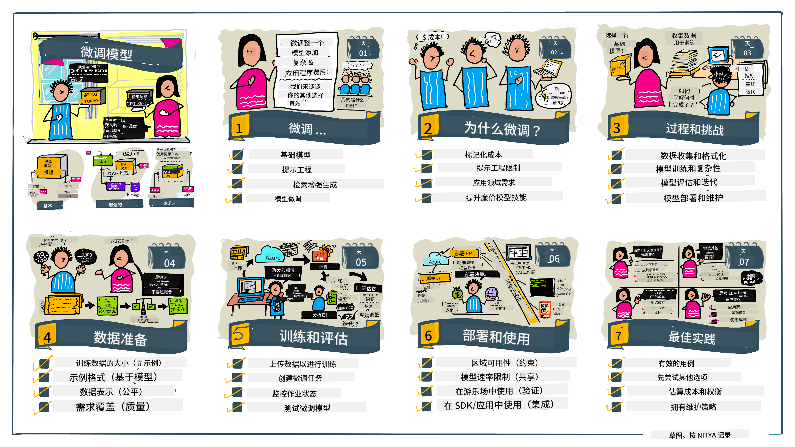

<!--
CO_OP_TRANSLATOR_METADATA:
{
  "original_hash": "68664f7e754a892ae1d8d5e2b7bd2081",
  "translation_date": "2025-05-20T07:38:14+00:00",
  "source_file": "18-fine-tuning/README.md",
  "language_code": "zh"
}
-->

# 微调您的大型语言模型

使用大型语言模型来构建生成式 AI 应用程序带来了新的挑战。一个关键问题是确保模型为给定用户请求生成的内容的响应质量（准确性和相关性）。在之前的课程中，我们讨论了通过修改现有模型的提示输入来解决问题的技术，如提示工程和检索增强生成。

在今天的课程中，我们讨论第三种技术，即**微调**，它通过使用额外的数据重新训练模型本身来解决挑战。让我们深入了解细节。

## 学习目标

本课程介绍了预训练语言模型的微调概念，探讨了这种方法的优点和挑战，并提供了何时以及如何使用微调来提高生成式 AI 模型性能的指导。

在本课程结束时，您应该能够回答以下问题：

- 什么是语言模型的微调？
- 什么时候以及为什么微调有用？
- 我如何微调预训练模型？
- 微调的局限性是什么？

准备好了吗？让我们开始吧。

## 图解指南

想在深入学习之前了解我们将要覆盖的内容吗？查看这个描述本课程学习旅程的图解指南 - 从学习微调的核心概念和动机，到理解执行微调任务的过程和最佳实践。这是一个引人入胜的探索主题，所以别忘了查看[资源](./RESOURCES.md?WT.mc_id=academic-105485-koreyst)页面以获取支持您自学之旅的额外链接！

## 什么是语言模型的微调？

根据定义，大型语言模型是从包括互联网在内的多种来源的大量文本中进行_预训练_的。正如我们在之前的课程中所学，我们需要像_提示工程_和_检索增强生成_这样的技术来提高模型对用户问题（“提示”）的响应质量。

一种流行的提示工程技术涉及通过提供_指令_（显性指导）或_给出几个示例_（隐性指导）来为模型提供更多关于期望响应的指导。这被称为_少样本学习_，但它有两个局限性：

- 模型的令牌限制可能会限制您可以提供的示例数量，并限制其有效性。
- 模型的令牌成本可能会使在每个提示中添加示例变得昂贵，并限制灵活性。

微调是机器学习系统中的一种常见做法，我们通过使用新数据重新训练预训练模型来提高其在特定任务上的性能。在语言模型的背景下，我们可以使用为给定任务或应用领域精心挑选的示例来微调预训练模型，以创建一个可能在该特定任务或领域上更准确和相关的**自定义模型**。微调的一个副作用是，它还可以减少少样本学习所需的示例数量，从而减少令牌使用和相关成本。

## 我们什么时候以及为什么要微调模型？

在_这个_背景下，当我们谈论微调时，我们指的是**监督**微调，其中通过添加原始训练数据集中未包含的新数据来进行重新训练。这与无监督微调方法不同，后者是使用不同的超参数在原始数据上重新训练模型。

需要记住的关键是，微调是一种高级技术，需要一定水平的专业知识才能获得预期的结果。如果操作不当，它可能无法提供预期的改进，甚至可能降低模型在目标领域的性能。

因此，在您学习“如何”微调语言模型之前，您需要知道“为什么”您应该选择这种方法，以及“何时”开始微调过程。首先问自己这些问题：

- **用例**：您的微调_用例_是什么？您想改进当前预训练模型的哪个方面？
- **替代方案**：您是否尝试过_其他技术_来实现所需的结果？使用它们来创建比较的基准。
  - 提示工程：尝试使用相关提示响应示例进行少样本提示技术。评估响应的质量。
  - 检索增强生成：尝试通过搜索您的数据检索的查询结果来增强提示。评估响应的质量。
- **成本**：您是否确定了微调的成本？
  - 可调性 - 预训练模型是否可供微调？
  - 努力 - 准备训练数据、评估和改进模型的努力。
  - 计算 - 运行微调作业和部署微调模型的计算成本
  - 数据 - 获取足够质量的示例以影响微调
- **收益**：您是否确认了微调的收益？
  - 质量 - 微调后的模型是否优于基准？
  - 成本 - 通过简化提示来减少令牌使用吗？
  - 可扩展性 - 您能否将基础模型重新用于新领域？

通过回答这些问题，您应该能够决定微调是否适合您的用例。理想情况下，只有当收益超过成本时，这种方法才有效。一旦您决定继续，就该考虑如何微调预训练模型了。

想要获得更多关于决策过程的见解吗？观看[是否微调](https://www.youtube.com/watch?v=0Jo-z-MFxJs)

## 我们如何微调预训练模型？

要微调预训练模型，您需要：

- 一个用于微调的预训练模型
- 用于微调的数据集
- 用于运行微调作业的训练环境
- 用于部署微调模型的托管环境

## 微调实战

以下资源提供了逐步教程，引导您通过使用精选数据集的实际示例。要完成这些教程，您需要在特定提供商处拥有一个账户，并能够访问相关模型和数据集。

| 提供商       | 教程                                                                                                                                                                       | 描述                                                                                                                                                                                                                                                                                                                                                                                                                        |
| ------------ | ------------------------------------------------------------------------------------------------------------------------------------------------------------------------ | ---------------------------------------------------------------------------------------------------------------------------------------------------------------------------------------------------------------------------------------------------------------------------------------------------------------------------------------------------------------------------------------------------------------------------------- |
| OpenAI       | [如何微调聊天模型](https://github.com/openai/openai-cookbook/blob/main/examples/How_to_finetune_chat_models.ipynb?WT.mc_id=academic-105485-koreyst)                | 学习如何通过准备训练数据、运行微调作业，并使用微调后的模型进行推理来微调`gpt-35-turbo`以适应特定领域（“食谱助手”）。                                                                                                                                                                                                                                              |
| Azure OpenAI | [GPT 3.5 Turbo 微调教程](https://learn.microsoft.com/azure/ai-services/openai/tutorials/fine-tune?tabs=python-new%2Ccommand-line?WT.mc_id=academic-105485-koreyst) | 学习如何在**Azure**上微调`gpt-35-turbo-0613`模型，步骤包括创建和上传训练数据、运行微调作业。部署并使用新模型。                                                                                                                                                                                                                                                                 |
| Hugging Face | [使用 Hugging Face 微调 LLMs](https://www.philschmid.de/fine-tune-llms-in-2024-with-trl?WT.mc_id=academic-105485-koreyst)                                               | 本博客文章带您微调一个_开放 LLM_（例如：`CodeLlama 7B`），使用 [transformers](https://huggingface.co/docs/transformers/index?WT.mc_id=academic-105485-koreyst) 库和 [Transformer Reinforcement Learning (TRL)](https://huggingface.co/docs/trl/index?WT.mc_id=academic-105485-koreyst]) 以及 Hugging Face 上的开放[数据集](https://huggingface.co/docs/datasets/index?WT.mc_id=academic-105485-koreyst)。 |
|              |                                                                                                                                                                          |                                                                                                                                                                                                                                                                                                                                                                                                                                    |
| 🤗 AutoTrain | [使用 AutoTrain 微调 LLMs](https://github.com/huggingface/autotrain-advanced/?WT.mc_id=academic-105485-koreyst)                                                         | AutoTrain（或 AutoTrain Advanced）是 Hugging Face 开发的一个 Python 库，允许对包括 LLM 微调在内的多种不同任务进行微调。AutoTrain 是一个无代码解决方案，可以在您自己的云、Hugging Face Spaces 或本地进行微调。它支持基于 Web 的 GUI、CLI 和通过 yaml 配置文件进行训练。                                                                               |
|              |                                                                                                                                                                          |                                                                                                                                                                                                                                                                                                                                                                                                                                    |

## 作业

选择上述教程之一并进行学习。_我们可能会在本仓库中用 Jupyter Notebooks 复制这些教程的版本，仅供参考。请直接使用原始来源以获取最新版本_。

## 出色的工作！继续您的学习。

完成本课程后，请查看我们的[生成式 AI 学习集合](https://aka.ms/genai-collection?WT.mc_id=academic-105485-koreyst)，继续提升您的生成式 AI 知识！

恭喜！您已完成本课程的 v2 系列的最后一课！不要停止学习和构建。**查看[资源](RESOURCES.md?WT.mc_id=academic-105485-koreyst)页面，获取更多关于此主题的建议。

我们的 v1 系列课程也已更新，增加了更多作业和概念。因此，请花一点时间来刷新您的知识 - 并请[分享您的问题和反馈](https://github.com/microsoft/generative-ai-for-beginners/issues?WT.mc_id=academic-105485-koreyst)，以帮助我们为社区改进这些课程。

**免责声明**：
本文档使用AI翻译服务[Co-op Translator](https://github.com/Azure/co-op-translator)进行了翻译。虽然我们努力确保准确性，但请注意，自动翻译可能包含错误或不准确之处。应将原始语言的文档视为权威来源。对于关键信息，建议使用专业人工翻译。对于因使用本翻译而产生的任何误解或误读，我们不承担责任。