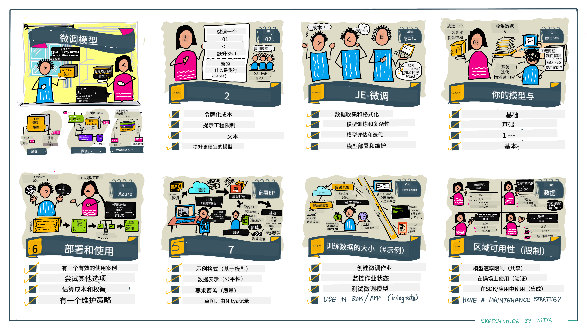

<!--
CO_OP_TRANSLATOR_METADATA:
{
  "original_hash": "68664f7e754a892ae1d8d5e2b7bd2081",
  "translation_date": "2025-06-26T00:32:48+00:00",
  "source_file": "18-fine-tuning/README.md",
  "language_code": "zh"
}
-->

# 微调你的大型语言模型

使用大型语言模型构建生成式 AI 应用程序带来了新的挑战。一个关键问题是确保模型为给定用户请求生成的内容的响应质量（准确性和相关性）。在前面的课程中，我们讨论了诸如提示工程和检索增强生成等技术，这些技术尝试通过_修改现有模型的提示输入_来解决问题。

在今天的课程中，我们讨论第三种技术，**微调**，它尝试通过使用额外数据_重新训练模型本身_来解决这一挑战。让我们深入了解细节。

## 学习目标

本课程介绍了对预训练语言模型进行微调的概念，探讨了这种方法的优缺点，并提供了何时以及如何使用微调来提高生成式 AI 模型性能的指导。

在本课程结束时，你应该能够回答以下问题：

- 什么是语言模型的微调？
- 微调在何时、为何有用？
- 我如何微调一个预训练模型？
- 微调的局限性是什么？

准备好了吗？让我们开始吧。

## 图解指南

想在深入学习之前了解我们将要讨论的内容的大致情况吗？查看这个描述本课程学习旅程的图解指南——从学习微调的核心概念和动机，到理解执行微调任务的过程和最佳实践。这是一个引人入胜的探索主题，因此不要忘记查看[资源](./RESOURCES.md?WT.mc_id=academic-105485-koreyst)页面，以获取支持你自学之旅的更多链接！

## 什么是语言模型的微调？

从定义上看，大型语言模型是在从包括互联网在内的各种来源获取的大量文本上_预训练_的。正如我们在前面的课程中所学，我们需要诸如_提示工程_和_检索增强生成_等技术来提高模型对用户问题（“提示”）的响应质量。

一种流行的提示工程技术是通过提供_指令_（显式指导）或_给出几个示例_（隐式指导）为模型提供更多期望的响应指导。这被称为_少样本学习_，但它有两个限制：

- 模型的令牌限制可能会限制你可以提供的示例数量，并限制效果。
- 模型的令牌成本可能会使每个提示添加示例变得昂贵，并限制灵活性。

微调是机器学习系统中的一种常见做法，我们采用预训练模型并用新数据重新训练它，以提高其在特定任务上的性能。在语言模型的背景下，我们可以通过_为给定任务或应用领域精心挑选的一组示例_来微调预训练模型，以创建一个可能对该特定任务或领域更准确和相关的**自定义模型**。微调的一个附带好处是，它还可以减少少样本学习所需的示例数量，从而减少令牌使用和相关成本。

## 什么时候以及为什么我们应该微调模型？

在_这个_背景下，当我们谈论微调时，我们指的是**监督**微调，其中通过**添加不属于原始训练数据集的新数据**来进行重新训练。这不同于无监督微调方法，其中模型在原始数据上重新训练，但使用不同的超参数。

需要记住的关键是，微调是一种高级技术，需要一定的专业知识才能获得预期的结果。如果操作不当，它可能无法提供预期的改进，甚至可能降低目标领域的模型性能。

因此，在学习如何微调语言模型之前，你需要知道为什么要走这条路，以及何时开始微调过程。首先问自己这些问题：

- **用例**：你的微调_用例_是什么？你希望改进当前预训练模型的哪个方面？
- **替代方案**：你是否尝试过_其他技术_来实现预期结果？使用它们创建一个比较基线。
  - 提示工程：尝试使用相关提示响应示例的少样本提示技术。评估响应质量。
  - 检索增强生成：尝试使用通过搜索数据检索的查询结果增强提示。评估响应质量。
- **成本**：你是否确定了微调的成本？
  - 可调性——预训练模型是否可用于微调？
  - 努力——用于准备训练数据、评估和优化模型。
  - 计算——用于运行微调任务和部署微调模型
  - 数据——是否有足够的高质量示例以影响微调
- **收益**：你是否确认了微调的好处？
  - 质量——微调模型是否优于基线？
  - 成本——通过简化提示是否减少了令牌使用？
  - 可扩展性——你能否将基础模型重新用于新领域？

通过回答这些问题，你应该能够决定微调是否适合你的用例。理想情况下，只有当收益大于成本时，这种方法才有效。一旦你决定继续，就该考虑如何微调预训练模型了。

想了解更多关于决策过程的见解吗？观看[微调还是不微调](https://www.youtube.com/watch?v=0Jo-z-MFxJs)

## 我们如何微调预训练模型？

要微调一个预训练模型，你需要具备：

- 一个要微调的预训练模型
- 用于微调的数据集
- 运行微调任务的训练环境
- 部署微调模型的托管环境

## 微调实践

以下资源提供了分步教程，带你通过使用精选模型和精心挑选的数据集的真实示例。要完成这些教程，你需要在特定提供商处注册账户，并访问相关的模型和数据集。

| 提供商       | 教程                                                                                                                                                                       | 描述                                                                                                                                                                                                                                                                                                                                                                                                                        |
| ------------ | ------------------------------------------------------------------------------------------------------------------------------------------------------------------------ | --------------------------------------------------------------------------------------------------------------------------------------------------------------------------------------------------------------------------------------------------------------------------------------------------------------------------------------------------------------------------------------------------------------------------- |
| OpenAI       | [如何微调聊天模型](https://github.com/openai/openai-cookbook/blob/main/examples/How_to_finetune_chat_models.ipynb?WT.mc_id=academic-105485-koreyst)                       | 了解如何通过准备训练数据、运行微调任务以及使用微调模型进行推理，微调一个`gpt-35-turbo`以适应特定领域（“食谱助手”）。                                                                                                                                                                                                                                                                    |
| Azure OpenAI | [GPT 3.5 Turbo 微调教程](https://learn.microsoft.com/azure/ai-services/openai/tutorials/fine-tune?tabs=python-new%2Ccommand-line?WT.mc_id=academic-105485-koreyst)        | 了解如何在 **Azure** 上微调一个`gpt-35-turbo-0613`模型，通过采取步骤创建和上传训练数据，运行微调任务。部署并使用新模型。                                                                                                                                                                                                                                                               |
| Hugging Face | [使用 Hugging Face 微调 LLMs](https://www.philschmid.de/fine-tune-llms-in-2024-with-trl?WT.mc_id=academic-105485-koreyst)                                                | 本博客文章带你通过使用 [transformers](https://huggingface.co/docs/transformers/index?WT.mc_id=academic-105485-koreyst) 库和 [Transformer Reinforcement Learning (TRL)](https://huggingface.co/docs/trl/index?WT.mc_id=academic-105485-koreyst]) 以及 Hugging Face 上的开放[数据集](https://huggingface.co/docs/datasets/index?WT.mc_id=academic-105485-koreyst)微调一个_开放 LLM_（例如：`CodeLlama 7B`）。 |
|              |                                                                                                                                                                          |                                                                                                                                                                                                                                                                                                                                                                                                                             |
| 🤗 AutoTrain | [使用 AutoTrain 微调 LLMs](https://github.com/huggingface/autotrain-advanced/?WT.mc_id=academic-105485-koreyst)                                                         | AutoTrain（或 AutoTrain Advanced）是 Hugging Face 开发的一个 Python 库，允许针对包括 LLM 微调在内的许多不同任务进行微调。AutoTrain 是一个无代码解决方案，可以在你自己的云中、在 Hugging Face Spaces 上或本地完成微调。它支持基于 Web 的 GUI、CLI 和通过 yaml 配置文件进行训练。                                                                                                        |
|              |                                                                                                                                                                          |                                                                                                                                                                                                                                                                                                                                                                                                                             |

## 作业

选择上述教程之一并完成它们。_我们可能会在本仓库中以 Jupyter Notebooks 的形式复制这些教程的一个版本，仅供参考。请直接使用原始来源以获取最新版本_。

## 干得好！继续你的学习。

完成本课后，请查看我们的[生成式 AI 学习合集](https://aka.ms/genai-collection?WT.mc_id=academic-105485-koreyst)以继续提升你的生成式 AI 知识！

恭喜！！你已完成本课程 v2 系列的最后一课！不要停止学习和构建。**查看[资源](RESOURCES.md?WT.mc_id=academic-105485-koreyst)页面以获取更多关于此主题的建议。

我们的 v1 系列课程也已更新了更多的作业和概念。所以花一分钟刷新你的知识——并请[分享你的问题和反馈](https://github.com/microsoft/generative-ai-for-beginners/issues?WT.mc_id=academic-105485-koreyst)以帮助我们改进这些课程，为社区服务。

**免责声明**：  
本文档使用AI翻译服务[Co-op Translator](https://github.com/Azure/co-op-translator)进行翻译。尽管我们努力确保准确性，但请注意自动翻译可能包含错误或不准确之处。应将原始语言的文档视为权威来源。对于关键信息，建议使用专业人工翻译。对于因使用此翻译而引起的任何误解或误释，我们概不负责。