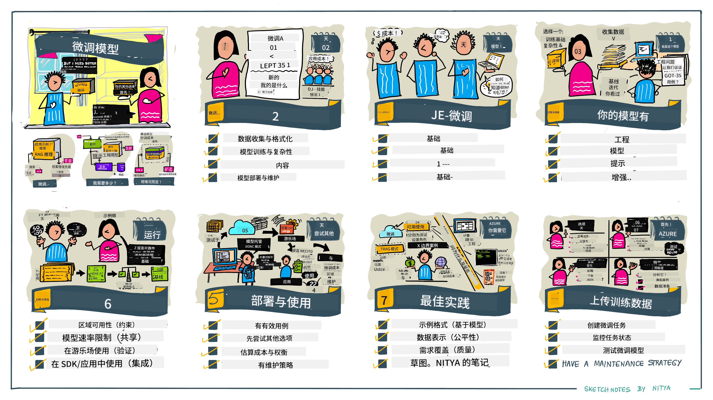

<!--
CO_OP_TRANSLATOR_METADATA:
{
  "original_hash": "807f0d9fc1747e796433534e1be6a98a",
  "translation_date": "2025-10-17T23:24:50+00:00",
  "source_file": "18-fine-tuning/README.md",
  "language_code": "zh"
}
-->

# 微调您的大语言模型（LLM）

使用大语言模型构建生成式人工智能应用程序会带来一些新的挑战。一个关键问题是确保模型根据用户请求生成的内容具有高质量（准确性和相关性）。在之前的课程中，我们讨论了诸如提示工程和检索增强生成等技术，这些技术试图通过**修改现有模型的提示输入**来解决问题。

在今天的课程中，我们将讨论第三种技术——**微调**，它试图通过使用额外的数据**重新训练模型本身**来解决这一挑战。让我们深入了解细节。

## 学习目标

本课程介绍了预训练语言模型的微调概念，探讨了这种方法的优势和挑战，并提供了关于何时以及如何使用微调来提高生成式人工智能模型性能的指导。

在课程结束时，您应该能够回答以下问题：

- 什么是语言模型的微调？
- 微调在什么情况下有用，为什么有用？
- 我如何微调一个预训练模型？
- 微调的局限性是什么？

准备好了吗？让我们开始吧。

## 图解指南

想在深入学习之前了解我们将涵盖的内容的大致框架吗？请查看这个图解指南，它描述了本课程的学习路径——从学习微调的核心概念和动机，到理解执行微调任务的过程和最佳实践。这是一个值得探索的有趣话题，所以别忘了查看[资源页面](./RESOURCES.md?WT.mc_id=academic-105485-koreyst)，以获取支持您自主学习的额外链接！

## 什么是语言模型的微调？

从定义上来说，大型语言模型是基于从互联网等多种来源获取的大量文本进行**预训练**的。正如我们在之前的课程中所学，为了提高模型对用户问题（“提示”）的响应质量，我们需要使用诸如**提示工程**和**检索增强生成**等技术。

一种流行的提示工程技术是通过提供**指令**（明确指导）或**几个示例**（隐含指导）来为模型提供更多关于期望响应的指导。这被称为**少样本学习**，但它有两个局限性：

- 模型的令牌限制可能会限制您可以提供的示例数量，从而影响效果。
- 模型的令牌成本可能会使每个提示添加示例变得昂贵，从而限制了灵活性。

微调是机器学习系统中的一种常见实践，我们通过使用新数据重新训练预训练模型来提高其在特定任务上的性能。在语言模型的背景下，我们可以通过为特定任务或应用领域**精心挑选的示例集**对预训练模型进行微调，从而创建一个**定制模型**，使其在特定任务或领域中更加准确和相关。微调的一个附带好处是，它还可以减少少样本学习所需的示例数量，从而降低令牌使用量和相关成本。

## 我们什么时候以及为什么需要微调模型？

在**这个**背景下，当我们谈论微调时，我们指的是**监督式微调**，即通过**添加新数据**（这些数据不属于原始训练数据集）来进行重新训练。这与无监督微调方法不同，后者是使用原始数据但调整不同的超参数来重新训练模型。

需要记住的关键是，微调是一种高级技术，需要一定的专业知识才能获得预期的结果。如果操作不当，它可能无法提供预期的改进，甚至可能降低模型在目标领域的性能。

因此，在学习“如何”微调语言模型之前，您需要知道“为什么”选择这种方法，以及“何时”开始微调过程。首先问自己以下问题：

- **使用场景**：您的微调**使用场景**是什么？您希望改进当前预训练模型的哪些方面？
- **替代方案**：您是否尝试过其他技术来实现预期结果？使用它们创建一个基准进行比较。
  - 提示工程：尝试使用相关提示响应示例的少样本提示技术。评估响应质量。
  - 检索增强生成：尝试通过搜索您的数据检索查询结果来增强提示。评估响应质量。
- **成本**：您是否评估过微调的成本？
  - 可调性——预训练模型是否支持微调？
  - 努力——准备训练数据、评估和优化模型所需的工作量。
  - 计算——运行微调任务和部署微调模型所需的计算资源。
  - 数据——是否有足够质量的示例来确保微调的效果。
- **收益**：您是否确认了微调的收益？
  - 质量——微调后的模型是否优于基准？
  - 成本——是否通过简化提示减少了令牌使用量？
  - 可扩展性——是否可以将基础模型重新用于新领域？

通过回答这些问题，您应该能够决定微调是否适合您的使用场景。理想情况下，只有当收益超过成本时，这种方法才是有效的。一旦您决定继续，就可以开始思考**如何**微调预训练模型。

想了解更多关于决策过程的见解？观看[是否需要微调](https://www.youtube.com/watch?v=0Jo-z-MFxJs)。

## 我们如何微调预训练模型？

要微调预训练模型，您需要具备以下条件：

- 一个可供微调的预训练模型
- 用于微调的数据集
- 用于运行微调任务的训练环境
- 用于部署微调模型的托管环境

## 微调实践

以下资源提供了分步教程，带您通过使用选定模型和精心挑选的数据集的真实示例。要完成这些教程，您需要在特定提供商处注册账户，并获得相关模型和数据集的访问权限。

| 提供商       | 教程                                                                                                                                                                       | 描述                                                                                                                                                                                                                                                                                                                                                                                                                        |
| ------------ | -------------------------------------------------------------------------------------------------------------------------------------------------------------------------- | ---------------------------------------------------------------------------------------------------------------------------------------------------------------------------------------------------------------------------------------------------------------------------------------------------------------------------------------------------------------------------------------------------------------------------------- |
| OpenAI       | [如何微调聊天模型](https://github.com/openai/openai-cookbook/blob/main/examples/How_to_finetune_chat_models.ipynb?WT.mc_id=academic-105485-koreyst)                | 学习如何为特定领域（“食谱助手”）微调`gpt-35-turbo`，包括准备训练数据、运行微调任务以及使用微调后的模型进行推理。                                                                                                                                                                                                                                              |
| Azure OpenAI | [GPT 3.5 Turbo 微调教程](https://learn.microsoft.com/azure/ai-services/openai/tutorials/fine-tune?tabs=python-new%2Ccommand-line?WT.mc_id=academic-105485-koreyst) | 学习如何在**Azure**上微调`gpt-35-turbo-0613`模型，包括创建和上传训练数据、运行微调任务、部署并使用新模型。                                                                                                                                                                                                                                                                 |
| Hugging Face | [使用Hugging Face微调LLM](https://www.philschmid.de/fine-tune-llms-in-2024-with-trl?WT.mc_id=academic-105485-koreyst)                                               | 这篇博客文章介绍了如何使用[transformers](https://huggingface.co/docs/transformers/index?WT.mc_id=academic-105485-koreyst)库和[Transformer Reinforcement Learning (TRL)](https://huggingface.co/docs/trl/index?WT.mc_id=academic-105485-koreyst)以及Hugging Face上的开放[数据集](https://huggingface.co/docs/datasets/index?WT.mc_id=academic-105485-koreyst)微调一个开放的LLM（例如`CodeLlama 7B`）。 |
|              |                                                                                                                                                                                |                                                                                                                                                                                                                                                                                                                                                                                                                                    |
| 🤗 AutoTrain | [使用AutoTrain微调LLM](https://github.com/huggingface/autotrain-advanced/?WT.mc_id=academic-105485-koreyst)                                                         | AutoTrain（或AutoTrain Advanced）是由Hugging Face开发的一个Python库，支持包括LLM微调在内的多种任务的微调。AutoTrain是一种无代码解决方案，微调可以在您自己的云端、Hugging Face Spaces或本地完成。它支持基于网页的GUI、CLI以及通过yaml配置文件进行训练。                                                                               |
|              |                                                                                                                                                                                |                                                                                                                                                                                                                                                                                                                                                                                                                                    |

## 作业

选择上述教程之一并完成学习。**我们可能会在此代码库中复制这些教程的Jupyter Notebook版本，仅供参考。请直接使用原始来源以获取最新版本**。

## 出色的工作！继续学习。

完成本课程后，请查看我们的[生成式AI学习合集](https://aka.ms/genai-collection?WT.mc_id=academic-105485-koreyst)，继续提升您的生成式AI知识！

恭喜您！您已经完成了本课程v2系列的最后一课！不要停止学习和构建。**查看[资源页面](RESOURCES.md?WT.mc_id=academic-105485-koreyst)，获取更多关于此主题的建议列表。

我们的v1系列课程也已更新，增加了更多的作业和概念。花点时间刷新您的知识——并请[分享您的问题和反馈](https://github.com/microsoft/generative-ai-for-beginners/issues?WT.mc_id=academic-105485-koreyst)，帮助我们为社区改进这些课程。

---

**免责声明**：  
本文档使用AI翻译服务[Co-op Translator](https://github.com/Azure/co-op-translator)进行翻译。尽管我们努力确保翻译的准确性，但请注意，自动翻译可能包含错误或不准确之处。原始语言的文档应被视为权威来源。对于重要信息，建议使用专业人工翻译。我们对因使用此翻译而产生的任何误解或误读不承担责任。