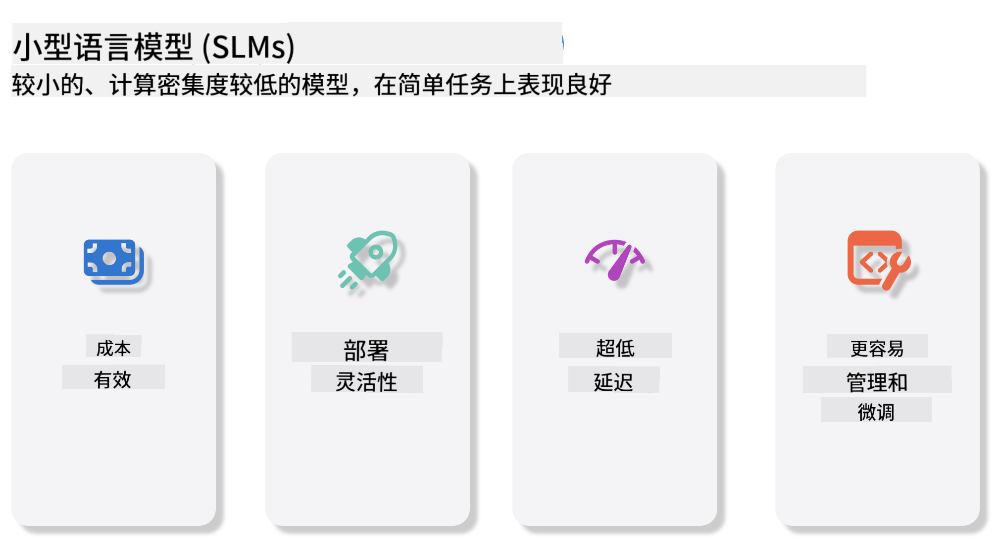
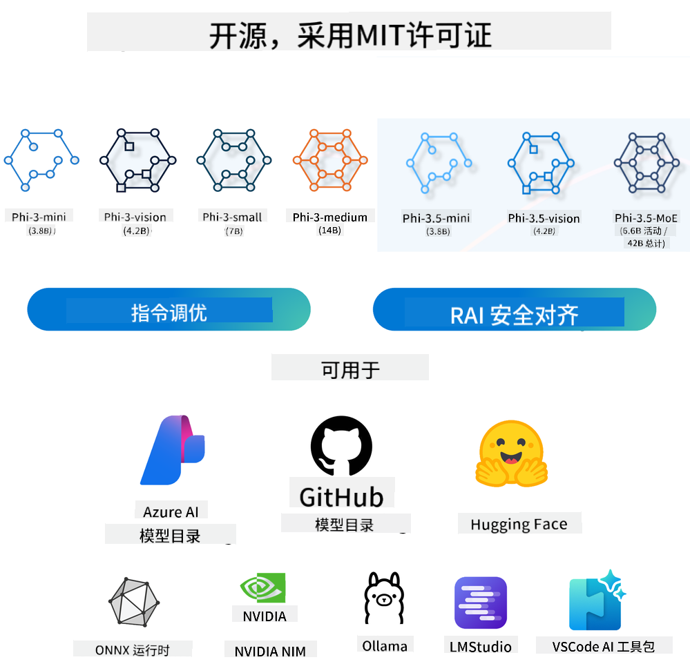
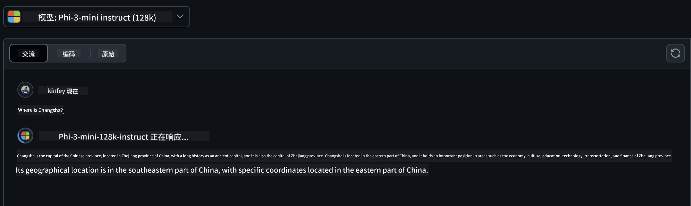
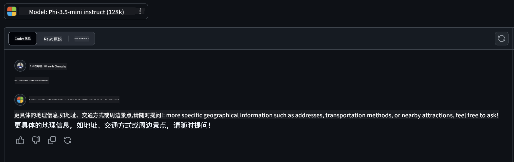

<!--
CO_OP_TRANSLATOR_METADATA:
{
  "original_hash": "124ad36cfe96f74038811b6e2bb93e9d",
  "translation_date": "2025-05-20T09:11:50+00:00",
  "source_file": "19-slm/README.md",
  "language_code": "zh"
}
-->
# 生成式AI初学者的小型语言模型简介

生成式AI是人工智能的一个迷人领域，专注于创建能够生成新内容的系统。这些内容可以从文本和图像扩展到音乐，甚至是整个虚拟环境。生成式AI最令人兴奋的应用之一是语言模型领域。

## 什么是小型语言模型？

小型语言模型（SLM）代表了一种大型语言模型（LLM）的缩小版本，利用了LLM的许多架构原则和技术，同时显著减少了计算占用。SLM是设计用于生成类似人类文本的语言模型的一个子集。与其较大的对手，如GPT-4不同，SLM更为紧凑和高效，使其成为计算资源有限的应用程序的理想选择。尽管体积较小，它们仍然可以执行各种任务。通常，SLM通过压缩或蒸馏LLM构建，旨在保留原始模型功能和语言能力的很大一部分。这种模型大小的减少降低了整体复杂性，使SLM在内存使用和计算需求方面更高效。尽管进行了这些优化，SLM仍然可以执行广泛的自然语言处理（NLP）任务：

- 文本生成：创建连贯且语境相关的句子或段落。
- 文本补全：根据给定的提示预测和完成句子。
- 翻译：将文本从一种语言转换为另一种语言。
- 摘要：将长文本浓缩成更短、更易消化的摘要。

尽管与其较大的对手相比，在性能或理解深度上有所折衷。

## 小型语言模型如何工作？

SLM是在大量文本数据上进行训练的。在训练过程中，它们学习语言的模式和结构，使它们能够生成语法正确且语境适当的文本。训练过程包括：

- 数据收集：从各种来源收集大型文本数据集。
- 预处理：清理和组织数据，使其适合训练。
- 训练：使用机器学习算法教模型如何理解和生成文本。
- 微调：调整模型以提高其在特定任务上的性能。

SLM的发展与对可以在资源受限环境中部署的模型的需求增加保持一致，如移动设备或边缘计算平台，由于其资源需求较大，完整规模的LLM可能不切实际。通过专注于效率，SLM在性能和可访问性之间取得平衡，使其能够在各个领域更广泛地应用。



## 学习目标

在本课程中，我们希望介绍SLM的知识，并将其与微软Phi-3结合，以学习文本内容、视觉和MoE的不同场景。到本课程结束时，您应该能够回答以下问题：

- 什么是SLM
- SLM和LLM有什么区别
- 什么是微软Phi-3/3.5家族
- 如何推理微软Phi-3/3.5家族

准备好了吗？让我们开始吧。

## 大型语言模型（LLM）和小型语言模型（SLM）之间的区别

LLM和SLM都是建立在概率机器学习的基础原则之上，在架构设计、训练方法、数据生成过程和模型评估技术方面采用类似的方法。然而，这两种模型存在几个关键差异。

## 小型语言模型的应用

SLM有广泛的应用，包括：

- 聊天机器人：提供客户支持并以对话方式与用户互动。
- 内容创作：通过生成想法甚至起草整篇文章来协助作者。
- 教育：帮助学生完成写作作业或学习新语言。
- 可访问性：为残疾人创建工具，如文本转语音系统。

**规模**

LLM和SLM之间的主要区别在于模型的规模。LLM，如ChatGPT（GPT-4），可以包含估计1.76万亿个参数，而像Mistral 7B这样的开源SLM则设计为参数显著更少—大约70亿。这种差异主要是由于模型架构和训练过程的不同。例如，ChatGPT在编码器-解码器框架中使用自注意力机制，而Mistral 7B使用滑动窗口注意力，这使得在仅解码器模型中更高效的训练成为可能。这种架构差异对这些模型的复杂性和性能有深远影响。

**理解**

SLM通常针对特定领域的性能进行优化，使其高度专业化，但在跨多个知识领域提供广泛上下文理解的能力上可能有限。相比之下，LLM旨在模拟更全面的人类智能。训练于庞大、多样化的数据集上，LLM旨在跨多个领域表现良好，提供更大的多功能性和适应性。因此，LLM更适合于更广泛的下游任务，如自然语言处理和编程。

**计算**

LLM的训练和部署是资源密集型过程，通常需要大量的计算基础设施，包括大规模GPU集群。例如，从头开始训练像ChatGPT这样的模型可能需要数千个GPU长时间运行。相比之下，SLM由于其较小的参数数量，在计算资源方面更易于访问。像Mistral 7B这样的模型可以在配备中等GPU能力的本地机器上进行训练和运行，尽管训练仍需要在多个GPU上进行数小时。

**偏见**

偏见是LLM中的一个已知问题，主要是由于训练数据的性质。这些模型通常依赖于来自互联网的原始、公开可用的数据，这些数据可能会低估或误代表某些群体，引入错误标记，或反映受方言、地理变异和语法规则影响的语言偏见。此外，LLM架构的复杂性可能会无意中加剧偏见，如果不进行仔细微调，这可能会被忽视。另一方面，SLM由于在更受限、特定领域的数据集上进行训练，固有地对这些偏见的敏感性较低，尽管它们并非对其免疫。

**推理**

SLM的较小规模在推理速度方面提供了显著优势，使其能够在本地硬件上高效生成输出，而无需广泛的并行处理。相比之下，由于规模和复杂性，LLM通常需要大量并行计算资源才能实现可接受的推理时间。当在规模上部署时，多个并发用户的存在进一步减慢了LLM的响应时间。

总之，虽然LLM和SLM在机器学习的基础上共享一个基础，但它们在模型规模、资源需求、上下文理解、偏见敏感性和推理速度方面存在显著差异。这些区别反映了它们在不同用例中的适用性，LLM更具多功能性但资源密集，而SLM在特定领域的效率更高，计算需求减少。

***注意：在本章中，我们将以微软Phi-3 / 3.5为例介绍SLM。***

## 介绍Phi-3 / Phi-3.5家族

Phi-3 / 3.5家族主要针对文本、视觉和Agent（MoE）应用场景：

### Phi-3 / 3.5指令

主要用于文本生成、聊天完成和内容信息提取等。

**Phi-3-mini**

3.8B语言模型可在微软Azure AI Studio、Hugging Face和Ollama上使用。Phi-3模型在关键基准测试中显著优于同等和更大规模的语言模型（见下文基准测试数据，数字越高越好）。Phi-3-mini优于其两倍大小的模型，而Phi-3-small和Phi-3-medium则优于更大的模型，包括GPT-3.5。

**Phi-3-small & medium**

仅有70亿参数，Phi-3-small在各种语言、推理、编码和数学基准测试中击败GPT-3.5T。Phi-3-medium具有140亿参数，延续了这一趋势，超越了Gemini 1.0 Pro。

**Phi-3.5-mini**

我们可以将其视为Phi-3-mini的升级版。虽然参数保持不变，但它提高了支持多种语言的能力（支持20多种语言：阿拉伯语、中文、捷克语、丹麦语、荷兰语、英语、芬兰语、法语、德语、希伯来语、匈牙利语、意大利语、日语、韩语、挪威语、波兰语、葡萄牙语、俄语、西班牙语、瑞典语、泰语、土耳其语、乌克兰语）并增加了对长上下文的更强支持。Phi-3.5-mini具有3.8B参数，性能优于同等规模的语言模型，并与两倍规模的模型相当。

### Phi-3 / 3.5视觉

我们可以将Phi-3/3.5的指令模型视为Phi的理解能力，而视觉是赋予Phi理解世界的眼睛。

**Phi-3-Vision**

Phi-3-vision仅有4.2B参数，在一般视觉推理任务、OCR和表格及图表理解任务上超越了更大的模型，如Claude-3 Haiku和Gemini 1.0 Pro V。

**Phi-3.5-Vision**

Phi-3.5-Vision也是Phi-3-Vision的升级版，增加了对多张图像的支持。您可以将其视为视觉的改进，不仅可以查看图片，还可以查看视频。Phi-3.5-vision在OCR、表格和图表理解任务以及一般视觉知识推理任务上超越了更大的模型，如Claude-3.5 Sonnet和Gemini 1.5 Flash，并在多帧输入上支持，即对多个输入图像进行推理。

### Phi-3.5-MoE

***专家混合（MoE）***使模型可以在计算量大幅减少的情况下进行预训练，这意味着您可以在与密集模型相同的计算预算下显著扩展模型或数据集的规模。特别是，MoE模型在预训练期间应能更快地达到与其密集对应模型相同的质量。Phi-3.5-MoE由16x3.8B专家模块组成。Phi-3.5-MoE仅用6.6B活跃参数就达到了与更大模型相似的推理、语言理解和数学水平。

我们可以根据不同的场景使用Phi-3/3.5家族模型。与LLM不同，您可以在边缘设备上部署Phi-3/3.5-mini或Phi-3/3.5-Vision。

## 如何使用Phi-3/3.5家族模型

我们希望在不同场景中使用Phi-3/3.5。接下来，我们将在不同场景中使用Phi-3/3.5。



### 推理差异

云API

**GitHub模型**

GitHub
模型是最直接的方法。您可以通过GitHub Models快速访问Phi-3/3.5-Instruct模型。结合Azure AI Inference SDK / OpenAI SDK，您可以通过代码访问API来完成Phi-3/3.5-Instruct调用。您还可以通过Playground测试不同效果。- 演示：在中文场景中Phi-3-mini和Phi-3.5-mini效果比较   **Azure AI Studio** 或者如果我们想使用视觉和MoE模型，可以使用Azure AI Studio完成调用。如果您有兴趣，可以阅读Phi-3 Cookbook了解如何通过Azure AI Studio调用Phi-3/3.5 Instruct, Vision, MoE [点击此链接](https://github.com/microsoft/Phi-3CookBook/blob/main/md/02.QuickStart/AzureAIStudio_QuickStart.md?WT.mc_id=academic-105485-koreyst) **NVIDIA NIM** 除了Azure和GitHub提供的基于云的模型目录解决方案，您还可以使用[Nivida NIM](https://developer.nvidia.com/nim?WT.mc_id=academic-105485-koreyst)完成相关调用。您可以访问NIVIDA NIM完成Phi-3/3.5系列的API调用。NVIDIA NIM（NVIDIA推理微服务）是一组加速的推理微服务，旨在帮助开发人员在各种环境中高效部署AI模型，包括云、数据中心和工作站。以下是NVIDIA NIM的一些关键特性：- **部署简便性：** NIM允许通过单个命令部署AI模型，使其易于集成到现有工作流程中。- **优化性能：** 它利用NVIDIA预优化的推理引擎，如TensorRT和TensorRT-LLM，以确保低延迟和高吞吐量。- **可扩展性：** NIM支持Kubernetes上的自动扩展，使其能够有效处理不同的工作负载。- **安全性和控制：** 组织可以通过在自己管理的基础设施上自托管NIM微服务来保持对其数据和应用程序的控制。- **标准API：** NIM提供行业标准API，使构建和集成AI应用程序（如聊天机器人、AI助手等）变得简单。NIM是NVIDIA AI Enterprise的一部分，旨在简化AI模型的部署和操作化，确保它们在NVIDIA GPU上高效运行。- 演示：使用Nividia NIM调用Phi-3.5-Vision-API [[点击此链接](../../../19-slm/python/Phi-3-Vision-Nividia-NIM.ipynb)] ### 本地环境中的Phi-3/3.5推理 与Phi-3或任何语言模型（如GPT-3）相关的推理是指根据接收到的输入生成响应或预测的过程。当您向Phi-3提供提示或问题时，它使用其训练的神经网络通过分析其训练数据中的模式和关系来推断最可能和相关的响应。**Hugging Face Transformer** Hugging Face Transformers是一个为自然语言处理（NLP）和其他机器学习任务设计的强大库。以下是关于它的一些关键点：1. **预训练模型：** 它提供数千种预训练模型，可用于各种任务，如文本分类、命名实体识别、问答、摘要、翻译和文本生成。2. **框架互操作性：** 该库支持多个深度学习框架，包括PyTorch、TensorFlow和JAX。这允许您在一个框架中训练模型并在另一个框架中使用它。3. **多模态能力：** 除了NLP，Hugging Face Transformers还支持计算机视觉（例如，图像分类、目标检测）和音频处理（例如，语音识别、音频分类）任务。4. **易用性：** 该库提供API和工具，轻松下载和微调模型，使其对初学者和专家都易于访问。5. **社区和资源：** Hugging Face拥有一个活跃的社区和广泛的文档、教程和指南，帮助用户入门并充分利用该库。[官方文档](https://huggingface.co/docs/transformers/index?WT.mc_id=academic-105485-koreyst)或他们的[GitHub存储库](https://github.com/huggingface/transformers?WT.mc_id=academic-105485-koreyst)。这是最常用的方法，但也需要GPU加速。毕竟，像Vision和MoE这样的场景需要大量计算，如果不进行量化，CPU将非常有限。- 演示：使用Transformer调用Phi-3.5-Instuct [点击此链接](../../../19-slm/python/phi35-instruct-demo.ipynb) - 演示：使用Transformer调用Phi-3.5-Vision[点击此链接](../../../19-slm/python/phi35-vision-demo.ipynb) - 演示：使用Transformer调用Phi-3.5-MoE[点击此链接](../../../19-slm/python/phi35_moe_demo.ipynb) **Ollama** [Ollama](https://ollama.com/?WT.mc_id=academic-105485-koreyst)是一个旨在使大型语言模型（LLM）在本地计算机上更容易运行的平台。它支持各种模型，如Llama 3.1、Phi 3、Mistral和Gemma 2等。该平台通过将模型权重、配置和数据打包成一个单一包来简化过程，使用户更容易定制和创建自己的模型。Ollama适用于macOS、Linux和Windows。如果您希望在不依赖云服务的情况下实验或部署LLM，这是一个很好的工具。Ollama是最直接的方法，您只需执行以下语句。```bash

ollama run phi3.5

``` **ONNX Runtime for GenAI** [ONNX Runtime](https://github.com/microsoft/onnxruntime-genai?WT.mc_id=academic-105485-koreyst)是一个跨平台的推理和训练机器学习加速器。ONNX Runtime for Generative AI (GENAI)是一个强大的工具，帮助您在各种平台上高效运行生成式AI模型。## 什么是ONNX Runtime？ONNX Runtime是一个开源项目，支持高性能推理的机器学习模型。它支持Open Neural Network Exchange (ONNX)格式的模型，这是一种表示机器学习模型的标准。ONNX Runtime推理可以实现更快的客户体验和更低的成本，支持来自深度学习框架（如PyTorch和TensorFlow/Keras）以及经典机器学习库（如scikit-learn、LightGBM、XGBoost等）的模型。ONNX Runtime与不同的硬件、驱动程序和操作系统兼容，并通过利用硬件加速器（如适用）以及图形优化和转换提供最佳性能。## 什么是生成式AI？生成式AI是指可以根据训练数据生成新内容（如文本、图像或音乐）的AI系统。例子包括语言模型（如GPT-3）和图像生成模型（如Stable Diffusion）。ONNX Runtime for GenAI库为ONNX模型提供生成式AI循环，包括使用ONNX Runtime的推理、logits处理、搜索和采样以及KV缓存管理。## ONNX Runtime for GENAI ONNX Runtime for GENAI扩展了ONNX Runtime的功能以支持生成式AI模型。以下是一些关键特性：- **广泛的平台支持：** 它适用于各种平台，包括Windows、Linux、macOS、Android和iOS。- **模型支持：** 它支持许多流行的生成式AI模型，如LLaMA、GPT-Neo、BLOOM等。- **性能优化：** 它包括针对不同硬件加速器（如NVIDIA GPU、AMD GPU等）的优化。- **易用性：** 它提供API，便于集成到应用程序中，使您能够用最少的代码生成文本、图像和其他内容- 用户可以调用高级generate()方法，或在循环中运行模型的每次迭代，每次生成一个标记，并可选择在循环中更新生成参数。- ONNX Runtime还支持贪婪/束搜索和TopP、TopK采样以生成标记序列，并内置logits处理，如重复惩罚。您还可以轻松添加自定义评分。## 入门要开始使用ONNX Runtime for GENAI，您可以按照以下步骤：### 安装ONNX Runtime：```Python
pip install onnxruntime
``` ### 安装生成式AI扩展：```Python
pip install onnxruntime-genai
``` ### 运行模型：这是一个简单的Python示例：```Python
import onnxruntime_genai as og

model = og.Model('path_to_your_model.onnx')

tokenizer = og.Tokenizer(model)

input_text = "Hello, how are you?"

input_tokens = tokenizer.encode(input_text)

output_tokens = model.generate(input_tokens)

output_text = tokenizer.decode(output_tokens)

print(output_text) 
``` ### 演示：使用ONNX Runtime GenAI调用Phi-3.5-Vision ```python

import onnxruntime_genai as og

model_path = './Your Phi-3.5-vision-instruct ONNX Path'

img_path = './Your Image Path'

model = og.Model(model_path)

processor = model.create_multimodal_processor()

tokenizer_stream = processor.create_stream()

text = "Your Prompt"

prompt = "<|user|>\n"

prompt += "<|image_1|>\n"

prompt += f"{text}<|end|>\n"

prompt += "<|assistant|>\n"

image = og.Images.open(img_path)

inputs = processor(prompt, images=image)

params = og.GeneratorParams(model)

params.set_inputs(inputs)

params.set_search_options(max_length=3072)

generator = og.Generator(model, params)

while not generator.is_done():

    generator.compute_logits()
    
    generator.generate_next_token()

    new_token = generator.get_next_tokens()[0]
    
    code += tokenizer_stream.decode(new_token)
    
    print(tokenizer_stream.decode(new_token), end='', flush=True)

``` **其他** 除了ONNX Runtime和Ollama参考方法，我们还可以根据不同制造商提供的模型参考方法完成定量模型的参考。如Apple MLX框架与Apple Metal、Qualcomm QNN与NPU、Intel OpenVINO与CPU/GPU等。您还可以从[Phi-3 Cookbook](https://github.com/microsoft/phi-3cookbook?WT.mc_id=academic-105485-koreyst)获取更多内容。## 更多我们已经学习了Phi-3/3.5系列的基础知识，但要了解更多关于SLM的信息，我们需要更多的知识。您可以在Phi-3 Cookbook中找到答案。如果您想了解更多，请访问[Phi-3 Cookbook](https://github.com/microsoft/phi-3cookbook?WT.mc_id=academic-105485-koreyst)。

**免责声明**：
本文档已使用 AI 翻译服务 [Co-op Translator](https://github.com/Azure/co-op-translator) 进行翻译。虽然我们努力确保准确性，但请注意自动翻译可能包含错误或不准确之处。原始文档的母语版本应被视为权威来源。对于关键信息，建议进行专业人工翻译。对于因使用此翻译而产生的任何误解或误读，我们不承担责任。