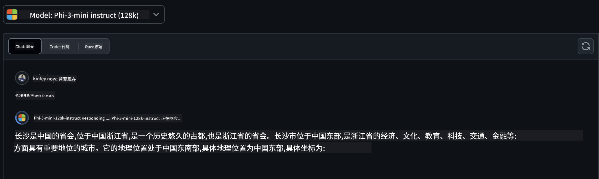
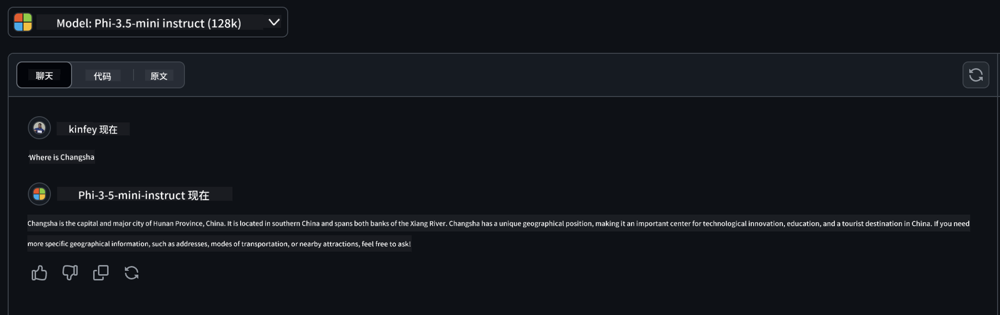

<!--
CO_OP_TRANSLATOR_METADATA:
{
  "original_hash": "124ad36cfe96f74038811b6e2bb93e9d",
  "translation_date": "2025-06-26T01:41:02+00:00",
  "source_file": "19-slm/README.md",
  "language_code": "zh"
}
-->

模型是最直接的方法。您可以通过GitHub Models快速访问Phi-3/3.5-Instruct模型。结合Azure AI Inference SDK / OpenAI SDK，您可以通过代码访问API来完成Phi-3/3.5-Instruct调用。您还可以通过Playground测试不同效果。- 演示：Phi-3-mini和Phi-3.5-mini在中文场景中的效果比较   **Azure AI Studio** 或者如果我们想使用视觉和MoE模型，您可以使用Azure AI Studio来完成调用。如果您感兴趣，可以阅读Phi-3 Cookbook，了解如何通过Azure AI Studio调用Phi-3/3.5 Instruct、Vision、MoE [点击此链接](https://github.com/microsoft/Phi-3CookBook/blob/main/md/02.QuickStart/AzureAIStudio_QuickStart.md?WT.mc_id=academic-105485-koreyst) **NVIDIA NIM** 除了Azure和GitHub提供的基于云的模型目录解决方案，您还可以使用[Nivida NIM](https://developer.nvidia.com/nim?WT.mc_id=academic-105485-koreyst)来完成相关调用。您可以访问NIVIDA NIM来完成Phi-3/3.5系列的API调用。NVIDIA NIM（NVIDIA Inference Microservices）是一组加速推理微服务，旨在帮助开发人员在各种环境中高效部署AI模型，包括云、数据中心和工作站。以下是NVIDIA NIM的一些关键功能：- **易于部署：** NIM允许通过单个命令部署AI模型，使其易于集成到现有工作流程中。- **优化性能：** 它利用NVIDIA预优化的推理引擎，如TensorRT和TensorRT-LLM，确保低延迟和高吞吐量。- **可扩展性：** NIM支持Kubernetes上的自动扩展，使其能够有效处理不同工作负载。- **安全和控制：** 组织可以通过在自己的管理基础设施上自托管NIM微服务来保持对其数据和应用程序的控制。- **标准API：** NIM提供行业标准API，使其易于构建和集成AI应用程序，如聊天机器人、AI助手等。NIM是NVIDIA AI Enterprise的一部分，旨在简化AI模型的部署和运营化，确保它们在NVIDIA GPU上高效运行。- 演示：使用Nividia NIM调用Phi-3.5-Vision-API [[点击此链接](../../../19-slm/python/Phi-3-Vision-Nividia-NIM.ipynb)] ### 在本地环境中推理Phi-3/3.5 与Phi-3或任何语言模型如GPT-3相关的推理是指根据接收到的输入生成响应或预测的过程。当您向Phi-3提供提示或问题时，它使用其训练过的神经网络通过分析其训练数据中的模式和关系来推断最可能和相关的响应。**Hugging Face Transformer** Hugging Face Transformers是一个为自然语言处理（NLP）和其他机器学习任务设计的强大库。以下是关于它的一些关键点：1. **预训练模型：** 它提供了数千个预训练模型，可用于各种任务，如文本分类、命名实体识别、问答、摘要、翻译和文本生成。2. **框架互操作性：** 该库支持多个深度学习框架，包括PyTorch、TensorFlow和JAX。这使您能够在一个框架中训练模型并在另一个框架中使用它。3. **多模态能力：** 除了NLP，Hugging Face Transformers还支持计算机视觉（例如，图像分类、目标检测）和音频处理（例如，语音识别、音频分类）任务。4. **易于使用：** 该库提供API和工具，易于下载和微调模型，使其对初学者和专家都可访问。5. **社区和资源：** Hugging Face拥有一个活跃的社区和广泛的文档、教程和指南，帮助用户入门并充分利用该库。[官方文档](https://huggingface.co/docs/transformers/index?WT.mc_id=academic-105485-koreyst)或他们的[GitHub仓库](https://github.com/huggingface/transformers?WT.mc_id=academic-105485-koreyst)。这是最常用的方法，但它也需要GPU加速。毕竟，像Vision和MoE这样的场景需要大量计算，如果不进行量化，CPU会非常有限。- 演示：使用Transformer调用Phi-3.5-Instuct [点击此链接](../../../19-slm/python/phi35-instruct-demo.ipynb) - 演示：使用Transformer调用Phi-3.5-Vision[点击此链接](../../../19-slm/python/phi35-vision-demo.ipynb) - 演示：使用Transformer调用Phi-3.5-MoE[点击此链接](../../../19-slm/python/phi35_moe_demo.ipynb) **Ollama** [Ollama](https://ollama.com/?WT.mc_id=academic-105485-koreyst)是一个旨在使在您的机器上本地运行大型语言模型（LLMs）更容易的平台。它支持各种模型，如Llama 3.1、Phi 3、Mistral和Gemma 2等。该平台通过将模型权重、配置和数据打包成一个单一包简化了过程，使用户更容易定制和创建自己的模型。Ollama适用于macOS、Linux和Windows。如果您希望在不依赖云服务的情况下实验或部署LLMs，这是一个很好的工具。Ollama是最直接的方法，您只需执行以下语句。```bash

ollama run phi3.5

``` **ONNX Runtime for GenAI** [ONNX Runtime](https://github.com/microsoft/onnxruntime-genai?WT.mc_id=academic-105485-koreyst)是一个跨平台的推理和训练机器学习加速器。ONNX Runtime for Generative AI (GENAI)是一个强大的工具，帮助您在各种平台上高效运行生成性AI模型。## 什么是ONNX Runtime？ONNX Runtime是一个开源项目，使机器学习模型的高性能推理成为可能。它支持Open Neural Network Exchange (ONNX)格式的模型，这是表示机器学习模型的标准。ONNX Runtime推理可以实现更快的客户体验和降低成本，支持来自深度学习框架如PyTorch和TensorFlow/Keras以及经典机器学习库如scikit-learn、LightGBM、XGBoost等的模型。ONNX Runtime兼容不同的硬件、驱动程序和操作系统，并通过利用硬件加速器（如适用）以及图优化和转换提供最佳性能## 什么是生成性AI？生成性AI指的是能够根据其训练数据生成新内容（如文本、图像或音乐）的AI系统。示例包括语言模型如GPT-3和图像生成模型如Stable Diffusion。ONNX Runtime for GenAI库为ONNX模型提供生成性AI循环，包括使用ONNX Runtime进行推理、logits处理、搜索和采样以及KV缓存管理。## ONNX Runtime for GENAI ONNX Runtime for GENAI扩展了ONNX Runtime的功能，以支持生成性AI模型。以下是一些关键功能：- **广泛的平台支持：** 它适用于各种平台，包括Windows、Linux、macOS、Android和iOS。- **模型支持：** 它支持许多流行的生成性AI模型，如LLaMA、GPT-Neo、BLOOM等。- **性能优化：** 它包括针对不同硬件加速器（如NVIDIA GPU、AMD GPU等）的优化。- **易于使用：** 它提供API，便于集成到应用程序中，使您能够以最少的代码生成文本、图像和其他内容- 用户可以调用高级generate()方法，或在循环中运行模型的每次迭代，一次生成一个token，并可选择在循环中更新生成参数。- ONNX runtime还支持贪婪/束搜索和TopP、TopK采样以生成token序列，并内置logits处理如重复惩罚。您还可以轻松添加自定义评分。## 入门要开始使用ONNX Runtime for GENAI，您可以按照以下步骤进行：### 安装ONNX Runtime：```Python
pip install onnxruntime
``` ### 安装生成性AI扩展：```Python
pip install onnxruntime-genai
``` ### 运行模型：这是一个简单的Python示例：```Python
import onnxruntime_genai as og

model = og.Model('path_to_your_model.onnx')

tokenizer = og.Tokenizer(model)

input_text = "Hello, how are you?"

input_tokens = tokenizer.encode(input_text)

output_tokens = model.generate(input_tokens)

output_text = tokenizer.decode(output_tokens)

print(output_text) 
``` ### 演示：使用ONNX Runtime GenAI调用Phi-3.5-Vision ```python

import onnxruntime_genai as og

model_path = './Your Phi-3.5-vision-instruct ONNX Path'

img_path = './Your Image Path'

model = og.Model(model_path)

processor = model.create_multimodal_processor()

tokenizer_stream = processor.create_stream()

text = "Your Prompt"

prompt = "<|user|>\n"

prompt += "<|image_1|>\n"

prompt += f"{text}<|end|>\n"

prompt += "<|assistant|>\n"

image = og.Images.open(img_path)

inputs = processor(prompt, images=image)

params = og.GeneratorParams(model)

params.set_inputs(inputs)

params.set_search_options(max_length=3072)

generator = og.Generator(model, params)

while not generator.is_done():

    generator.compute_logits()
    
    generator.generate_next_token()

    new_token = generator.get_next_tokens()[0]
    
    code += tokenizer_stream.decode(new_token)
    
    print(tokenizer_stream.decode(new_token), end='', flush=True)

``` **其他** 除了ONNX Runtime和Ollama参考方法，我们还可以基于不同制造商提供的模型参考方法完成定量模型的参考。比如Apple MLX框架与Apple Metal，Qualcomm QNN与NPU，Intel OpenVINO与CPU/GPU等。您还可以从[Phi-3 Cookbook](https://github.com/microsoft/phi-3cookbook?WT.mc_id=academic-105485-koreyst)获取更多内容## 更多我们已经了解了Phi-3/3.5系列的基础知识，但要了解更多关于SLM的信息，我们需要更多的知识。您可以在Phi-3 Cookbook中找到答案。如果您想了解更多，请访问[Phi-3 Cookbook](https://github.com/microsoft/phi-3cookbook?WT.mc_id=academic-105485-koreyst)。

**免责声明**：
本文档使用AI翻译服务[Co-op Translator](https://github.com/Azure/co-op-translator)进行翻译。虽然我们努力确保准确性，但请注意，自动翻译可能包含错误或不准确之处。应将原始文档的母语版本视为权威来源。对于关键信息，建议使用专业人工翻译。对于因使用此翻译而产生的任何误解或误释，我们不承担责任。