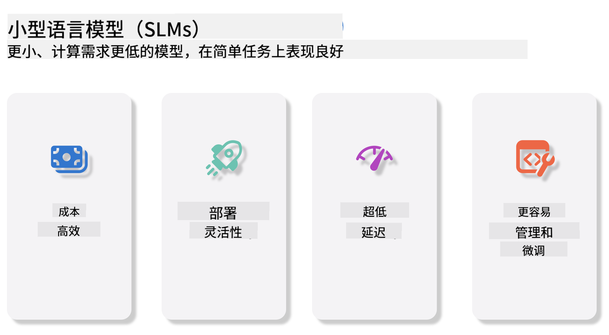
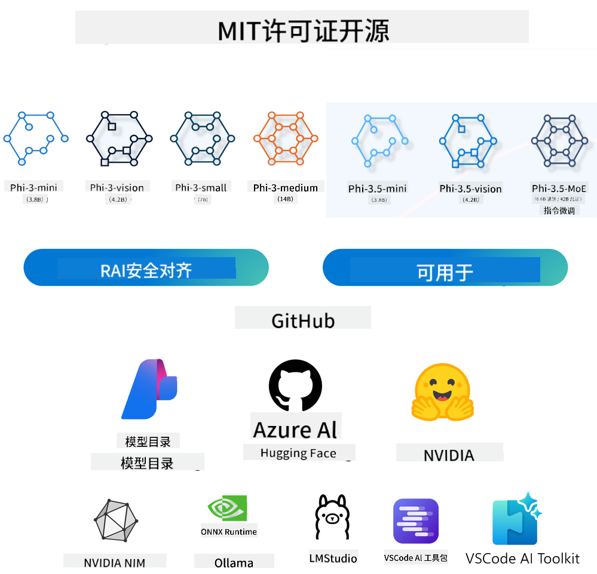
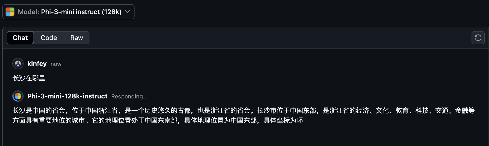
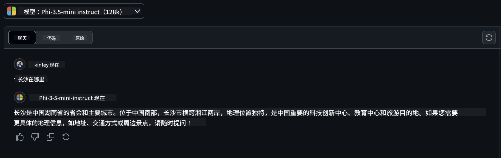

<!--
CO_OP_TRANSLATOR_METADATA:
{
  "original_hash": "124ad36cfe96f74038811b6e2bb93e9d",
  "translation_date": "2025-07-09T18:19:35+00:00",
  "source_file": "19-slm/README.md",
  "language_code": "zh"
}
-->
# 面向初学者的生成式 AI 小型语言模型简介
生成式 AI 是人工智能中一个令人着迷的领域，专注于创建能够生成新内容的系统。这些内容可以是文本、图像、音乐，甚至是完整的虚拟环境。生成式 AI 最令人兴奋的应用之一就是语言模型领域。

## 什么是小型语言模型？

小型语言模型（SLM）是大型语言模型（LLM）的缩小版本，采用了许多大型语言模型的架构原理和技术，但计算资源需求大幅降低。

SLM 是一类设计用来生成类人文本的语言模型。与 GPT-4 等大型模型相比，SLM 更加紧凑高效，适合计算资源有限的应用场景。尽管体积较小，它们仍能完成多种任务。通常，SLM 是通过压缩或蒸馏大型语言模型构建的，旨在保留原模型的大部分功能和语言能力。模型规模的缩小降低了整体复杂度，使 SLM 在内存使用和计算需求上更为高效。经过这些优化，SLM 依然能够执行多种自然语言处理（NLP）任务：

- 文本生成：创建连贯且符合上下文的句子或段落。
- 文本补全：根据给定提示预测并完成句子。
- 翻译：将文本从一种语言转换为另一种语言。
- 摘要：将长文本浓缩成简短易懂的摘要。

当然，相较于大型模型，SLM 在性能或理解深度上存在一定权衡。

## 小型语言模型如何工作？
SLM 通过大量文本数据进行训练。在训练过程中，它们学习语言的模式和结构，从而能够生成语法正确且符合上下文的文本。训练流程包括：

- 数据收集：从各种来源收集大量文本数据。
- 预处理：清洗和整理数据，使其适合训练。
- 训练：利用机器学习算法教模型理解和生成文本。
- 微调：调整模型以提升其在特定任务上的表现。

SLM 的发展契合了在资源受限环境（如移动设备或边缘计算平台）中部署模型的需求，因为完整的 LLM 由于资源消耗大往往不适用。通过注重效率，SLM 在性能和可用性之间取得平衡，促进了其在各领域的广泛应用。



## 学习目标

本课希望介绍 SLM 的相关知识，并结合 Microsoft Phi-3，学习文本内容、视觉和 MoE 等不同场景。

完成本课后，你应能回答以下问题：

- 什么是 SLM
- SLM 与 LLM 有何区别
- 什么是 Microsoft Phi-3/3.5 家族
- 如何推理 Microsoft Phi-3/3.5 家族模型

准备好了吗？我们开始吧。

## 大型语言模型（LLM）与小型语言模型（SLM）的区别

LLM 和 SLM 都基于概率机器学习的基本原理，采用类似的架构设计、训练方法、数据生成流程和模型评估技术。但两者在以下几个关键方面存在差异。

## 小型语言模型的应用

SLM 有广泛的应用场景，包括：

- 聊天机器人：提供客户支持，与用户进行对话交流。
- 内容创作：协助写作者生成创意或起草整篇文章。
- 教育：帮助学生完成写作作业或学习新语言。
- 辅助功能：为残障人士创建工具，如文本转语音系统。

**规模**

LLM 和 SLM 的主要区别在于模型规模。LLM 如 ChatGPT（GPT-4）参数量估计达 1.76 万亿，而开源 SLM 如 Mistral 7B 仅有约 70 亿参数。差异主要源于模型架构和训练方式的不同。例如，ChatGPT 采用编码器-解码器架构中的自注意力机制，而 Mistral 7B 使用滑动窗口注意力，支持更高效的解码器单独训练。这种架构差异对模型复杂度和性能有深远影响。

**理解能力**

SLM 通常针对特定领域进行优化，专业性强，但在跨领域的广泛上下文理解上可能有限。相比之下，LLM 旨在模拟更全面的人类智能，训练于庞大且多样化的数据集，能在多领域表现出更强的适应性和多功能性。因此，LLM 更适合多样化的下游任务，如自然语言处理和编程。

**计算资源**

LLM 的训练和部署资源消耗巨大，通常需要大规模 GPU 集群。例如，从零开始训练 ChatGPT 可能需要数千 GPU 持续数周。相比之下，SLM 参数较少，计算资源需求更低。像 Mistral 7B 这样的模型可以在配备中等 GPU 的本地机器上训练和运行，尽管训练仍需数小时并使用多 GPU。

**偏见**

LLM 的偏见问题主要源于训练数据的性质。这些模型依赖于互联网公开数据，可能存在对某些群体的代表性不足、错误标注或语言偏见（如方言、地域差异和语法规则影响）。复杂的 LLM 架构也可能无意中加剧偏见，若无细致微调难以察觉。相比之下，SLM 由于训练数据更受限且领域专一，固有偏见较少，但仍不可完全避免。

**推理速度**

SLM 体积较小，推理速度快，能在本地硬件上高效生成结果，无需大量并行计算资源。LLM 由于规模庞大，通常需要大量并行计算资源以保证合理的响应时间。多用户并发时，LLM 的响应速度会进一步下降，尤其在大规模部署时更为明显。

总结来说，LLM 和 SLM 虽然都基于机器学习，但在模型规模、资源需求、上下文理解能力、偏见敏感度和推理速度上存在显著差异。这些差异决定了它们各自适合的应用场景：LLM 更通用但资源消耗大，SLM 更高效且适合特定领域。

***注意：本章将以 Microsoft Phi-3 / 3.5 为例介绍 SLM。***

## 介绍 Phi-3 / Phi-3.5 家族

Phi-3 / 3.5 家族主要面向文本、视觉和 Agent（MoE）应用场景：

### Phi-3 / 3.5 Instruct

主要用于文本生成、对话补全和内容信息提取等。

**Phi-3-mini**

3.8B 参数的语言模型，可在 Microsoft Azure AI Studio、Hugging Face 和 Ollama 上使用。Phi-3 模型在关键基准测试中显著优于同等或更大规模的语言模型（见下方基准数据，数值越高越好）。Phi-3-mini 表现优于体积是其两倍的模型，而 Phi-3-small 和 Phi-3-medium 则超越了包括 GPT-3.5 在内的更大模型。

**Phi-3-small & medium**

仅有 7B 参数的 Phi-3-small 在多种语言、推理、编码和数学基准测试中击败了 GPT-3.5T。

14B 参数的 Phi-3-medium 延续这一趋势，表现优于 Gemini 1.0 Pro。

**Phi-3.5-mini**

可视为 Phi-3-mini 的升级版。参数未变，但增强了多语言支持（支持 20 多种语言：阿拉伯语、中文、捷克语、丹麦语、荷兰语、英语、芬兰语、法语、德语、希伯来语、匈牙利语、意大利语、日语、韩语、挪威语、波兰语、葡萄牙语、俄语、西班牙语、瑞典语、泰语、土耳其语、乌克兰语）并加强了长上下文支持。

3.8B 参数的 Phi-3.5-mini 超越同规模语言模型，表现与体积是其两倍的模型相当。

### Phi-3 / 3.5 Vision

可以把 Phi-3/3.5 的 Instruct 模型看作 Phi 的理解能力，而 Vision 则赋予 Phi “眼睛”，让它能理解世界。

**Phi-3-Vision**

仅有 4.2B 参数的 Phi-3-vision 延续了这一趋势，在通用视觉推理、OCR 以及表格和图表理解任务中，表现优于更大模型如 Claude-3 Haiku 和 Gemini 1.0 Pro V。

**Phi-3.5-Vision**

Phi-3.5-Vision 是 Phi-3-Vision 的升级版，新增了多图像支持。可以理解为视觉能力的提升，不仅能看图片，还能处理视频。

Phi-3.5-vision 在 OCR、表格和图表理解任务中优于更大模型如 Claude-3.5 Sonnet 和 Gemini 1.5 Flash，在通用视觉知识推理任务中表现相当。支持多帧输入，即对多张输入图像进行推理。

### Phi-3.5-MoE

***专家混合模型（MoE）*** 使模型预训练所需计算大幅减少，这意味着在相同计算预算下，可以显著扩大模型或数据集规模。特别是，MoE 模型在预训练阶段能更快达到与密集模型相同的质量。

Phi-3.5-MoE 包含 16 个 3.8B 参数的专家模块。仅有 6.6B 活跃参数的 Phi-3.5-MoE 在推理、语言理解和数学能力上达到与更大模型相似的水平。

我们可以根据不同场景使用 Phi-3/3.5 家族模型。与 LLM 不同，Phi-3/3.5-mini 或 Phi-3/3.5-Vision 可部署于边缘设备。

## 如何使用 Phi-3/3.5 家族模型

我们希望在不同场景下使用 Phi-3/3.5。接下来将基于不同场景介绍 Phi-3/3.5 的使用。



### 云端 API 推理差异

**GitHub Models**

GitHub Models 是最直接的方式。你可以通过 GitHub Models 快速访问 Phi-3/3.5-Instruct 模型。结合 Azure AI Inference SDK / OpenAI SDK，可以通过代码调用 API 完成 Phi-3/3.5-Instruct 的调用。你也可以通过 Playground 测试不同效果。

- 演示：Phi-3-mini 和 Phi-3.5-mini 在中文场景下效果对比





**Azure AI Studio**

如果想使用视觉和 MoE 模型，可以通过 Azure AI Studio 完成调用。如果感兴趣，可以阅读 Phi-3 Cookbook，了解如何通过 Azure AI Studio 调用 Phi-3/3.5 Instruct、Vision、MoE [点击此链接](https://github.com/microsoft/Phi-3CookBook/blob/main/md/02.QuickStart/AzureAIStudio_QuickStart.md?WT.mc_id=academic-105485-koreyst)

**NVIDIA NIM**

除了 Azure 和 GitHub 提供的云端模型目录解决方案外，你还可以使用 [NVIDIA NIM](https://developer.nvidia.com/nim?WT.mc_id=academic-105485-koreyst) 完成相关调用。NVIDIA NIM（NVIDIA 推理微服务）是一套加速推理微服务，帮助开发者高效部署 AI 模型，适用于云端、数据中心和工作站等多种环境。

NVIDIA NIM 的主要特点包括：

- **易于部署：** 只需一条命令即可部署 AI 模型，方便集成到现有工作流。
- **性能优化：** 利用 NVIDIA 预优化的推理引擎，如 TensorRT 和 TensorRT-LLM，确保低延迟和高吞吐量。
- **可扩展性：** 支持 Kubernetes 自动扩缩容，有效应对不同负载需求。
- **安全与控制：** 组织可以通过在自有管理的基础设施上自托管 NIM 微服务，来保持对其数据和应用的控制权。
- **标准 API：** NIM 提供行业标准的 API，方便构建和集成聊天机器人、AI 助手等 AI 应用。

NIM 是 NVIDIA AI Enterprise 的一部分，旨在简化 AI 模型的部署和运营，确保其在 NVIDIA GPU 上高效运行。

- 演示：使用 Nividia NIM 调用 Phi-3.5-Vision-API  [[点击此链接](../../../19-slm/python/Phi-3-Vision-Nividia-NIM.ipynb)]


### 在本地环境中推理 Phi-3/3.5
关于 Phi-3 或任何类似 GPT-3 的语言模型的推理，指的是根据输入生成响应或预测的过程。当你向 Phi-3 提供提示或问题时，它会利用训练好的神经网络，通过分析训练数据中的模式和关系，推断出最可能且相关的回答。

**Hugging Face Transformer**  
Hugging Face Transformers 是一个强大的库，专为自然语言处理（NLP）及其他机器学习任务设计。以下是一些关键点：

1. **预训练模型**：提供数千个预训练模型，可用于文本分类、命名实体识别、问答、摘要、翻译和文本生成等多种任务。

2. **框架互操作性**：支持多种深度学习框架，包括 PyTorch、TensorFlow 和 JAX，允许你在一个框架中训练模型，在另一个框架中使用。

3. **多模态能力**：除了 NLP，Hugging Face Transformers 还支持计算机视觉（如图像分类、目标检测）和音频处理（如语音识别、音频分类）任务。

4. **易用性**：提供 API 和工具，方便下载和微调模型，适合初学者和专家使用。

5. **社区与资源**：拥有活跃的社区和丰富的文档、教程及指南，帮助用户快速上手并充分利用该库。  
[官方文档](https://huggingface.co/docs/transformers/index?WT.mc_id=academic-105485-koreyst) 或其 [GitHub 仓库](https://github.com/huggingface/transformers?WT.mc_id=academic-105485-koreyst)。

这是最常用的方法，但也需要 GPU 加速。毕竟，视觉和 MoE 等场景需要大量计算，如果不进行量化，CPU 上的计算能力会非常有限。

- 演示：使用 Transformer 调用 Phi-3.5-Instuct [点击此链接](../../../19-slm/python/phi35-instruct-demo.ipynb)

- 演示：使用 Transformer 调用 Phi-3.5-Vision [点击此链接](../../../19-slm/python/phi35-vision-demo.ipynb)

- 演示：使用 Transformer 调用 Phi-3.5-MoE [点击此链接](../../../19-slm/python/phi35_moe_demo.ipynb)

**Ollama**  
[Ollama](https://ollama.com/?WT.mc_id=academic-105485-koreyst) 是一个旨在简化本地运行大型语言模型（LLM）的平台。它支持多种模型，如 Llama 3.1、Phi 3、Mistral 和 Gemma 2 等。该平台将模型权重、配置和数据打包成一个整体，方便用户定制和创建自己的模型。Ollama 支持 macOS、Linux 和 Windows。如果你想在不依赖云服务的情况下试验或部署 LLM，Ollama 是一个非常好的工具。使用 Ollama 是最直接的方式，你只需执行以下语句。

```bash

ollama run phi3.5

```

**ONNX Runtime for GenAI**

[ONNX Runtime](https://github.com/microsoft/onnxruntime-genai?WT.mc_id=academic-105485-koreyst) 是一个跨平台的机器学习推理和训练加速器。ONNX Runtime for Generative AI (GENAI) 是一个强大的工具，帮助你在各种平台上高效运行生成式 AI 模型。

## 什么是 ONNX Runtime？  
ONNX Runtime 是一个开源项目，支持高性能的机器学习模型推理。它支持 Open Neural Network Exchange (ONNX) 格式的模型，这是一种机器学习模型的标准表示格式。ONNX Runtime 推理可以提升客户体验速度并降低成本，支持来自深度学习框架如 PyTorch 和 TensorFlow/Keras 以及经典机器学习库如 scikit-learn、LightGBM、XGBoost 等的模型。ONNX Runtime 兼容不同硬件、驱动和操作系统，通过利用硬件加速器以及图优化和转换，实现最佳性能。

## 什么是生成式 AI？  
生成式 AI 指能够基于训练数据生成新内容的 AI 系统，如文本、图像或音乐。示例包括 GPT-3 这类语言模型和 Stable Diffusion 这类图像生成模型。ONNX Runtime for GenAI 库为 ONNX 模型提供生成式 AI 循环，包括使用 ONNX Runtime 进行推理、logits 处理、搜索与采样以及 KV 缓存管理。

## ONNX Runtime for GENAI  
ONNX Runtime for GENAI 扩展了 ONNX Runtime 的功能，支持生成式 AI 模型。主要特点包括：

- **广泛的平台支持：** 适用于 Windows、Linux、macOS、Android 和 iOS 等多种平台。
- **模型支持：** 支持多种流行的生成式 AI 模型，如 LLaMA、GPT-Neo、BLOOM 等。
- **性能优化：** 针对 NVIDIA GPU、AMD GPU 等多种硬件加速器进行了优化。
- **易用性：** 提供 API，方便集成到应用中，能够用最少代码生成文本、图像等内容。
- 用户可以调用高级的 generate() 方法，或在循环中逐步运行模型，每次生成一个 token，并可在循环内动态调整生成参数。
- ONNX Runtime 还支持贪婪搜索、束搜索（beam search）以及 TopP、TopK 采样生成 token 序列，并内置了如重复惩罚等 logits 处理功能。你也可以轻松添加自定义评分机制。

## 快速开始  
要开始使用 ONNX Runtime for GENAI，可以按照以下步骤：

### 安装 ONNX Runtime：  
```Python
pip install onnxruntime
```  
### 安装生成式 AI 扩展：  
```Python
pip install onnxruntime-genai
```

### 运行模型：以下是一个简单的 Python 示例：  
```Python
import onnxruntime_genai as og

model = og.Model('path_to_your_model.onnx')

tokenizer = og.Tokenizer(model)

input_text = "Hello, how are you?"

input_tokens = tokenizer.encode(input_text)

output_tokens = model.generate(input_tokens)

output_text = tokenizer.decode(output_tokens)

print(output_text) 
```  
### 演示：使用 ONNX Runtime GenAI 调用 Phi-3.5-Vision

```python

import onnxruntime_genai as og

model_path = './Your Phi-3.5-vision-instruct ONNX Path'

img_path = './Your Image Path'

model = og.Model(model_path)

processor = model.create_multimodal_processor()

tokenizer_stream = processor.create_stream()

text = "Your Prompt"

prompt = "<|user|>\n"

prompt += "<|image_1|>\n"

prompt += f"{text}<|end|>\n"

prompt += "<|assistant|>\n"

image = og.Images.open(img_path)

inputs = processor(prompt, images=image)

params = og.GeneratorParams(model)

params.set_inputs(inputs)

params.set_search_options(max_length=3072)

generator = og.Generator(model, params)

while not generator.is_done():

    generator.compute_logits()
    
    generator.generate_next_token()

    new_token = generator.get_next_tokens()[0]
    
    code += tokenizer_stream.decode(new_token)
    
    print(tokenizer_stream.decode(new_token), end='', flush=True)

```


**其他**

除了 ONNX Runtime 和 Ollama 参考方法外，我们还可以基于不同厂商提供的模型参考方法完成量化模型的参考。例如 Apple MLX 框架结合 Apple Metal，Qualcomm QNN 结合 NPU，Intel OpenVINO 结合 CPU/GPU 等。你还可以从 [Phi-3 Cookbook](https://github.com/microsoft/phi-3cookbook?WT.mc_id=academic-105485-koreyst) 获取更多内容。


## 更多

我们已经了解了 Phi-3/3.5 家族的基础知识，但要深入学习 SLM 还需要更多知识。你可以在 Phi-3 Cookbook 中找到答案。如果想了解更多，请访问 [Phi-3 Cookbook](https://github.com/microsoft/phi-3cookbook?WT.mc_id=academic-105485-koreyst)。

**免责声明**：  
本文件使用 AI 翻译服务 [Co-op Translator](https://github.com/Azure/co-op-translator) 进行翻译。虽然我们力求准确，但请注意，自动翻译可能包含错误或不准确之处。原始文件的母语版本应被视为权威来源。对于重要信息，建议采用专业人工翻译。对于因使用本翻译而产生的任何误解或误释，我们不承担任何责任。