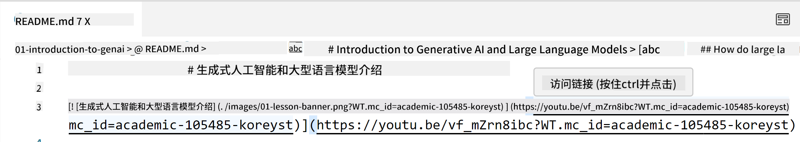
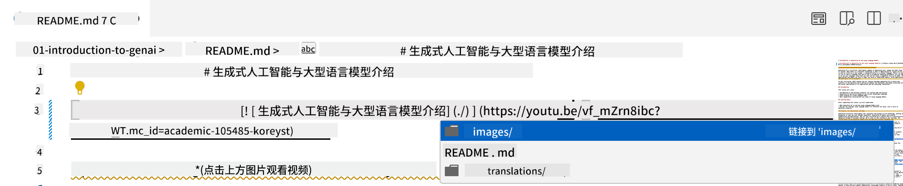
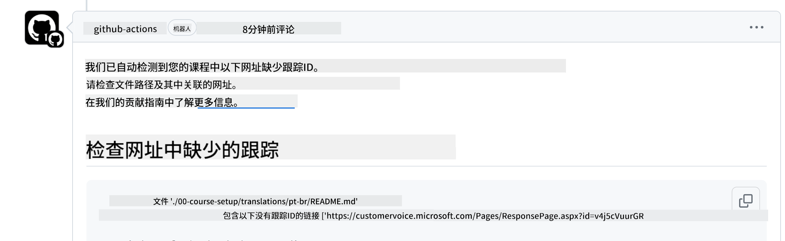
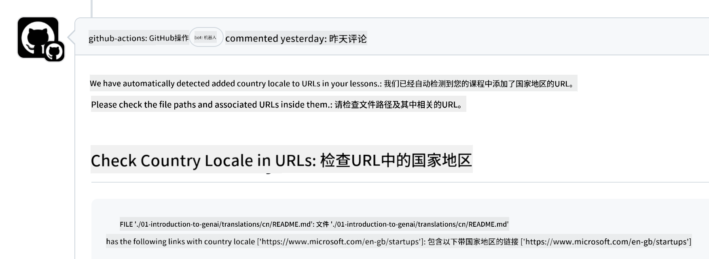

<!--
CO_OP_TRANSLATOR_METADATA:
{
  "original_hash": "57c41f2af71001a2cff9d8eb797cb843",
  "translation_date": "2025-05-19T08:41:22+00:00",
  "source_file": "CONTRIBUTING.md",
  "language_code": "zh"
}
-->
# 贡献

这个项目欢迎贡献和建议。大多数贡献需要您同意一个贡献者许可协议（CLA），声明您有权利并实际上授予我们使用您的贡献的权利。详情请访问<https://cla.microsoft.com>。

> 重要提示：在翻译此仓库中的文本时，请确保不使用机器翻译。我们将通过社区验证翻译，因此请仅在您精通的语言中志愿翻译。

当您提交拉取请求时，CLA-bot会自动确定您是否需要提供CLA，并适当地装饰PR（例如标签、评论）。只需按照机器人提供的说明进行操作即可。您只需要在使用我们CLA的所有仓库中执行一次此操作。

## 行为准则

这个项目采用了[微软开源行为准则](https://opensource.microsoft.com/codeofconduct/?WT.mc_id=academic-105485-koreyst)。欲了解更多信息，请阅读[行为准则常见问题](https://opensource.microsoft.com/codeofconduct/faq/?WT.mc_id=academic-105485-koreyst)或通过[opencode@microsoft.com](mailto:opencode@microsoft.com)联系我们，提出任何其他问题或评论。

## 问题或疑问？

请不要为一般支持问题打开GitHub问题，因为GitHub列表应用于功能请求和错误报告。这样我们可以更容易地跟踪代码中的实际问题或错误，并将一般讨论与实际代码分开。

## 拼写错误、问题、错误和贡献

每当您提交对“生成性AI初学者”仓库的任何更改时，请遵循以下建议。

* 在进行修改之前，请始终将仓库分叉到您自己的账户
* 不要将多个更改合并到一个拉取请求中。例如，使用单独的PR提交任何错误修复和文档更新
* 如果您的拉取请求显示合并冲突，请确保在进行修改之前更新本地main，以镜像主仓库中的内容
* 如果您提交翻译，请为所有翻译文件创建一个PR，因为我们不接受内容的部分翻译
* 如果您提交拼写错误或文档修复，您可以在合适的地方将修改合并到一个PR中

## 写作的一般指导

- 确保所有URL都用方括号括起来，后跟没有额外空格的圆括号``。
- 确保任何相对链接（即链接到仓库中的其他文件和文件夹）以`./`开头，指向当前工作目录中的文件或文件夹，或者以`../`开头，指向父工作目录中的文件或文件夹。
- 确保任何相对链接（即链接到仓库中的其他文件和文件夹）在末尾有一个跟踪ID（即`?`或`&`然后`wt.mc_id=`或`WT.mc_id=`）。
- 确保来自以下域的任何URL _github.com, microsoft.com, visualstudio.com, aka.ms, 和 azure.com_ 在末尾有一个跟踪ID（即`?`或`&`然后`wt.mc_id=`或`WT.mc_id=`）。
- 确保您的链接中没有特定国家的区域设置（即`/en-us/`或`/en/`）。
- 确保所有图像都存储在`./images`文件夹中。
- 确保图像有使用英文字符、数字和破折号的描述性名称。

## GitHub 工作流

当您提交拉取请求时，将触发四种不同的工作流以验证以前的规则。
只需按照这里列出的说明进行操作即可通过工作流检查。

- [检查损坏的相对路径](../..)
- [检查路径是否有跟踪](../..)
- [检查URL是否有跟踪](../..)
- [检查URL没有区域设置](../..)

### 检查损坏的相对路径

此工作流确保您文件中的任何相对路径都正常工作。
这个仓库部署到GitHub页面，所以在输入链接时需要非常小心，以免将任何人引导到错误的地方。

要确保您的链接正常工作，只需使用VS代码检查即可。

例如，当您在文件中悬停在任何链接上时，您将被提示通过按**ctrl + click**来跟随链接。

如果您点击链接并且它在本地不起作用，那么它肯定会触发工作流并且在GitHub上不起作用。

要解决此问题，请尝试在VS代码的帮助下输入链接。

当您输入`./`或`../`时，VS代码会提示您根据输入选择可用选项。

通过点击所需的文件或文件夹跟随路径，您将确保您的路径没有损坏。

一旦您添加了正确的相对路径，保存并推送您的更改，工作流将再次触发以验证您的更改。
如果您通过了检查，那么您就可以继续了。

### 检查路径是否有跟踪

此工作流确保任何相对路径中都有跟踪。
这个仓库部署到GitHub页面，所以我们需要跟踪不同文件和文件夹之间的移动。

要确保您的相对路径中有跟踪，只需检查路径末尾的以下文本`?wt.mc_id=`。
如果它附加到您的相对路径上，那么您将通过此检查。

如果没有，您可能会收到以下错误。

要解决此问题，请尝试打开工作流突出显示的文件路径并将跟踪ID添加到相对路径的末尾。

一旦您添加了跟踪ID，保存并推送您的更改，工作流将再次触发以验证您的更改。
如果您通过了检查，那么您就可以继续了。

### 检查URL是否有跟踪

此工作流确保任何网页URL中都有跟踪。
这个仓库对所有人开放，所以您需要确保跟踪访问以了解流量来自何处。

要确保您的URL中有跟踪，只需检查URL末尾的以下文本`?wt.mc_id=`。
如果它附加到您的URL上，那么您将通过此检查。

如果没有，您可能会收到以下错误。

要解决此问题，请尝试打开工作流突出显示的文件路径并将跟踪ID添加到URL的末尾。

一旦您添加了跟踪ID，保存并推送您的更改，工作流将再次触发以验证您的更改。
如果您通过了检查，那么您就可以继续了。

### 检查URL没有区域设置

此工作流确保任何网页URL中没有国家特定的区域设置。
这个仓库对世界各地的每个人开放，所以您需要确保不要在URL中包含您国家的区域设置。

要确保您的URL中没有国家区域设置，只需检查URL中的以下文本`/en-us/`或`/en/`或任何其他语言区域设置。
如果它不存在于您的URL中，那么您将通过此检查。

如果没有，您可能会收到以下错误。

要解决此问题，请尝试打开工作流突出显示的文件路径并从URL中删除国家区域设置。

一旦您删除了国家区域设置，保存并推送您的更改，工作流将再次触发以验证您的更改。
如果您通过了检查，那么您就可以继续了。

恭喜！我们将尽快反馈您的贡献。

**免责声明**：  
本文档已使用AI翻译服务[Co-op Translator](https://github.com/Azure/co-op-translator)进行翻译。虽然我们努力确保准确性，但请注意，自动翻译可能包含错误或不准确之处。应将原始语言的文档视为权威来源。对于关键信息，建议使用专业人工翻译。对于因使用此翻译而引起的任何误解或误释，我们不承担责任。