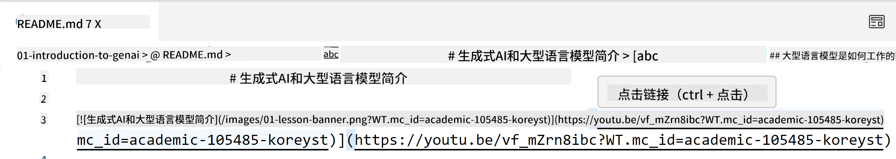
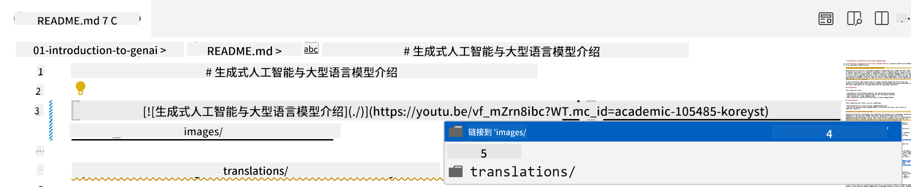
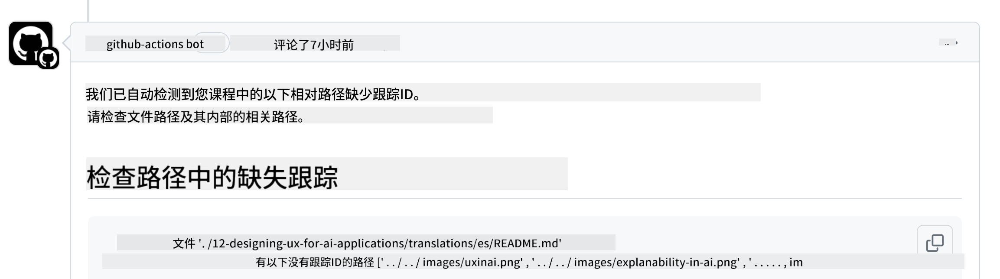
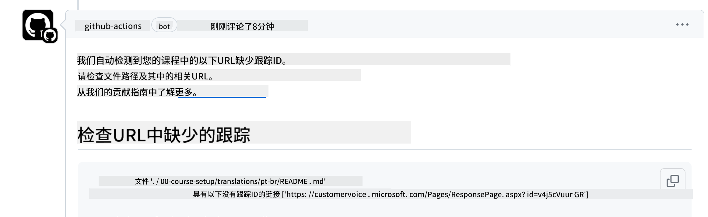
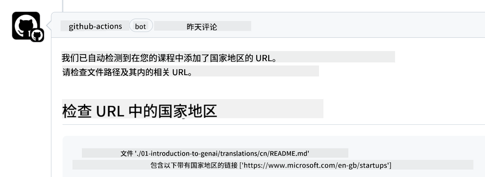

<!--
CO_OP_TRANSLATOR_METADATA:
{
  "original_hash": "57c41f2af71001a2cff9d8eb797cb843",
  "translation_date": "2025-06-25T07:02:08+00:00",
  "source_file": "CONTRIBUTING.md",
  "language_code": "zh"
}
-->
# 贡献

这个项目欢迎贡献和建议。大多数贡献需要您同意贡献者许可协议（CLA），声明您有权并确实授予我们使用您贡献的权利。详情请访问<https://cla.microsoft.com>。

> 重要提示：在翻译此仓库中的文本时，请确保不使用机器翻译。我们将通过社区验证翻译，因此请仅在您精通的语言中志愿翻译。

当您提交拉取请求时，CLA-bot会自动确定您是否需要提供CLA并适当地装饰PR（例如，标签、评论）。只需按照bot提供的说明进行操作。您只需在使用我们CLA的所有仓库中执行一次此操作。

## 行为准则

该项目采用了[微软开源行为准则](https://opensource.microsoft.com/codeofconduct/?WT.mc_id=academic-105485-koreyst)。有关更多信息，请阅读[行为准则FAQ](https://opensource.microsoft.com/codeofconduct/faq/?WT.mc_id=academic-105485-koreyst)或联系[opencode@microsoft.com](mailto:opencode@microsoft.com)以获得任何其他问题或评论。

## 问题或疑问？

请不要为一般支持问题打开GitHub问题，因为GitHub列表应该用于功能请求和错误报告。这样我们可以更容易地跟踪代码中的实际问题或错误，并将一般讨论与实际代码分开。

## 拼写错误、问题、错误和贡献

每当您提交对初学者生成AI仓库的任何更改时，请遵循以下建议。

* 在进行修改之前，始终将仓库fork到您自己的账户
* 不要将多个更改合并到一个拉取请求中。例如，使用单独的PR提交任何错误修复和文档更新
* 如果您的拉取请求显示合并冲突，请确保更新您的本地main以镜像主仓库中的内容，然后再进行修改
* 如果您提交翻译，请为所有翻译文件创建一个PR，因为我们不接受内容的部分翻译
* 如果您提交拼写错误或文档修复，可以在适当的情况下将修改合并到一个PR中

## 编写的一般指导

- 确保所有URL都用方括号括起来，后面跟着括号，中间没有多余的空格 ``。
- 确保任何相对链接（即链接到仓库中的其他文件和文件夹）以`./`开头，指向位于当前工作目录中的文件或文件夹，或`../`，指向位于父工作目录中的文件或文件夹。
- 确保任何相对链接（即链接到仓库中的其他文件和文件夹）在末尾有一个跟踪ID（即`?`或`&`然后`wt.mc_id=`或`WT.mc_id=`）。
- 确保以下域名中的任何URL _github.com, microsoft.com, visualstudio.com, aka.ms, 和 azure.com_ 在末尾有一个跟踪ID（即`?`或`&`然后`wt.mc_id=`或`WT.mc_id=`）。
- 确保您的链接中没有国家特定的语言区域（即`/en-us/`或`/en/`）。
- 确保所有图片都存储在`./images`文件夹中。
- 确保图片有使用英文字符、数字和破折号的描述性名称。

## GitHub工作流程

当您提交拉取请求时，将触发四个不同的工作流程以验证之前的规则。
只需按照此处列出的说明进行操作即可通过工作流程检查。

- [检查损坏的相对路径](../..)
- [检查路径是否有跟踪](../..)
- [检查URL是否有跟踪](../..)
- [检查URL是否没有语言区域](../..)

### 检查损坏的相对路径

此工作流程确保您文件中的任何相对路径都是有效的。
此仓库已部署到GitHub页面，因此在输入将所有内容粘合在一起的链接时，您需要非常小心，以免将任何人引导到错误的地方。

为了确保您的链接正常工作，只需使用VS code进行检查即可。

例如，当您在文件中悬停在任何链接上时，系统会提示您通过按**ctrl + click**跟随链接。

如果您单击链接并且它在本地不起作用，那么肯定会触发工作流程，并且在GitHub上也不起作用。

要解决此问题，请尝试在VS code的帮助下输入链接。

当您输入`./`或`../`时，VS code会提示您根据输入内容从可用选项中进行选择。

通过单击所需的文件或文件夹来跟随路径，您就可以确保您的路径没有损坏。

一旦您添加了正确的相对路径，保存并推送您的更改，工作流程将再次触发以验证您的更改。
如果您通过了检查，那么您就可以继续了。

### 检查路径是否有跟踪

此工作流程确保任何相对路径都有跟踪。
此仓库已部署到GitHub页面，因此我们需要跟踪不同文件和文件夹之间的移动。

为了确保您的相对路径中有跟踪，只需检查路径末尾是否有以下文本`?wt.mc_id=`。
如果它附加到您的相对路径，那么您将通过此检查。

如果没有，您可能会收到以下错误。

要解决此问题，请尝试打开工作流程突出显示的文件路径并在相对路径末尾添加跟踪ID。

一旦您添加了跟踪ID，保存并推送您的更改，工作流程将再次触发以验证您的更改。
如果您通过了检查，那么您就可以继续了。

### 检查URL是否有跟踪

此工作流程确保任何网页URL都有跟踪。
此仓库对所有人开放，因此您需要确保跟踪访问以了解流量来自哪里。

为了确保您的URL中有跟踪，只需检查URL末尾是否有以下文本`?wt.mc_id=`。
如果它附加到您的URL，那么您将通过此检查。

如果没有，您可能会收到以下错误。

要解决此问题，请尝试打开工作流程突出显示的文件路径并在URL末尾添加跟踪ID。

一旦您添加了跟踪ID，保存并推送您的更改，工作流程将再次触发以验证您的更改。
如果您通过了检查，那么您就可以继续了。

### 检查URL是否没有语言区域

此工作流程确保任何网页URL中没有国家特定的语言区域。
此仓库对全球所有人开放，因此您需要确保不要在URL中包含您国家的语言区域。

为了确保您的URL中没有国家语言区域，只需检查URL中的任何地方是否有以下文本`/en-us/`或`/en/`或任何其他语言区域。
如果它没有出现在您的URL中，那么您将通过此检查。

如果没有，您可能会收到以下错误。

要解决此问题，请尝试打开工作流程突出显示的文件路径并从URL中删除国家语言区域。

一旦您删除了国家语言区域，保存并推送您的更改，工作流程将再次触发以验证您的更改。
如果您通过了检查，那么您就可以继续了。

恭喜！我们会尽快反馈您的贡献。

**免责声明**：  
本文档使用 AI 翻译服务 [Co-op Translator](https://github.com/Azure/co-op-translator) 进行了翻译。虽然我们努力确保准确性，但请注意，自动翻译可能包含错误或不准确之处。应将原文档视为权威来源。对于重要信息，建议使用专业人工翻译。对于因使用此翻译而产生的任何误解或误读，我们不承担责任。