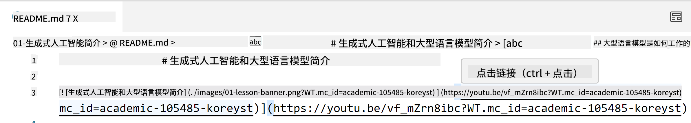
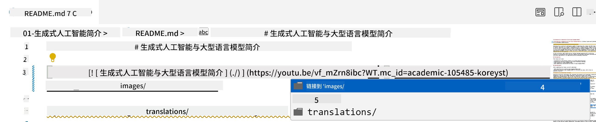
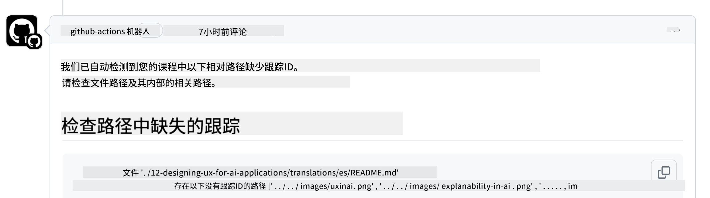
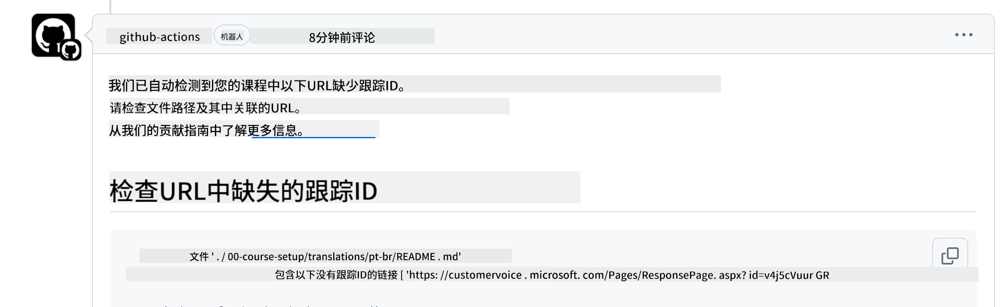
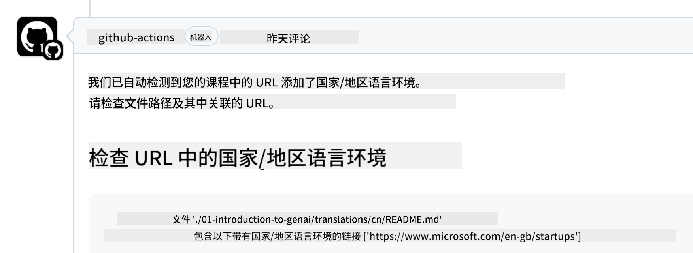

<!--
CO_OP_TRANSLATOR_METADATA:
{
  "original_hash": "57c41f2af71001a2cff9d8eb797cb843",
  "translation_date": "2025-07-09T05:49:34+00:00",
  "source_file": "CONTRIBUTING.md",
  "language_code": "zh"
}
-->
# 贡献指南

本项目欢迎贡献和建议。大多数贡献需要您同意一份贡献者许可协议（CLA），声明您有权利并且确实授予我们使用您贡献内容的权利。详情请访问 <https://cla.microsoft.com>。

> 重要提示：在翻译本仓库中的文本时，请确保不要使用机器翻译。我们会通过社区验证翻译质量，因此请仅在您熟练掌握的语言中自愿参与翻译。

当您提交拉取请求时，CLA 机器人会自动判断您是否需要提供 CLA，并相应地标注 PR（例如，添加标签或评论）。只需按照机器人提供的指示操作即可。您在所有使用我们 CLA 的仓库中只需完成一次此操作。

## 行为准则

本项目采用了[Microsoft 开源行为准则](https://opensource.microsoft.com/codeofconduct/?WT.mc_id=academic-105485-koreyst)。  
更多信息请阅读[行为准则常见问题](https://opensource.microsoft.com/codeofconduct/faq/?WT.mc_id=academic-105485-koreyst)，或通过 [opencode@microsoft.com](mailto:opencode@microsoft.com) 联系我们，提出任何额外的问题或意见。

## 有问题或遇到困难？

请不要为一般支持问题打开 GitHub issue，因为 GitHub 列表应仅用于功能请求和错误报告。这样我们可以更方便地跟踪代码中的实际问题或错误，并将一般讨论与代码问题分开。

## 拼写错误、问题、Bug 及贡献

每当您向 Generative AI for Beginners 仓库提交任何更改时，请遵循以下建议：

* 在进行修改前，请务必先将仓库 fork 到您自己的账户
* 不要将多个更改合并到一个拉取请求中。例如，错误修复和文档更新请分别提交不同的 PR
* 如果您的拉取请求显示有合并冲突，请确保先将本地 main 分支更新为主仓库的最新状态，再进行修改
* 如果您提交的是翻译，请将所有翻译文件合并到一个 PR 中提交，我们不接受内容的部分翻译
* 如果您提交的是拼写错误或文档修正，可以将多个修改合并到一个 PR 中提交（适用时）

## 编写的一般指导

- 确保所有 URL 都用方括号包裹，后面紧跟圆括号，且中间无多余空格 ``。
- 确保任何相对链接（即指向仓库中其他文件和文件夹的链接）以 `./` 开头，表示当前工作目录中的文件或文件夹，或以 `../` 开头，表示父级工作目录中的文件或文件夹。
- 确保任何相对链接末尾都带有跟踪 ID（即以 `?` 或 `&` 开头，后跟 `wt.mc_id=` 或 `WT.mc_id=`）。
- 确保来自以下域名的 URL _github.com、microsoft.com、visualstudio.com、aka.ms 和 azure.com_ 末尾都带有跟踪 ID（即以 `?` 或 `&` 开头，后跟 `wt.mc_id=` 或 `WT.mc_id=`）。
- 确保您的链接中不包含特定国家或地区的语言代码（例如 `/en-us/` 或 `/en/`）。
- 确保所有图片都存放在 `./images` 文件夹中。
- 确保图片文件名具有描述性，且使用英文字符、数字和短横线。

## GitHub 工作流

当您提交拉取请求时，会触发四个不同的工作流来验证上述规则。  
只需按照这里列出的说明操作，即可通过工作流检查。

- [检查相对路径是否损坏](../..)
- [检查路径是否带有跟踪](../..)
- [检查 URL 是否带有跟踪](../..)
- [检查 URL 是否包含语言代码](../..)

### 检查相对路径是否损坏

此工作流确保您文件中的任何相对路径都能正常工作。  
本仓库部署在 GitHub Pages 上，因此您在输入链接时必须非常小心，避免链接指向错误位置。

要确保链接正常工作，可以使用 VS Code 进行检查。

例如，将鼠标悬停在文件中的任意链接上时，您会看到提示，按 **ctrl + 点击** 即可跳转链接。

如果您点击链接后本地无法打开，那么该链接肯定会触发工作流失败，且在 GitHub 上也无法正常工作。

解决此问题的方法是借助 VS Code 输入链接。

当您输入 `./` 或 `../` 时，VS Code 会根据您输入的内容弹出可选项供您选择。

点击所需的文件或文件夹即可确保路径无误。

添加正确的相对路径后，保存并推送更改，工作流会再次触发验证。  
通过检查后即可继续。

### 检查路径是否带有跟踪

此工作流确保任何相对路径都带有跟踪信息。  
本仓库部署在 GitHub Pages 上，因此我们需要跟踪不同文件和文件夹之间的访问。

要确保相对路径带有跟踪，请检查路径末尾是否包含 `?wt.mc_id=`。  
如果有，则通过此检查。

如果没有，您可能会看到如下错误：

解决方法是打开工作流提示的文件路径，在相对路径末尾添加跟踪 ID。

添加后保存并推送更改，工作流会再次验证。  
通过检查后即可继续。

### 检查 URL 是否带有跟踪

此工作流确保任何网页 URL 都带有跟踪信息。  
本仓库对所有人开放，因此需要跟踪访问来源。

要确保 URL 带有跟踪，请检查 URL 末尾是否包含 `?wt.mc_id=`。  
如果有，则通过此检查。

如果没有，您可能会看到如下错误：

解决方法是打开工作流提示的文件路径，在 URL 末尾添加跟踪 ID。

添加后保存并推送更改，工作流会再次验证。  
通过检查后即可继续。

### 检查 URL 是否包含语言代码

此工作流确保任何网页 URL 中不包含特定国家或地区的语言代码。  
本仓库面向全球用户，因此请确保 URL 中不包含您所在国家的语言代码。

要确保 URL 不包含语言代码，请检查 URL 中是否含有 `/en-us/`、`/en/` 或其他语言代码。  
如果没有，则通过此检查。

如果有，您可能会看到如下错误：

解决方法是打开工作流提示的文件路径，删除 URL 中的语言代码。

删除后保存并推送更改，工作流会再次验证。  
通过检查后即可继续。

恭喜！我们会尽快就您的贡献反馈意见。

**免责声明**：  
本文件使用 AI 翻译服务 [Co-op Translator](https://github.com/Azure/co-op-translator) 进行翻译。虽然我们力求准确，但请注意，自动翻译可能包含错误或不准确之处。原始文件的母语版本应被视为权威来源。对于重要信息，建议使用专业人工翻译。我们不对因使用本翻译而产生的任何误解或误释承担责任。