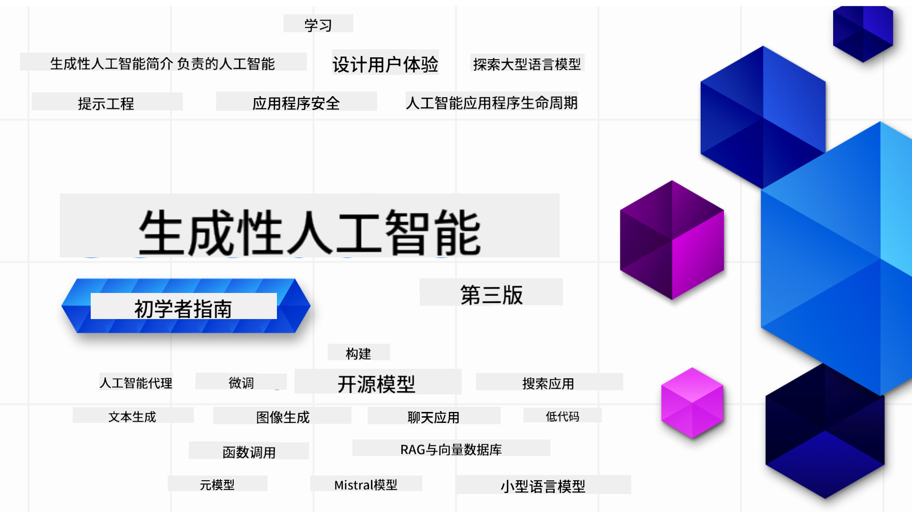

<!--
CO_OP_TRANSLATOR_METADATA:
{
  "original_hash": "c2ee25895ebbfa1a52868bb6eab686fc",
  "translation_date": "2025-05-19T10:53:55+00:00",
  "source_file": "README.md",
  "language_code": "zh"
}
-->

### 21节课教你开始构建生成式AI应用所需的一切知识

### 🌐 多语言支持

#### 通过GitHub Action支持（自动化并始终保持最新）
[法语](../fr/README.md) | [西班牙语](../es/README.md) | [德语](../de/README.md) | [俄语](../ru/README.md) | [阿拉伯语](../ar/README.md) | [波斯语 (法尔西语)](../fa/README.md) | [乌尔都语](../ur/README.md) | [中文 (简体)](./README.md) | [中文 (繁体, 澳门)](../mo/README.md) | [中文 (繁体, 香港)](../hk/README.md) | [中文 (繁体, 台湾)](../tw/README.md) | [日语](../ja/README.md) | [韩语](../ko/README.md) | [印地语](../hi/README.md) | [孟加拉语](../bn/README.md) | [马拉地语](../mr/README.md) | [尼泊尔语](../ne/README.md) | [旁遮普语 (古木基文)](../pa/README.md) | [葡萄牙语 (葡萄牙)](../pt/README.md) | [葡萄牙语 (巴西)](../br/README.md) | [意大利语](../it/README.md) | [波兰语](../pl/README.md) | [土耳其语](../tr/README.md) | [希腊语](../el/README.md) | [泰语](../th/README.md) | [瑞典语](../sv/README.md) | [丹麦语](../da/README.md) | [挪威语](../no/README.md) | [芬兰语](../fi/README.md) | [荷兰语](../nl/README.md) | [希伯来语](../he/README.md) | [越南语](../vi/README.md) | [印度尼西亚语](../id/README.md) | [马来语](../ms/README.md) | [他加禄语 (菲律宾语)](../tl/README.md) | [斯瓦希里语](../sw/README.md) | [匈牙利语](../hu/README.md) | [捷克语](../cs/README.md) | [斯洛伐克语](../sk/README.md) | [罗马尼亚语](../ro/README.md) | [保加利亚语](../bg/README.md) | [塞尔维亚语 (西里尔文)](../sr/README.md) | [克罗地亚语](../hr/README.md) | [斯洛文尼亚语](../sl/README.md)
# 初学者生成式 AI（版本 3）- 课程

通过微软云倡导者的 21 节课全面课程学习构建生成式 AI 应用的基础知识。

## 🌱 入门

这门课程有 21 节课。每节课都有自己的主题，所以可以从任何你喜欢的地方开始！

课程分为“学习”课程，解释生成式 AI 概念，或“构建”课程，解释概念并提供 **Python** 和 **TypeScript** 的代码示例（如有可能）。

对于 .NET 开发者，请查看 [初学者生成式 AI（.NET 版）](https://github.com/microsoft/Generative-AI-for-beginners-dotnet?WT.mc_id=academic-105485-koreyst)！

每节课还包括一个“继续学习”部分，提供额外的学习工具。

## 你需要准备什么
### 要运行本课程的代码，你可以使用：
 - [Azure OpenAI 服务](https://aka.ms/genai-beginners/azure-open-ai?WT.mc_id=academic-105485-koreyst) - **课程：** "aoai-assignment"
 - [GitHub Marketplace 模型目录](https://aka.ms/genai-beginners/gh-models?WT.mc_id=academic-105485-koreyst) - **课程：** "githubmodels"
 - [OpenAI API](https://aka.ms/genai-beginners/open-ai?WT.mc_id=academic-105485-koreyst) - **课程：** "oai-assignment"

- Python 或 TypeScript 的基础知识会有所帮助 - \*对于绝对初学者，请查看这些 [Python](https://aka.ms/genai-beginners/python?WT.mc_id=academic-105485-koreyst) 和 [TypeScript](https://aka.ms/genai-beginners/typescript?WT.mc_id=academic-105485-koreyst) 课程
- 一个 GitHub 账户来 [fork 整个仓库](https://aka.ms/genai-beginners/github?WT.mc_id=academic-105485-koreyst) 到你自己的 GitHub 账户

我们创建了一个 **[课程设置](./00-course-setup/README.md?WT.mc_id=academic-105485-koreyst)** 课程来帮助你设置开发环境。

别忘了 [给这个仓库加星 (🌟)](https://docs.github.com/en/get-started/exploring-projects-on-github/saving-repositories-with-stars?WT.mc_id=academic-105485-koreyst) 以便以后更容易找到。

## 🧠 准备部署了吗？

如果你在寻找更高级的代码示例，请查看我们的 [生成式 AI 代码示例集](https://aka.ms/genai-beg-code?WT.mc_id=academic-105485-koreyst)，包括 **Python** 和 **TypeScript**。

## 🗣️ 结识其他学习者，获得支持

加入我们的 [官方 Azure AI Foundry Discord 服务器](https://aka.ms/genai-discord?WT.mc_id=academic-105485-koreyst)，与其他学习者交流并获得支持。

在 GitHub 上的 [Azure AI Foundry 开发者论坛](https://aka.ms/azureaifoundry/forum) 中提问或分享产品反馈。

## 🚀 创办初创公司？

注册 [Microsoft for Startups Founders Hub](https://aka.ms/genai-foundershub?WT.mc_id=academic-105485-koreyst)，以获得 **免费的 OpenAI 额度** 和高达 **$150k 的 Azure 额度，用于通过 Azure OpenAI 服务访问 OpenAI 模型**。

## 🙏 想要帮助？

你有建议或发现拼写或代码错误吗？[提出问题](https://github.com/microsoft/generative-ai-for-beginners/issues?WT.mc_id=academic-105485-koreyst) 或 [创建拉取请求](https://github.com/microsoft/generative-ai-for-beginners/pulls?WT.mc_id=academic-105485-koreyst)

## 📂 每节课包括：

- 主题的简短视频介绍
- 位于 README 中的书面课程
- 支持 Azure OpenAI 和 OpenAI API 的 Python 和 TypeScript 代码示例
- 链接到额外资源以继续学习

## 🗃️ 课程

| #   | **课程链接**                                                                                                                              | **描述**                                                                                 | **视频**                                                                   | **额外学习**                                                             |
| --- | -------------------------------------------------------------------------------------------------------------------------------------------- | ----------------------------------------------------------------------------------------------- | --------------------------------------------------------------------------- | ------------------------------------------------------------------------------ |
| 00  | [课程设置](./00-course-setup/README.md?WT.mc_id=academic-105485-koreyst)                                                                 | **学习：** 如何设置你的开发环境                                            | 视频即将推出                                                                 | [了解更多](https://aka.ms/genai-collection?WT.mc_id=academic-105485-koreyst) |
| 01  | [生成式 AI 和 LLMs 介绍](./01-introduction-to-genai/README.md?WT.mc_id=academic-105485-koreyst)                              | **学习：** 了解什么是生成式 AI 以及大型语言模型（LLMs）如何工作。       | [视频](https://aka.ms/gen-ai-lesson-1-gh?WT.mc_id=academic-105485-koreyst) | [了解更多](https://aka.ms/genai-collection?WT.mc_id=academic-105485-koreyst) |
| 02  | [探索和比较不同的 LLMs](./02-exploring-and-comparing-different-llms/README.md?WT.mc_id=academic-105485-koreyst)             | **学习：** 如何为你的使用场景选择合适的模型                                      | [视频](https://aka.ms/gen-ai-lesson2-gh?WT.mc_id=academic-105485-koreyst)  | [了解更多](https://aka.ms/genai-collection?WT.mc_id=academic-105485-koreyst) |
| 03  | [负责任地使用生成式 AI](./03-using-generative-ai-responsibly/README.md?WT.mc_id=academic-105485-koreyst)                           | **学习：** 如何负责任地构建生成式 AI 应用                                  | [视频](https://aka.ms/gen-ai-lesson3-gh?WT.mc_id=academic-105485-koreyst)  | [了解更多](https://aka.ms/genai-collection?WT.mc_id=academic-105485-koreyst) |
| 04  | [理解提示工程基础](./04-prompt-engineering-fundamentals/README.md?WT.mc_id=academic-105485-koreyst)             | **学习：** 实践提示工程最佳实践                                           | [视频](https://aka.ms/gen-ai-lesson4-gh?WT.mc_id=academic-105485-koreyst)  | [了解更多](https://aka.ms/genai-collection?WT.mc_id=academic-105485-koreyst) |
| 05  | [创建高级提示](./05-advanced-prompts/README.md?WT.mc_id=academic-105485-koreyst)                                                | **学习：** 如何应用提示工程技术以改善提示的结果。 | [视频](https://aka.ms/gen-ai-lesson5-gh?WT.mc_id=academic-105485-koreyst)  | [了解更多](https://aka.ms/genai-collection?WT.mc_id=academic-105485-koreyst) |
| 06  | [构建文本生成应用](./06-text-generation-apps/README.md?WT.mc_id=academic-105485-koreyst)                                | **构建：** 使用 Azure OpenAI / OpenAI API 构建文本生成应用                                | [视频](https://aka.ms/gen-ai-lesson6-gh?WT.mc_id=academic-105485-koreyst)  | [了解更多](https://aka.ms/genai-collection?WT.mc_id=academic-105485-koreyst) |
| 07  | [构建聊天应用](./07-building-chat-applications/README.md?WT.mc_id=academic-105485-koreyst)                                     | **构建：** 高效构建和集成聊天应用的技术。               | [视频](https://aka.ms/gen-ai-lessons7-gh?WT.mc_id=academic-105485-koreyst) | [了解更多](https://aka.ms/genai-collection?WT.mc_id=academic-105485-koreyst) |
| 08  | [构建搜索应用与向量数据库](./08-building-search-applications/README.md?WT.mc_id=academic-105485-koreyst)                        | **构建：** 使用嵌入搜索数据的搜索应用。                        | [视频](https://aka.ms/gen-ai-lesson8-gh?WT.mc_id=academic-105485-koreyst)  | [了解更多](https://aka.ms/genai-collection?WT.mc_id=academic-105485-koreyst) |
| 09  | [构建图像生成应用](./09-building-image-applications/README.md?WT.mc_id=academic-105485-koreyst)                        | **构建：** 图像生成应用                                                       | [视频](https://aka.ms/gen-ai-lesson9-gh?WT.mc_id=academic-105485-koreyst)  | [了解更多](https://aka.ms/genai-collection?WT.mc_id=academic-105485-koreyst) |
| 10  | [构建低代码 AI 应用](./10-building-low-code-ai-applications/README.md?WT.mc_id=academic-105485-koreyst)                       | **构建：** 使用低代码工具的生成式 AI 应用                                     | [视频](https://aka.ms/gen-ai-lesson10-gh?WT.mc_id=academic-105485-koreyst) | [了解更多](https://aka.ms/genai-collection?WT.mc_id=academic-105485-koreyst) |
| 11  | [通过函数调用集成外部应用](./11-integrating-with-function-calling/README.md?WT.mc_id=academic-105485-koreyst) | **构建：** 函数调用是什么及其在应用中的使用场景                          | [视频](https://aka.ms/gen-ai-lesson11-gh?WT.mc_id=academic-105485-koreyst) | [了解更多](https://aka.ms/genai-collection?WT.mc_id=academic-105485-koreyst) |
| 12  | [为 AI 应用设计用户体验](./12-designing-ux-for-ai-applications/README.md?WT.mc_id=academic-105485-koreyst)                         | **学习：** 在开发生成式 AI 应用时如何应用用户体验设计原则         | [视频](https://aka.ms/gen-ai-lesson12-gh?WT.mc_id=academic-105485-koreyst) | [了解更多](https://aka.ms/genai-collection?WT.mc_id=academic-105485-koreyst) |
| 13  | [保护您的生成式 AI 应用](./13-securing-ai-applications/README.md?WT.mc_id=academic-105485-koreyst)                         | **学习：** AI 系统的威胁和风险及保护这些系统的方法。             | [视频](https://aka.ms/gen-ai-lesson13-gh?WT.mc_id=academic-105485-koreyst) | [了解更多](https://aka.ms/genai-collection?WT.mc_id=academic-105485-koreyst) |
| 14  | [生成式 AI 应用生命周期](./14-the-generative-ai-application-lifecycle/README.md?WT.mc_id=academic-105485-koreyst)           | **学习：** 管理 LLM 生命周期和 LLMOps 的工具和指标                         | [视频](https://aka.ms/gen-ai-lesson14-gh?WT.mc_id=academic-105485-koreyst) | [了解更多](https://aka.ms/genai-collection?WT.mc_id=academic-105485-koreyst) |
| 15  | [检索增强生成 (RAG) 和向量数据库](./15-rag-and-vector-databases/README.md?WT.mc_id=academic-105485-koreyst)        | **构建：** 使用 RAG 框架从向量数据库中检索嵌入的应用程序  | [视频](https://aka.ms/gen-ai-lesson15-gh?WT.mc_id=academic-105485-koreyst) | [了解更多](https://aka.ms/genai-collection?WT.mc_id=academic-105485-koreyst) |
| 16  | [开源模型和 Hugging Face](./16-open-source-models/README.md?WT.mc_id=academic-105485-koreyst)                                    | **构建：** 使用 Hugging Face 上可用的开源模型的应用程序                    | [视频](https://aka.ms/gen-ai-lesson16-gh?WT.mc_id=academic-105485-koreyst) | [了解更多](https://aka.ms/genai-collection?WT.mc_id=academic-105485-koreyst) |
| 17  | [AI 代理](./17-ai-agents/README.md?WT.mc_id=academic-105485-koreyst)                                                                       | **构建：** 使用 AI 代理框架的应用程序                                           | [视频](https://aka.ms/gen-ai-lesson17-gh?WT.mc_id=academic-105485-koreyst) | [了解更多](https://aka.ms/genai-collection?WT.mc_id=academic-105485-koreyst) |
| 18  | [微调大型语言模型](./18-fine-tuning/README.md?WT.mc_id=academic-105485-koreyst)                                                              | **学习：** 微调大型语言模型的内容、原因和方法                                            | [视频](https://aka.ms/gen-ai-lesson18-gh?WT.mc_id=academic-105485-koreyst) | [了解更多](https://aka.ms/genai-collection?WT.mc_id=academic-105485-koreyst) |
| 19  | [使用小型语言模型构建](./19-slm/README.md?WT.mc_id=academic-105485-koreyst)                                                              | **学习：** 使用小型语言模型构建的好处                                            | 视频即将推出 | [了解更多](https://aka.ms/genai-collection?WT.mc_id=academic-105485-koreyst) |
| 20  | [使用 Mistral 模型构建](./20-mistral/README.md?WT.mc_id=academic-105485-koreyst)                                                              | **学习：** Mistral 家族模型的特性和区别                                           | 视频即将推出 | [了解更多](https://aka.ms/genai-collection?WT.mc_id=academic-105485-koreyst) |
| 21  | [使用 Meta 模型构建](./21-meta/README.md?WT.mc_id=academic-105485-koreyst)                                                              | **学习：** Meta 家族模型的特性和区别                                           | 视频即将推出 | [了解更多](https://aka.ms/genai-collection?WT.mc_id=academic-105485-koreyst) |

### 🌟 特别感谢

特别感谢 [**John Aziz**](https://www.linkedin.com/in/john0isaac/) 创建了所有的 GitHub Actions 和工作流

[**Bernhard Merkle**](https://www.linkedin.com/in/bernhard-merkle-738b73/) 对每节课做出关键贡献，以改善学习者和代码体验。

## 🎒 其他课程

我们的团队还制作其他课程！查看以下内容：

- [**新** AI 代理入门](https://github.com/microsoft/ai-agents-for-beginners?WT.mc_id=academic-105485-koreyst)
- [**新** 使用 .NET 的生成式 AI 入门](https://github.com/microsoft/Generative-AI-for-beginners-dotnet?WT.mc_id=academic-105485-koreyst)
- [**新** 使用 JavaScript 的生成式 AI 入门](https://aka.ms/genai-js-course?WT.mc_id=academic-105485-koreyst)
- [机器学习入门](https://aka.ms/ml-beginners?WT.mc_id=academic-105485-koreyst)
- [数据科学入门](https://aka.ms/datascience-beginners?WT.mc_id=academic-105485-koreyst)
- [人工智能入门](https://aka.ms/ai-beginners?WT.mc_id=academic-105485-koreyst)
- [网络安全入门](https://github.com/microsoft/Security-101??WT.mc_id=academic-96948-sayoung)
- [Web 开发入门](https://aka.ms/webdev-beginners?WT.mc_id=academic-105485-koreyst)
- [物联网入门](https://aka.ms/iot-beginners?WT.mc_id=academic-105485-koreyst)
- [XR 开发入门](https://github.com/microsoft/xr-development-for-beginners?WT.mc_id=academic-105485-koreyst)
- [掌握 GitHub Copilot 进行 AI 配对编程](https://aka.ms/GitHubCopilotAI?WT.mc_id=academic-105485-koreyst)
- [掌握 GitHub Copilot 适用于 C#/.NET 开发者](https://github.com/microsoft/mastering-github-copilot-for-dotnet-csharp-developers?WT.mc_id=academic-105485-koreyst)
- [选择你自己的 Copilot 冒险](https://github.com/microsoft/CopilotAdventures?WT.mc_id=academic-105485-koreyst)

**免责声明**：
本文档已使用AI翻译服务[Co-op Translator](https://github.com/Azure/co-op-translator)进行翻译。尽管我们努力确保准确性，但请注意，自动翻译可能包含错误或不准确之处。应将原始语言的文档视为权威来源。对于关键信息，建议使用专业人工翻译。对于因使用本翻译而引起的任何误解或误读，我们概不负责。