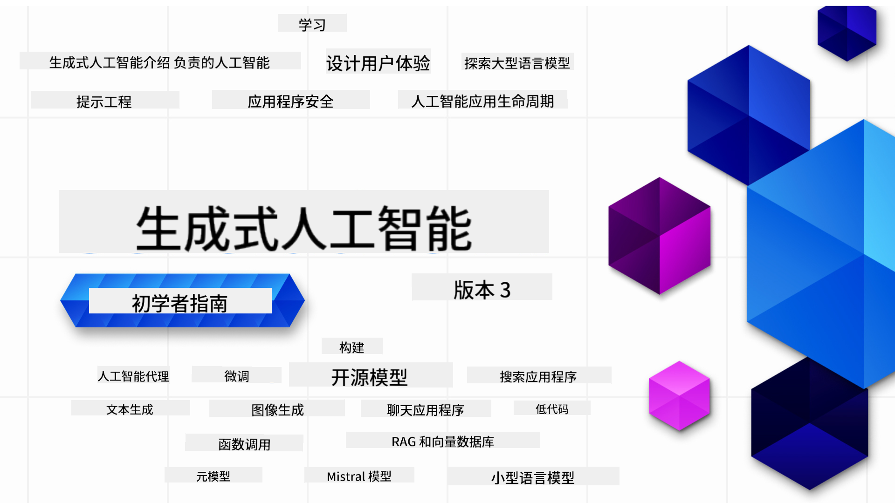

<!--
CO_OP_TRANSLATOR_METADATA:
{
  "original_hash": "5740c9b7fcb6919da1ea4df93475f331",
  "translation_date": "2025-07-09T06:21:03+00:00",
  "source_file": "README.md",
  "language_code": "zh"
}
-->

### 21节课程，教你构建生成式AI应用所需的全部知识

### 🌐 多语言支持

#### 通过 GitHub Action 支持（自动且始终保持最新）

[法语](../fr/README.md) | [西班牙语](../es/README.md) | [德语](../de/README.md) | [俄语](../ru/README.md) | [阿拉伯语](../ar/README.md) | [波斯语 (Farsi)](../fa/README.md) | [乌尔都语](../ur/README.md) | [中文（简体）](./README.md) | [中文（繁体，澳门）](../mo/README.md) | [中文（繁体，香港）](../hk/README.md) | [中文（繁体，台湾）](../tw/README.md) | [日语](../ja/README.md) | [韩语](../ko/README.md) | [印地语](../hi/README.md) | [孟加拉语](../bn/README.md) | [马拉地语](../mr/README.md) | [尼泊尔语](../ne/README.md) | [旁遮普语 (Gurmukhi)](../pa/README.md) | [葡萄牙语（葡萄牙）](../pt/README.md) | [葡萄牙语（巴西）](../br/README.md) | [意大利语](../it/README.md) | [波兰语](../pl/README.md) | [土耳其语](../tr/README.md) | [希腊语](../el/README.md) | [泰语](../th/README.md) | [瑞典语](../sv/README.md) | [丹麦语](../da/README.md) | [挪威语](../no/README.md) | [芬兰语](../fi/README.md) | [荷兰语](../nl/README.md) | [希伯来语](../he/README.md) | [越南语](../vi/README.md) | [印尼语](../id/README.md) | [马来语](../ms/README.md) | [他加禄语（菲律宾语）](../tl/README.md) | [斯瓦希里语](../sw/README.md) | [匈牙利语](../hu/README.md) | [捷克语](../cs/README.md) | [斯洛伐克语](../sk/README.md) | [罗马尼亚语](../ro/README.md) | [保加利亚语](../bg/README.md) | [塞尔维亚语（西里尔字母）](../sr/README.md) | [克罗地亚语](../hr/README.md) | [斯洛文尼亚语](../sl/README.md) | [乌克兰语](../uk/README.md) | [缅甸语](../my/README.md)

# 生成式AI入门（版本3）- 一门课程

通过微软云倡导者团队的21节全面课程，学习构建生成式AI应用的基础知识。

## 🌱 入门指南

本课程包含21节课。每节课涵盖一个主题，您可以从任何一节开始学习！

课程分为“Learn”课程，讲解生成式AI的概念；以及“Build”课程，讲解概念并提供**Python**和**TypeScript**的代码示例（如适用）。

对于 .NET 开发者，请查看 [Generative AI for Beginners (.NET Edition)](https://github.com/microsoft/Generative-AI-for-beginners-dotnet?WT.mc_id=academic-105485-koreyst)！

每节课还包含“Keep Learning”部分，提供额外的学习资源。

## 你需要准备的东西
### 运行本课程代码，你可以使用以下任意一种：
 - [Azure OpenAI Service](https://aka.ms/genai-beginners/azure-open-ai?WT.mc_id=academic-105485-koreyst) - **课程:** "aoai-assignment"
 - [GitHub Marketplace Model Catalog](https://aka.ms/genai-beginners/gh-models?WT.mc_id=academic-105485-koreyst) - **课程:** "githubmodels"
 - [OpenAI API](https://aka.ms/genai-beginners/open-ai?WT.mc_id=academic-105485-koreyst) - **课程:** "oai-assignment" 
   
- 具备基础的 Python 或 TypeScript 知识会更有帮助 - \*绝对初学者可参考这些[Python](https://aka.ms/genai-beginners/python?WT.mc_id=academic-105485-koreyst)和[TypeScript](https://aka.ms/genai-beginners/typescript?WT.mc_id=academic-105485-koreyst)课程
- 一个 GitHub 账号，用于[将整个仓库 fork 到你的账号](https://aka.ms/genai-beginners/github?WT.mc_id=academic-105485-koreyst)

我们还准备了一个**[课程环境搭建](./00-course-setup/README.md?WT.mc_id=academic-105485-koreyst)**章节，帮助你配置开发环境。

别忘了给本仓库[点星 (🌟)](https://docs.github.com/en/get-started/exploring-projects-on-github/saving-repositories-with-stars?WT.mc_id=academic-105485-koreyst)，方便以后快速找到。

## 🧠 准备好部署了吗？

如果你想要更高级的代码示例，请查看我们提供的[生成式AI代码示例合集](https://aka.ms/genai-beg-code?WT.mc_id=academic-105485-koreyst)，包含**Python**和**TypeScript**版本。

## 🗣️ 结识其他学习者，获取支持

加入我们的[官方 Azure AI Foundry Discord 服务器](https://aka.ms/genai-discord?WT.mc_id=academic-105485-koreyst)，与其他学习本课程的学员交流并获得帮助。

在我们的[Azure AI Foundry 开发者论坛](https://aka.ms/azureaifoundry/forum)（GitHub）提问或分享产品反馈。

## 🚀 创业中？

注册[Microsoft for Startups Founders Hub](https://aka.ms/genai-foundershub?WT.mc_id=academic-105485-koreyst)，即可获得**免费OpenAI额度**和最高**15万美元Azure额度**，通过Azure OpenAI服务访问OpenAI模型。

## 🙏 想帮忙吗？

有建议或发现拼写、代码错误？请[提交问题](https://github.com/microsoft/generative-ai-for-beginners/issues?WT.mc_id=academic-105485-koreyst)或[创建拉取请求](https://github.com/microsoft/generative-ai-for-beginners/pulls?WT.mc_id=academic-105485-koreyst)。

## 📂 每节课包含：

- 主题的简短视频介绍
- README 中的文字课程内容
- 支持 Azure OpenAI 和 OpenAI API 的 Python 和 TypeScript 代码示例
- 继续学习的额外资源链接

## 🗃️ 课程列表

| #   | **课程链接**                                                                                                                              | **课程简介**                                                                                 | **视频**                                                                   | **额外学习**                                                             |
| --- | -------------------------------------------------------------------------------------------------------------------------------------------- | ----------------------------------------------------------------------------------------------- | --------------------------------------------------------------------------- | ------------------------------------------------------------------------------ |
| 00  | [课程环境搭建](./00-course-setup/README.md?WT.mc_id=academic-105485-koreyst)                                                                 | **学习:** 如何搭建开发环境                                            | 视频即将上线                                                                 | [了解更多](https://aka.ms/genai-collection?WT.mc_id=academic-105485-koreyst) |
| 01  | [生成式AI与大型语言模型简介](./01-introduction-to-genai/README.md?WT.mc_id=academic-105485-koreyst)                              | **学习:** 了解什么是生成式AI及大型语言模型（LLMs）的工作原理       | [视频](https://aka.ms/gen-ai-lesson-1-gh?WT.mc_id=academic-105485-koreyst) | [了解更多](https://aka.ms/genai-collection?WT.mc_id=academic-105485-koreyst) |
| 02  | [探索与比较不同的LLM](./02-exploring-and-comparing-different-llms/README.md?WT.mc_id=academic-105485-koreyst)             | **学习:** 如何为你的用例选择合适的模型                                      | [视频](https://aka.ms/gen-ai-lesson2-gh?WT.mc_id=academic-105485-koreyst)  | [了解更多](https://aka.ms/genai-collection?WT.mc_id=academic-105485-koreyst) |
| 03  | [负责任地使用生成式AI](./03-using-generative-ai-responsibly/README.md?WT.mc_id=academic-105485-koreyst)                           | **学习:** 如何负责任地构建生成式AI应用                                  | [视频](https://aka.ms/gen-ai-lesson3-gh?WT.mc_id=academic-105485-koreyst)  | [了解更多](https://aka.ms/genai-collection?WT.mc_id=academic-105485-koreyst) |
| 04  | [理解提示工程基础](./04-prompt-engineering-fundamentals/README.md?WT.mc_id=academic-105485-koreyst)             | **学习:** 提示工程最佳实践实操                                           | [视频](https://aka.ms/gen-ai-lesson4-gh?WT.mc_id=academic-105485-koreyst)  | [了解更多](https://aka.ms/genai-collection?WT.mc_id=academic-105485-koreyst) |
| 05  | [创建高级提示](./05-advanced-prompts/README.md?WT.mc_id=academic-105485-koreyst)                                                | **学习:** 如何应用提示工程技巧提升提示效果 | [视频](https://aka.ms/gen-ai-lesson5-gh?WT.mc_id=academic-105485-koreyst)  | [了解更多](https://aka.ms/genai-collection?WT.mc_id=academic-105485-koreyst) |
| 06  | [构建文本生成应用](./06-text-generation-apps/README.md?WT.mc_id=academic-105485-koreyst)                                | **构建：** 使用 Azure OpenAI / OpenAI API 构建文本生成应用                                | [视频](https://aka.ms/gen-ai-lesson6-gh?WT.mc_id=academic-105485-koreyst)  | [了解更多](https://aka.ms/genai-collection?WT.mc_id=academic-105485-koreyst) |
| 07  | [构建聊天应用](./07-building-chat-applications/README.md?WT.mc_id=academic-105485-koreyst)                                     | **构建：** 高效构建和集成聊天应用的技术               | [视频](https://aka.ms/gen-ai-lessons7-gh?WT.mc_id=academic-105485-koreyst) | [了解更多](https://aka.ms/genai-collection?WT.mc_id=academic-105485-koreyst) |
| 08  | [构建搜索应用与向量数据库](./08-building-search-applications/README.md?WT.mc_id=academic-105485-koreyst)                        | **构建：** 使用 Embeddings 进行数据搜索的搜索应用                        | [视频](https://aka.ms/gen-ai-lesson8-gh?WT.mc_id=academic-105485-koreyst)  | [了解更多](https://aka.ms/genai-collection?WT.mc_id=academic-105485-koreyst) |
| 09  | [构建图像生成应用](./09-building-image-applications/README.md?WT.mc_id=academic-105485-koreyst)                        | **构建：** 图像生成应用                                                       | [视频](https://aka.ms/gen-ai-lesson9-gh?WT.mc_id=academic-105485-koreyst)  | [了解更多](https://aka.ms/genai-collection?WT.mc_id=academic-105485-koreyst) |
| 10  | [构建低代码 AI 应用](./10-building-low-code-ai-applications/README.md?WT.mc_id=academic-105485-koreyst)                       | **构建：** 使用低代码工具构建生成式 AI 应用                                     | [视频](https://aka.ms/gen-ai-lesson10-gh?WT.mc_id=academic-105485-koreyst) | [了解更多](https://aka.ms/genai-collection?WT.mc_id=academic-105485-koreyst) |
| 11  | [通过 Function Calling 集成外部应用](./11-integrating-with-function-calling/README.md?WT.mc_id=academic-105485-koreyst) | **构建：** 什么是 function calling 及其在应用中的使用场景                          | [视频](https://aka.ms/gen-ai-lesson11-gh?WT.mc_id=academic-105485-koreyst) | [了解更多](https://aka.ms/genai-collection?WT.mc_id=academic-105485-koreyst) |
| 12  | [为 AI 应用设计用户体验](./12-designing-ux-for-ai-applications/README.md?WT.mc_id=academic-105485-koreyst)                         | **学习：** 在开发生成式 AI 应用时如何应用用户体验设计原则         | [视频](https://aka.ms/gen-ai-lesson12-gh?WT.mc_id=academic-105485-koreyst) | [了解更多](https://aka.ms/genai-collection?WT.mc_id=academic-105485-koreyst) |
| 13  | [保护你的生成式 AI 应用](./13-securing-ai-applications/README.md?WT.mc_id=academic-105485-koreyst)                         | **学习：** AI 系统面临的威胁和风险，以及保护这些系统的方法             | [视频](https://aka.ms/gen-ai-lesson13-gh?WT.mc_id=academic-105485-koreyst) | [了解更多](https://aka.ms/genai-collection?WT.mc_id=academic-105485-koreyst) |
| 14  | [生成式 AI 应用生命周期](./14-the-generative-ai-application-lifecycle/README.md?WT.mc_id=academic-105485-koreyst)           | **学习：** 管理 LLM 生命周期和 LLMOps 的工具和指标                         | [视频](https://aka.ms/gen-ai-lesson14-gh?WT.mc_id=academic-105485-koreyst) | [了解更多](https://aka.ms/genai-collection?WT.mc_id=academic-105485-koreyst) |
| 15  | [检索增强生成（RAG）与向量数据库](./15-rag-and-vector-databases/README.md?WT.mc_id=academic-105485-koreyst)        | **构建：** 使用 RAG 框架从向量数据库检索 embeddings 的应用  | [视频](https://aka.ms/gen-ai-lesson15-gh?WT.mc_id=academic-105485-koreyst) | [了解更多](https://aka.ms/genai-collection?WT.mc_id=academic-105485-koreyst) |
| 16  | [开源模型与 Hugging Face](./16-open-source-models/README.md?WT.mc_id=academic-105485-koreyst)                                    | **构建：** 使用 Hugging Face 上开源模型的应用                    | [视频](https://aka.ms/gen-ai-lesson16-gh?WT.mc_id=academic-105485-koreyst) | [了解更多](https://aka.ms/genai-collection?WT.mc_id=academic-105485-koreyst) |
| 17  | [AI 代理](./17-ai-agents/README.md?WT.mc_id=academic-105485-koreyst)                                                                       | **构建：** 使用 AI 代理框架的应用                                           | [视频](https://aka.ms/gen-ai-lesson17-gh?WT.mc_id=academic-105485-koreyst) | [了解更多](https://aka.ms/genai-collection?WT.mc_id=academic-105485-koreyst) |
| 18  | [微调 LLMs](./18-fine-tuning/README.md?WT.mc_id=academic-105485-koreyst)                                                              | **学习：** 微调 LLMs 的内容、原因及方法                                            | [视频](https://aka.ms/gen-ai-lesson18-gh?WT.mc_id=academic-105485-koreyst) | [了解更多](https://aka.ms/genai-collection?WT.mc_id=academic-105485-koreyst) |
| 19  | [使用 SLMs 构建](./19-slm/README.md?WT.mc_id=academic-105485-koreyst)                                                              | **学习：** 使用小型语言模型构建的优势                                            | 视频即将上线 | [了解更多](https://aka.ms/genai-collection?WT.mc_id=academic-105485-koreyst) |
| 20  | [使用 Mistral 模型构建](./20-mistral/README.md?WT.mc_id=academic-105485-koreyst)                                                              | **学习：** Mistral 系列模型的特点和区别                                           | 视频即将上线 | [了解更多](https://aka.ms/genai-collection?WT.mc_id=academic-105485-koreyst) |
| 21  | [使用 Meta 模型构建](./21-meta/README.md?WT.mc_id=academic-105485-koreyst)                                                              | **学习：** Meta 系列模型的特点和区别                                           | 视频即将上线 | [了解更多](https://aka.ms/genai-collection?WT.mc_id=academic-105485-koreyst) |

### 🌟 特别感谢

特别感谢 [**John Aziz**](https://www.linkedin.com/in/john0isaac/) 创建了所有的 GitHub Actions 和工作流

[**Bernhard Merkle**](https://www.linkedin.com/in/bernhard-merkle-738b73/) 对每节课程做出了关键贡献，提升了学习和代码体验。

## 🎒 其他课程

我们的团队还制作了其他课程！欢迎查看：

- [**新** 初学者模型上下文协议](https://github.com/microsoft/mcp-for-beginners?WT.mc_id=academic-105485-koreyst)
- [初学者 AI 代理](https://github.com/microsoft/ai-agents-for-beginners?WT.mc_id=academic-105485-koreyst)
- [使用 .NET 的生成式 AI 初学者课程](https://github.com/microsoft/Generative-AI-for-beginners-dotnet?WT.mc_id=academic-105485-koreyst)
- [使用 JavaScript 的生成式 AI 初学者课程](https://aka.ms/genai-js-course?WT.mc_id=academic-105485-koreyst)
- [机器学习初学者](https://aka.ms/ml-beginners?WT.mc_id=academic-105485-koreyst)
- [数据科学初学者](https://aka.ms/datascience-beginners?WT.mc_id=academic-105485-koreyst)
- [AI 初学者](https://aka.ms/ai-beginners?WT.mc_id=academic-105485-koreyst)
- [网络安全初学者](https://github.com/microsoft/Security-101??WT.mc_id=academic-96948-sayoung)
- [网页开发初学者](https://aka.ms/webdev-beginners?WT.mc_id=academic-105485-koreyst)
- [物联网初学者](https://aka.ms/iot-beginners?WT.mc_id=academic-105485-koreyst)
- [XR 开发初学者](https://github.com/microsoft/xr-development-for-beginners?WT.mc_id=academic-105485-koreyst)
- [掌握 GitHub Copilot 进行 AI 配对编程](https://aka.ms/GitHubCopilotAI?WT.mc_id=academic-105485-koreyst)
- [掌握 GitHub Copilot 面向 C#/.NET 开发者](https://github.com/microsoft/mastering-github-copilot-for-dotnet-csharp-developers?WT.mc_id=academic-105485-koreyst)
- [选择你自己的 Copilot 冒险](https://github.com/microsoft/CopilotAdventures?WT.mc_id=academic-105485-koreyst)

**免责声明**：  
本文件使用 AI 翻译服务 [Co-op Translator](https://github.com/Azure/co-op-translator) 进行翻译。虽然我们力求准确，但请注意，自动翻译可能包含错误或不准确之处。原始文件的母语版本应被视为权威来源。对于重要信息，建议采用专业人工翻译。对于因使用本翻译而产生的任何误解或误释，我们概不负责。