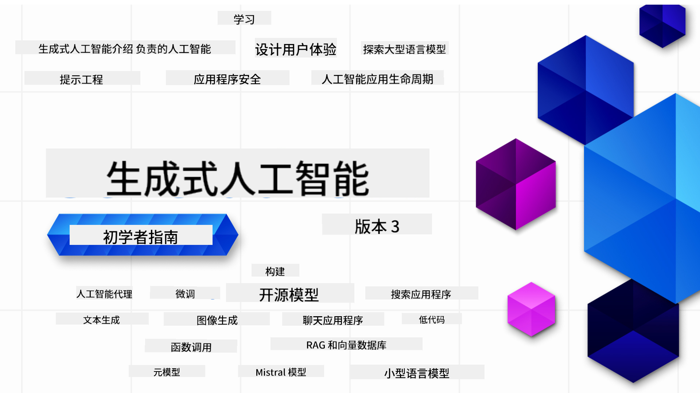

<!--
CO_OP_TRANSLATOR_METADATA:
{
  "original_hash": "6e3f4c8a4f323b8eab1cf11ded304b0f",
  "translation_date": "2025-06-25T07:34:38+00:00",
  "source_file": "README.md",
  "language_code": "zh"
}
-->

### 21节课教你构建生成式AI应用所需的全部知识

### 🌐 多语言支持

#### 通过 GitHub Action 支持（自动化且始终保持最新）

# 初学者生成式AI课程（版本3）

通过微软云倡导者的21节全面课程学习构建生成式AI应用的基础知识。

## 🌱 入门

这门课程共有21节。每节课都涵盖了自己的主题，所以可以从任何你喜欢的地方开始！

课程分为两类：“学习”课程解释生成式AI概念，或“构建”课程解释概念并提供**Python**和**TypeScript**代码示例（尽可能提供）。

对于 .NET 开发者，请查看 [初学者生成式AI课程（.NET版）](https://github.com/microsoft/Generative-AI-for-beginners-dotnet?WT.mc_id=academic-105485-koreyst)!

每节课还包括一个“继续学习”部分，提供额外的学习工具。

## 你需要准备什么
### 要运行这门课程的代码，你可以使用以下任一服务：
 - [Azure OpenAI Service](https://aka.ms/genai-beginners/azure-open-ai?WT.mc_id=academic-105485-koreyst) - **课程：** "aoai-assignment"
 - [GitHub Marketplace Model Catalog](https://aka.ms/genai-beginners/gh-models?WT.mc_id=academic-105485-koreyst) - **课程：** "githubmodels"
 - [OpenAI API](https://aka.ms/genai-beginners/open-ai?WT.mc_id=academic-105485-koreyst) - **课程：** "oai-assignment" 
   
- 具备Python或TypeScript的基础知识会有帮助 - \*对于绝对初学者，请查看这些[Python](https://aka.ms/genai-beginners/python?WT.mc_id=academic-105485-koreyst)和[TypeScript](https://aka.ms/genai-beginners/typescript?WT.mc_id=academic-105485-koreyst)课程
- 一个GitHub账户，以便[分叉这个完整的仓库](https://aka.ms/genai-beginners/github?WT.mc_id=academic-105485-koreyst)到你的GitHub账户

我们创建了一个**[课程设置](./00-course-setup/README.md?WT.mc_id=academic-105485-koreyst)**课程，帮助你设置开发环境。

别忘了[为这个仓库加星（🌟）](https://docs.github.com/en/get-started/exploring-projects-on-github/saving-repositories-with-stars?WT.mc_id=academic-105485-koreyst)，方便以后找到。

## 🧠 准备部署？

如果你在寻找更高级的代码示例，请查看我们的[生成式AI代码示例集](https://aka.ms/genai-beg-code?WT.mc_id=academic-105485-koreyst)，包括**Python**和**TypeScript**。

## 🗣️ 结识其他学习者，获取支持

加入我们的[官方Azure AI Foundry Discord服务器](https://aka.ms/genai-discord?WT.mc_id=academic-105485-koreyst)，与其他学习者交流并获得支持。

在我们的GitHub上的[Azure AI Foundry开发者论坛](https://aka.ms/azureaifoundry/forum)中提问或分享产品反馈。

## 🚀 创建初创公司？

注册[微软初创公司创始人中心](https://aka.ms/genai-foundershub?WT.mc_id=academic-105485-koreyst)，获得**免费OpenAI积分**以及最多**15万美元的Azure积分，用于通过Azure OpenAI服务访问OpenAI模型**。

## 🙏 想要帮助？

你有建议或发现拼写或代码错误吗？[提出问题](https://github.com/microsoft/generative-ai-for-beginners/issues?WT.mc_id=academic-105485-koreyst)或[创建一个拉取请求](https://github.com/microsoft/generative-ai-for-beginners/pulls?WT.mc_id=academic-105485-koreyst)

## 📂 每节课包括：

- 一个简短的视频介绍主题
- 位于README中的书面课程
- 支持Azure OpenAI和OpenAI API的Python和TypeScript代码示例
- 链接到额外资源以继续学习

## 🗃️ 课程

| #   | **课程链接**                                                                                                                              | **描述**                                                                                 | **视频**                                                                   | **额外学习**                                                             |
| --- | -------------------------------------------------------------------------------------------------------------------------------------------- | ----------------------------------------------------------------------------------------------- | --------------------------------------------------------------------------- | ------------------------------------------------------------------------------ |
| 00  | [课程设置](./00-course-setup/README.md?WT.mc_id=academic-105485-koreyst)                                                                 | **学习：** 如何设置你的开发环境                                            | 视频即将上线                                                                 | [了解更多](https://aka.ms/genai-collection?WT.mc_id=academic-105485-koreyst) |
| 01  | [生成式AI和LLMs介绍](./01-introduction-to-genai/README.md?WT.mc_id=academic-105485-koreyst)                              | **学习：** 了解生成式AI是什么以及大型语言模型（LLMs）如何工作。       | [视频](https://aka.ms/gen-ai-lesson-1-gh?WT.mc_id=academic-105485-koreyst) | [了解更多](https://aka.ms/genai-collection?WT.mc_id=academic-105485-koreyst) |
| 02  | [探索和比较不同的LLMs](./02-exploring-and-comparing-different-llms/README.md?WT.mc_id=academic-105485-koreyst)             | **学习：** 如何为你的使用案例选择合适的模型                                      | [视频](https://aka.ms/gen-ai-lesson2-gh?WT.mc_id=academic-105485-koreyst)  | [了解更多](https://aka.ms/genai-collection?WT.mc_id=academic-105485-koreyst) |
| 03  | [负责任地使用生成式AI](./03-using-generative-ai-responsibly/README.md?WT.mc_id=academic-105485-koreyst)                           | **学习：** 如何负责任地构建生成式AI应用                                  | [视频](https://aka.ms/gen-ai-lesson3-gh?WT.mc_id=academic-105485-koreyst)  | [了解更多](https://aka.ms/genai-collection?WT.mc_id=academic-105485-koreyst) |
| 04  | [理解提示工程基础](./04-prompt-engineering-fundamentals/README.md?WT.mc_id=academic-105485-koreyst)             | **学习：** 实践提示工程最佳实践                                           | [视频](https://aka.ms/gen-ai-lesson4-gh?WT.mc_id=academic-105485-koreyst)  | [了解更多](https://aka.ms/genai-collection?WT.mc_id=academic-105485-koreyst) |
| 05  | [创建高级提示](./05-advanced-prompts/README.md?WT.mc_id=academic-105485-koreyst)                                                | **学习：** 如何应用提示工程技术以改善提示的结果。 | [视频](https://aka.ms/gen-ai-lesson5-gh?WT.mc_id=academic-105485-koreyst)  | [了解更多](https://aka.ms/genai-collection?WT.mc_id=academic-105485-koreyst) |
| 06  | [构建文本生成应用](./06-text-generation-apps/README.md?WT.mc_id=academic-105485-koreyst)                                | **构建：** 使用 Azure OpenAI / OpenAI API 的文本生成应用                                | [视频](https://aka.ms/gen-ai-lesson6-gh?WT.mc_id=academic-105485-koreyst)  | [了解更多](https://aka.ms/genai-collection?WT.mc_id=academic-105485-koreyst) |
| 07  | [构建聊天应用](./07-building-chat-applications/README.md?WT.mc_id=academic-105485-koreyst)                                     | **构建：** 高效构建和集成聊天应用的技术。               | [视频](https://aka.ms/gen-ai-lessons7-gh?WT.mc_id=academic-105485-koreyst) | [了解更多](https://aka.ms/genai-collection?WT.mc_id=academic-105485-koreyst) |
| 08  | [构建搜索应用向量数据库](./08-building-search-applications/README.md?WT.mc_id=academic-105485-koreyst)                        | **构建：** 使用嵌入搜索数据的搜索应用。                        | [视频](https://aka.ms/gen-ai-lesson8-gh?WT.mc_id=academic-105485-koreyst)  | [了解更多](https://aka.ms/genai-collection?WT.mc_id=academic-105485-koreyst) |
| 09  | [构建图像生成应用](./09-building-image-applications/README.md?WT.mc_id=academic-105485-koreyst)                        | **构建：** 图像生成应用                                                       | [视频](https://aka.ms/gen-ai-lesson9-gh?WT.mc_id=academic-105485-koreyst)  | [了解更多](https://aka.ms/genai-collection?WT.mc_id=academic-105485-koreyst) |
| 10  | [构建低代码 AI 应用](./10-building-low-code-ai-applications/README.md?WT.mc_id=academic-105485-koreyst)                       | **构建：** 使用低代码工具的生成式 AI 应用                                     | [视频](https://aka.ms/gen-ai-lesson10-gh?WT.mc_id=academic-105485-koreyst) | [了解更多](https://aka.ms/genai-collection?WT.mc_id=academic-105485-koreyst) |
| 11  | [集成外部应用与函数调用](./11-integrating-with-function-calling/README.md?WT.mc_id=academic-105485-koreyst) | **构建：** 什么是函数调用及其在应用中的用例                          | [视频](https://aka.ms/gen-ai-lesson11-gh?WT.mc_id=academic-105485-koreyst) | [了解更多](https://aka.ms/genai-collection?WT.mc_id=academic-105485-koreyst) |
| 12  | [设计 AI 应用的用户体验](./12-designing-ux-for-ai-applications/README.md?WT.mc_id=academic-105485-koreyst)                         | **学习：** 在开发生成式 AI 应用时如何应用用户体验设计原则         | [视频](https://aka.ms/gen-ai-lesson12-gh?WT.mc_id=academic-105485-koreyst) | [了解更多](https://aka.ms/genai-collection?WT.mc_id=academic-105485-koreyst) |
| 13  | [保护你的生成式 AI 应用](./13-securing-ai-applications/README.md?WT.mc_id=academic-105485-koreyst)                         | **学习：** AI 系统的威胁和风险以及保护这些系统的方法。             | [视频](https://aka.ms/gen-ai-lesson13-gh?WT.mc_id=academic-105485-koreyst) | [了解更多](https://aka.ms/genai-collection?WT.mc_id=academic-105485-koreyst) |
| 14  | [生成式 AI 应用生命周期](./14-the-generative-ai-application-lifecycle/README.md?WT.mc_id=academic-105485-koreyst)           | **学习：** 管理 LLM 生命周期和 LLMOps 的工具和指标                         | [视频](https://aka.ms/gen-ai-lesson14-gh?WT.mc_id=academic-105485-koreyst) | [了解更多](https://aka.ms/genai-collection?WT.mc_id=academic-105485-koreyst) |
| 15  | [检索增强生成（RAG）和向量数据库](./15-rag-and-vector-databases/README.md?WT.mc_id=academic-105485-koreyst)        | **构建:** 使用RAG框架从向量数据库中检索嵌入的应用程序  | [视频](https://aka.ms/gen-ai-lesson15-gh?WT.mc_id=academic-105485-koreyst) | [了解更多](https://aka.ms/genai-collection?WT.mc_id=academic-105485-koreyst) |
| 16  | [开源模型和Hugging Face](./16-open-source-models/README.md?WT.mc_id=academic-105485-koreyst)                                    | **构建:** 使用Hugging Face上可用的开源模型的应用程序                    | [视频](https://aka.ms/gen-ai-lesson16-gh?WT.mc_id=academic-105485-koreyst) | [了解更多](https://aka.ms/genai-collection?WT.mc_id=academic-105485-koreyst) |
| 17  | [AI代理](./17-ai-agents/README.md?WT.mc_id=academic-105485-koreyst)                                                                       | **构建:** 使用AI代理框架的应用程序                                           | [视频](https://aka.ms/gen-ai-lesson17-gh?WT.mc_id=academic-105485-koreyst) | [了解更多](https://aka.ms/genai-collection?WT.mc_id=academic-105485-koreyst) |
| 18  | [微调大型语言模型](./18-fine-tuning/README.md?WT.mc_id=academic-105485-koreyst)                                                              | **学习:** 微调大型语言模型的是什么、为什么和如何                                            | [视频](https://aka.ms/gen-ai-lesson18-gh?WT.mc_id=academic-105485-koreyst) | [了解更多](https://aka.ms/genai-collection?WT.mc_id=academic-105485-koreyst) |
| 19  | [使用小型语言模型构建](./19-slm/README.md?WT.mc_id=academic-105485-koreyst)                                                              | **学习:** 使用小型语言模型构建的好处                                            | 视频即将推出 | [了解更多](https://aka.ms/genai-collection?WT.mc_id=academic-105485-koreyst) |
| 20  | [使用Mistral模型构建](./20-mistral/README.md?WT.mc_id=academic-105485-koreyst)                                                              | **学习:** Mistral系列模型的特点和区别                                           | 视频即将推出 | [了解更多](https://aka.ms/genai-collection?WT.mc_id=academic-105485-koreyst) |
| 21  | [使用Meta模型构建](./21-meta/README.md?WT.mc_id=academic-105485-koreyst)                                                              | **学习:** Meta系列模型的特点和区别                                           | 视频即将推出 | [了解更多](https://aka.ms/genai-collection?WT.mc_id=academic-105485-koreyst) |

### 🌟 特别感谢

特别感谢 [**John Aziz**](https://www.linkedin.com/in/john0isaac/) 创建所有GitHub Actions和工作流程

[**Bernhard Merkle**](https://www.linkedin.com/in/bernhard-merkle-738b73/) 为每一课作出关键贡献，以改善学习者和代码体验。

## 🎒 其他课程

我们的团队还制作其他课程！查看：

- [**新** 模型上下文协议入门](https://github.com/microsoft/mcp-for-beginners?WT.mc_id=academic-105485-koreyst)
- [AI代理入门](https://github.com/microsoft/ai-agents-for-beginners?WT.mc_id=academic-105485-koreyst)
- [使用.NET的生成式AI入门](https://github.com/microsoft/Generative-AI-for-beginners-dotnet?WT.mc_id=academic-105485-koreyst)
- [使用JavaScript的生成式AI入门](https://aka.ms/genai-js-course?WT.mc_id=academic-105485-koreyst)
- [机器学习入门](https://aka.ms/ml-beginners?WT.mc_id=academic-105485-koreyst)
- [数据科学入门](https://aka.ms/datascience-beginners?WT.mc_id=academic-105485-koreyst)
- [AI入门](https://aka.ms/ai-beginners?WT.mc_id=academic-105485-koreyst)
- [网络安全入门](https://github.com/microsoft/Security-101??WT.mc_id=academic-96948-sayoung)
- [网页开发入门](https://aka.ms/webdev-beginners?WT.mc_id=academic-105485-koreyst)
- [物联网入门](https://aka.ms/iot-beginners?WT.mc_id=academic-105485-koreyst)
- [初学者的XR开发](https://github.com/microsoft/xr-development-for-beginners?WT.mc_id=academic-105485-koreyst)
- [精通GitHub Copilot进行AI配对编程](https://aka.ms/GitHubCopilotAI?WT.mc_id=academic-105485-koreyst)
- [精通GitHub Copilot为C#/.NET开发者](https://github.com/microsoft/mastering-github-copilot-for-dotnet-csharp-developers?WT.mc_id=academic-105485-koreyst)
- [选择你的Copilot冒险](https://github.com/microsoft/CopilotAdventures?WT.mc_id=academic-105485-koreyst)

**免责声明**：
本文档使用AI翻译服务[Co-op Translator](https://github.com/Azure/co-op-translator)进行翻译。尽管我们努力确保准确性，但请注意，自动翻译可能包含错误或不准确之处。应将原始语言的文档视为权威来源。对于关键信息，建议进行专业人工翻译。我们不对因使用此翻译而引起的任何误解或误读承担责任。